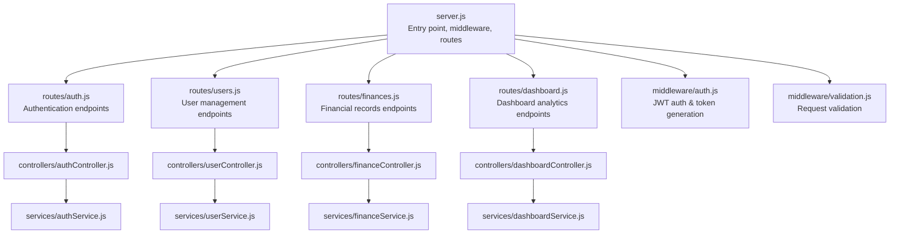
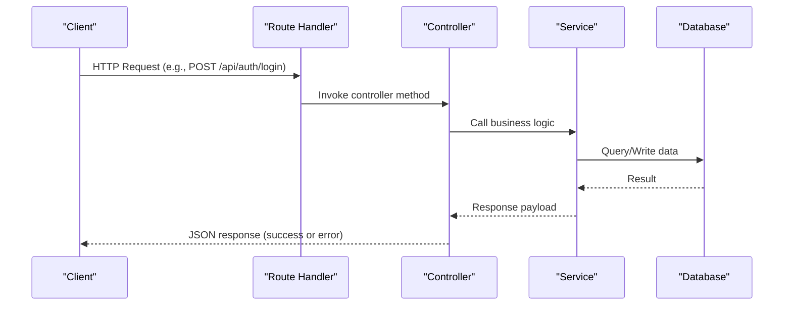
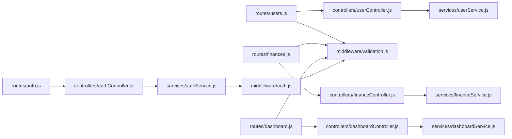
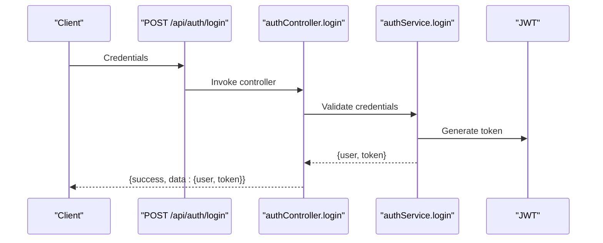
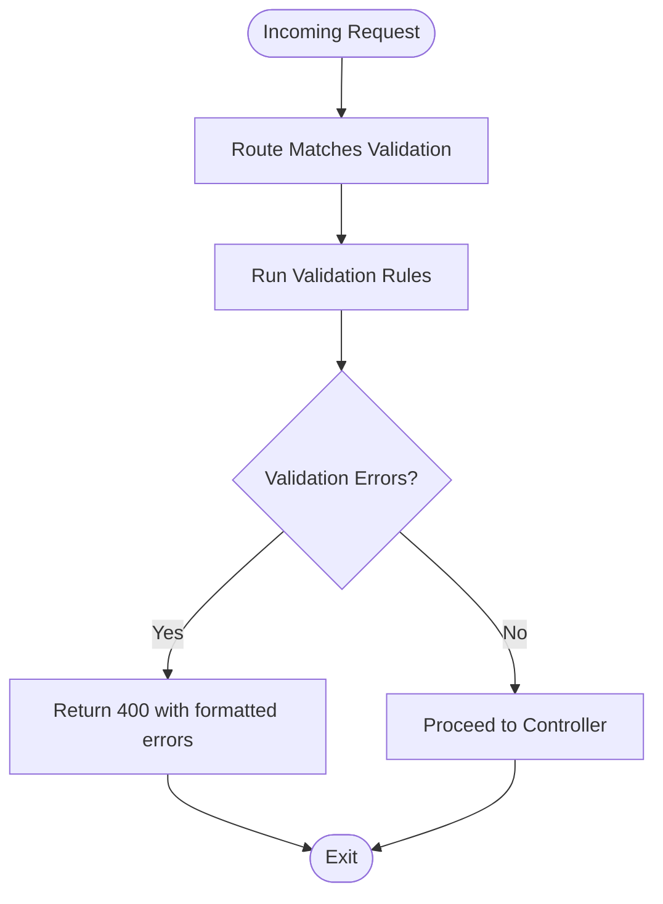

# API Reference

<cite>
**Referenced Files in This Document**
- [server.js](file://backend/server.js)
- [auth.js](file://backend/routes/auth.js)
- [users.js](file://backend/routes/users.js)
- [finances.js](file://backend/routes/finances.js)
- [dashboard.js](file://backend/routes/dashboard.js)
- [authController.js](file://backend/controllers/authController.js)
- [userController.js](file://backend/controllers/userController.js)
- [financeController.js](file://backend/controllers/financeController.js)
- [dashboardController.js](file://backend/controllers/dashboardController.js)
- [auth.js](file://backend/middleware/auth.js)
- [validation.js](file://backend/middleware/validation.js)
- [authService.js](file://backend/services/authService.js)
- [userService.js](file://backend/services/userService.js)
- [financeService.js](file://backend/services/financeService.js)
- [dashboardService.js](file://backend/services/dashboardService.js)
</cite>

## Table of Contents
1. [Introduction](#introduction)
2. [Project Structure](#project-structure)
3. [Core Components](#core-components)
4. [Architecture Overview](#architecture-overview)
5. [Detailed Component Analysis](#detailed-component-analysis)
6. [Dependency Analysis](#dependency-analysis)
7. [Performance Considerations](#performance-considerations)
8. [Troubleshooting Guide](#troubleshooting-guide)
9. [Conclusion](#conclusion)
10. [Appendices](#appendices)

## Introduction
This document provides comprehensive API documentation for the FDPAC Finance Dashboard backend. It covers all RESTful endpoints, including authentication, user management, financial records, and dashboard analytics. For each endpoint, you will find HTTP methods, URL patterns, request/response schemas, authentication requirements, parameter specifications, filtering and pagination options, response formats, practical curl examples, error handling scenarios, and security considerations.

## Project Structure
The backend is organized around Express.js routes, controllers, services, and middleware. The server initializes middleware, registers route groups under /api/*, and exposes health checks and root metadata. Controllers delegate to services, which encapsulate business logic and interact with models. Validation middleware enforces request schemas, while authentication middleware verifies JWT tokens and attaches user context.

**Diagram sources**
- [server.js:52-56](file://backend/server.js#L52-L56)
- [auth.js:1-49](file://backend/routes/auth.js#L1-L49)
- [users.js:1-64](file://backend/routes/users.js#L1-L64)
- [finances.js:1-67](file://backend/routes/finances.js#L1-L67)
- [dashboard.js:1-57](file://backend/routes/dashboard.js#L1-L57)
- [authController.js:1-114](file://backend/controllers/authController.js#L1-L114)
- [userController.js:1-152](file://backend/controllers/userController.js#L1-L152)
- [financeController.js:1-138](file://backend/controllers/financeController.js#L1-L138)
- [dashboardController.js:1-144](file://backend/controllers/dashboardController.js#L1-L144)
- [auth.js:1-116](file://backend/middleware/auth.js#L1-L116)
- [validation.js:1-309](file://backend/middleware/validation.js#L1-L309)

**Section sources**
- [server.js:52-56](file://backend/server.js#L52-L56)
- [auth.js:1-49](file://backend/routes/auth.js#L1-L49)
- [users.js:1-64](file://backend/routes/users.js#L1-L64)
- [finances.js:1-67](file://backend/routes/finances.js#L1-L67)
- [dashboard.js:1-57](file://backend/routes/dashboard.js#L1-L57)

## Core Components
- Authentication endpoints: register, login, profile retrieval, password change, and initial admin setup.
- User management endpoints: list, stats, create, retrieve by ID, update, delete (soft), toggle status.
- Financial records endpoints: list with filtering/pagination, categories, create, retrieve by ID, update, delete (soft).
- Dashboard analytics endpoints: summary totals, category summary, recent activity, monthly and weekly trends, and complete dashboard data.

Authentication and authorization:
- All private endpoints require a Bearer token via the Authorization header.
- Roles and permissions are enforced via RBAC middleware for user and finance operations.
- Validation middleware ensures request bodies and query parameters conform to strict schemas.

**Section sources**
- [auth.js:14-59](file://backend/middleware/auth.js#L14-L59)
- [validation.js:13-27](file://backend/middleware/validation.js#L13-L27)
- [users.js:19-61](file://backend/routes/users.js#L19-L61)
- [finances.js:29-64](file://backend/routes/finances.js#L29-L64)
- [dashboard.js:19-54](file://backend/routes/dashboard.js#L19-L54)

## Architecture Overview
The API follows a layered architecture:
- Routes define endpoint contracts.
- Controllers handle HTTP concerns and pass data to services.
- Services encapsulate business logic and perform data operations.
- Middleware handles authentication, authorization, validation, and error responses.
- Models and collections are accessed through services.

**Diagram sources**
- [auth.js:25](file://backend/routes/auth.js#L25)
- [authController.js:32-46](file://backend/controllers/authController.js#L32-L46)
- [authService.js:59-93](file://backend/services/authService.js#L59-L93)

## Detailed Component Analysis

### Authentication Endpoints
- Base path: /api/auth
- Authentication: Public for registration and login; Private for profile and password change.

Endpoints:
- POST /api/auth/register
  - Description: Register a new user.
  - Authentication: None.
  - Request body:
    - name: string, required, max 100 chars.
    - email: string, required, valid email.
    - password: string, required, min 6 chars.
    - role: string, optional, one of configured roles.
  - Responses:
    - 201 Created: { success: true, data: { user, token }, message }.
    - 400 Bad Request: Validation errors.
    - 409 Conflict: Email already exists.
    - 500 Internal Server Error: General failure.
  - curl example:
    - curl -X POST https://host/api/auth/register -H "Content-Type: application/json" -d '{"name":"John","email":"john@example.com","password":"pass123"}'

- POST /api/auth/login
  - Description: Authenticate user and return token.
  - Authentication: None.
  - Request body:
    - email: string, required, valid email.
    - password: string, required.
  - Responses:
    - 200 OK: { success: true, data: { user, token }, message }.
    - 400 Bad Request: Validation errors.
    - 401 Unauthorized: Invalid credentials or inactive account.
    - 500 Internal Server Error.
  - curl example:
    - curl -X POST https://host/api/auth/login -H "Content-Type: application/json" -d '{"email":"john@example.com","password":"pass123"}'

- GET /api/auth/profile
  - Description: Retrieve current user profile.
  - Authentication: Required (Bearer token).
  - Responses:
    - 200 OK: { success: true, data: user profile, message }.
    - 401 Unauthorized: Missing/invalid/expired token or inactive user.
    - 404 Not Found: User not found.
    - 500 Internal Server Error.
  - curl example:
    - curl -H "Authorization: Bearer YOUR_TOKEN" https://host/api/auth/profile

- PUT /api/auth/change-password
  - Description: Change current password.
  - Authentication: Required (Bearer token).
  - Request body:
    - currentPassword: string, required.
    - newPassword: string, required, min 6 chars.
  - Responses:
    - 200 OK: { success: true, message }.
    - 400 Bad Request: Validation or current password mismatch.
    - 401 Unauthorized: Missing/invalid token or user not found.
    - 500 Internal Server Error.
  - curl example:
    - curl -X PUT https://host/api/auth/change-password -H "Authorization: Bearer YOUR_TOKEN" -H "Content-Type: application/json" -d '{"currentPassword":"oldpass","newPassword":"newpass123"}'

- POST /api/auth/setup-admin
  - Description: Create the initial admin user (one-time).
  - Authentication: None.
  - Request body:
    - name: string, required.
    - email: string, required, valid email.
    - password: string, required, min 6 chars.
  - Responses:
    - 201 Created: { success: true, data: { user, token }, message }.
    - 400 Bad Request: Validation errors.
    - 409 Conflict: Admin already exists or email in use.
    - 500 Internal Server Error.
  - curl example:
    - curl -X POST https://host/api/auth/setup-admin -H "Content-Type: application/json" -d '{"name":"Admin","email":"admin@example.com","password":"adminpass"}'

Security considerations:
- Passwords are hashed by the service; avoid logging sensitive fields.
- Token expiration is configurable; clients should refresh or re-authenticate as needed.
- Ensure HTTPS in production to protect tokens and credentials.

**Section sources**
- [auth.js:14-46](file://backend/routes/auth.js#L14-L46)
- [authController.js:13-105](file://backend/controllers/authController.js#L13-L105)
- [authService.js:15-186](file://backend/services/authService.js#L15-L186)
- [validation.js:32-78](file://backend/middleware/validation.js#L32-L78)
- [auth.js:14-59](file://backend/middleware/auth.js#L14-L59)

### User Management Endpoints
- Base path: /api/users
- Authentication: All endpoints require a Bearer token.
- Authorization: Admin or designated RBAC roles.

Endpoints:
- GET /api/users
  - Description: List users with pagination and optional filters.
  - Authentication: Required.
  - RBAC: Admin or authorized user manager.
  - Query parameters:
    - page: integer, optional, default 1, min 1.
    - limit: integer, optional, default 10, range 1..100.
    - role: string, optional, one of configured roles.
    - status: string, optional, one of configured statuses.
  - Responses:
    - 200 OK: { success: true, data: { users[], pagination{ page, limit, total, pages, hasNext, hasPrev } }, message }.
    - 400 Bad Request: Validation errors.
    - 401 Unauthorized: Missing/invalid/expired token.
    - 403 Forbidden: Insufficient permissions.
    - 500 Internal Server Error.
  - curl example:
    - curl -H "Authorization: Bearer YOUR_TOKEN" "https://host/api/users?page=1&limit=20&role=admin"

- GET /api/users/stats
  - Description: Get user statistics (counts by status and role).
  - Authentication: Required.
  - RBAC: Admin or authorized user manager.
  - Responses:
    - 200 OK: { success: true, data: { total, active, inactive, byRole{} }, message }.
    - 401 Unauthorized.
    - 403 Forbidden.
    - 500 Internal Server Error.
  - curl example:
    - curl -H "Authorization: Bearer YOUR_TOKEN" https://host/api/users/stats

- POST /api/users
  - Description: Create a new user (admin only).
  - Authentication: Required.
  - RBAC: Admin.
  - Request body:
    - name: string, required.
    - email: string, required, valid email.
    - password: string, required, min 6 chars.
    - role: string, optional, one of configured roles.
    - status: string, optional, one of configured statuses.
  - Responses:
    - 201 Created: { success: true, data: user, message }.
    - 400 Bad Request: Validation errors.
    - 401 Unauthorized.
    - 403 Forbidden: Insufficient permissions.
    - 409 Conflict: Email already exists.
    - 500 Internal Server Error.
  - curl example:
    - curl -X POST https://host/api/users -H "Authorization: Bearer YOUR_TOKEN" -H "Content-Type: application/json" -d '{"name":"Jane","email":"jane@example.com","password":"pass456","role":"analyst"}'

- GET /api/users/:id
  - Description: Retrieve user by ID.
  - Authentication: Required.
  - RBAC: Admin or authorized user manager.
  - Path parameters:
    - id: string, required, valid Mongo ID.
  - Responses:
    - 200 OK: { success: true, data: user, message }.
    - 400 Bad Request: Validation errors.
    - 401 Unauthorized.
    - 403 Forbidden.
    - 404 Not Found: User not found.
    - 500 Internal Server Error.
  - curl example:
    - curl -H "Authorization: Bearer YOUR_TOKEN" https://host/api/users/USER_ID

- PUT /api/users/:id
  - Description: Update user (admin only).
  - Authentication: Required.
  - RBAC: Admin or authorized user manager.
  - Path parameters:
    - id: string, required, valid Mongo ID.
  - Request body:
    - name: string, optional, max 100 chars.
    - email: string, optional, valid email.
    - role: string, optional, one of configured roles.
    - status: string, optional, one of configured statuses.
  - Responses:
    - 200 OK: { success: true, data: user, message }.
    - 400 Bad Request: Validation errors.
    - 401 Unauthorized.
    - 403 Forbidden.
    - 404 Not Found: User not found.
    - 409 Conflict: Email already in use.
    - 500 Internal Server Error.
  - curl example:
    - curl -X PUT https://host/api/users/USER_ID -H "Authorization: Bearer YOUR_TOKEN" -H "Content-Type: application/json" -d '{"status":"inactive"}'

- DELETE /api/users/:id
  - Description: Deactivate user (soft delete) (admin only).
  - Authentication: Required.
  - RBAC: Admin.
  - Path parameters:
    - id: string, required, valid Mongo ID.
  - Responses:
    - 200 OK: { success: true, message }.
    - 400 Bad Request: Validation errors.
    - 401 Unauthorized.
    - 403 Forbidden: Cannot delete last active admin.
    - 404 Not Found: User not found.
    - 500 Internal Server Error.
  - curl example:
    - curl -X DELETE https://host/api/users/USER_ID -H "Authorization: Bearer YOUR_TOKEN"

- PUT /api/users/:id/status
  - Description: Toggle user status (active/inactive) (admin only).
  - Authentication: Required.
  - RBAC: Admin.
  - Path parameters:
    - id: string, required, valid Mongo ID.
  - Responses:
    - 200 OK: { success: true, data: { user with new status }, message }.
    - 400 Bad Request: Validation errors.
    - 401 Unauthorized.
    - 403 Forbidden: Cannot deactivate last active admin.
    - 404 Not Found: User not found.
    - 500 Internal Server Error.
  - curl example:
    - curl -X PUT https://host/api/users/USER_ID/status -H "Authorization: Bearer YOUR_TOKEN"

Security considerations:
- Enforce RBAC strictly; prevent deactivating the last admin.
- Validate and normalize emails during updates.
- Limit pagination window to protect performance.

**Section sources**
- [users.js:19-61](file://backend/routes/users.js#L19-L61)
- [userController.js:13-141](file://backend/controllers/userController.js#L13-L141)
- [userService.js:14-264](file://backend/services/userService.js#L14-L264)
- [validation.js:83-125](file://backend/middleware/validation.js#L83-L125)

### Financial Records Endpoints
- Base path: /api/finances
- Authentication: All endpoints require a Bearer token.
- Authorization: Varies by endpoint; some require admin or analyst roles.

Endpoints:
- GET /api/finances
  - Description: List records with filtering, sorting, and pagination.
  - Authentication: Required.
  - RBAC: Any authenticated user; admin can filter by userId.
  - Query parameters:
    - page: integer, optional, default 1, min 1.
    - limit: integer, optional, default 10, range 1..100.
    - type: string, optional, one of configured record types.
    - category: string, optional, max 50 chars.
    - startDate: date, optional, ISO 8601.
    - endDate: date, optional, ISO 8601.
    - sortBy: string, optional, one of date, amount, category, type, createdAt.
    - sortOrder: string, optional, one of asc, desc.
    - userId: string, optional, valid Mongo ID (admin only).
  - Responses:
    - 200 OK: { success: true, data: { records[], pagination{...} }, message }.
    - 400 Bad Request: Validation errors.
    - 401 Unauthorized.
    - 403 Forbidden: Access denied (non-admin viewing another’s records).
    - 500 Internal Server Error.
  - curl example:
    - curl -H "Authorization: Bearer YOUR_TOKEN" "https://host/api/finances?page=1&limit=50&type=expense&startDate=2023-01-01"

- GET /api/finances/categories
  - Description: Get distinct categories by type (income/expense).
  - Authentication: Required.
  - RBAC: Any authenticated user.
  - Responses:
    - 200 OK: { success: true, data: { income[], expense[], all[] }, message }.
    - 401 Unauthorized.
    - 500 Internal Server Error.
  - curl example:
    - curl -H "Authorization: Bearer YOUR_TOKEN" https://host/api/finances/categories

- POST /api/finances
  - Description: Create a new financial record (analyst/admin).
  - Authentication: Required.
  - RBAC: Analyst or Admin.
  - Request body:
    - amount: number, required, positive.
    - type: string, required, one of configured record types.
    - category: string, required, max 50 chars.
    - date: date, optional, ISO 8601.
    - description: string, optional, max 500 chars.
    - notes: string, optional, max 1000 chars.
  - Responses:
    - 201 Created: { success: true, data: record, message }.
    - 400 Bad Request: Validation errors.
    - 401 Unauthorized.
    - 403 Forbidden: Insufficient permissions.
    - 500 Internal Server Error.
  - curl example:
    - curl -X POST https://host/api/finances -H "Authorization: Bearer YOUR_TOKEN" -H "Content-Type: application/json" -d '{"amount":100.50,"type":"income","category":"Salary","date":"2023-10-01"}'

- GET /api/finances/:id
  - Description: Retrieve record by ID.
  - Authentication: Required.
  - RBAC: Any authenticated user; admin can access any record.
  - Path parameters:
    - id: string, required, valid Mongo ID.
  - Responses:
    - 200 OK: { success: true, data: record, message }.
    - 400 Bad Request: Validation errors.
    - 401 Unauthorized.
    - 403 Forbidden: Access denied (non-admin viewing another’s record).
    - 404 Not Found: Record not found.
    - 500 Internal Server Error.
  - curl example:
    - curl -H "Authorization: Bearer YOUR_TOKEN" https://host/api/finances/RECORD_ID

- PUT /api/finances/:id
  - Description: Update record (admin only).
  - Authentication: Required.
  - RBAC: Admin.
  - Path parameters:
    - id: string, required, valid Mongo ID.
  - Request body:
    - amount: number, optional, positive.
    - type: string, optional, one of configured record types.
    - category: string, optional, max 50 chars.
    - date: date, optional, ISO 8601.
    - description: string, optional, max 500 chars.
    - notes: string, optional, max 1000 chars.
  - Responses:
    - 200 OK: { success: true, data: record, message }.
    - 400 Bad Request: Validation errors.
    - 401 Unauthorized.
    - 403 Forbidden: Insufficient permissions.
    - 404 Not Found: Record not found.
    - 500 Internal Server Error.
  - curl example:
    - curl -X PUT https://host/api/finances/RECORD_ID -H "Authorization: Bearer YOUR_TOKEN" -H "Content-Type: application/json" -d '{"amount":150.00}'

- DELETE /api/finances/:id
  - Description: Soft-delete record (admin only).
  - Authentication: Required.
  - RBAC: Admin.
  - Path parameters:
    - id: string, required, valid Mongo ID.
  - Responses:
    - 200 OK: { success: true, message }.
    - 400 Bad Request: Validation errors.
    - 401 Unauthorized.
    - 403 Forbidden: Insufficient permissions.
    - 404 Not Found: Record not found.
    - 500 Internal Server Error.
  - curl example:
    - curl -X DELETE https://host/api/finances/RECORD_ID -H "Authorization: Bearer YOUR_TOKEN"

Security considerations:
- Non-admin users can only access their own records.
- Admins can filter records by userId for auditing.
- Soft delete prevents data loss; ensure clients handle isDeleted flag.

**Section sources**
- [finances.js:29-64](file://backend/routes/finances.js#L29-L64)
- [financeController.js:34-128](file://backend/controllers/financeController.js#L34-L128)
- [financeService.js:38-225](file://backend/services/financeService.js#L38-L225)
- [validation.js:230-273](file://backend/middleware/validation.js#L230-L273)

### Dashboard Analytics Endpoints
- Base path: /api/dashboard
- Authentication: All endpoints require a Bearer token.
- Authorization: Varies; some require analysts/admins.

Endpoints:
- GET /api/dashboard
  - Description: Get complete dashboard data (summary, categories, recent activity, trends).
  - Authentication: Required.
  - RBAC: Analyst or Admin.
  - Query parameters:
    - startDate: date, optional, ISO 8601.
    - endDate: date, optional, ISO 8601.
    - period: string, optional, one of week, month, quarter, year.
    - type: string, optional, one of configured record types.
    - userId: string, optional, valid Mongo ID (admin only).
  - Responses:
    - 200 OK: { success: true, data: { summary, categories, recentActivity[], trends{ monthly[] } }, message }.
    - 400 Bad Request: Validation errors.
    - 401 Unauthorized.
    - 403 Forbidden: Insufficient permissions.
    - 500 Internal Server Error.
  - curl example:
    - curl -H "Authorization: Bearer YOUR_TOKEN" "https://host/api/dashboard?period=month"

- GET /api/dashboard/summary
  - Description: Get totals and balance (income, expense, net).
  - Authentication: Required.
  - RBAC: Any authenticated user.
  - Query parameters:
    - startDate: date, optional, ISO 8601.
    - endDate: date, optional, ISO 8601.
    - period: string, optional, one of week, month, quarter, year.
    - type: string, optional, one of configured record types.
    - userId: string, optional, valid Mongo ID (admin only).
  - Responses:
    - 200 OK: { success: true, data: { totalIncome, totalExpense, netBalance, incomeCount, expenseCount, totalRecords }, message }.
    - 400 Bad Request: Validation errors.
    - 401 Unauthorized.
    - 403 Forbidden.
    - 500 Internal Server Error.
  - curl example:
    - curl -H "Authorization: Bearer YOUR_TOKEN" "https://host/api/dashboard/summary?startDate=2023-01-01&endDate=2023-12-31"

- GET /api/dashboard/category-summary
  - Description: Category-wise totals and counts.
  - Authentication: Required.
  - RBAC: Analyst or Admin.
  - Query parameters:
    - startDate: date, optional, ISO 8601.
    - endDate: date, optional, ISO 8601.
    - period: string, optional, one of week, month, quarter, year.
    - type: string, optional, one of configured record types.
    - userId: string, optional, valid Mongo ID (admin only).
  - Responses:
    - 200 OK: { success: true, data: { income[], expense[] }, message }.
    - 400 Bad Request: Validation errors.
    - 401 Unauthorized.
    - 403 Forbidden.
    - 500 Internal Server Error.
  - curl example:
    - curl -H "Authorization: Bearer YOUR_TOKEN" "https://host/api/dashboard/category-summary?period=quarter"

- GET /api/dashboard/recent-activity
  - Description: Most recent records.
  - Authentication: Required.
  - RBAC: Any authenticated user.
  - Query parameters:
    - limit: integer, optional, default 10.
  - Responses:
    - 200 OK: { success: true, data: records[], message }.
    - 400 Bad Request: Validation errors.
    - 401 Unauthorized.
    - 403 Forbidden.
    - 500 Internal Server Error.
  - curl example:
    - curl -H "Authorization: Bearer YOUR_TOKEN" "https://host/api/dashboard/recent-activity?limit=15"

- GET /api/dashboard/trends/monthly
  - Description: Monthly income/expense/balance trends.
  - Authentication: Required.
  - RBAC: Analyst or Admin.
  - Query parameters:
    - startDate: date, optional, ISO 8601.
    - endDate: date, optional, ISO 8601.
    - period: string, optional, one of week, month, quarter, year.
    - type: string, optional, one of configured record types.
    - userId: string, optional, valid Mongo ID (admin only).
  - Responses:
    - 200 OK: { success: true, data: monthlyTrendItems[], message }.
    - 400 Bad Request: Validation errors.
    - 401 Unauthorized.
    - 403 Forbidden.
    - 500 Internal Server Error.
  - curl example:
    - curl -H "Authorization: Bearer YOUR_TOKEN" "https://host/api/dashboard/trends/monthly?period=year"

- GET /api/dashboard/trends/weekly
  - Description: Weekly income/expense/balance trends.
  - Authentication: Required.
  - RBAC: Analyst or Admin.
  - Query parameters:
    - startDate: date, optional, ISO 8601.
    - endDate: date, optional, ISO 8601.
    - period: string, optional, one of week, month, quarter, year.
    - type: string, optional, one of configured record types.
    - userId: string, optional, valid Mongo ID (admin only).
  - Responses:
    - 200 OK: { success: true, data: weeklyTrendItems[], message }.
    - 400 Bad Request: Validation errors.
    - 401 Unauthorized.
    - 403 Forbidden.
    - 500 Internal Server Error.
  - curl example:
    - curl -H "Authorization: Bearer YOUR_TOKEN" "https://host/api/dashboard/trends/weekly?period=quarter"

Security considerations:
- Aggregation queries respect user roles and optional userId filters for admins.
- Trend calculations are computed client-side from aggregated data; ensure appropriate date ranges.

**Section sources**
- [dashboard.js:19-54](file://backend/routes/dashboard.js#L19-L54)
- [dashboardController.js:13-134](file://backend/controllers/dashboardController.js#L13-L134)
- [dashboardService.js:16-334](file://backend/services/dashboardService.js#L16-L334)
- [validation.js:278-295](file://backend/middleware/validation.js#L278-L295)

## Dependency Analysis
The following diagram shows key dependencies among routes, controllers, services, and middleware.

**Diagram sources**
- [auth.js:10-11](file://backend/routes/auth.js#L10-L11)
- [users.js:9-12](file://backend/routes/users.js#L9-L12)
- [finances.js:9-22](file://backend/routes/finances.js#L9-L22)
- [dashboard.js:9-12](file://backend/routes/dashboard.js#L9-L12)
- [authController.js:6](file://backend/controllers/authController.js#L6)
- [userController.js:6](file://backend/controllers/userController.js#L6)
- [financeController.js:6](file://backend/controllers/financeController.js#L6)
- [dashboardController.js:6](file://backend/controllers/dashboardController.js#L6)
- [authService.js:7](file://backend/services/authService.js#L7)
- [userService.js:7](file://backend/services/userService.js#L7)
- [financeService.js:6](file://backend/services/financeService.js#L6)
- [dashboardService.js:7](file://backend/services/dashboardService.js#L7)
- [auth.js:6](file://backend/middleware/auth.js#L6)
- [validation.js:6](file://backend/middleware/validation.js#L6)

**Section sources**
- [auth.js:10-11](file://backend/routes/auth.js#L10-L11)
- [users.js:9-12](file://backend/routes/users.js#L9-L12)
- [finances.js:9-22](file://backend/routes/finances.js#L9-L22)
- [dashboard.js:9-12](file://backend/routes/dashboard.js#L9-L12)

## Performance Considerations
- Pagination: Use page and limit parameters to constrain result sets; defaults and caps are enforced in services.
- Filtering: Apply startDate, endDate, type, and category filters to reduce dataset size.
- Sorting: Prefer indexed fields (e.g., date, createdAt) to minimize sort overhead.
- Aggregations: Dashboard endpoints use aggregation pipelines; ensure proper indexing on filtered fields.
- RBAC checks: Keep middleware checks early to fail fast and avoid unnecessary downstream work.

[No sources needed since this section provides general guidance]

## Troubleshooting Guide
Common error scenarios and resolutions:
- 400 Bad Request
  - Cause: Validation errors (missing/invalid fields).
  - Resolution: Review validation rules and fix input fields.
  - Sources:
    - [validation.js:13-27](file://backend/middleware/validation.js#L13-L27)
    - [validation.js:230-273](file://backend/middleware/validation.js#L230-L273)

- 401 Unauthorized
  - Cause: Missing, invalid, or expired token; inactive user.
  - Resolution: Re-authenticate or renew token; ensure account is active.
  - Sources:
    - [auth.js:14-59](file://backend/middleware/auth.js#L14-L59)

- 403 Forbidden
  - Cause: Insufficient permissions or access denied (e.g., non-admin accessing another’s records).
  - Resolution: Ensure correct role and permissions; admins can filter by userId.
  - Sources:
    - [finances.js:57](file://backend/routes/finances.js#L57)
    - [financeService.js:119-122](file://backend/services/financeService.js#L119-L122)

- 404 Not Found
  - Cause: Resource not found (user or record).
  - Resolution: Verify IDs and existence.
  - Sources:
    - [userController.js:31-44](file://backend/controllers/userController.js#L31-L44)
    - [financeController.js:55-71](file://backend/controllers/financeController.js#L55-L71)

- 409 Conflict
  - Cause: Duplicate email during registration or admin setup.
  - Resolution: Use a unique email.
  - Sources:
    - [authService.js:18-22](file://backend/services/authService.js#L18-L22)
    - [authService.js:160-164](file://backend/services/authService.js#L160-L164)
    - [userService.js:88-95](file://backend/services/userService.js#L88-L95)

- 5xx Internal Server Error
  - Cause: Unexpected failures in services or middleware.
  - Resolution: Check server logs and error boundaries.
  - Sources:
    - [auth.js:55-58](file://backend/middleware/auth.js#L55-L58)

**Section sources**
- [validation.js:13-27](file://backend/middleware/validation.js#L13-L27)
- [auth.js:14-59](file://backend/middleware/auth.js#L14-L59)
- [finances.js:57](file://backend/routes/finances.js#L57)
- [financeService.js:119-122](file://backend/services/financeService.js#L119-L122)
- [userController.js:31-44](file://backend/controllers/userController.js#L31-L44)
- [financeController.js:55-71](file://backend/controllers/financeController.js#L55-L71)
- [authService.js:18-22](file://backend/services/authService.js#L18-L22)
- [authService.js:160-164](file://backend/services/authService.js#L160-L164)
- [userService.js:88-95](file://backend/services/userService.js#L88-L95)
- [auth.js:55-58](file://backend/middleware/auth.js#L55-L58)

## Conclusion
The FDPAC Finance Dashboard API provides a secure, role-aware set of endpoints for authentication, user management, financial records, and analytics. By adhering to the documented schemas, query parameters, and RBAC rules, clients can integrate reliably. Use the provided curl examples as templates and apply the troubleshooting guidance for common issues.

[No sources needed since this section summarizes without analyzing specific files]

## Appendices

### Authentication Flow

**Diagram sources**
- [auth.js:25](file://backend/routes/auth.js#L25)
- [authController.js:32-46](file://backend/controllers/authController.js#L32-L46)
- [authService.js:59-93](file://backend/services/authService.js#L59-L93)
- [auth.js:100-109](file://backend/middleware/auth.js#L100-L109)

### Request Validation Flow

**Diagram sources**
- [validation.js:13-27](file://backend/middleware/validation.js#L13-L27)
- [validation.js:230-273](file://backend/middleware/validation.js#L230-L273)