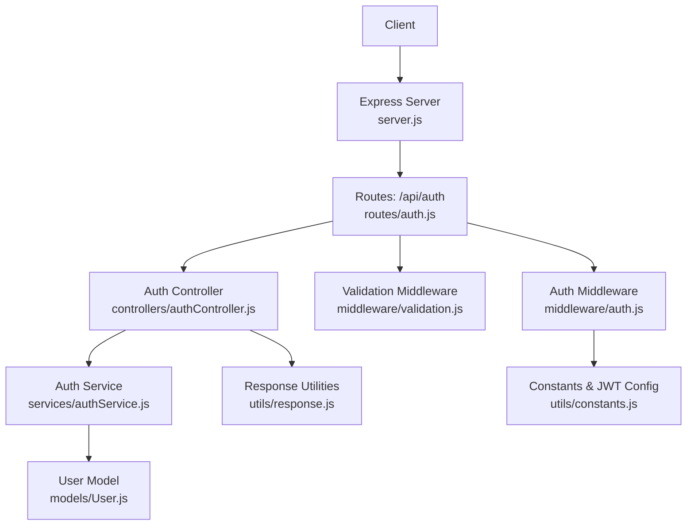
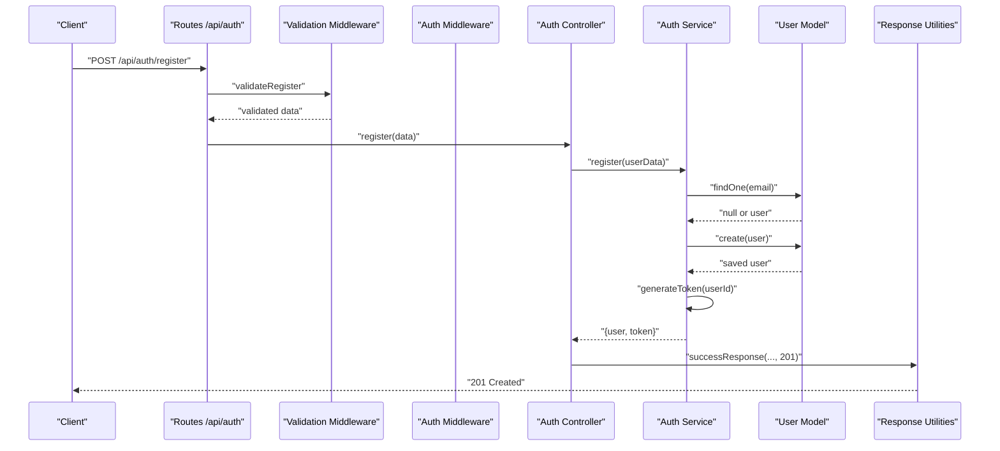
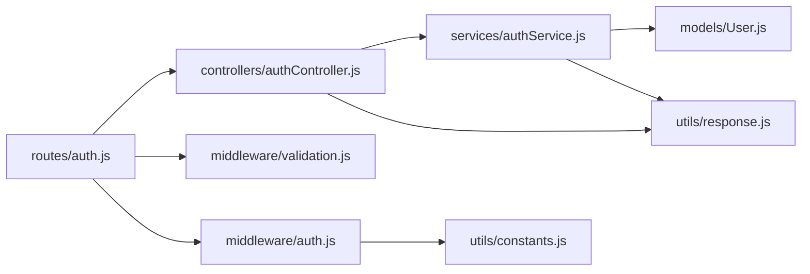

# Authentication Endpoints

<cite>
**Referenced Files in This Document**
- [server.js](file://backend/server.js)
- [routes/auth.js](file://backend/routes/auth.js)
- [controllers/authController.js](file://backend/controllers/authController.js)
- [services/authService.js](file://backend/services/authService.js)
- [middleware/validation.js](file://backend/middleware/validation.js)
- [middleware/auth.js](file://backend/middleware/auth.js)
- [models/User.js](file://backend/models/User.js)
- [utils/constants.js](file://backend/utils/constants.js)
- [utils/response.js](file://backend/utils/response.js)
- [tests/auth.test.js](file://backend/tests/auth.test.js)
</cite>

## Table of Contents
1. [Introduction](#introduction)
2. [Project Structure](#project-structure)
3. [Core Components](#core-components)
4. [Architecture Overview](#architecture-overview)
5. [Detailed Component Analysis](#detailed-component-analysis)
6. [Dependency Analysis](#dependency-analysis)
7. [Performance Considerations](#performance-considerations)
8. [Troubleshooting Guide](#troubleshooting-guide)
9. [Conclusion](#conclusion)
10. [Appendices](#appendices)

## Introduction
This document provides comprehensive API documentation for the authentication endpoints. It covers five routes:
- POST /api/auth/register (user registration with validation)
- POST /api/auth/login (user authentication)
- GET /api/auth/profile (authenticated user profile retrieval)
- PUT /api/auth/change-password (password modification)
- POST /api/auth/setup-admin (initial admin creation)

For each endpoint, we specify HTTP methods, URL patterns, request body schemas, response formats, authentication requirements, validation rules, practical curl examples, success responses, error scenarios with appropriate HTTP status codes, and security considerations.

## Project Structure
The authentication system is organized around Express routes, controllers, services, middleware, and models. The server mounts the authentication routes under /api/auth.

**Diagram sources**
- [server.js:52-56](file://backend/server.js#L52-L56)
- [routes/auth.js:13-46](file://backend/routes/auth.js#L13-L46)
- [controllers/authController.js:13-105](file://backend/controllers/authController.js#L13-L105)
- [services/authService.js:15-186](file://backend/services/authService.js#L15-L186)
- [models/User.js:10-54](file://backend/models/User.js#L10-L54)
- [middleware/validation.js:32-78](file://backend/middleware/validation.js#L32-L78)
- [middleware/auth.js:14-59](file://backend/middleware/auth.js#L14-L59)
- [utils/constants.js:66-70](file://backend/utils/constants.js#L66-L70)
- [utils/response.js:12-63](file://backend/utils/response.js#L12-L63)

**Section sources**
- [server.js:52-56](file://backend/server.js#L52-L56)
- [routes/auth.js:13-46](file://backend/routes/auth.js#L13-L46)

## Core Components
- Routes define the HTTP endpoints and apply middleware for validation and authentication.
- Controller functions orchestrate request handling and delegate to the service layer.
- Service functions encapsulate business logic, including user operations, password hashing, and JWT token generation.
- Validation middleware enforces request payload constraints using express-validator.
- Auth middleware verifies JWT tokens and attaches the authenticated user to the request.
- Response utilities standardize success, error, and validation responses.
- User model defines schema, indexes, password hashing hooks, and helper methods.

**Section sources**
- [routes/auth.js:13-46](file://backend/routes/auth.js#L13-L46)
- [controllers/authController.js:13-105](file://backend/controllers/authController.js#L13-L105)
- [services/authService.js:15-186](file://backend/services/authService.js#L15-L186)
- [middleware/validation.js:13-27](file://backend/middleware/validation.js#L13-L27)
- [middleware/auth.js:14-59](file://backend/middleware/auth.js#L14-L59)
- [utils/response.js:12-63](file://backend/utils/response.js#L12-L63)
- [models/User.js:10-127](file://backend/models/User.js#L10-L127)

## Architecture Overview
The authentication flow follows a layered architecture:
- Routes receive HTTP requests and apply validation and auth middleware.
- Controllers call service functions with validated data.
- Services interact with the User model, manage password hashing, and generate JWT tokens.
- Responses are standardized via response utilities.

**Diagram sources**
- [routes/auth.js:18](file://backend/routes/auth.js#L18)
- [middleware/validation.js:32-60](file://backend/middleware/validation.js#L32-L60)
- [controllers/authController.js:13-26](file://backend/controllers/authController.js#L13-L26)
- [services/authService.js:15-51](file://backend/services/authService.js#L15-L51)
- [models/User.js:19-33](file://backend/models/User.js#L19-L33)
- [utils/response.js:12-19](file://backend/utils/response.js#L12-L19)

## Detailed Component Analysis

### POST /api/auth/register
- Method: POST
- URL: /api/auth/register
- Access: Public
- Purpose: Register a new user with validation and return user data and JWT token.

Request Body Schema
- name: string, required, trimmed, max length 100
- email: string, required, valid email, normalized
- password: string, required, min length 6
- role: string, optional, must be one of viewer, analyst, admin

Validation Rules
- Name: required, trimmed, max 100 chars
- Email: required, valid email format, normalized
- Password: required, min 6 chars
- Role: optional, must be one of predefined roles

Response Formats
- Success (201): { success: true, message: string, data: { user: object, token: string }, error: null }
- Validation Error (400): { success: false, message: "Validation failed", data: null, error: [{ field: string, message: string, value: any }] }
- Error (409): { success: false, message: string, data: null, error: string }

Authentication Requirements
- None

Security Considerations
- Password is hashed before storage.
- Token is generated with HS256 algorithm and configured expiration.

Practical curl Example
- curl -X POST http://localhost:5000/api/auth/register -H "Content-Type: application/json" -d '{"name":"John Doe","email":"john@example.com","password":"securepass","role":"viewer"}'

Success Response
- 201 Created with user object and token.

Error Scenarios
- Duplicate email: 409 Conflict
- Validation failures: 400 Bad Request
- Internal errors: 500 Internal Server Error

**Section sources**
- [routes/auth.js:18](file://backend/routes/auth.js#L18)
- [middleware/validation.js:32-60](file://backend/middleware/validation.js#L32-L60)
- [controllers/authController.js:13-26](file://backend/controllers/authController.js#L13-L26)
- [services/authService.js:15-51](file://backend/services/authService.js#L15-L51)
- [models/User.js:28-33](file://backend/models/User.js#L28-L33)
- [utils/response.js:42-49](file://backend/utils/response.js#L42-L49)

### POST /api/auth/login
- Method: POST
- URL: /api/auth/login
- Access: Public
- Purpose: Authenticate user and return user data and JWT token.

Request Body Schema
- email: string, required, valid email
- password: string, required

Validation Rules
- Email: required, valid email format
- Password: required

Response Formats
- Success (200): { success: true, message: string, data: { user: object, token: string }, error: null }
- Validation Error (400): { success: false, message: "Validation failed", data: null, error: [{ field: string, message: string, value: any }] }
- Error (401): { success: false, message: string, data: null, error: string }

Authentication Requirements
- None

Security Considerations
- Password comparison uses bcrypt.
- Token is generated with HS256 algorithm and configured expiration.

Practical curl Example
- curl -X POST http://localhost:5000/api/auth/login -H "Content-Type: application/json" -d '{"email":"john@example.com","password":"securepass"}'

Success Response
- 200 OK with user object and token.

Error Scenarios
- Invalid credentials: 401 Unauthorized
- Inactive account: 401 Unauthorized
- Validation failures: 400 Bad Request
- Internal errors: 500 Internal Server Error

**Section sources**
- [routes/auth.js:25](file://backend/routes/auth.js#L25)
- [middleware/validation.js:65-78](file://backend/middleware/validation.js#L65-L78)
- [controllers/authController.js:32-46](file://backend/controllers/authController.js#L32-L46)
- [services/authService.js:59-93](file://backend/services/authService.js#L59-L93)
- [utils/response.js:42-49](file://backend/utils/response.js#L42-L49)

### GET /api/auth/profile
- Method: GET
- URL: /api/auth/profile
- Access: Private
- Purpose: Retrieve authenticated user’s profile.

Request Body Schema
- None

Validation Rules
- None

Response Formats
- Success (200): { success: true, message: string, data: { id: string, name: string, email: string, role: string, status: string, createdAt: datetime, updatedAt: datetime }, error: null }
- Error (401): { success: false, message: string, data: null, error: string }
- Error (404): { success: false, message: "Resource not found", data: null, error: "Not Found" }

Authentication Requirements
- Bearer token required in Authorization header.

Security Considerations
- Token verified by auth middleware; user must be active.

Practical curl Example
- curl -X GET http://localhost:5000/api/auth/profile -H "Authorization: Bearer YOUR_JWT_TOKEN"

Success Response
- 200 OK with user profile.

Error Scenarios
- Missing/expired/invalid token: 401 Unauthorized
- User not found: 404 Not Found
- Internal errors: 500 Internal Server Error

**Section sources**
- [routes/auth.js:32](file://backend/routes/auth.js#L32)
- [controllers/authController.js:52-66](file://backend/controllers/authController.js#L52-L66)
- [services/authService.js:100-116](file://backend/services/authService.js#L100-L116)
- [middleware/auth.js:14-59](file://backend/middleware/auth.js#L14-L59)
- [utils/response.js:84-91](file://backend/utils/response.js#L84-L91)

### PUT /api/auth/change-password
- Method: PUT
- URL: /api/auth/change-password
- Access: Private
- Purpose: Change authenticated user’s password.

Request Body Schema
- currentPassword: string, required
- newPassword: string, required

Validation Rules
- currentPassword: required
- newPassword: required

Response Formats
- Success (200): { success: true, message: string, data: null, error: null }
- Error (400): { success: false, message: "Validation failed", data: null, error: [{ field: string, message: string, value: any }] }
- Error (401): { success: false, message: string, data: null, error: string }
- Error (404): { success: false, message: "Resource not found", data: null, error: "Not Found" }

Authentication Requirements
- Bearer token required in Authorization header.

Security Considerations
- Current password verified against stored hash.
- New password is saved after hashing.

Practical curl Example
- curl -X PUT http://localhost:5000/api/auth/change-password -H "Authorization: Bearer YOUR_JWT_TOKEN" -H "Content-Type: application/json" -d '{"currentPassword":"oldpass","newPassword":"newpass"}'

Success Response
- 200 OK with success message.

Error Scenarios
- Missing/expired/invalid token: 401 Unauthorized
- Current password incorrect: 401 Unauthorized
- User not found: 404 Not Found
- Validation failures: 400 Bad Request
- Internal errors: 500 Internal Server Error

**Section sources**
- [routes/auth.js:39](file://backend/routes/auth.js#L39)
- [controllers/authController.js:72-86](file://backend/controllers/authController.js#L72-L86)
- [services/authService.js:125-144](file://backend/services/authService.js#L125-L144)
- [middleware/auth.js:14-59](file://backend/middleware/auth.js#L14-L59)
- [utils/response.js:42-49](file://backend/utils/response.js#L42-L49)

### POST /api/auth/setup-admin
- Method: POST
- URL: /api/auth/setup-admin
- Access: Public (one-time setup)
- Purpose: Create the initial admin user if none exists.

Request Body Schema
- name: string, required, trimmed, max length 100
- email: string, required, valid email, normalized
- password: string, required, min length 6

Validation Rules
- Name: required, trimmed, max 100 chars
- Email: required, valid email format, normalized
- Password: required, min 6 chars

Response Formats
- Success (201): { success: true, message: string, data: { user: object, token: string }, error: null }
- Error (400): { success: false, message: "Validation failed", data: null, error: [{ field: string, message: string, value: any }] }
- Error (409): { success: false, message: string, data: null, error: string }

Authentication Requirements
- None

Security Considerations
- Validates that no admin currently exists.
- Enforces unique email constraint.
- Generates JWT token upon successful creation.

Practical curl Example
- curl -X POST http://localhost:5000/api/auth/setup-admin -H "Content-Type: application/json" -d '{"name":"Admin","email":"admin@example.com","password":"adminpass"}'

Success Response
- 201 Created with admin user object and token.

Error Scenarios
- Admin already exists: 409 Conflict
- Duplicate email: 409 Conflict
- Validation failures: 400 Bad Request
- Internal errors: 500 Internal Server Error

**Section sources**
- [routes/auth.js:46](file://backend/routes/auth.js#L46)
- [controllers/authController.js:92-105](file://backend/controllers/authController.js#L92-L105)
- [services/authService.js:151-186](file://backend/services/authService.js#L151-L186)
- [middleware/validation.js:32-60](file://backend/middleware/validation.js#L32-L60)
- [utils/response.js:42-49](file://backend/utils/response.js#L42-L49)

## Dependency Analysis
The authentication endpoints depend on:
- Routes mounting controllers and applying middleware.
- Controllers delegating to services.
- Services interacting with the User model and JWT utilities.
- Validation middleware enforcing request constraints.
- Response utilities standardizing outputs.

**Diagram sources**
- [routes/auth.js:9-11](file://backend/routes/auth.js#L9-L11)
- [controllers/authController.js:6](file://backend/controllers/authController.js#L6)
- [services/authService.js:6-7](file://backend/services/authService.js#L6-L7)
- [models/User.js:6-8](file://backend/models/User.js#L6-L8)
- [middleware/validation.js:6](file://backend/middleware/validation.js#L6)
- [middleware/auth.js:6-9](file://backend/middleware/auth.js#L6-L9)
- [utils/constants.js:66-70](file://backend/utils/constants.js#L66-L70)
- [utils/response.js:7](file://backend/utils/response.js#L7)

**Section sources**
- [routes/auth.js:9-11](file://backend/routes/auth.js#L9-L11)
- [controllers/authController.js:6](file://backend/controllers/authController.js#L6)
- [services/authService.js:6-7](file://backend/services/authService.js#L6-L7)
- [middleware/validation.js:6](file://backend/middleware/validation.js#L6)
- [middleware/auth.js:6-9](file://backend/middleware/auth.js#L6-L9)
- [utils/response.js:7](file://backend/utils/response.js#L7)

## Performance Considerations
- Password hashing uses bcrypt with a salt; consider adjusting rounds for production load.
- JWT token generation and verification are lightweight; ensure secret rotation and secure storage.
- Database queries use indexes on email, role, and status for efficient lookups.
- Validation middleware short-circuits on first error to reduce unnecessary processing.

[No sources needed since this section provides general guidance]

## Troubleshooting Guide
Common Issues and Resolutions
- Missing Authorization Header: Ensure Bearer token is present for private endpoints.
- Expired Token: Re-authenticate to obtain a new token.
- Invalid Credentials: Verify email and password correctness.
- Inactive Account: Contact administrator to activate the account.
- Validation Failures: Review request body against schema requirements.
- Duplicate Email: Use a unique email address during registration or setup-admin.

Error Response Patterns
- Validation errors return structured arrays with field, message, and value.
- Unauthorized and forbidden responses include standardized messages.
- Not found responses indicate missing resources.

**Section sources**
- [middleware/auth.js:14-59](file://backend/middleware/auth.js#L14-L59)
- [utils/response.js:42-63](file://backend/utils/response.js#L42-L63)
- [tests/auth.test.js:41-111](file://backend/tests/auth.test.js#L41-L111)

## Conclusion
The authentication endpoints provide a secure, validated, and standardized interface for user registration, login, profile retrieval, password changes, and initial admin setup. They leverage middleware for validation and authentication, services for business logic, and consistent response utilities for predictable outcomes. Adhering to the documented schemas, validation rules, and security considerations ensures reliable operation.

[No sources needed since this section summarizes without analyzing specific files]

## Appendices

### Endpoint Reference Summary
- POST /api/auth/register: Public, validates name/email/password/role, returns user and token.
- POST /api/auth/login: Public, validates email/password, returns user and token.
- GET /api/auth/profile: Private, requires Bearer token, returns user profile.
- PUT /api/auth/change-password: Private, requires Bearer token, validates current/new passwords.
- POST /api/auth/setup-admin: Public (one-time), validates name/email/password, creates admin if none exists.

### JWT Token Handling
- Algorithm: HS256
- Expiration: Configurable via environment variables
- Secret: Environment variable or fallback constant
- Header: Authorization: Bearer <token>

**Section sources**
- [utils/constants.js:66-70](file://backend/utils/constants.js#L66-L70)
- [middleware/auth.js:100-109](file://backend/middleware/auth.js#L100-L109)