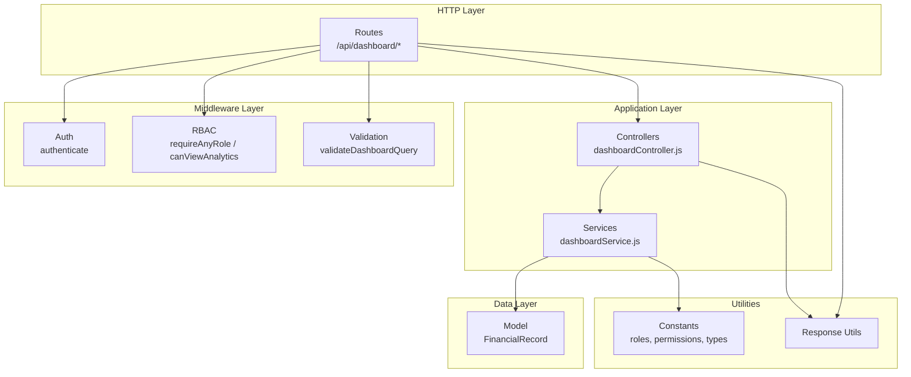
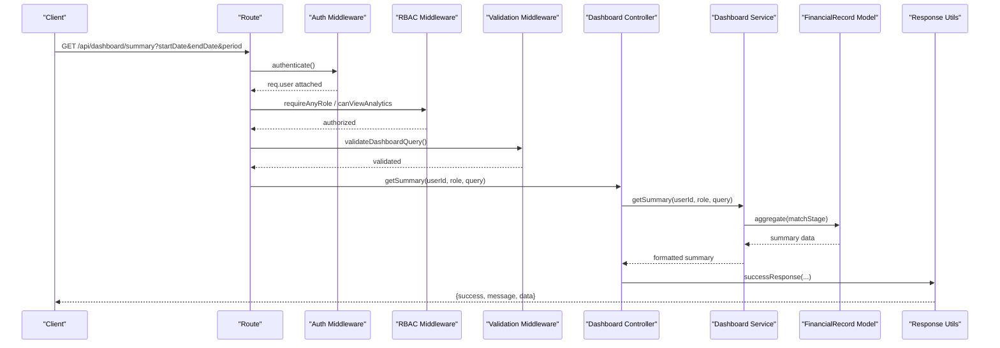
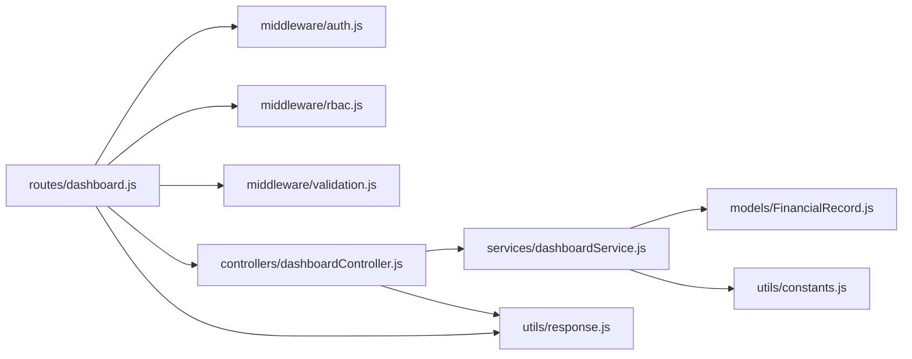

# Dashboard & Analytics Endpoints

<cite>
**Referenced Files in This Document**
- [server.js](file://backend/server.js)
- [routes/dashboard.js](file://backend/routes/dashboard.js)
- [controllers/dashboardController.js](file://backend/controllers/dashboardController.js)
- [services/dashboardService.js](file://backend/services/dashboardService.js)
- [middleware/auth.js](file://backend/middleware/auth.js)
- [middleware/rbac.js](file://backend/middleware/rbac.js)
- [middleware/validation.js](file://backend/middleware/validation.js)
- [utils/constants.js](file://backend/utils/constants.js)
- [utils/response.js](file://backend/utils/response.js)
- [models/FinancialRecord.js](file://backend/models/FinancialRecord.js)
</cite>

## Table of Contents
1. [Introduction](#introduction)
2. [Project Structure](#project-structure)
3. [Core Components](#core-components)
4. [Architecture Overview](#architecture-overview)
5. [Detailed Component Analysis](#detailed-component-analysis)
6. [Dependency Analysis](#dependency-analysis)
7. [Performance Considerations](#performance-considerations)
8. [Troubleshooting Guide](#troubleshooting-guide)
9. [Conclusion](#conclusion)

## Introduction
This document provides comprehensive API documentation for the dashboard and analytics endpoints. It covers all analytics routes including:
- GET /api/dashboard/summary (comprehensive financial summary)
- GET /api/dashboard/category-summary (category-wise financial breakdown)
- GET /api/dashboard/recent-activity (recent transactions feed)
- GET /api/dashboard/trends/monthly (monthly financial trends)
- GET /api/dashboard/trends/weekly (weekly financial trends)
- GET /api/dashboard (complete dashboard data bundle)

For each endpoint, you will find HTTP methods, optional query parameters for date ranges and filters, response schemas with aggregated financial data, authentication requirements, and permission-based data filtering. Practical examples for trend analysis, category breakdown visualization, recent activity monitoring, and comprehensive dashboard integration patterns are included.

## Project Structure
The dashboard analytics module follows a layered architecture:
- Routes define the HTTP endpoints and apply middleware
- Controllers handle request/response and delegate to services
- Services encapsulate business logic and data aggregation
- Middleware enforces authentication, authorization, and validation
- Models define data structures and indexes
- Utilities provide shared constants and standardized responses

**Diagram sources**
- [routes/dashboard.js:14-54](file://backend/routes/dashboard.js#L14-L54)
- [controllers/dashboardController.js:13-134](file://backend/controllers/dashboardController.js#L13-L134)
- [services/dashboardService.js:16-345](file://backend/services/dashboardService.js#L16-L345)
- [middleware/auth.js:14-59](file://backend/middleware/auth.js#L14-L59)
- [middleware/rbac.js:14-106](file://backend/middleware/rbac.js#L14-L106)
- [middleware/validation.js:278-295](file://backend/middleware/validation.js#L278-L295)
- [models/FinancialRecord.js:9-134](file://backend/models/FinancialRecord.js#L9-L134)
- [utils/constants.js:5-81](file://backend/utils/constants.js#L5-L81)
- [utils/response.js:12-101](file://backend/utils/response.js#L12-L101)

**Section sources**
- [server.js:52-56](file://backend/server.js#L52-L56)
- [routes/dashboard.js:14-54](file://backend/routes/dashboard.js#L14-L54)

## Core Components
- Authentication middleware verifies JWT tokens and attaches user context
- RBAC middleware enforces role-based permissions (VIEW_ANALYTICS for analytics endpoints)
- Validation middleware ensures query parameters conform to allowed formats
- Dashboard controller delegates to service layer and returns standardized responses
- Dashboard service performs aggregation queries and data formatting
- FinancialRecord model defines schema, indexes, and soft-delete behavior

Key permissions and roles:
- VIEW_ANALYTICS: required for analytics endpoints
- VIEWER, ANALYST, ADMIN: can access summary endpoints
- ANALYST, ADMIN: can access category-summary, monthly/weekly trends, and dashboard bundle

**Section sources**
- [middleware/rbac.js:48-106](file://backend/middleware/rbac.js#L48-L106)
- [utils/constants.js:48-57](file://backend/utils/constants.js#L48-L57)
- [middleware/validation.js:278-295](file://backend/middleware/validation.js#L278-L295)

## Architecture Overview
The analytics endpoints follow a consistent flow:
1. Route receives HTTP request
2. Authentication middleware validates token and sets req.user
3. RBAC middleware checks role/permission requirements
4. Validation middleware validates query parameters
5. Controller extracts userId, role, and query params
6. Service builds match stages, executes aggregations or queries
7. Controller wraps response with standardized success envelope

**Diagram sources**
- [routes/dashboard.js:19](file://backend/routes/dashboard.js#L19)
- [middleware/auth.js:14-59](file://backend/middleware/auth.js#L14-L59)
- [middleware/rbac.js:14-106](file://backend/middleware/rbac.js#L14-L106)
- [middleware/validation.js:278-295](file://backend/middleware/validation.js#L278-L295)
- [controllers/dashboardController.js:13-28](file://backend/controllers/dashboardController.js#L13-L28)
- [services/dashboardService.js:16-55](file://backend/services/dashboardService.js#L16-L55)
- [utils/response.js:12-19](file://backend/utils/response.js#L12-L19)

## Detailed Component Analysis

### Endpoint: GET /api/dashboard/summary
- Method: GET
- Path: /api/dashboard/summary
- Description: Retrieves a comprehensive financial summary including totals, counts, and net balance
- Authentication: Required (any authenticated user)
- Permissions: VIEW_ANALYTICS (analyst/admin) or VIEWER/ANALYST/ADMIN for summary
- Query Parameters:
  - startDate (optional): ISO date string
  - endDate (optional): ISO date string
  - period (optional): week | month | quarter | year
  - type (optional): income | expense (applies to analytics endpoints)
  - userId (optional): admin-only to view another user's records
- Response Schema:
  - totalIncome: number (2 decimals)
  - totalExpense: number (2 decimals)
  - netBalance: number (2 decimals)
  - incomeCount: integer
  - expenseCount: integer
  - totalRecords: integer

Practical example:
- Request: GET /api/dashboard/summary?startDate=2024-01-01&endDate=2024-12-31
- Response: { totalIncome: 120000.00, totalExpense: 85000.00, netBalance: 35000.00, incomeCount: 120, expenseCount: 85, totalRecords: 205 }

**Section sources**
- [routes/dashboard.js:22-26](file://backend/routes/dashboard.js#L22-L26)
- [controllers/dashboardController.js:13-28](file://backend/controllers/dashboardController.js#L13-L28)
- [services/dashboardService.js:16-55](file://backend/services/dashboardService.js#L16-L55)
- [middleware/validation.js:278-295](file://backend/middleware/validation.js#L278-L295)

### Endpoint: GET /api/dashboard/category-summary
- Method: GET
- Path: /api/dashboard/category-summary
- Description: Provides category-wise financial breakdown by income and expense
- Authentication: Required
- Permissions: VIEW_ANALYTICS (analyst/admin)
- Query Parameters:
  - startDate (optional): ISO date string
  - endDate (optional): ISO date string
  - period (optional): week | month | quarter | year
  - type (optional): income | expense
  - userId (optional): admin-only to view another user's records
- Response Schema:
  - income: array of { category: string, amount: number, count: integer }
  - expense: array of { category: string, amount: number, count: integer }
- Sorting: Results sorted by total amount descending within each category group

Practical example:
- Request: GET /api/dashboard/category-summary?period=quarter
- Response: {
  income: [
    { category: "salary", amount: 35000.00, count: 3 },
    { category: "freelance", amount: 12000.00, count: 4 }
  ],
  expense: [
    { category: "housing", amount: 18000.00, count: 12 },
    { category: "food", amount: 6000.00, count: 30 }
  ]
}

**Section sources**
- [routes/dashboard.js:29-33](file://backend/routes/dashboard.js#L29-L33)
- [controllers/dashboardController.js:34-49](file://backend/controllers/dashboardController.js#L34-L49)
- [services/dashboardService.js:64-100](file://backend/services/dashboardService.js#L64-L100)

### Endpoint: GET /api/dashboard/recent-activity
- Method: GET
- Path: /api/dashboard/recent-activity
- Description: Returns recent financial activity with user details
- Authentication: Required (any authenticated user)
- Permissions: VIEW_ANALYTICS (analyst/admin) or VIEWER/ANALYST/ADMIN for recent activity
- Query Parameters:
  - limit (optional): integer, default 10, max 100
  - userId (optional): admin-only to view another user's records
- Response Schema:
  - Array of records with:
    - id: string
    - amount: number
    - type: string (income | expense)
    - category: string
    - date: ISO date string
    - description: string
    - user: { name: string, email: string } or null

Practical example:
- Request: GET /api/dashboard/recent-activity?limit=25
- Response: [
  { id: "654321...", amount: 1200.00, type: "income", category: "salary", date: "2024-12-15T08:30:00Z", description: "Monthly salary", user: { name: "John Doe", email: "john@example.com" } },
  { id: "654320...", amount: 85.50, type: "expense", category: "food", date: "2024-12-14T19:15:00Z", description: "Grocery shopping", user: null }
]

**Section sources**
- [routes/dashboard.js:36-40](file://backend/routes/dashboard.js#L36-L40)
- [controllers/dashboardController.js:55-71](file://backend/controllers/dashboardController.js#L55-L71)
- [services/dashboardService.js:109-129](file://backend/services/dashboardService.js#L109-L129)

### Endpoint: GET /api/dashboard/trends/monthly
- Method: GET
- Path: /api/dashboard/trends/monthly
- Description: Provides monthly financial trends aggregated by income, expense, and balance
- Authentication: Required
- Permissions: VIEW_ANALYTICS (analyst/admin)
- Query Parameters:
  - startDate (optional): ISO date string
  - endDate (optional): ISO date string
  - period (optional): week | month | quarter | year
  - type (optional): income | expense
  - userId (optional): admin-only to view another user's records
- Response Schema:
  - Array of periods with:
    - period: string (YYYY-MM format)
    - income: number (2 decimals)
    - expense: number (2 decimals)
    - balance: number (2 decimals)
    - incomeCount: integer
    - expenseCount: integer
- Sorting: Chronologically ascending by year-month

Practical example:
- Request: GET /api/dashboard/trends/monthly?startDate=2024-01-01&endDate=2024-12-31
- Response: [
  { period: "2024-01", income: 10000.00, expense: 7500.00, balance: 2500.00, incomeCount: 10, expenseCount: 8 },
  { period: "2024-02", income: 11000.00, expense: 8200.00, balance: 2800.00, incomeCount: 11, expenseCount: 9 }
]

**Section sources**
- [routes/dashboard.js:43-47](file://backend/routes/dashboard.js#L43-L47)
- [controllers/dashboardController.js:77-92](file://backend/controllers/dashboardController.js#L77-L92)
- [services/dashboardService.js:138-188](file://backend/services/dashboardService.js#L138-L188)

### Endpoint: GET /api/dashboard/trends/weekly
- Method: GET
- Path: /api/dashboard/trends/weekly
- Description: Provides weekly financial trends aggregated by income, expense, and balance
- Authentication: Required
- Permissions: VIEW_ANALYTICS (analyst/admin)
- Query Parameters:
  - startDate (optional): ISO date string
  - endDate (optional): ISO date string
  - period (optional): week | month | quarter | year
  - type (optional): income | expense
  - userId (optional): admin-only to view another user's records
- Response Schema:
  - Array of periods with:
    - period: string (YYYY-Www format)
    - income: number (2 decimals)
    - expense: number (2 decimals)
    - balance: number (2 decimals)
    - incomeCount: integer
    - expenseCount: integer
- Sorting: Chronologically ascending by year-week

Practical example:
- Request: GET /api/dashboard/trends/weekly?period=quarter
- Response: [
  { period: "2024-W01", income: 2800.00, expense: 2100.00, balance: 700.00, incomeCount: 3, expenseCount: 2 },
  { period: "2024-W02", income: 2900.00, expense: 2200.00, balance: 700.00, incomeCount: 3, expenseCount: 2 }
]

**Section sources**
- [routes/dashboard.js:50-54](file://backend/routes/dashboard.js#L50-L54)
- [controllers/dashboardController.js:99-113](file://backend/controllers/dashboardController.js#L99-L113)
- [services/dashboardService.js:198-247](file://backend/services/dashboardService.js#L198-L247)

### Endpoint: GET /api/dashboard (Complete Dashboard Bundle)
- Method: GET
- Path: /api/dashboard
- Description: Returns a complete dashboard data bundle combining summary, category breakdown, recent activity, and monthly trends
- Authentication: Required
- Permissions: VIEW_ANALYTICS (analyst/admin)
- Query Parameters:
  - startDate (optional): ISO date string
  - endDate (optional): ISO date string
  - period (optional): week | month | quarter | year
  - type (optional): income | expense
  - userId (optional): admin-only to view another user's records
- Response Schema:
  - summary: same as /api/dashboard/summary
  - categories: same as /api/dashboard/category-summary
  - recentActivity: same as /api/dashboard/recent-activity (limit 10)
  - trends: {
    monthly: same as /api/dashboard/trends/monthly
  }

Integration pattern example:
- Frontend calls GET /api/dashboard to load all analytics widgets in a single request
- Backend concurrently executes summary, category-summary, recent-activity, and monthly-trends
- Response combines all data for immediate rendering

**Section sources**
- [routes/dashboard.js:15-19](file://backend/routes/dashboard.js#L15-L19)
- [controllers/dashboardController.js:119-134](file://backend/controllers/dashboardController.js#L119-L134)
- [services/dashboardService.js:256-272](file://backend/services/dashboardService.js#L256-L272)

## Dependency Analysis
The analytics endpoints depend on several middleware layers and shared utilities:

**Diagram sources**
- [routes/dashboard.js:10-12](file://backend/routes/dashboard.js#L10-L12)
- [controllers/dashboardController.js:6](file://backend/controllers/dashboardController.js#L6)
- [services/dashboardService.js:6-7](file://backend/services/dashboardService.js#L6-L7)
- [middleware/validation.js:278-295](file://backend/middleware/validation.js#L278-L295)

Key dependency relationships:
- Routes import controllers and middleware
- Controllers import services and response utilities
- Services import model, constants, and perform aggregation queries
- Middleware enforces authentication, authorization, and validation
- Shared constants define roles, permissions, and record types

**Section sources**
- [routes/dashboard.js:10-12](file://backend/routes/dashboard.js#L10-L12)
- [controllers/dashboardController.js:6-7](file://backend/controllers/dashboardController.js#L6-L7)
- [services/dashboardService.js:6-7](file://backend/services/dashboardService.js#L6-L7)

## Performance Considerations
- Aggregation pipeline efficiency: The service uses MongoDB aggregation for efficient summarization without loading full datasets
- Index usage: FinancialRecord schema includes compound indexes for userId+date, type+date, and other common query patterns
- Concurrency: The dashboard bundle endpoint uses Promise.all to execute multiple analytics in parallel
- Data formatting: Results are rounded to 2 decimal places to reduce payload size
- Pagination defaults: While not applicable to analytics endpoints, the validation middleware establishes consistent patterns

Optimization opportunities:
- Consider adding time-series indexes for frequently filtered date ranges
- Implement caching for static category lists
- Add pagination support for recent-activity endpoint if needed
- Monitor aggregation performance with explain() for complex date range queries

**Section sources**
- [services/dashboardService.js:19-28](file://backend/services/dashboardService.js#L19-L28)
- [services/dashboardService.js:257-262](file://backend/services/dashboardService.js#L257-L262)
- [models/FinancialRecord.js:65-71](file://backend/models/FinancialRecord.js#L65-L71)

## Troubleshooting Guide
Common error scenarios and resolutions:

Authentication failures:
- Missing or invalid Authorization header: Returns 401 Unauthorized
- Expired token: Returns 401 Unauthorized with token expired message
- Inactive account: Returns 401 Unauthorized for inactive users

Authorization failures:
- Missing VIEW_ANALYTICS permission: Returns 403 Forbidden
- Insufficient role (viewer vs analyst/admin): Returns 403 Forbidden

Validation errors:
- Invalid date formats: Returns 400 Validation failed with field details
- Unsupported period values: Returns 400 Validation failed
- Out-of-range limits: Returns 400 Validation failed

Data filtering issues:
- Non-admin users cannot specify userId parameter: Only their own records are returned
- Deleted records are excluded by default: Soft-deleted records are not included in analytics

**Section sources**
- [middleware/auth.js:14-59](file://backend/middleware/auth.js#L14-L59)
- [middleware/rbac.js:14-33](file://backend/middleware/rbac.js#L14-L33)
- [middleware/validation.js:13-27](file://backend/middleware/validation.js#L13-L27)
- [services/dashboardService.js:281-334](file://backend/services/dashboardService.js#L281-L334)

## Conclusion
The dashboard and analytics endpoints provide a comprehensive financial insights platform with secure, role-based access control and efficient data aggregation. The modular architecture ensures maintainability while the standardized response format simplifies frontend integration. The endpoints support flexible date range filtering, category breakdowns, trend analysis, and complete dashboard bundling for optimal developer experience.