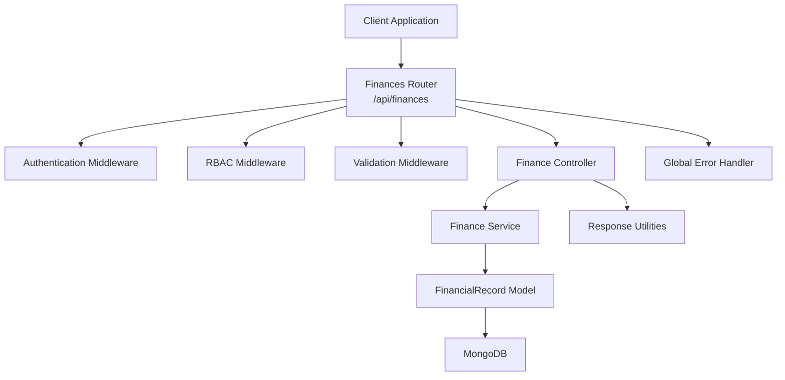
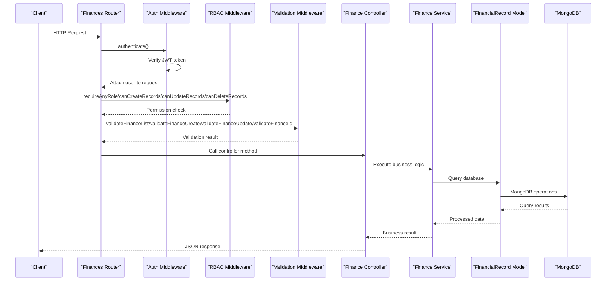
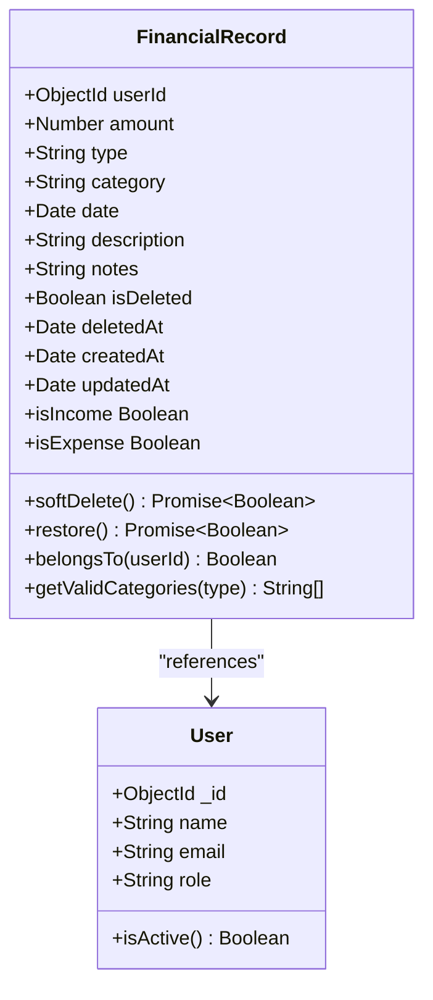
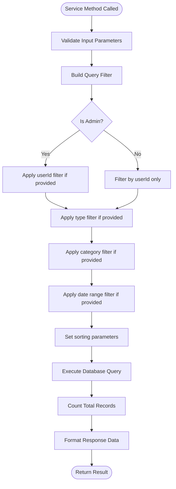
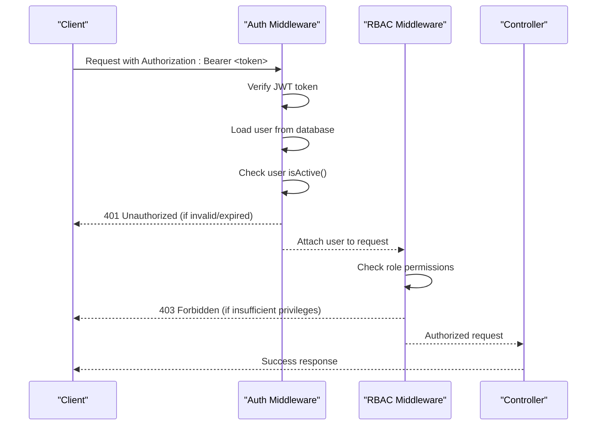
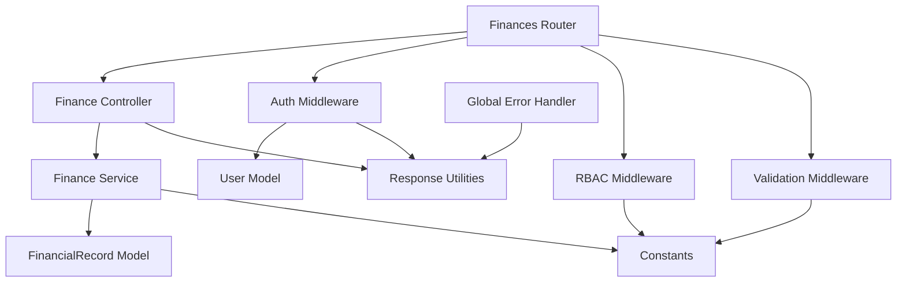

# Financial Records Endpoints

<cite>
**Referenced Files in This Document**
- [server.js](file://backend/server.js)
- [finances.js](file://backend/routes/finances.js)
- [financeController.js](file://backend/controllers/financeController.js)
- [financeService.js](file://backend/services/financeService.js)
- [FinancialRecord.js](file://backend/models/FinancialRecord.js)
- [validation.js](file://backend/middleware/validation.js)
- [auth.js](file://backend/middleware/auth.js)
- [rbac.js](file://backend/middleware/rbac.js)
- [constants.js](file://backend/utils/constants.js)
- [response.js](file://backend/utils/response.js)
- [errorHandler.js](file://backend/middleware/errorHandler.js)
</cite>

## Table of Contents
1. [Introduction](#introduction)
2. [Project Structure](#project-structure)
3. [Core Components](#core-components)
4. [Architecture Overview](#architecture-overview)
5. [Detailed Component Analysis](#detailed-component-analysis)
6. [Dependency Analysis](#dependency-analysis)
7. [Performance Considerations](#performance-considerations)
8. [Troubleshooting Guide](#troubleshooting-guide)
9. [Conclusion](#conclusion)

## Introduction
This document provides comprehensive API documentation for financial records endpoints. It covers all CRUD operations for financial records, including listing with advanced filtering and pagination, creating new records, retrieving individual records, updating existing records, and soft-deleting records. The documentation specifies HTTP methods, URL parameters, extensive query parameters for filtering (date ranges, categories, types), request/response schemas, authentication and authorization requirements, and soft deletion behavior. Practical examples demonstrate income/expense categorization, filtering scenarios, pagination patterns, and error handling for invalid financial data.

## Project Structure
The financial records feature follows a layered architecture:
- Routes define endpoint contracts and apply middleware
- Controllers handle HTTP requests and orchestrate service operations
- Services encapsulate business logic and data access
- Models define data schemas and pre-save hooks
- Middleware enforces authentication, authorization, and input validation
- Utilities provide standardized responses and shared constants



**Diagram sources**
- [server.js:52-56](file://backend/server.js#L52-L56)
- [finances.js:10-22](file://backend/routes/finances.js#L10-L22)
- [financeController.js:6](file://backend/controllers/financeController.js#L6)
- [financeService.js:6](file://backend/services/financeService.js#L6)
- [FinancialRecord.js:6](file://backend/models/FinancialRecord.js#L6)

**Section sources**
- [server.js:52-56](file://backend/server.js#L52-L56)
- [finances.js:1-67](file://backend/routes/finances.js#L1-L67)

## Core Components
This section documents each financial records endpoint with its HTTP method, URL parameters, query parameters, request/response schemas, authentication/authorization requirements, and behavior details.

### Endpoint: GET /api/finances
- Method: GET
- Description: Retrieve all financial records with filtering and pagination
- Authentication: Required (any authenticated user)
- Authorization: Viewer, Analyst, Admin roles
- Query Parameters:
  - page: Integer, default 1, min 1
  - limit: Integer, default 10, min 1, max 100
  - type: Enum 'income' or 'expense'
  - category: String, max 50 characters
  - startDate: ISO date string
  - endDate: ISO date string
  - sortBy: Enum 'date', 'amount', 'category', 'type', 'createdAt'
  - sortOrder: Enum 'asc', 'desc'

Response Schema (success):
- success: Boolean
- message: String
- data: Object
  - records: Array of financial records
  - pagination: Object
    - page: Integer
    - limit: Integer
    - total: Integer
    - pages: Integer
    - hasNext: Boolean
    - hasPrev: Boolean

Example Request:
- GET /api/finances?page=1&limit=10&type=income&startDate=2023-01-01&endDate=2023-12-31&sortBy=date&sortOrder=desc

Example Response:
- Status: 200 OK
- Body: { success: true, message: "Financial records retrieved successfully", data: { records: [...], pagination: { page, limit, total, pages, hasNext, hasPrev } } }

Behavior Details:
- Non-admin users can only see their own records
- Admin users can filter by userId via query parameter
- Soft-deleted records are excluded by default
- Sorting defaults to date descending

**Section sources**
- [finances.js:24-29](file://backend/routes/finances.js#L24-L29)
- [financeController.js:34-49](file://backend/controllers/financeController.js#L34-L49)
- [financeService.js:38-102](file://backend/services/financeService.js#L38-L102)
- [validation.js:227-273](file://backend/middleware/validation.js#L227-L273)
- [constants.js:59-64](file://backend/utils/constants.js#L59-L64)

### Endpoint: POST /api/finances
- Method: POST
- Description: Create a new financial record
- Authentication: Required
- Authorization: Analyst, Admin roles
- Request Body Fields:
  - amount: Number, required, min 0
  - type: Enum 'income' or 'expense', required
  - category: String, required, max 50 characters
  - date: ISO date string, optional (defaults to current date)
  - description: String, optional, max 500 characters
  - notes: String, optional, max 1000 characters

Response Schema (success):
- success: Boolean
- message: String
- data: Financial record object

Example Request:
- POST /api/finances
- Headers: Authorization: Bearer <token>
- Body: { amount: 1500.00, type: "income", category: "salary", date: "2023-10-01", description: "Monthly salary", notes: "Bonus included" }

Example Response:
- Status: 201 Created
- Body: { success: true, message: "Financial record created successfully", data: { id, userId, amount, type, category, date, description, notes, createdAt, updatedAt } }

Behavior Details:
- Automatically sets userId from authenticated user
- Normalizes category to lowercase and trims whitespace
- Returns the created record with populated user information

**Section sources**
- [finances.js:38-43](file://backend/routes/finances.js#L38-L43)
- [financeController.js:13-28](file://backend/controllers/financeController.js#L13-L28)
- [financeService.js:15-29](file://backend/services/financeService.js#L15-L29)
- [validation.js:127-168](file://backend/middleware/validation.js#L127-L168)

### Endpoint: GET /api/finances/:id
- Method: GET
- Description: Retrieve a specific financial record by ID
- Authentication: Required (any authenticated user)
- Authorization: Viewer, Analyst, Admin roles
- URL Parameters:
  - id: Mongo ObjectId, required

Response Schema (success):
- success: Boolean
- message: String
- data: Financial record object

Example Request:
- GET /api/finances/507f1f77bcf86cd799439011

Example Response:
- Status: 200 OK
- Body: { success: true, message: "Financial record retrieved successfully", data: { id, userId, amount, type, category, date, description, notes, createdAt, updatedAt } }

Behavior Details:
- Non-admin users can only access their own records
- Returns record with user information populated
- Soft-deleted records are excluded by default

**Section sources**
- [finances.js:45-50](file://backend/routes/finances.js#L45-L50)
- [financeController.js:55-71](file://backend/controllers/financeController.js#L55-L71)
- [financeService.js:111-125](file://backend/services/financeService.js#L111-L125)
- [validation.js:217-225](file://backend/middleware/validation.js#L217-L225)

### Endpoint: PUT /api/finances/:id
- Method: PUT
- Description: Update an existing financial record
- Authentication: Required
- Authorization: Admin role only
- URL Parameters:
  - id: Mongo ObjectId, required
- Request Body Fields (optional):
  - amount: Number, min 0
  - type: Enum 'income' or 'expense'
  - category: String, max 50 characters
  - date: ISO date string
  - description: String, max 500 characters
  - notes: String, max 1000 characters

Response Schema (success):
- success: Boolean
- message: String
- data: Updated financial record object

Example Request:
- PUT /api/finances/507f1f77bcf86cd799439011
- Body: { amount: 2000.00, category: "freelance_work" }

Example Response:
- Status: 200 OK
- Body: { success: true, message: "Financial record updated successfully", data: { id, userId, amount, type, category, date, description, notes, createdAt, updatedAt } }

Behavior Details:
- Only allowed fields are updated (amount, type, category, date, description, notes)
- Amount is converted to float
- Category is normalized to lowercase and trimmed
- Returns the updated record with populated user information

**Section sources**
- [finances.js:52-57](file://backend/routes/finances.js#L52-L57)
- [financeController.js:77-91](file://backend/controllers/financeController.js#L77-L91)
- [financeService.js:133-157](file://backend/services/financeService.js#L133-L157)
- [validation.js:171-214](file://backend/middleware/validation.js#L171-L214)

### Endpoint: DELETE /api/finances/:id
- Method: DELETE
- Description: Soft delete a financial record
- Authentication: Required
- Authorization: Admin role only
- URL Parameters:
  - id: Mongo ObjectId, required

Response Schema (success):
- success: Boolean
- message: String

Example Request:
- DELETE /api/finances/507f1f77bcf86cd799439011

Example Response:
- Status: 200 OK
- Body: { success: true, message: "Financial record deleted successfully" }

Behavior Details:
- Performs soft delete by setting isDeleted flag and recording deletedAt timestamp
- Record remains in database but is excluded from queries by default
- Admin users can still access soft-deleted records if explicitly queried

**Section sources**
- [finances.js:59-64](file://backend/routes/finances.js#L59-L64)
- [financeController.js:97-110](file://backend/controllers/financeController.js#L97-L110)
- [financeService.js:164-173](file://backend/services/financeService.js#L164-L173)
- [FinancialRecord.js:86-99](file://backend/models/FinancialRecord.js#L86-L99)

### Endpoint: GET /api/finances/categories
- Method: GET
- Description: Retrieve all categories used in records, grouped by type
- Authentication: Required (any authenticated user)
- Authorization: Viewer, Analyst, Admin roles

Response Schema (success):
- success: Boolean
- message: String
- data: Object
  - income: Array of category strings
  - expense: Array of category strings
  - all: Array of unique category strings

Example Request:
- GET /api/finances/categories

Example Response:
- Status: 200 OK
- Body: { success: true, message: "Categories retrieved successfully", data: { income: [...], expense: [...], all: [...] } }

Behavior Details:
- Returns distinct categories for income and expense types
- Provides combined list of all unique categories

**Section sources**
- [finances.js:31-36](file://backend/routes/finances.js#L31-L36)
- [financeController.js:116-128](file://backend/controllers/financeController.js#L116-L128)
- [financeService.js:216-225](file://backend/services/financeService.js#L216-L225)

## Architecture Overview
The financial records endpoints follow a clean architecture pattern with clear separation of concerns:



**Diagram sources**
- [finances.js:10-22](file://backend/routes/finances.js#L10-L22)
- [auth.js:14-59](file://backend/middleware/auth.js#L14-L59)
- [rbac.js:14-33](file://backend/middleware/rbac.js#L14-L33)
- [validation.js:13-27](file://backend/middleware/validation.js#L13-L27)
- [financeController.js:13-28](file://backend/controllers/financeController.js#L13-L28)
- [financeService.js:15-29](file://backend/services/financeService.js#L15-L29)
- [FinancialRecord.js:9-63](file://backend/models/FinancialRecord.js#L9-L63)

## Detailed Component Analysis

### Data Model: FinancialRecord
The FinancialRecord model defines the schema for financial entries with built-in validation and soft-delete capabilities.



**Diagram sources**
- [FinancialRecord.js:9-63](file://backend/models/FinancialRecord.js#L9-L63)
- [FinancialRecord.js:106-128](file://backend/models/FinancialRecord.js#L106-L128)

Key model features:
- Required fields: userId, amount, type, category, date
- Enum validation for type ('income' or 'expense')
- Indexes for efficient querying (userId, date, type, category, isDeleted)
- Pre-find middleware to exclude soft-deleted records by default
- Soft delete methods (softDelete, restore)
- Virtual properties for income/expense classification
- Static method to get valid categories based on type

**Section sources**
- [FinancialRecord.js:9-63](file://backend/models/FinancialRecord.js#L9-L63)
- [FinancialRecord.js:75-81](file://backend/models/FinancialRecord.js#L75-L81)
- [FinancialRecord.js:86-99](file://backend/models/FinancialRecord.js#L86-L99)

### Service Layer: FinanceService
The service layer encapsulates business logic and handles data access patterns.



**Diagram sources**
- [financeService.js:38-102](file://backend/services/financeService.js#L38-L102)
- [financeService.js:232-251](file://backend/services/financeService.js#L232-L251)

Service capabilities:
- Advanced filtering with type, category, date ranges
- Pagination with configurable page and limit
- Sorting by multiple fields with ascending/descending order
- Access control enforcement (admin vs non-admin users)
- Soft-delete handling and restoration
- Category aggregation and validation

**Section sources**
- [financeService.js:38-102](file://backend/services/financeService.js#L38-L102)
- [financeService.js:216-225](file://backend/services/financeService.js#L216-L225)

### Authentication and Authorization
The system implements JWT-based authentication with role-based access control:



**Diagram sources**
- [auth.js:14-59](file://backend/middleware/auth.js#L14-L59)
- [rbac.js:14-33](file://backend/middleware/rbac.js#L14-L33)

Authentication flow:
- Token extraction from Authorization header
- JWT verification with secret key
- User existence and active status checks
- Role-based permission enforcement

**Section sources**
- [auth.js:14-59](file://backend/middleware/auth.js#L14-L59)
- [rbac.js:14-33](file://backend/middleware/rbac.js#L14-L33)

## Dependency Analysis
The financial records module has clear dependency relationships:



**Diagram sources**
- [finances.js:9-22](file://backend/routes/finances.js#L9-L22)
- [financeController.js:6](file://backend/controllers/financeController.js#L6)
- [financeService.js:6-7](file://backend/services/financeService.js#L6-L7)
- [auth.js:6-9](file://backend/middleware/auth.js#L6-L9)
- [rbac.js:6-7](file://backend/middleware/rbac.js#L6-L7)
- [validation.js:6-8](file://backend/middleware/validation.js#L6-L8)
- [errorHandler.js:6](file://backend/middleware/errorHandler.js#L6)

Key dependencies:
- Route handlers depend on controller functions
- Controllers depend on service layer for business logic
- Services depend on models for data persistence
- All components depend on constants for shared values
- Middleware components provide cross-cutting concerns

**Section sources**
- [finances.js:9-22](file://backend/routes/finances.js#L9-L22)
- [financeController.js:6](file://backend/controllers/financeController.js#L6)
- [financeService.js:6-7](file://backend/services/financeService.js#L6-L7)

## Performance Considerations
The system implements several performance optimizations:

- Database indexing strategy:
  - Compound indexes for common query patterns (userId+date, userId+type, userId+category, userId+isDeleted)
  - Separate indexes for type+date combinations
  - Automatic exclusion of soft-deleted records in queries

- Pagination limits:
  - Default page size of 10 with maximum 100 per page
  - Efficient skip/limit implementation for large datasets

- Query optimization:
  - Pre-find middleware excludes deleted records by default
  - Selective population of user fields reduces payload size
  - Efficient filtering with indexed fields

- Memory management:
  - Streaming responses for large result sets
  - Proper cleanup of database connections

## Troubleshooting Guide

### Common Validation Errors
- Amount validation: Must be numeric and >= 0
- Type validation: Must be 'income' or 'expense'
- Category validation: Required, max 50 characters
- Date validation: Must be valid ISO date format
- Pagination validation: Page >= 1, limit 1-100

### Authentication and Authorization Issues
- 401 Unauthorized: Missing or invalid JWT token
- 403 Forbidden: Insufficient role permissions
- 404 Not Found: User account inactive or record not found

### Soft Delete Behavior
Soft-deleted records:
- Are excluded from default queries
- Can be accessed by admins if explicitly queried
- Retain all original data except isDeleted flag
- DeletedAt timestamp indicates when deletion occurred

### Error Response Format
All error responses follow a standardized format:
```json
{
  "success": false,
  "message": "Error message",
  "data": null,
  "error": "Error details"
}
```

**Section sources**
- [validation.js:13-27](file://backend/middleware/validation.js#L13-L27)
- [auth.js:24-54](file://backend/middleware/auth.js#L24-L54)
- [rbac.js:16-32](file://backend/middleware/rbac.js#L16-L32)
- [errorHandler.js:89-145](file://backend/middleware/errorHandler.js#L89-L145)

## Conclusion
The financial records endpoints provide a robust, secure, and scalable API for managing financial data. The implementation follows best practices with clear separation of concerns, comprehensive validation, role-based access control, and efficient database operations. The soft-delete mechanism ensures data integrity while maintaining audit trails. The standardized response format and error handling provide consistent developer experience across all endpoints.