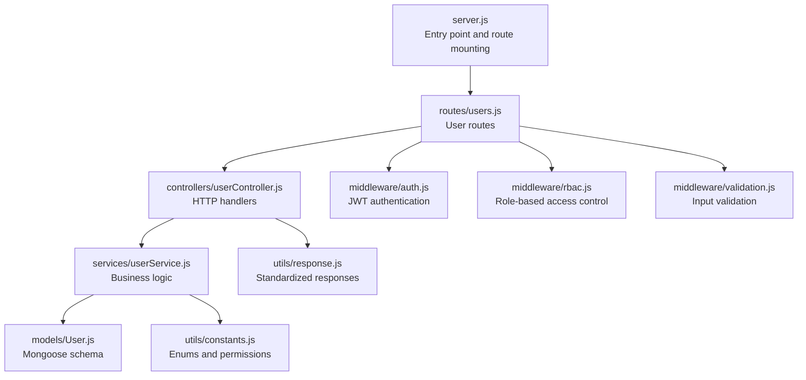
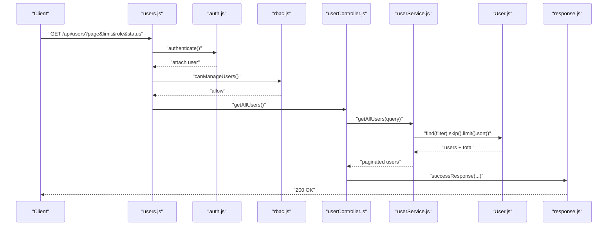
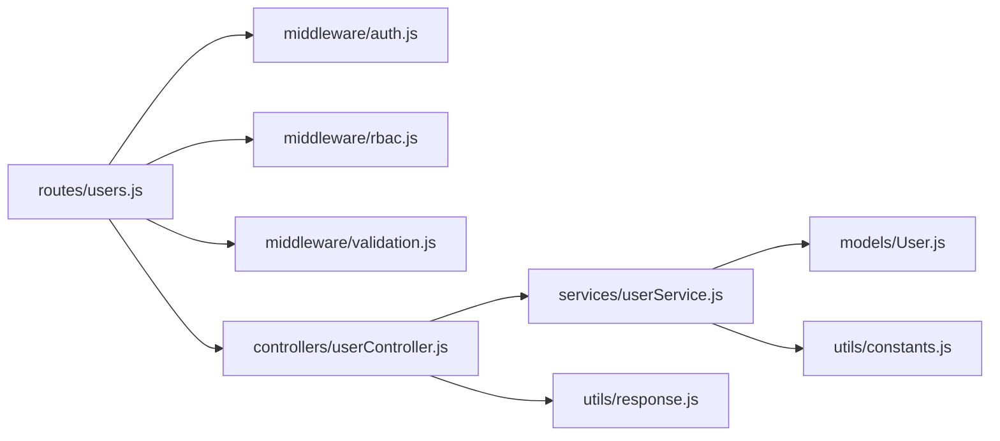

# User Management Endpoints

<cite>
**Referenced Files in This Document**
- [server.js](file://backend/server.js)
- [users.js](file://backend/routes/users.js)
- [userController.js](file://backend/controllers/userController.js)
- [userService.js](file://backend/services/userService.js)
- [User.js](file://backend/models/User.js)
- [auth.js](file://backend/middleware/auth.js)
- [rbac.js](file://backend/middleware/rbac.js)
- [validation.js](file://backend/middleware/validation.js)
- [constants.js](file://backend/utils/constants.js)
- [response.js](file://backend/utils/response.js)
</cite>

## Table of Contents
1. [Introduction](#introduction)
2. [Project Structure](#project-structure)
3. [Core Components](#core-components)
4. [Architecture Overview](#architecture-overview)
5. [Detailed Component Analysis](#detailed-component-analysis)
6. [Dependency Analysis](#dependency-analysis)
7. [Performance Considerations](#performance-considerations)
8. [Troubleshooting Guide](#troubleshooting-guide)
9. [Conclusion](#conclusion)

## Introduction
This document provides comprehensive API documentation for user management endpoints. It covers all user-related routes, including listing users with pagination and filtering, retrieving user statistics, creating users, fetching individual users, updating user information, toggling user status, and soft-deleting users. For each endpoint, we specify HTTP methods, URL parameters, query parameters, request/response schemas, authentication and authorization requirements, role-based access controls, practical examples, error handling scenarios, soft deletion behavior, and permission matrix considerations.

## Project Structure
The user management functionality is organized across routes, controllers, services, models, middleware, and utilities. The server mounts the user routes under the /api/users base path.

**Diagram sources**
- [server.js:52-56](file://backend/server.js#L52-L56)
- [users.js:14-61](file://backend/routes/users.js#L14-L61)
- [userController.js:13-141](file://backend/controllers/userController.js#L13-L141)
- [userService.js:14-264](file://backend/services/userService.js#L14-L264)
- [User.js:10-54](file://backend/models/User.js#L10-L54)
- [auth.js:14-59](file://backend/middleware/auth.js#L14-L59)
- [rbac.js:14-86](file://backend/middleware/rbac.js#L14-L86)
- [validation.js:13-27](file://backend/middleware/validation.js#L13-L27)
- [constants.js:5-79](file://backend/utils/constants.js#L5-L79)
- [response.js:12-99](file://backend/utils/response.js#L12-L99)

**Section sources**
- [server.js:52-56](file://backend/server.js#L52-L56)
- [users.js:14-61](file://backend/routes/users.js#L14-L61)

## Core Components
- Routes: Define HTTP endpoints, apply middleware, and delegate to controllers.
- Controller: Orchestrates request handling and returns standardized responses.
- Service: Implements business logic, performs validations, and interacts with the model.
- Model: Defines the User schema, indexes, and helper methods.
- Middleware: Provides authentication, RBAC, and input validation.
- Utilities: Provide constants, permissions, and standardized response helpers.

**Section sources**
- [users.js:14-61](file://backend/routes/users.js#L14-L61)
- [userController.js:13-141](file://backend/controllers/userController.js#L13-L141)
- [userService.js:14-264](file://backend/services/userService.js#L14-L264)
- [User.js:10-54](file://backend/models/User.js#L10-L54)
- [auth.js:14-59](file://backend/middleware/auth.js#L14-L59)
- [rbac.js:14-86](file://backend/middleware/rbac.js#L14-L86)
- [validation.js:13-27](file://backend/middleware/validation.js#L13-L27)
- [constants.js:5-79](file://backend/utils/constants.js#L5-L79)
- [response.js:12-99](file://backend/utils/response.js#L12-L99)

## Architecture Overview
The user management flow follows a layered architecture:
- Route layer validates inputs and applies authentication/RBAC.
- Controller delegates to service layer.
- Service handles business logic and interacts with the model.
- Model persists data and enforces schema constraints.
- Response utilities standardize all responses.

**Diagram sources**
- [users.js:19](file://backend/routes/users.js#L19)
- [auth.js:14-59](file://backend/middleware/auth.js#L14-L59)
- [rbac.js:86](file://backend/middleware/rbac.js#L86)
- [userController.js:13-25](file://backend/controllers/userController.js#L13-L25)
- [userService.js:14-58](file://backend/services/userService.js#L14-L58)
- [User.js:10-54](file://backend/models/User.js#L10-L54)
- [response.js:12-19](file://backend/utils/response.js#L12-L19)

## Detailed Component Analysis

### Endpoint: GET /api/users
- Method: GET
- Description: List all users with pagination and filtering.
- Authentication: Required
- Authorization: Admin or role with permission to manage users.
- URL Parameters: None
- Query Parameters:
  - page: Integer, default from constants.
  - limit: Integer, default from constants.
  - role: Enumerated role value.
  - status: Enumerated status value.
- Request Body: None
- Response Schema:
  - success: Boolean
  - message: String
  - data.users: Array of user objects with id, name, email, role, status, createdAt, updatedAt.
  - data.pagination: Object with page, limit, total, pages, hasNext, hasPrev.
  - error: Null on success.
- Error Responses:
  - 400 Bad Request: Validation errors for invalid page/limit/role/status.
  - 401 Unauthorized: Missing or invalid token.
  - 403 Forbidden: Insufficient permissions or inactive account.
  - 500 Internal Server Error: Unexpected server error.
- Practical Example:
  - Request: GET /api/users?page=1&limit=10&role=analyst&status=active
  - Response: 200 OK with paginated users and pagination metadata.
- Notes:
  - Uses MongoDB aggregation-like filters and sorting by creation date descending.
  - Pagination defaults and limits are enforced via constants.

**Section sources**
- [users.js:19](file://backend/routes/users.js#L19)
- [userController.js:13-25](file://backend/controllers/userController.js#L13-L25)
- [userService.js:14-58](file://backend/services/userService.js#L14-L58)
- [constants.js:60-64](file://backend/utils/constants.js#L60-L64)
- [validation.js:13-27](file://backend/middleware/validation.js#L13-L27)
- [auth.js:14-59](file://backend/middleware/auth.js#L14-L59)
- [rbac.js:86](file://backend/middleware/rbac.js#L86)
- [response.js:12-19](file://backend/utils/response.js#L12-L19)

### Endpoint: GET /api/users/stats
- Method: GET
- Description: Retrieve user statistics and analytics.
- Authentication: Required
- Authorization: Admin or role with permission to view analytics.
- URL Parameters: None
- Query Parameters: None
- Request Body: None
- Response Schema:
  - success: Boolean
  - message: String
  - data.total: Number
  - data.active: Number
  - data.inactive: Number
  - data.byRole: Object mapping role to count.
  - error: Null on success.
- Error Responses:
  - 401 Unauthorized: Missing or invalid token.
  - 403 Forbidden: Insufficient permissions or inactive account.
  - 500 Internal Server Error: Unexpected server error.
- Practical Example:
  - Request: GET /api/users/stats
  - Response: 200 OK with totals and counts by role.
- Notes:
  - Aggregates counts across all users and by role.

**Section sources**
- [users.js:26](file://backend/routes/users.js#L26)
- [userController.js:129-141](file://backend/controllers/userController.js#L129-L141)
- [userService.js:248-264](file://backend/services/userService.js#L248-L264)
- [rbac.js:106](file://backend/middleware/rbac.js#L106)
- [response.js:12-19](file://backend/utils/response.js#L12-L19)

### Endpoint: POST /api/users
- Method: POST
- Description: Create a new user with role assignment.
- Authentication: Required
- Authorization: Admin or role with permission to manage users.
- URL Parameters: None
- Query Parameters: None
- Request Body Fields:
  - name: String, required, trimmed, max length 100.
  - email: String, required, valid email, unique.
  - password: String, required, min length 6.
  - role: Enumerated role value (optional; defaults to viewer).
  - status: Enumerated status value (optional; defaults to active).
- Response Schema:
  - success: Boolean
  - message: String
  - data.id: String
  - data.name: String
  - data.email: String
  - data.role: String
  - data.status: String
  - data.createdAt: ISO date string.
  - error: Null on success.
- Error Responses:
  - 400 Bad Request: Validation errors or duplicate email.
  - 401 Unauthorized: Missing or invalid token.
  - 403 Forbidden: Insufficient permissions or inactive account.
  - 404 Not Found: User not found during update operations.
  - 500 Internal Server Error: Unexpected server error.
- Practical Example:
  - Request: POST /api/users with JSON payload containing name, email, password, role, status.
  - Response: 201 Created with created user details.
- Notes:
  - Password is hashed before saving.
  - Email uniqueness is enforced.
  - Default role is viewer and default status is active.

**Section sources**
- [users.js:33](file://backend/routes/users.js#L33)
- [userController.js:51-64](file://backend/controllers/userController.js#L51-L64)
- [userService.js:88-113](file://backend/services/userService.js#L88-L113)
- [User.js:10-54](file://backend/models/User.js#L10-L54)
- [validation.js:32-60](file://backend/middleware/validation.js#L32-L60)
- [rbac.js:86](file://backend/middleware/rbac.js#L86)
- [response.js:12-19](file://backend/utils/response.js#L12-L19)

### Endpoint: GET /api/users/:id
- Method: GET
- Description: Retrieve a specific user by ID.
- Authentication: Required
- Authorization: Admin or role with permission to manage users.
- URL Parameters:
  - id: Mongo ObjectId format.
- Query Parameters: None
- Request Body: None
- Response Schema:
  - success: Boolean
  - message: String
  - data.id: String
  - data.name: String
  - data.email: String
  - data.role: String
  - data.status: String
  - data.createdAt: ISO date string.
  - data.updatedAt: ISO date string.
  - error: Null on success.
- Error Responses:
  - 400 Bad Request: Invalid user ID format.
  - 401 Unauthorized: Missing or invalid token.
  - 403 Forbidden: Insufficient permissions or inactive account.
  - 404 Not Found: User does not exist.
  - 500 Internal Server Error: Unexpected server error.
- Practical Example:
  - Request: GET /api/users/507f1f77bcf86cd799439011
  - Response: 200 OK with user details.
- Notes:
  - Validates ObjectId format and existence.

**Section sources**
- [users.js:40](file://backend/routes/users.js#L40)
- [userController.js:31-45](file://backend/controllers/userController.js#L31-L45)
- [userService.js:65-81](file://backend/services/userService.js#L65-L81)
- [validation.js:119-125](file://backend/middleware/validation.js#L119-L125)
- [rbac.js:86](file://backend/middleware/rbac.js#L86)
- [response.js:12-19](file://backend/utils/response.js#L12-L19)

### Endpoint: PUT /api/users/:id
- Method: PUT
- Description: Update user information.
- Authentication: Required
- Authorization: Admin or role with permission to manage users.
- URL Parameters:
  - id: Mongo ObjectId format.
- Query Parameters: None
- Request Body Fields (optional):
  - name: String, trimmed, max length 100.
  - email: String, valid email, unique among other users.
  - role: Enumerated role value.
  - status: Enumerated status value.
- Response Schema:
  - success: Boolean
  - message: String
  - data.id: String
  - data.name: String
  - data.email: String
  - data.role: String
  - data.status: String
  - data.updatedAt: ISO date string.
  - error: Null on success.
- Error Responses:
  - 400 Bad Request: Validation errors or duplicate email.
  - 401 Unauthorized: Missing or invalid token.
  - 403 Forbidden: Insufficient permissions or inactive account.
  - 404 Not Found: User does not exist.
  - 500 Internal Server Error: Unexpected server error.
- Practical Example:
  - Request: PUT /api/users/507f1f77bcf86cd799439011 with JSON payload.
  - Response: 200 OK with updated user details.
- Notes:
  - Only provided fields are updated.
  - Email uniqueness is enforced during updates.

**Section sources**
- [users.js:47](file://backend/routes/users.js#L47)
- [userController.js:70-84](file://backend/controllers/userController.js#L70-L84)
- [userService.js:121-154](file://backend/services/userService.js#L121-L154)
- [validation.js:83-114](file://backend/middleware/validation.js#L83-L114)
- [rbac.js:86](file://backend/middleware/rbac.js#L86)
- [response.js:12-19](file://backend/utils/response.js#L12-L19)

### Endpoint: DELETE /api/users/:id
- Method: DELETE
- Description: Soft delete user (set status to inactive).
- Authentication: Required
- Authorization: Admin or role with permission to manage users.
- URL Parameters:
  - id: Mongo ObjectId format.
- Query Parameters: None
- Request Body: None
- Response Schema:
  - success: Boolean
  - message: String
  - error: Null on success.
- Error Responses:
  - 400 Bad Request: Cannot delete the last active admin.
  - 401 Unauthorized: Missing or invalid token.
  - 403 Forbidden: Insufficient permissions or inactive account.
  - 404 Not Found: User does not exist.
  - 500 Internal Server Error: Unexpected server error.
- Practical Example:
  - Request: DELETE /api/users/507f1f77bcf86cd799439011
  - Response: 200 OK with success message.
- Notes:
  - Soft delete sets status to inactive.
  - Prevents removal of the last active admin.
  - Returns success message indicating deactivation.

**Section sources**
- [users.js:54](file://backend/routes/users.js#L54)
- [userController.js:90-103](file://backend/controllers/userController.js#L90-L103)
- [userService.js:161-181](file://backend/services/userService.js#L161-L181)
- [validation.js:119-125](file://backend/middleware/validation.js#L119-L125)
- [rbac.js:86](file://backend/middleware/rbac.js#L86)
- [response.js:12-19](file://backend/utils/response.js#L12-L19)

### Endpoint: PUT /api/users/:id/status
- Method: PUT
- Description: Toggle user status between active and inactive.
- Authentication: Required
- Authorization: Admin or role with permission to manage users.
- URL Parameters:
  - id: Mongo ObjectId format.
- Query Parameters: None
- Request Body: None
- Response Schema:
  - success: Boolean
  - message: String
  - data.id: String
  - data.name: String
  - data.email: String
  - data.role: String
  - data.status: String
  - data.updatedAt: ISO date string.
  - error: Null on success.
- Error Responses:
  - 400 Bad Request: Cannot deactivate the last active admin.
  - 401 Unauthorized: Missing or invalid token.
  - 403 Forbidden: Insufficient permissions or inactive account.
  - 404 Not Found: User does not exist.
  - 500 Internal Server Error: Unexpected server error.
- Practical Example:
  - Request: PUT /api/users/507f1f77bcf86cd799439011/status
  - Response: 200 OK with updated user status.
- Notes:
  - Prevents deactivation of the last active admin.
  - Returns the updated user with new status.

**Section sources**
- [users.js:61](file://backend/routes/users.js#L61)
- [userController.js:109-123](file://backend/controllers/userController.js#L109-L123)
- [userService.js:188-221](file://backend/services/userService.js#L188-L221)
- [validation.js:119-125](file://backend/middleware/validation.js#L119-L125)
- [rbac.js:86](file://backend/middleware/rbac.js#L86)
- [response.js:12-19](file://backend/utils/response.js#L12-L19)

## Dependency Analysis
The user management endpoints depend on the following layers and utilities:
- Route layer depends on authentication, RBAC, and validation middleware.
- Controller depends on service layer and response utilities.
- Service depends on model and constants.
- Model depends on Mongoose and constants.
- Response utilities provide standardized HTTP responses.

**Diagram sources**
- [users.js:10-12](file://backend/routes/users.js#L10-L12)
- [auth.js:14-59](file://backend/middleware/auth.js#L14-L59)
- [rbac.js:14-86](file://backend/middleware/rbac.js#L14-L86)
- [validation.js:13-27](file://backend/middleware/validation.js#L13-L27)
- [userController.js:6](file://backend/controllers/userController.js#L6)
- [userService.js:6-7](file://backend/services/userService.js#L6-L7)
- [User.js:6-8](file://backend/models/User.js#L6-L8)
- [constants.js:5-79](file://backend/utils/constants.js#L5-L79)
- [response.js:7](file://backend/utils/response.js#L7)

**Section sources**
- [users.js:10-12](file://backend/routes/users.js#L10-L12)
- [userController.js:6](file://backend/controllers/userController.js#L6)
- [userService.js:6-7](file://backend/services/userService.js#L6-L7)
- [User.js:6-8](file://backend/models/User.js#L6-L8)
- [constants.js:5-79](file://backend/utils/constants.js#L5-L79)
- [response.js:7](file://backend/utils/response.js#L7)

## Performance Considerations
- Pagination: The list endpoint supports configurable page and limit with a maximum limit enforced via constants.
- Filtering: Filters by role and status are applied to reduce result set size.
- Indexes: The User model defines indexes on email, role, and status to improve query performance.
- Sorting: Results are sorted by creation date descending to prioritize recent entries.
- Validation: Input validation occurs before business logic to prevent unnecessary database operations.

**Section sources**
- [constants.js:60-64](file://backend/utils/constants.js#L60-L64)
- [User.js:56-59](file://backend/models/User.js#L56-L59)
- [userService.js:14-58](file://backend/services/userService.js#L14-L58)

## Troubleshooting Guide
Common issues and resolutions:
- Authentication failures:
  - Missing Authorization header or invalid token: Returns 401 Unauthorized.
  - Expired token: Returns 401 Unauthorized with token expired message.
  - Inactive account: Returns 401 Unauthorized indicating inactive account.
- Authorization failures:
  - Missing MANAGE_USERS permission: Returns 403 Forbidden.
  - Non-admin user attempting privileged operations: Returns 403 Forbidden.
- Validation errors:
  - Invalid ObjectId format: Returns 400 Bad Request with validation errors.
  - Duplicate email: Returns 400 Bad Request indicating email already in use.
  - Invalid role/status values: Returns 400 Bad Request with allowed values.
- Business logic errors:
  - Attempting to delete the last active admin: Returns 400 Bad Request.
  - Attempting to deactivate the last active admin: Returns 400 Bad Request.
  - User not found: Returns 404 Not Found.
- Response utilities:
  - Standardized success, error, validation, unauthorized, forbidden, and not-found responses are used consistently.

**Section sources**
- [auth.js:14-59](file://backend/middleware/auth.js#L14-L59)
- [rbac.js:14-86](file://backend/middleware/rbac.js#L14-L86)
- [validation.js:13-27](file://backend/middleware/validation.js#L13-L27)
- [userService.js:161-181](file://backend/services/userService.js#L161-L181)
- [userService.js:188-221](file://backend/services/userService.js#L188-L221)
- [response.js:28-99](file://backend/utils/response.js#L28-L99)

## Conclusion
The user management endpoints provide a robust, secure, and scalable API for user lifecycle operations. They enforce strict authentication and authorization, support comprehensive filtering and pagination, and implement soft deletion with safeguards against critical misconfigurations. The standardized response utilities and middleware ensure consistent behavior across all endpoints.