# Architecture Overview

<cite>
**Referenced Files in This Document**
- [server.js](file://backend/server.js)
- [package.json](file://backend/package.json)
- [README.md](file://backend/README.md)
- [database.js](file://backend/config/database.js)
- [constants.js](file://backend/utils/constants.js)
- [auth.js](file://backend/middleware/auth.js)
- [rbac.js](file://backend/middleware/rbac.js)
- [validation.js](file://backend/middleware/validation.js)
- [errorHandler.js](file://backend/middleware/errorHandler.js)
- [response.js](file://backend/utils/response.js)
- [User.js](file://backend/models/User.js)
- [FinancialRecord.js](file://backend/models/FinancialRecord.js)
- [authService.js](file://backend/services/authService.js)
- [authController.js](file://backend/controllers/authController.js)
- [auth.js](file://backend/routes/auth.js)
- [vite.config.js](file://frontend/vite.config.js)
- [main.jsx](file://frontend/src/main.jsx)
- [App.jsx](file://frontend/src/App.jsx)
- [AuthContext.jsx](file://frontend/src/context/AuthContext.jsx)
- [api/index.js](file://frontend/src/api/index.js)
- [Login.jsx](file://frontend/src/pages/Login.jsx)
- [Layout.jsx](file://frontend/src/components/Layout.jsx)
- [Dashboard.jsx](file://frontend/src/pages/Dashboard.jsx)
- [Records.jsx](file://frontend/src/pages/Records.jsx)
</cite>

## Update Summary
**Changes Made**
- Added comprehensive React/Vite frontend architecture documentation
- Integrated modern frontend development workflow with Vite and React 19
- Documented integrated development workflow with proxy configuration
- Updated architecture diagrams to show client-server interaction
- Added frontend authentication context and API layer documentation
- Included React component hierarchy and state management patterns

## Table of Contents
1. [Introduction](#introduction)
2. [Project Structure](#project-structure)
3. [Core Components](#core-components)
4. [Architecture Overview](#architecture-overview)
5. [Detailed Component Analysis](#detailed-component-analysis)
6. [Frontend Architecture](#frontend-architecture)
7. [Integrated Development Workflow](#integrated-development-workflow)
8. [Dependency Analysis](#dependency-analysis)
9. [Performance Considerations](#performance-considerations)
10. [Troubleshooting Guide](#troubleshooting-guide)
11. [Conclusion](#conclusion)
12. [Appendices](#appendices)

## Introduction
This document describes the architecture of the FDPAC Finance Dashboard system, a comprehensive modern web application featuring both backend and frontend components. The system follows a layered architecture aligned with the Model-View-Controller (MVC) pattern for the backend, while the frontend implements a modern React/Vite architecture with component-based design. The backend is built with Node.js and Express, utilizing MongoDB via Mongoose for persistence, JWT-based authentication, and role-based access control (RBAC). The frontend leverages React 19 with Vite for rapid development, implementing a single-page application (SPA) with React Router for navigation and Context API for state management.

## Project Structure
The FDPAC Finance Dashboard consists of two primary components with clear separation of concerns:

**Backend (Node.js/Express/MongoDB):**
- config: Database connection initialization
- controllers: HTTP request handlers
- middleware: Authentication, RBAC, validation, error handling
- models: Mongoose schemas and methods
- routes: Route definitions per feature
- services: Business logic implementations
- utils: Shared constants, response helpers
- tests: Unit/integration tests
- scripts: Utility scripts (e.g., seeding)

**Frontend (React/Vite):**
- src: React application source code
- public: Static assets
- vite.config.js: Vite build configuration
- package.json: Frontend dependencies and scripts

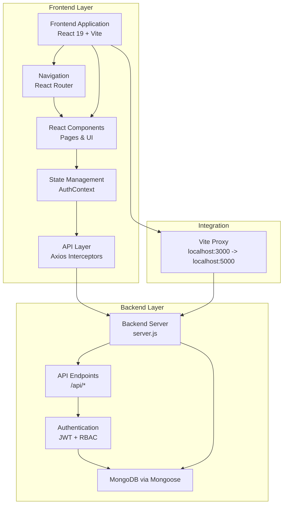

**Diagram sources**
- [server.js:1-113](file://backend/server.js#L1-L113)
- [vite.config.js:1-17](file://frontend/vite.config.js#L1-L17)
- [App.jsx:1-66](file://frontend/src/App.jsx#L1-L66)
- [AuthContext.jsx:1-81](file://frontend/src/context/AuthContext.jsx#L1-L81)
- [api/index.js:1-71](file://frontend/src/api/index.js#L1-L71)

**Section sources**
- [README.md:23-58](file://backend/README.md#L23-L58)
- [server.js:14-56](file://backend/server.js#L14-L56)
- [vite.config.js:1-17](file://frontend/vite.config.js#L1-L17)

## Core Components
The system comprises both backend and frontend components working together:

**Backend Components:**
- Express application entry point initializes middleware, routes, health checks, and error handling
- Routing organizes endpoints under /api/{auth,users,finances,dashboard}
- Controllers translate HTTP requests into domain actions via services
- Services encapsulate business logic and orchestrate model operations
- Models define schemas and pre/post hooks for persistence and soft-delete semantics
- Middleware enforces authentication, RBAC, input validation, and global error handling
- Shared utilities provide constants, response formatting, and JWT configuration

**Frontend Components:**
- React application with component-based architecture
- Vite build system for fast development and production builds
- React Router for SPA navigation and route protection
- Context API for global state management (authentication, user data)
- Axios interceptors for API communication and error handling
- Component hierarchy with layout, pages, and reusable UI elements

**Section sources**
- [server.js:20-84](file://backend/server.js#L20-L84)
- [auth.js:1-49](file://backend/routes/auth.js#L1-L49)
- [authController.js:1-114](file://backend/controllers/authController.js#L1-L114)
- [authService.js:1-195](file://backend/services/authService.js#L1-L195)
- [User.js:1-130](file://backend/models/User.js#L1-L130)
- [FinancialRecord.js:1-134](file://backend/models/FinancialRecord.js#L1-L134)
- [vite.config.js:1-17](file://frontend/vite.config.js#L1-L17)
- [App.jsx:1-66](file://frontend/src/App.jsx#L1-L66)
- [AuthContext.jsx:1-81](file://frontend/src/context/AuthContext.jsx#L1-L81)

## Architecture Overview
The system implements a modern client-server architecture with clear separation between presentation, business logic, persistence, and cross-cutting concerns:

**Backend Architecture (Layered MVC):**
- Presentation: Express routes and controllers
- Business Logic: Services
- Persistence: Mongoose models with indexes and soft-delete behavior
- Cross-Cutting: Authentication, RBAC, validation, error handling, and response formatting

**Frontend Architecture (Component-Based):**
- Presentation: React components with JSX templates
- State Management: Context API for global state
- Navigation: React Router for SPA functionality
- Data Layer: Axios interceptors for API communication
- Development: Vite for fast development and build optimization

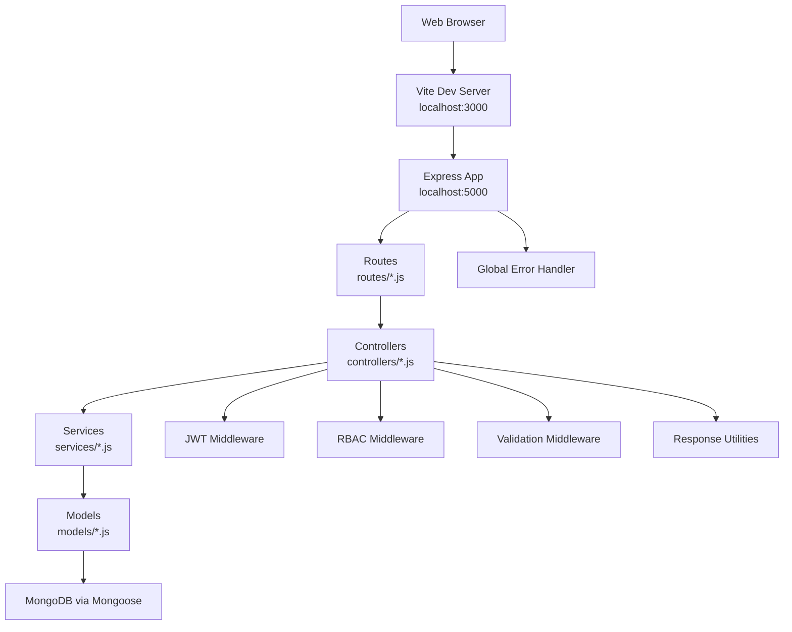

**Diagram sources**
- [server.js:1-113](file://backend/server.js#L1-L113)
- [vite.config.js:7-15](file://frontend/vite.config.js#L7-L15)
- [auth.js:1-116](file://backend/middleware/auth.js#L1-L116)
- [rbac.js:1-151](file://backend/middleware/rbac.js#L1-L151)
- [validation.js:1-309](file://backend/middleware/validation.js#L1-L309)
- [errorHandler.js:1-179](file://backend/middleware/errorHandler.js#L1-L179)

## Detailed Component Analysis

### Backend Authentication and Authorization Pipeline
The authentication flow validates credentials, verifies JWT, attaches user context, and enforces role-based permissions.

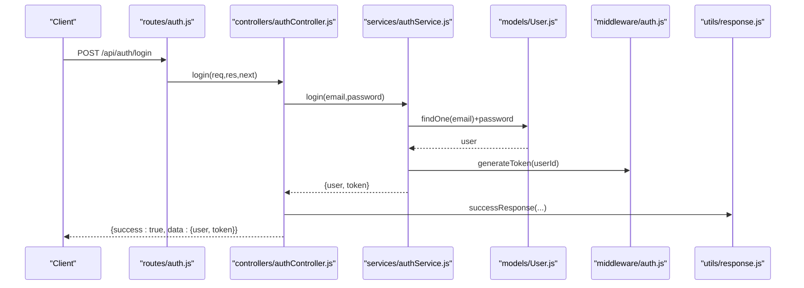

**Diagram sources**
- [auth.js:1-49](file://backend/routes/auth.js#L1-L49)
- [authController.js:1-114](file://backend/controllers/authController.js#L1-L114)
- [authService.js:1-195](file://backend/services/authService.js#L1-L195)
- [User.js:1-130](file://backend/models/User.js#L1-L130)
- [auth.js:1-116](file://backend/middleware/auth.js#L1-L116)
- [response.js:1-101](file://backend/utils/response.js#L1-L101)

**Section sources**
- [auth.js:14-59](file://backend/middleware/auth.js#L14-L59)
- [authService.js:59-93](file://backend/services/authService.js#L59-L93)
- [authController.js:32-46](file://backend/controllers/authController.js#L32-L46)
- [response.js:12-19](file://backend/utils/response.js#L12-L19)

### Role-Based Access Control (RBAC)
RBAC middleware checks user roles and permissions against a centralized permission matrix.

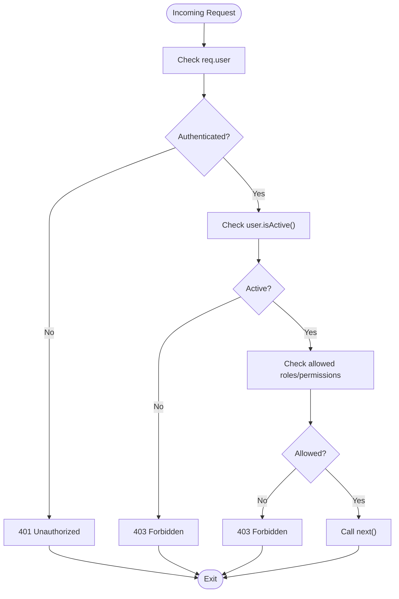

**Diagram sources**
- [rbac.js:14-66](file://backend/middleware/rbac.js#L14-L66)
- [constants.js:48-57](file://backend/utils/constants.js#L48-L57)

**Section sources**
- [rbac.js:1-151](file://backend/middleware/rbac.js#L1-L151)
- [constants.js:48-57](file://backend/utils/constants.js#L48-L57)

### Backend Data Validation Pipeline
Validation middleware uses express-validator to enforce request constraints and return structured validation errors.

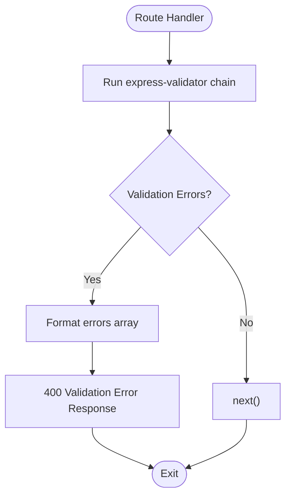

**Diagram sources**
- [validation.js:13-27](file://backend/middleware/validation.js#L13-L27)
- [response.js:42-49](file://backend/utils/response.js#L42-L49)

**Section sources**
- [validation.js:32-60](file://backend/middleware/validation.js#L32-L60)
- [response.js:42-49](file://backend/utils/response.js#L42-L49)

### Backend Error Handling and Response Formatting
Centralized error handling normalizes errors from validation, database, and JWT failures into a consistent response format.

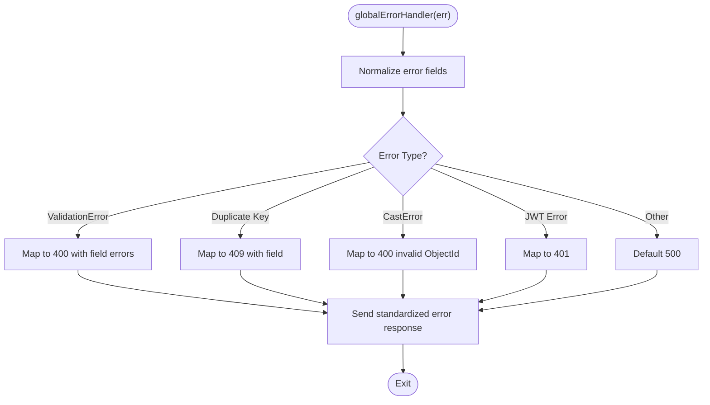

**Diagram sources**
- [errorHandler.js:89-145](file://backend/middleware/errorHandler.js#L89-L145)
- [response.js:28-35](file://backend/utils/response.js#L28-L35)

**Section sources**
- [errorHandler.js:11-20](file://backend/middleware/errorHandler.js#L11-L20)
- [errorHandler.js:101-136](file://backend/middleware/errorHandler.js#L101-L136)
- [response.js:28-35](file://backend/utils/response.js#L28-L35)

### Backend Data Models: User and FinancialRecord
The models define schemas, indexes, and helper methods for business logic.

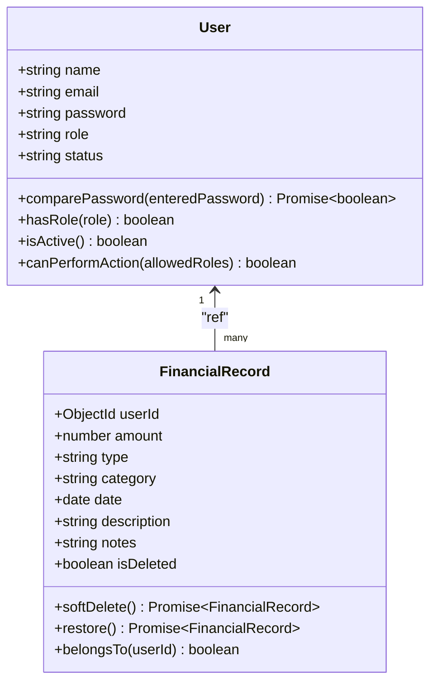

**Diagram sources**
- [User.js:10-127](file://backend/models/User.js#L10-L127)
- [FinancialRecord.js:9-130](file://backend/models/FinancialRecord.js#L9-L130)

**Section sources**
- [User.js:1-130](file://backend/models/User.js#L1-L130)
- [FinancialRecord.js:1-134](file://backend/models/FinancialRecord.js#L1-L134)

## Frontend Architecture

### React Component Hierarchy
The frontend implements a hierarchical component structure with clear separation of concerns:

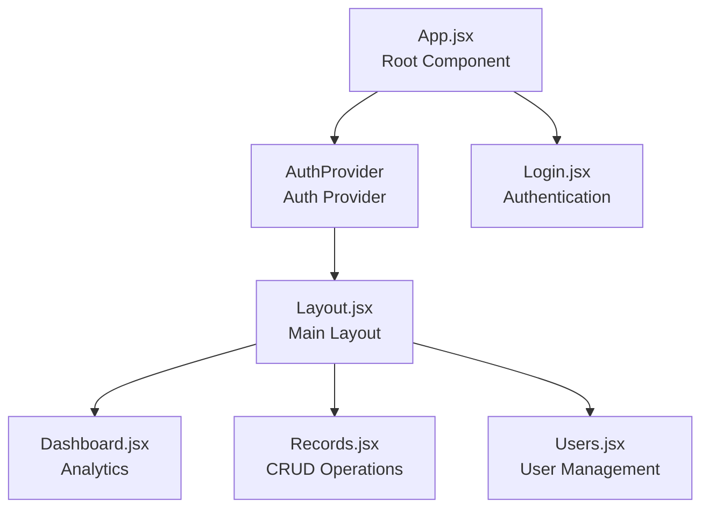

**Diagram sources**
- [App.jsx:23-62](file://frontend/src/App.jsx#L23-L62)
- [AuthContext.jsx:14-77](file://frontend/src/context/AuthContext.jsx#L14-L77)
- [Layout.jsx:4-57](file://frontend/src/components/Layout.jsx#L4-L57)
- [Login.jsx:6-170](file://frontend/src/pages/Login.jsx#L6-L170)
- [Dashboard.jsx:5-202](file://frontend/src/pages/Dashboard.jsx#L5-L202)
- [Records.jsx:5-372](file://frontend/src/pages/Records.jsx#L5-L372)

### Authentication Context and State Management
The frontend implements a comprehensive authentication system using React Context API:

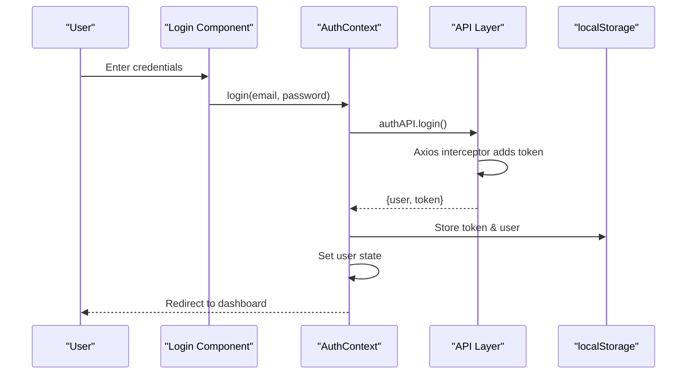

**Diagram sources**
- [Login.jsx:17-30](file://frontend/src/pages/Login.jsx#L17-L30)
- [AuthContext.jsx:38-47](file://frontend/src/context/AuthContext.jsx#L38-L47)
- [api/index.js:10-17](file://frontend/src/api/index.js#L10-L17)

### API Layer and Interceptors
The frontend implements a centralized API layer with Axios interceptors for consistent request/response handling:

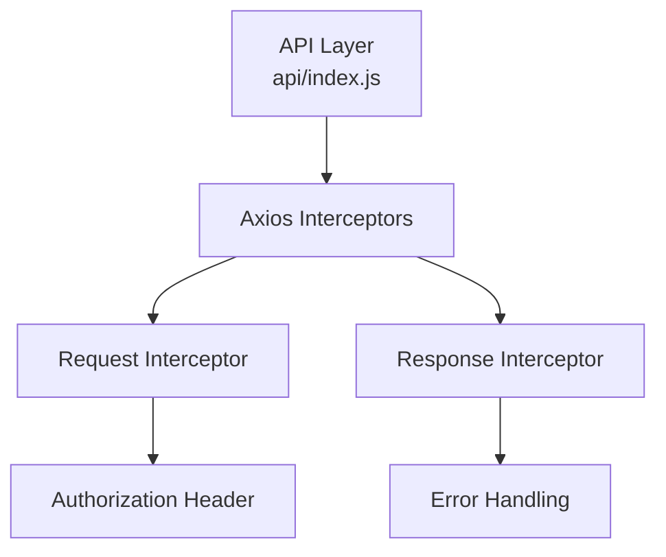

**Diagram sources**
- [api/index.js:1-71](file://frontend/src/api/index.js#L1-L71)

**Section sources**
- [App.jsx:1-66](file://frontend/src/App.jsx#L1-L66)
- [AuthContext.jsx:1-81](file://frontend/src/context/AuthContext.jsx#L1-L81)
- [api/index.js:1-71](file://frontend/src/api/index.js#L1-L71)
- [Login.jsx:1-173](file://frontend/src/pages/Login.jsx#L1-L173)
- [Layout.jsx:1-61](file://frontend/src/components/Layout.jsx#L1-L61)
- [Dashboard.jsx:1-206](file://frontend/src/pages/Dashboard.jsx#L1-L206)
- [Records.jsx:1-375](file://frontend/src/pages/Records.jsx#L1-L375)

## Integrated Development Workflow

### Development Server Configuration
The frontend uses Vite for development with automatic proxy configuration to the backend:

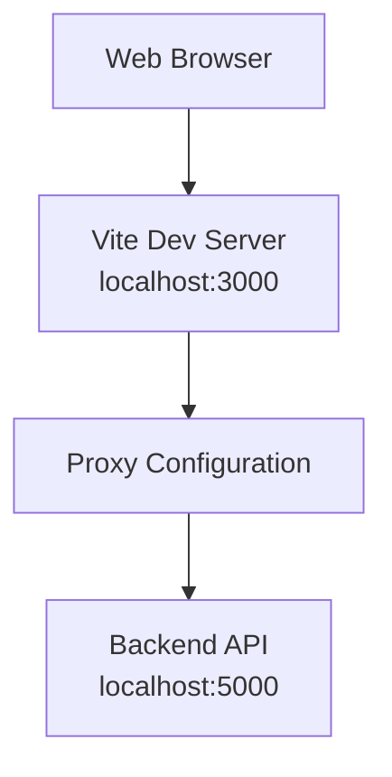

**Diagram sources**
- [vite.config.js:7-15](file://frontend/vite.config.js#L7-L15)

### Modern Frontend Tooling
The frontend leverages cutting-edge React development tools:

- **React 19**: Latest React features with improved performance
- **Vite**: Lightning-fast development server with HMR (Hot Module Replacement)
- **ESLint**: Code quality and consistency enforcement
- **TypeScript Support**: Optional type safety for better developer experience
- **React Router**: Client-side routing for SPA functionality

**Section sources**
- [vite.config.js:1-17](file://frontend/vite.config.js#L1-L17)
- [main.jsx:1-11](file://frontend/src/main.jsx#L1-L11)
- [App.jsx:1-66](file://frontend/src/App.jsx#L1-L66)
- [package.json](file://frontend/package.json)

## Dependency Analysis
The system maintains separate dependency trees for backend and frontend:

**Backend Dependencies:**
- Express: Web application framework
- Mongoose: MongoDB object modeling
- JWT: Authentication tokens
- Bcrypt: Password hashing
- Express-validator: Input validation
- CORS: Cross-origin resource sharing
- Dotenv: Environment variable management

**Frontend Dependencies:**
- React: UI library
- React DOM: React rendering
- React Router: Navigation
- Axios: HTTP client
- Vite: Build tool and dev server
- React Plugin: React transform

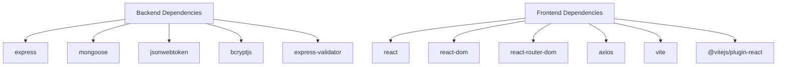

**Diagram sources**
- [package.json:16-27](file://backend/package.json#L16-L27)
- [package.json:12-28](file://frontend/package.json#L12-L28)

**Section sources**
- [package.json:16-27](file://backend/package.json#L16-L27)
- [package.json:12-28](file://frontend/package.json#L12-L28)
- [database.js:6-25](file://backend/config/database.js#L6-L25)

## Performance Considerations
**Backend Performance:**
- Database indexing: User and FinancialRecord schemas include targeted indexes to optimize common queries
- Soft deletes: FinancialRecord uses isDeleted flag to avoid physical removal and preserve audit trails
- Token expiration: JWT expiry reduces long-lived session risks
- Validation early exits: express-validator short-circuits invalid requests to reduce downstream work

**Frontend Performance:**
- Vite's optimized build system for fast development and production builds
- React 19 optimizations for improved rendering performance
- Component lazy loading and code splitting strategies
- Efficient state management with Context API
- Axios caching and request deduplication

**Section sources**
- [server.js:29-84](file://backend/server.js#L29-L84)
- [vite.config.js:1-17](file://frontend/vite.config.js#L1-L17)

## Troubleshooting Guide
**Backend Issues:**
- Authentication failures: Verify JWT_SECRET and token validity; ensure user isActive
- Validation errors: Review validationErrorResponse payloads for field-specific messages
- Database connection: Confirm MONGODB_URI and network connectivity; check logs for connection errors
- 404 routes: Ensure routes are mounted under /api/{auth,users,finances,dashboard}

**Frontend Issues:**
- Development server: Ensure Vite dev server is running on port 3000
- API proxy: Verify proxy configuration in vite.config.js points to backend
- Authentication: Check localStorage for token and user data
- Component rendering: Verify React component imports and exports

**Section sources**
- [auth.js:24-54](file://backend/middleware/auth.js#L24-L54)
- [errorHandler.js:150-171](file://backend/middleware/errorHandler.js#L150-L171)
- [database.js:21-24](file://backend/config/database.js#L21-L24)
- [server.js:74-81](file://backend/server.js#L74-L81)
- [vite.config.js:7-15](file://frontend/vite.config.js#L7-L15)

## Conclusion
The FDPAC Finance Dashboard represents a modern, comprehensive web application that successfully combines a robust backend architecture with a cutting-edge frontend implementation. The backend employs a clean, layered architecture with clear separation between presentation, business logic, persistence, and cross-cutting concerns, utilizing MongoDB and Mongoose for flexible, scalable persistence; JWT and RBAC for secure, granular access control; and middleware for robust validation and error handling.

The frontend modernization brings significant improvements through React 19, Vite's fast development workflow, and component-based architecture with Context API for state management. The integrated development workflow ensures seamless communication between frontend and backend through intelligent proxy configuration, while the React Router provides SPA functionality with route protection.

This architecture supports maintainability, testability, and future extensibility, with clear separation of concerns and modern development practices that enable efficient collaboration and rapid feature development.

## Appendices

### Infrastructure Requirements
**Backend Infrastructure:**
- Node.js runtime (v14 or higher)
- MongoDB instance (local or cloud)
- Environment variables for database URI, JWT secret, and server configuration

**Frontend Infrastructure:**
- Modern web browser with JavaScript ES6+ support
- Node.js runtime for development (optional)
- Vite development server for local development

**Section sources**
- [README.md:62-66](file://backend/README.md#L62-L66)
- [README.md:283-292](file://backend/README.md#L283-L292)

### Deployment Topology
**Development Deployment:**
- Frontend: Vite dev server on localhost:3000
- Backend: Node.js server on localhost:5000
- Proxy: Automatic forwarding of /api requests to backend

**Production Deployment:**
- Backend: Deploy Node.js application with MongoDB
- Frontend: Build static assets with Vite and serve via CDN or web server
- Reverse Proxy: Route API requests to backend server
- Environment Configuration: Separate environment variables for each deployment

**Section sources**
- [vite.config.js:7-15](file://frontend/vite.config.js#L7-L15)
- [server.js:86-99](file://backend/server.js#L86-L99)