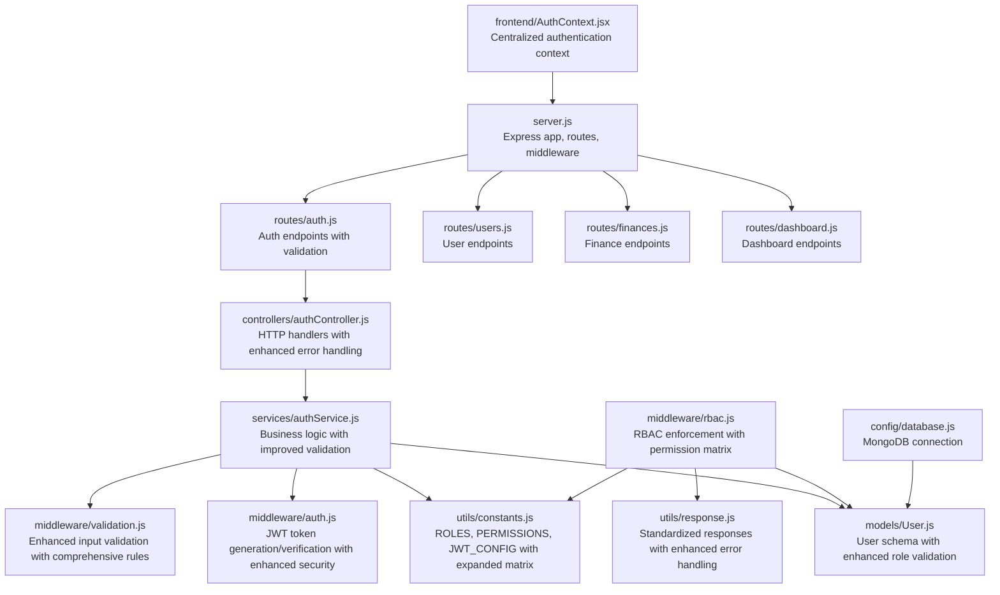
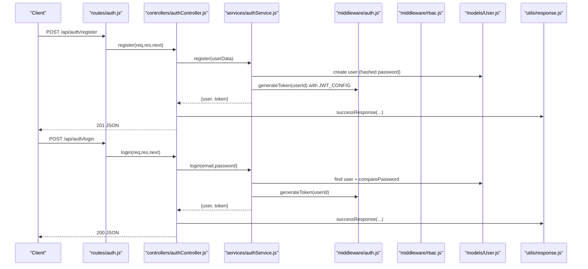
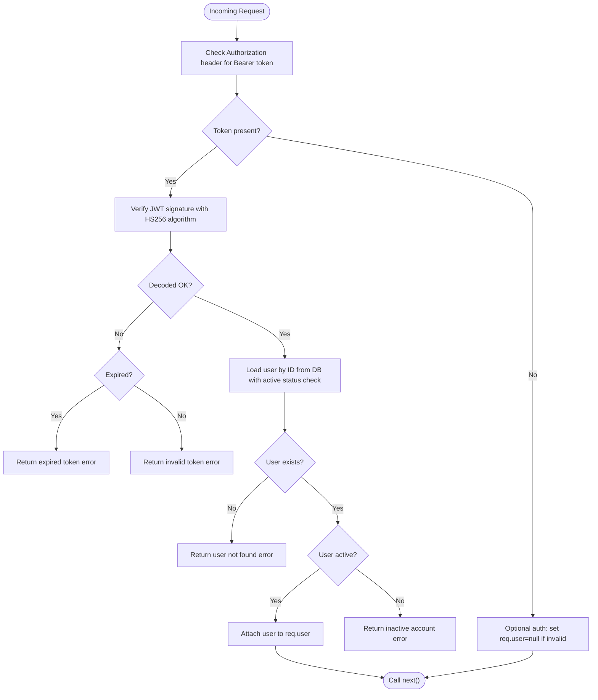
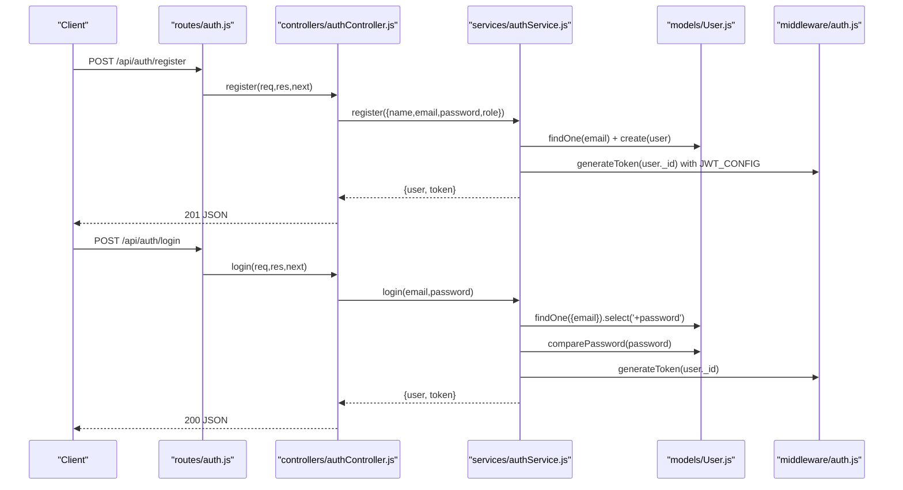
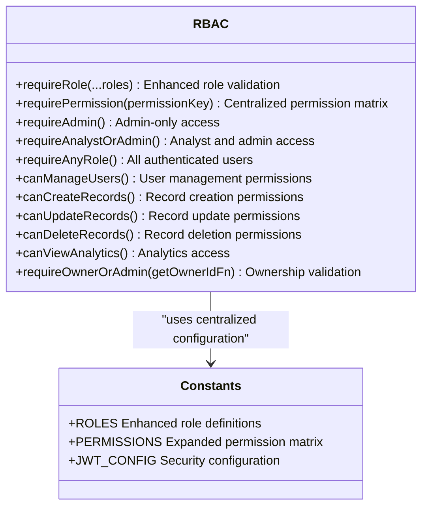
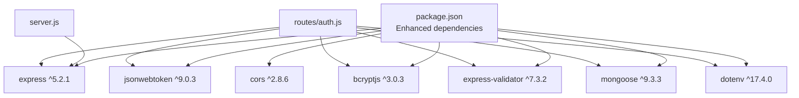

# Authentication & Authorization System

<cite>
**Referenced Files in This Document**
- [server.js](file://backend/server.js)
- [database.js](file://backend/config/database.js)
- [User.js](file://backend/models/User.js)
- [authService.js](file://backend/services/authService.js)
- [authController.js](file://backend/controllers/authController.js)
- [auth.js](file://backend/middleware/auth.js)
- [rbac.js](file://backend/middleware/rbac.js)
- [auth.js](file://backend/routes/auth.js)
- [constants.js](file://backend/utils/constants.js)
- [validation.js](file://backend/middleware/validation.js)
- [response.js](file://backend/utils/response.js)
- [seed.js](file://backend/scripts/seed.js)
- [package.json](file://backend/package.json)
- [auth.test.js](file://backend/tests/auth.test.js)
- [AuthContext.jsx](file://frontend/src/context/AuthContext.jsx)
</cite>

## Update Summary
**Changes Made**
- Enhanced JWT token management with improved security configurations
- Expanded role-based access control system with centralized permission matrix
- Added centralized authentication context for frontend integration
- Strengthened authentication middleware with better error handling
- Improved RBAC middleware with comprehensive permission enforcement

## Table of Contents
1. [Introduction](#introduction)
2. [Project Structure](#project-structure)
3. [Core Components](#core-components)
4. [Architecture Overview](#architecture-overview)
5. [Detailed Component Analysis](#detailed-component-analysis)
6. [Dependency Analysis](#dependency-analysis)
7. [Performance Considerations](#performance-considerations)
8. [Troubleshooting Guide](#troubleshooting-guide)
9. [Conclusion](#conclusion)
10. [Appendices](#appendices)

## Introduction
This document explains the authentication and authorization system for the Finance Dashboard backend. It covers JWT token lifecycle (generation, verification, and expiration handling), user registration and login flows, session management, and the role-based access control (RBAC) model with a comprehensive permission matrix. The system now features enhanced JWT security with improved configurations, expanded role-based access control supporting viewer, analyst, and admin roles, and centralized authentication context for seamless frontend integration. It also documents the middleware stack for token verification and permission enforcement, along with practical examples, security considerations, and best practices.

## Project Structure
The backend follows a layered architecture with enhanced security and centralized configuration:
- Entry point initializes Express, connects to MongoDB, registers routes, and applies middleware.
- Routes define endpoints for authentication and resources with proper middleware chaining.
- Controllers handle HTTP requests and delegate to services with enhanced error handling.
- Services encapsulate business logic for authentication and user operations with improved validation.
- Middleware enforces authentication and RBAC checks with comprehensive error responses.
- Models define schemas and helpers for users with enhanced role validation and status management.
- Utilities centralize constants, response formatting, and validation rules with expanded permission matrices.
- Frontend provides centralized authentication context for seamless token and user state management.

**Diagram sources**
- [server.js:14-56](file://backend/server.js#L14-L56)
- [auth.js:1-49](file://backend/routes/auth.js#L1-L49)
- [authController.js:1-114](file://backend/controllers/authController.js#L1-L114)
- [authService.js:1-195](file://backend/services/authService.js#L1-L195)
- [User.js:1-125](file://backend/models/User.js#L1-L125)
- [auth.js:1-116](file://backend/middleware/auth.js#L1-L116)
- [rbac.js:1-151](file://backend/middleware/rbac.js#L1-L151)
- [constants.js:1-81](file://backend/utils/constants.js#L1-L81)
- [validation.js:1-309](file://backend/middleware/validation.js#L1-L309)
- [response.js:1-101](file://backend/utils/response.js#L1-L101)
- [database.js:1-43](file://backend/config/database.js#L1-L43)
- [AuthContext.jsx:1-81](file://frontend/src/context/AuthContext.jsx#L1-L81)

**Section sources**
- [server.js:1-113](file://backend/server.js#L1-L113)
- [package.json:1-29](file://backend/package.json#L1-L29)

## Core Components
- **Enhanced JWT Token Management**
  - Secure token generation with configurable expiration and algorithm settings from JWT_CONFIG.
  - Robust token verification middleware with comprehensive error handling for different token states.
  - Optional authentication middleware allowing guest access when token is absent or invalid.
  - Enhanced security with proper algorithm specification and fallback mechanisms.
- **Advanced Authentication Service**
  - Registration with comprehensive duplicate-email prevention and role validation.
  - Login with enhanced password verification, active-user checks, and secure token issuance.
  - Profile retrieval and password change with current-password validation and error handling.
  - Initial admin creation with uniqueness checks and proper role assignment.
- **Comprehensive RBAC System**
  - Role-based middleware enforcing allowed roles with active status validation.
  - Permission-based middleware mapping permissions to allowed roles with centralized matrix.
  - Resource-level ownership checks for owner/admin scenarios with enhanced error handling.
  - Expanded permission matrix supporting VIEWER, ANALYST, and ADMIN roles.
- **Enhanced Validation and Response System**
  - Centralized validation rules for registration, login, and financial records with comprehensive error formatting.
  - Standardized response utilities for success, error, unauthorized, forbidden, and not-found with enhanced messaging.
  - Frontend authentication context for seamless token and user state management.

**Section sources**
- [auth.js:1-116](file://backend/middleware/auth.js#L1-L116)
- [authService.js:1-195](file://backend/services/authService.js#L1-L195)
- [rbac.js:1-151](file://backend/middleware/rbac.js#L1-L151)
- [constants.js:48-80](file://backend/utils/constants.js#L48-L80)
- [validation.js:1-309](file://backend/middleware/validation.js#L1-L309)
- [response.js:1-101](file://backend/utils/response.js#L1-L101)
- [AuthContext.jsx:1-81](file://frontend/src/context/AuthContext.jsx#L1-L81)

## Architecture Overview
The system integrates Express routes, controllers, services, and middleware to enforce authentication and RBAC with enhanced security. Requests flow through validation, authentication, and RBAC middleware before reaching controllers and services, with comprehensive error handling throughout the pipeline.

**Diagram sources**
- [auth.js:18-49](file://backend/middleware/auth.js#L18-L49)
- [authService.js:15-51](file://backend/services/authService.js#L15-L51)
- [authService.js:59-93](file://backend/services/authService.js#L59-L93)
- [authController.js:13-46](file://backend/controllers/authController.js#L13-L46)
- [User.js:84-86](file://backend/models/User.js#L84-L86)
- [response.js:12-19](file://backend/utils/response.js#L12-L19)

## Detailed Component Analysis

### Enhanced JWT Token Management
- **Generation**
  - Payload includes user ID with secure algorithm HS256 from JWT_CONFIG.
  - Configurable expiration (7 days default) and algorithm settings with environment variable overrides.
  - Enhanced security with proper algorithm specification and fallback mechanisms.
- **Verification**
  - Extracts Bearer token from Authorization header with comprehensive error handling.
  - Verifies signature with specified algorithm and decodes payload with enhanced error differentiation.
  - Loads user from DB with active status validation and comprehensive error responses.
  - Handles token expiration, invalid token, and user not found errors with distinct responses.
- **Optional Authentication**
  - Attempts verification but gracefully handles missing or invalid tokens without blocking requests.
  - Attaches user context when valid and active, sets null when invalid for guest access scenarios.

**Diagram sources**
- [auth.js:14-59](file://backend/middleware/auth.js#L14-L59)
- [auth.js:64-93](file://backend/middleware/auth.js#L64-L93)
- [constants.js:66-70](file://backend/utils/constants.js#L66-L70)

**Section sources**
- [auth.js:95-109](file://backend/middleware/auth.js#L95-L109)
- [auth.js:14-59](file://backend/middleware/auth.js#L14-L59)
- [auth.js:64-93](file://backend/middleware/auth.js#L64-L93)
- [constants.js:66-70](file://backend/utils/constants.js#L66-L70)

### Enhanced User Registration and Login Workflow
- **Registration**
  - Comprehensive input validation with name, email, password, and optional role fields.
  - Prevents duplicate emails with enhanced error handling and user-friendly messages.
  - Creates user with hashed password and default role (viewer) with role validation.
  - Generates secure JWT token with proper error handling and returns user + token.
- **Login**
  - Finds user by email with password inclusion for verification.
  - Checks active status with comprehensive error messages and password comparison.
  - Generates secure JWT token with enhanced error handling for invalid credentials.
  - Returns user profile with role and token for frontend integration.
- **Profile and Password Change**
  - Protected by authentication middleware with enhanced error handling.
  - Password change requires current password verification with proper validation.
  - Frontend authentication context manages token storage and user state.

**Diagram sources**
- [auth.js:18-49](file://backend/middleware/auth.js#L18-L49)
- [authService.js:15-51](file://backend/services/authService.js#L15-L51)
- [authService.js:59-93](file://backend/services/authService.js#L59-L93)
- [authController.js:13-46](file://backend/controllers/authController.js#L13-L46)
- [User.js:84-86](file://backend/models/User.js#L84-L86)

**Section sources**
- [authService.js:15-51](file://backend/services/authService.js#L15-L51)
- [authService.js:59-93](file://backend/services/authService.js#L59-L93)
- [authController.js:13-46](file://backend/controllers/authController.js#L13-L46)
- [validation.js:32-78](file://backend/middleware/validation.js#L32-L78)
- [AuthContext.jsx:14-81](file://frontend/src/context/AuthContext.jsx#L14-L81)

### Comprehensive Role-Based Access Control (RBAC)
- **Enhanced Roles**
  - Centralized role definitions: VIEWER, ANALYST, ADMIN with comprehensive validation.
  - Role-based middleware enforcing allowed roles with active status checks.
  - Permission-based middleware mapping permissions to allowed roles with centralized matrix.
- **Expanded Permission Matrix**
  - Permissions mapped to allowed roles for comprehensive dashboard, records, analytics, and user management.
  - VIEW_DASHBOARD accessible by all roles (viewer, analyst, admin).
  - VIEW_RECORDS accessible by all roles for transparency and reporting.
  - CREATE_RECORDS restricted to analyst and admin for data integrity.
  - UPDATE_RECORDS and DELETE_RECORDS restricted to admin for system security.
  - MANAGE_USERS restricted to admin for user administration.
  - VIEW_ANALYTICS accessible by analyst and admin for business insights.
- **RBAC Middleware Enhancements**
  - requireRole: Enforce allowed roles with comprehensive error handling.
  - requirePermission: Enforce permission-to-role mapping with centralized validation.
  - requireAdmin, requireAnalystOrAdmin, requireAnyRole: Convenience wrappers with enhanced security.
  - requireOwnerOrAdmin: Resource-level ownership checks for non-admin users with proper error handling.

**Diagram sources**
- [rbac.js:14-136](file://backend/middleware/rbac.js#L14-L136)
- [constants.js:48-57](file://backend/utils/constants.js#L48-L57)
- [constants.js:66-70](file://backend/utils/constants.js#L66-L70)

**Section sources**
- [rbac.js:14-136](file://backend/middleware/rbac.js#L14-L136)
- [constants.js:48-57](file://backend/utils/constants.js#L48-L57)
- [constants.js:66-70](file://backend/utils/constants.js#L66-L70)

### Enhanced Session Management
- **Stateless JWT Implementation**
  - Stateless JWT tokens with no server-side session storage for scalability.
  - Token expiration enforced during verification with comprehensive error handling.
  - Optional authentication allows guest-like access when token is absent or invalid.
- **Frontend Authentication Context**
  - Centralized authentication context managing user state and token persistence.
  - Automatic token validation and user profile retrieval on application startup.
  - Seamless login/logout functionality with localStorage integration.
  - Role-based access control helpers for frontend components.

**Section sources**
- [auth.js:64-93](file://backend/middleware/auth.js#L64-L93)
- [constants.js:66-70](file://backend/utils/constants.js#L66-L70)
- [AuthContext.jsx:14-81](file://frontend/src/context/AuthContext.jsx#L14-L81)

### Practical Examples

- **Enhanced Token Usage**
  - Include Authorization header with Bearer token for protected endpoints.
  - Example: Authorization: Bearer <token_with_hs256_algorithm>
  - Frontend automatically manages token storage and retrieval.
- **Expanded Role Assignments**
  - Default role is viewer; admin can create users with higher roles with validation.
  - Inactive users cannot authenticate with comprehensive error messages.
  - Role validation ensures only authorized users can access specific endpoints.
- **Comprehensive Permission Enforcement**
  - Use requirePermission('VIEW_ANALYTICS') for endpoints requiring analyst/admin.
  - Use requireRole(ROLES.ADMIN) for admin-only endpoints with enhanced validation.
  - Use requireOwnerOrAdmin for resource-level ownership checks with proper error handling.
  - Frontend uses authentication context for role-based UI rendering.

**Section sources**
- [auth.js:18-49](file://backend/middleware/auth.js#L18-L49)
- [rbac.js:40-66](file://backend/middleware/rbac.js#L40-L66)
- [rbac.js:113-136](file://backend/middleware/rbac.js#L113-L136)
- [constants.js:48-57](file://backend/utils/constants.js#L48-L57)
- [AuthContext.jsx:55-70](file://frontend/src/context/AuthContext.jsx#L55-L70)

## Dependency Analysis
The system relies on enhanced dependencies for improved security and functionality:
- Express for routing and middleware with enhanced error handling.
- jsonwebtoken for JWT operations with HS256 algorithm support.
- bcryptjs for secure password hashing with proper salt generation.
- mongoose for MongoDB ODM with enhanced schema validation.
- dotenv for environment variable configuration.
- express-validator for comprehensive input validation.
- cors for cross-origin resource sharing.

**Diagram sources**
- [package.json:16-27](file://backend/package.json#L16-L27)
- [server.js:8-11](file://backend/server.js#L8-L11)
- [auth.js:6-11](file://backend/routes/auth.js#L6-L11)

**Section sources**
- [package.json:16-27](file://backend/package.json#L16-L27)
- [server.js:8-11](file://backend/server.js#L8-L11)

## Performance Considerations
- **Enhanced Token Verification Performance**
  - Token verification is CPU-bound; keep secret rotation rare and avoid excessive token signing overhead.
  - HS256 algorithm provides good performance balance between security and speed.
- **Optimized Database Queries**
  - Use indexed fields (email, role, status) to optimize user lookups with enhanced indexing strategy.
  - Avoid returning sensitive fields (password) in queries with schema-level protection.
- **Frontend Performance Optimization**
  - Centralized authentication context reduces redundant API calls.
  - Token caching in localStorage minimizes authentication overhead.
- **Security Best Practices**
  - Consider rate-limiting login attempts to mitigate brute-force attacks.
  - Implement token refresh strategies for enhanced security (recommended enhancement).

## Troubleshooting Guide
- **Enhanced Authentication Failures**
  - Missing or malformed Authorization header: Unauthorized with specific error messages.
  - Invalid/expired token: Unauthorized with algorithm-specific error messages (HS256).
  - User not found or inactive: Unauthorized or Forbidden with comprehensive error details.
- **Improved Validation Errors**
  - Validation middleware returns structured error arrays with field, message, and value for debugging.
  - Comprehensive validation rules prevent common input errors and security vulnerabilities.
- **Database Connectivity Issues**
  - Ensure MONGODB_URI is configured; connection errors are logged with enhanced error handling.
  - Database connectivity issues cause graceful shutdown with proper error logging.
- **Frontend Authentication Issues**
  - Token storage failures: Check localStorage availability and browser compatibility.
  - User state synchronization: Verify authentication context provider wrapping.
  - Role-based UI issues: Ensure proper role checking functions are used.

**Section sources**
- [auth.js:14-59](file://backend/middleware/auth.js#L14-L59)
- [validation.js:13-27](file://backend/middleware/validation.js#L13-L27)
- [database.js:11-25](file://backend/config/database.js#L11-L25)
- [auth.test.js:41-111](file://backend/tests/auth.test.js#L41-L111)
- [AuthContext.jsx:22-36](file://frontend/src/context/AuthContext.jsx#L22-L36)

## Conclusion
The enhanced authentication and authorization system provides a robust, layered approach with improved security and comprehensive functionality:
- **Enhanced JWT-based stateless authentication** with secure HS256 algorithm and comprehensive verification.
- **Comprehensive RBAC** with centralized permission matrix supporting viewer, analyst, and admin roles.
- **Advanced validation and response systems** with structured error handling and user-friendly messages.
- **Centralized authentication context** for seamless frontend integration and user state management.
- **Practical examples and testing support** for development and deployment with enhanced security measures.

## Appendices

### Enhanced Permission Matrix (Viewer, Analyst, Admin)
- **VIEW_DASHBOARD**: viewer, analyst, admin (accessible by all authenticated users)
- **VIEW_RECORDS**: viewer, analyst, admin (comprehensive record visibility)
- **CREATE_RECORDS**: analyst, admin (data entry permissions)
- **UPDATE_RECORDS**: admin (system modification permissions)
- **DELETE_RECORDS**: admin (data deletion permissions)
- **MANAGE_USERS**: admin (user administration permissions)
- **VIEW_ANALYTICS**: analyst, admin (business intelligence access)

**Section sources**
- [constants.js:48-57](file://backend/utils/constants.js#L48-L57)

### Enhanced Security Considerations
- **Improved JWT Security**
  - Use HS256 algorithm with strong secrets and periodic rotation.
  - Enforce HTTPS in production with secure cookie policies.
  - Limit token expiration to reduce exposure windows (7-day default).
- **Enhanced Input Validation**
  - Comprehensive validation rules prevent injection attacks and data corruption.
  - Role validation ensures only authorized users can access specific endpoints.
- **Frontend Security**
  - Centralized authentication context manages tokens securely.
  - Role-based UI rendering prevents unauthorized access attempts.
  - Error handling prevents sensitive information leakage.

**Section sources**
- [auth.js:95-109](file://backend/middleware/auth.js#L95-L109)
- [User.js:28-33](file://backend/models/User.js#L28-L33)
- [constants.js:66-70](file://backend/utils/constants.js#L66-L70)

### Enhanced Token Refresh Strategies
- **Current Implementation**
  - Stateless JWT tokens with 7-day expiration using HS256 algorithm.
  - No dedicated refresh token mechanism implemented.
- **Recommended Enhanced Approaches**
  - Short-lived access tokens (15-30 minutes) with long-lived refresh tokens (7-30 days).
  - Secure refresh token storage with httpOnly cookies and CSRF protection.
  - Refresh endpoint with token validation and rotation for enhanced security.
  - Implement refresh token revocation and audit logging.

### Frontend Authentication Context Features
- **Centralized State Management**
  - Automatic token and user state persistence in localStorage.
  - Token validation on application startup with error recovery.
  - Seamless login/logout functionality with proper cleanup.
- **Role-Based UI Control**
  - isAdmin(), isAnalyst(), canManageUsers() helper functions.
  - canCreateRecords(), canEditRecords() for granular access control.
  - Loading states and error handling for better user experience.

**Section sources**
- [AuthContext.jsx:14-81](file://frontend/src/context/AuthContext.jsx#L14-L81)