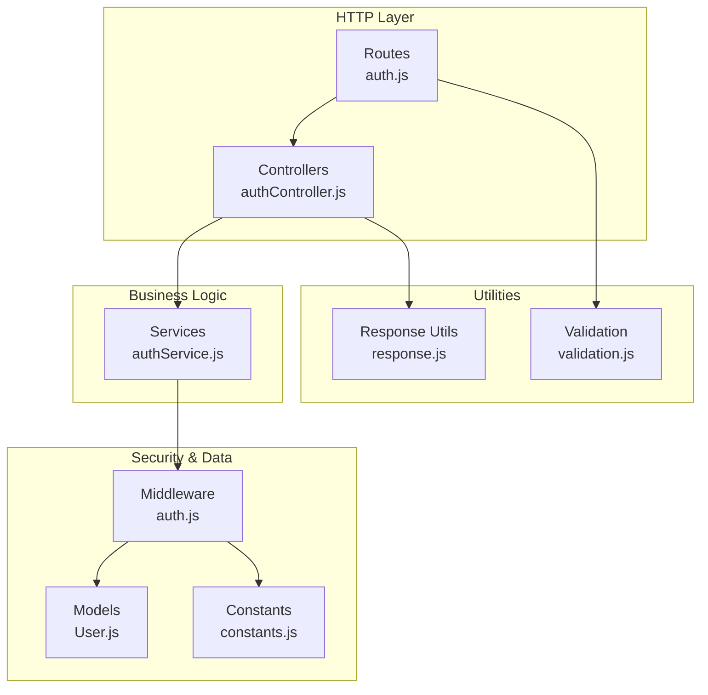
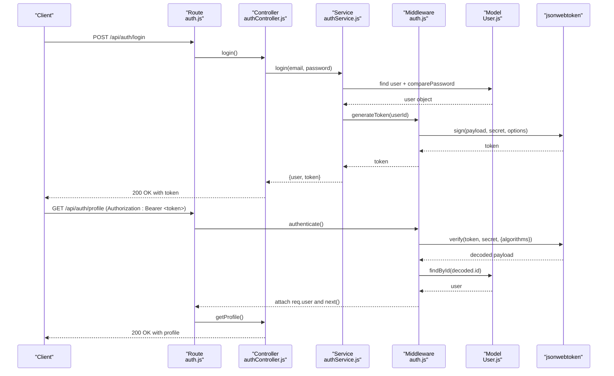
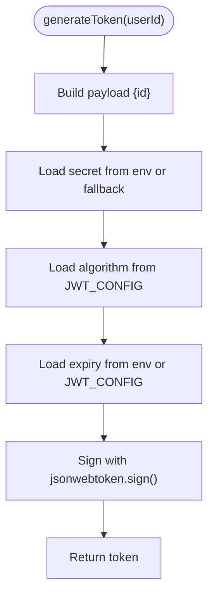
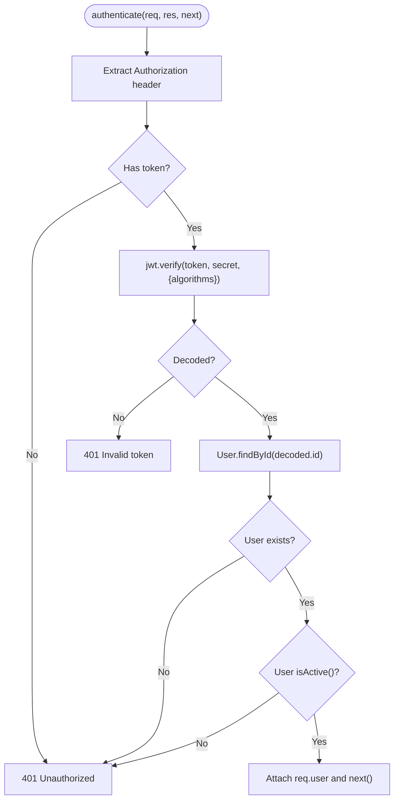
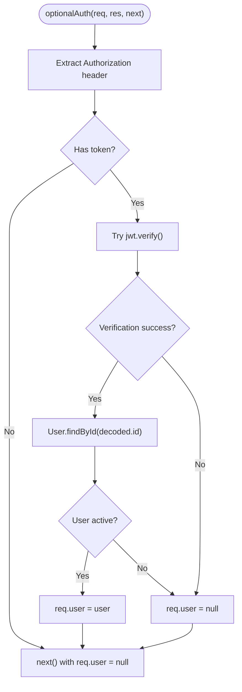
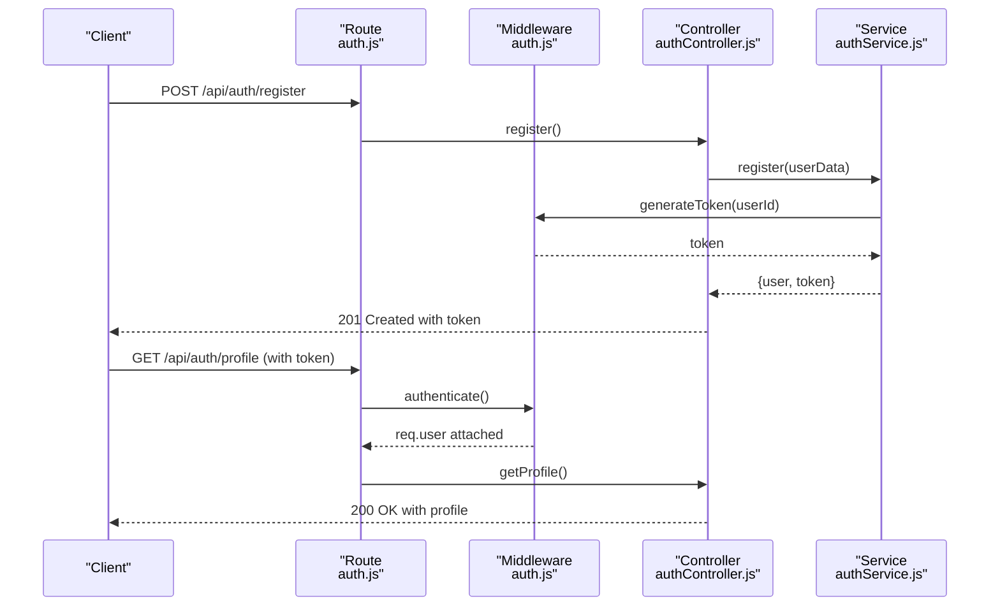
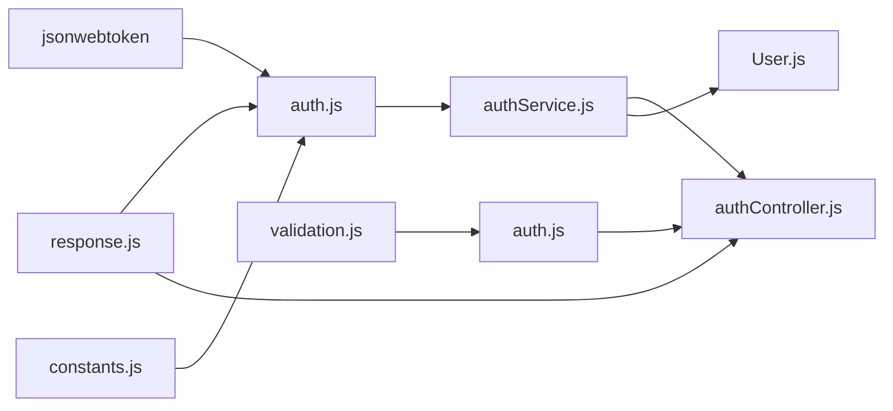

# JWT Token Management

<cite>
**Referenced Files in This Document**
- [auth.js](file://backend/middleware/auth.js)
- [authService.js](file://backend/services/authService.js)
- [authController.js](file://backend/controllers/authController.js)
- [constants.js](file://backend/utils/constants.js)
- [User.js](file://backend/models/User.js)
- [auth.js](file://backend/routes/auth.js)
- [server.js](file://backend/server.js)
- [validation.js](file://backend/middleware/validation.js)
- [response.js](file://backend/utils/response.js)
</cite>

## Table of Contents
1. [Introduction](#introduction)
2. [Project Structure](#project-structure)
3. [Core Components](#core-components)
4. [Architecture Overview](#architecture-overview)
5. [Detailed Component Analysis](#detailed-component-analysis)
6. [Dependency Analysis](#dependency-analysis)
7. [Performance Considerations](#performance-considerations)
8. [Troubleshooting Guide](#troubleshooting-guide)
9. [Security Considerations](#security-considerations)
10. [Practical Usage Examples](#practical-usage-examples)
11. [Conclusion](#conclusion)

## Introduction
This document provides comprehensive documentation for JWT token management in the backend application. It explains the token generation process, payload structure, secret key usage, expiration configuration, verification mechanisms, and error handling. It also details the difference between mandatory and optional authentication modes, provides practical examples for token creation, validation, and renewal strategies, and addresses security considerations including algorithm selection, secret rotation, and token storage best practices.

## Project Structure
The JWT implementation spans several layers:
- Middleware handles token extraction, verification, and user attachment to requests
- Services encapsulate business logic for authentication and token generation
- Controllers manage HTTP endpoints and integrate with middleware
- Models define user data and role/status checks
- Routes bind endpoints to controllers and apply authentication middleware
- Utilities centralize configuration and standardized responses

**Diagram sources**
- [auth.js:1-49](file://backend/routes/auth.js#L1-L49)
- [authController.js:1-114](file://backend/controllers/authController.js#L1-L114)
- [authService.js:1-195](file://backend/services/authService.js#L1-L195)
- [auth.js:1-116](file://backend/middleware/auth.js#L1-L116)
- [User.js:1-130](file://backend/models/User.js#L1-L130)
- [constants.js:1-81](file://backend/utils/constants.js#L1-L81)
- [response.js:1-101](file://backend/utils/response.js#L1-L101)
- [validation.js:1-309](file://backend/middleware/validation.js#L1-L309)

**Section sources**
- [auth.js:1-49](file://backend/routes/auth.js#L1-L49)
- [authController.js:1-114](file://backend/controllers/authController.js#L1-L114)
- [authService.js:1-195](file://backend/services/authService.js#L1-L195)
- [auth.js:1-116](file://backend/middleware/auth.js#L1-L116)
- [User.js:1-130](file://backend/models/User.js#L1-L130)
- [constants.js:1-81](file://backend/utils/constants.js#L1-L81)
- [response.js:1-101](file://backend/utils/response.js#L1-L101)
- [validation.js:1-309](file://backend/middleware/validation.js#L1-L309)

## Core Components
- JWT Configuration: Algorithm and expiration are centrally configured
- Token Generation: Payload includes user identifier; signing uses environment secret or fallback
- Token Verification: Validates signature, algorithm, and user existence; handles expired and invalid tokens
- Authentication Modes: Mandatory (401 on failure) and optional (no failure on missing/invalid token)
- User Model Integration: Verifies user activity and attaches user object to request

Key implementation references:
- JWT configuration and defaults: [constants.js:66-70](file://backend/utils/constants.js#L66-L70)
- Token generation: [auth.js:100-109](file://backend/middleware/auth.js#L100-L109)
- Token verification and error handling: [auth.js:14-59](file://backend/middleware/auth.js#L14-L59)
- Optional authentication mode: [auth.js:64-93](file://backend/middleware/auth.js#L64-L93)
- User model activity check: [User.js:98-103](file://backend/models/User.js#L98-L103)

**Section sources**
- [constants.js:66-70](file://backend/utils/constants.js#L66-L70)
- [auth.js:14-109](file://backend/middleware/auth.js#L14-L109)
- [User.js:98-103](file://backend/models/User.js#L98-L103)

## Architecture Overview
The JWT lifecycle integrates with Express route handlers and middleware. On successful authentication, a signed token is returned. Subsequent requests include the token in the Authorization header, which is verified by middleware before reaching protected endpoints.

**Diagram sources**
- [auth.js:1-49](file://backend/routes/auth.js#L1-L49)
- [authController.js:1-114](file://backend/controllers/authController.js#L1-L114)
- [authService.js:59-93](file://backend/services/authService.js#L59-L93)
- [auth.js:14-109](file://backend/middleware/auth.js#L14-L109)
- [User.js:1-130](file://backend/models/User.js#L1-L130)

## Detailed Component Analysis

### JWT Configuration and Payload Structure
- Algorithm: HS256 configured centrally
- Expiration: Default 7 days configurable via environment
- Payload: Contains user identifier (id) only
- Secret: Uses environment variable with fallback for development

Implementation references:
- Algorithm and expiration: [constants.js:66-70](file://backend/utils/constants.js#L66-L70)
- Token generation payload and options: [auth.js:100-109](file://backend/middleware/auth.js#L100-L109)

**Section sources**
- [constants.js:66-70](file://backend/utils/constants.js#L66-L70)
- [auth.js:100-109](file://backend/middleware/auth.js#L100-L109)

### Token Generation Process
- Extracts user identifier from the service layer
- Signs payload with HS256 using configured algorithm
- Applies expiration from environment or default
- Returns signed token string

**Diagram sources**
- [auth.js:100-109](file://backend/middleware/auth.js#L100-L109)
- [constants.js:66-70](file://backend/utils/constants.js#L66-L70)

**Section sources**
- [auth.js:100-109](file://backend/middleware/auth.js#L100-L109)
- [constants.js:66-70](file://backend/utils/constants.js#L66-L70)

### Token Verification Mechanisms
- Header parsing: Extracts Bearer token from Authorization header
- Verification: Uses HS256 with configured algorithm
- User lookup: Retrieves user by decoded id and verifies activity
- Error handling: Distinguishes expired vs invalid tokens; returns 401 for failures

**Diagram sources**
- [auth.js:14-59](file://backend/middleware/auth.js#L14-L59)
- [User.js:98-103](file://backend/models/User.js#L98-L103)

**Section sources**
- [auth.js:14-59](file://backend/middleware/auth.js#L14-L59)
- [User.js:98-103](file://backend/models/User.js#L98-L103)

### Authentication Modes: Mandatory vs Optional
- Mandatory authentication: Fails with 401 if token missing/expired/invalid
- Optional authentication: Attempts verification silently; attaches user if valid, otherwise sets user to null

**Diagram sources**
- [auth.js:64-93](file://backend/middleware/auth.js#L64-L93)

**Section sources**
- [auth.js:64-93](file://backend/middleware/auth.js#L64-L93)

### Integration with Routes and Controllers
- Routes define public/private endpoints and apply authentication middleware
- Controllers receive authenticated user from middleware and delegate to services
- Services generate tokens upon successful authentication

**Diagram sources**
- [auth.js:1-49](file://backend/routes/auth.js#L1-L49)
- [authController.js:1-114](file://backend/controllers/authController.js#L1-L114)
- [authService.js:15-51](file://backend/services/authService.js#L15-L51)
- [auth.js:100-109](file://backend/middleware/auth.js#L100-L109)

**Section sources**
- [auth.js:1-49](file://backend/routes/auth.js#L1-L49)
- [authController.js:1-114](file://backend/controllers/authController.js#L1-L114)
- [authService.js:15-51](file://backend/services/authService.js#L15-L51)
- [auth.js:100-109](file://backend/middleware/auth.js#L100-L109)

## Dependency Analysis
- Middleware depends on jsonwebtoken, User model, constants, and response utilities
- Services depend on middleware for token generation and User model for authentication
- Controllers depend on services and response utilities
- Routes depend on controllers and middleware
- Validation middleware validates inputs before controllers/services act

**Diagram sources**
- [auth.js:1-116](file://backend/middleware/auth.js#L1-L116)
- [constants.js:1-81](file://backend/utils/constants.js#L1-L81)
- [response.js:1-101](file://backend/utils/response.js#L1-L101)
- [authController.js:1-114](file://backend/controllers/authController.js#L1-L114)
- [validation.js:1-309](file://backend/middleware/validation.js#L1-L309)
- [authService.js:1-195](file://backend/services/authService.js#L1-L195)
- [User.js:1-130](file://backend/models/User.js#L1-L130)

**Section sources**
- [auth.js:1-116](file://backend/middleware/auth.js#L1-L116)
- [constants.js:1-81](file://backend/utils/constants.js#L1-L81)
- [response.js:1-101](file://backend/utils/response.js#L1-L101)
- [validation.js:1-309](file://backend/middleware/validation.js#L1-L309)
- [authController.js:1-114](file://backend/controllers/authController.js#L1-L114)
- [authService.js:1-195](file://backend/services/authService.js#L1-L195)
- [User.js:1-130](file://backend/models/User.js#L1-L130)

## Performance Considerations
- Token verification is lightweight; ensure minimal database lookups by caching user roles or using indexed lookups
- Avoid excessive token refreshes; rely on expiration configuration to balance security and performance
- Consider rate limiting for authentication endpoints to prevent brute force attacks

[No sources needed since this section provides general guidance]

## Troubleshooting Guide
Common issues and resolutions:
- Missing Authorization header: Returns 401 Unauthorized
- Expired token: Returns 401 with expired message
- Invalid signature: Returns 401 Invalid token
- User not found or inactive: Returns 401 Unauthorized
- Internal errors: Returns 500 with error details

Implementation references:
- Error handling in middleware: [auth.js:14-59](file://backend/middleware/auth.js#L14-L59)
- Unauthorized response utility: [response.js:56-63](file://backend/utils/response.js#L56-L63)
- Error response utility: [response.js:28-35](file://backend/utils/response.js#L28-L35)

**Section sources**
- [auth.js:14-59](file://backend/middleware/auth.js#L14-L59)
- [response.js:28-63](file://backend/utils/response.js#L28-L63)

## Security Considerations
- Algorithm selection: HS256 is configured; ensure secret strength and rotation
- Secret management: Use environment variables; fallback is provided for development
- Token storage: Store tokens securely in memory or secure cookies; avoid localStorage for sensitive applications
- Expiration policy: Configure appropriate TTL; consider refresh tokens for long sessions
- Validation: Always validate tokens before accessing protected resources

Implementation references:
- Algorithm and expiration: [constants.js:66-70](file://backend/utils/constants.js#L66-L70)
- Secret usage: [auth.js:100-109](file://backend/middleware/auth.js#L100-L109)
- Verification with algorithm constraint: [auth.js:28-32](file://backend/middleware/auth.js#L28-L32)

**Section sources**
- [constants.js:66-70](file://backend/utils/constants.js#L66-L70)
- [auth.js:28-32](file://backend/middleware/auth.js#L28-L32)
- [auth.js:100-109](file://backend/middleware/auth.js#L100-L109)

## Practical Usage Examples

### Creating a JWT Token
- After successful user registration or login, generate a token using the middleware’s generator
- The service layer invokes the generator with the user’s identifier

References:
- Token generation invocation: [authService.js:38-38](file://backend/services/authService.js#L38-L38), [authService.js:80-80](file://backend/services/authService.js#L80-L80)
- Generator implementation: [auth.js:100-109](file://backend/middleware/auth.js#L100-L109)

### Validating a JWT Token in Requests
- Include Authorization header with Bearer scheme
- Middleware extracts token, verifies signature and algorithm, and attaches user to request

References:
- Header parsing and verification: [auth.js:14-59](file://backend/middleware/auth.js#L14-L59)
- Route protection: [auth.js:32-39](file://backend/routes/auth.js#L32-L39)

### Optional Authentication Mode
- Use optionalAuth when you want to proceed without failing if token is absent or invalid
- Middleware attempts verification; on failure, sets user to null and continues

References:
- Optional auth implementation: [auth.js:64-93](file://backend/middleware/auth.js#L64-L93)

### Renewal Strategies
- Implement refresh token pattern: issue short-lived access tokens and long-lived refresh tokens
- On access token expiration, validate refresh token and issue a new access token
- Rotate secrets periodically and invalidate old tokens

[No sources needed since this section provides general guidance]

## Conclusion
The JWT implementation follows a clean separation of concerns: middleware handles token verification and user attachment, services manage authentication logic and token generation, and controllers expose protected endpoints. The system supports both mandatory and optional authentication modes, robust error handling, and centralized configuration for algorithm and expiration. By adhering to security best practices—strong secret management, algorithm constraints, and secure token storage—the system maintains both usability and security.