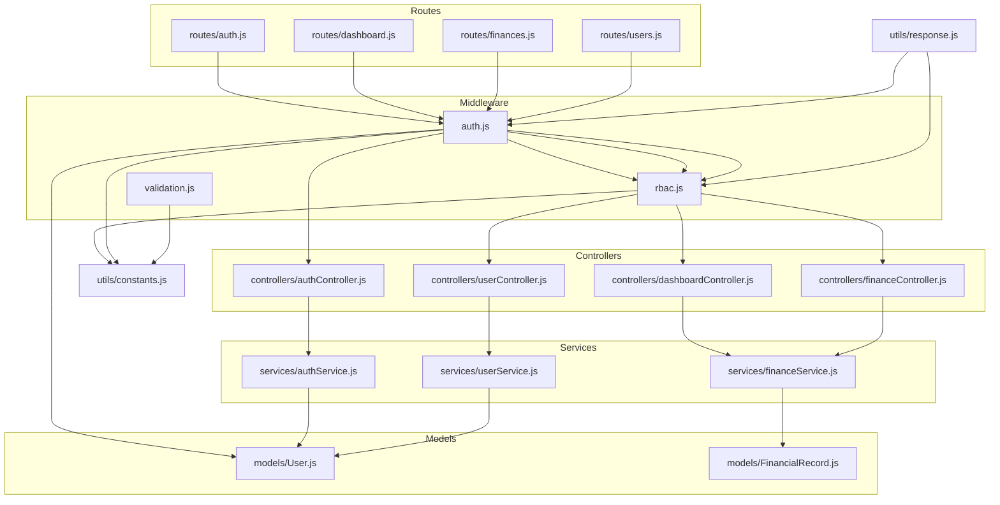
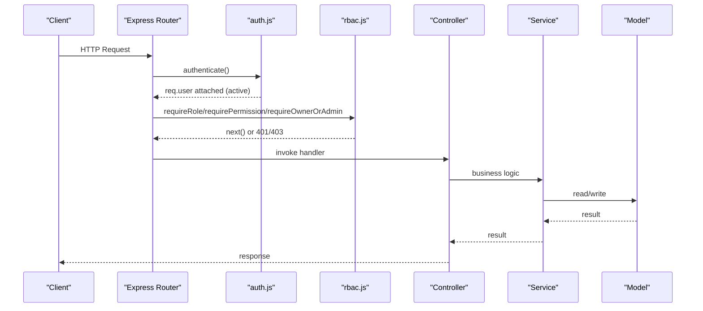
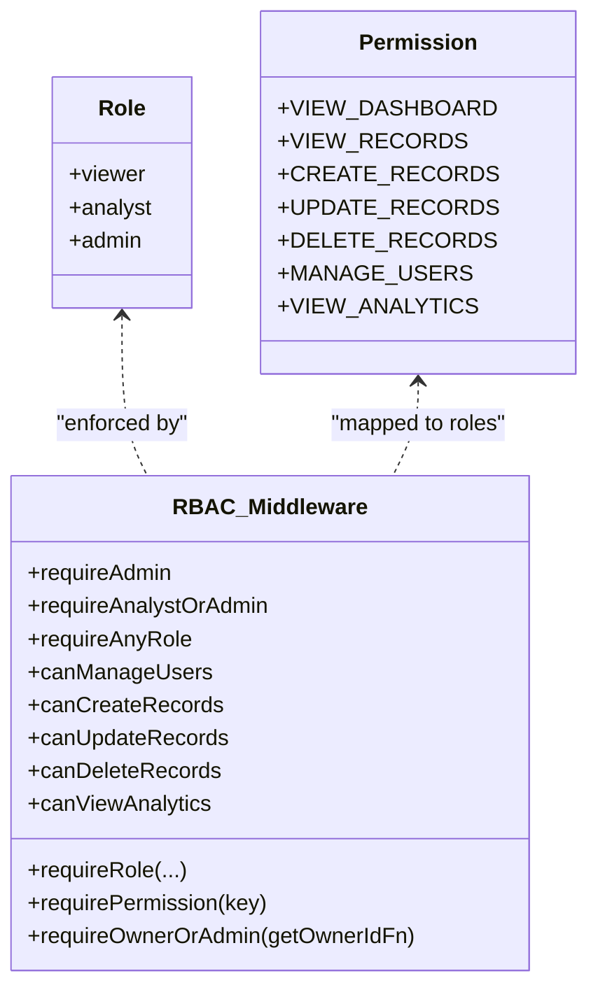
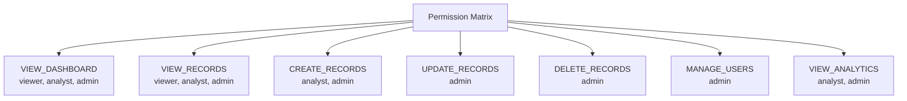
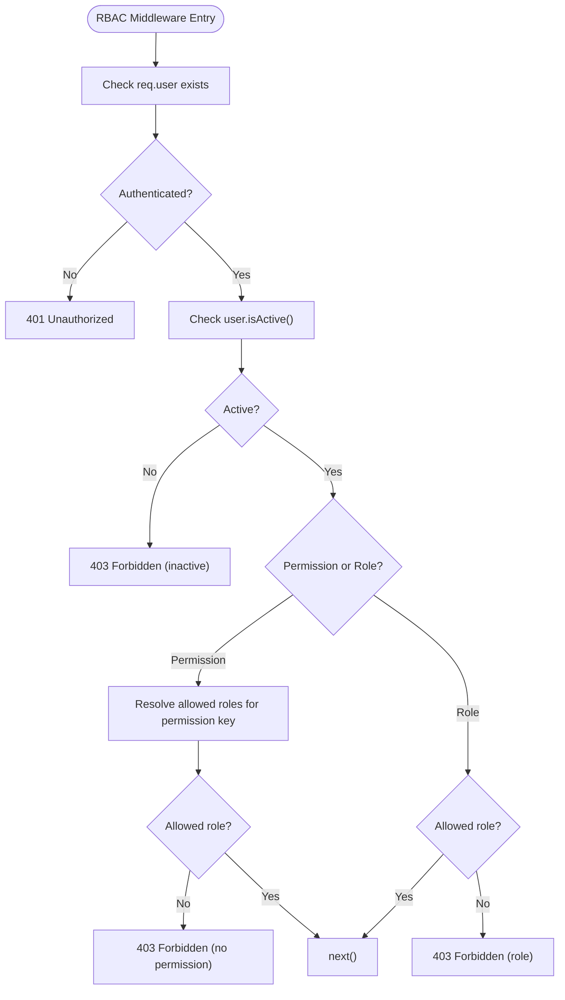
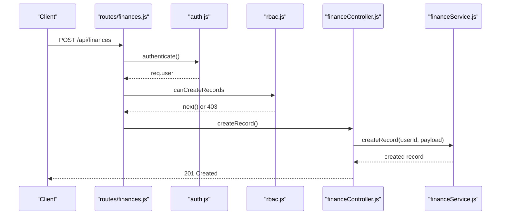
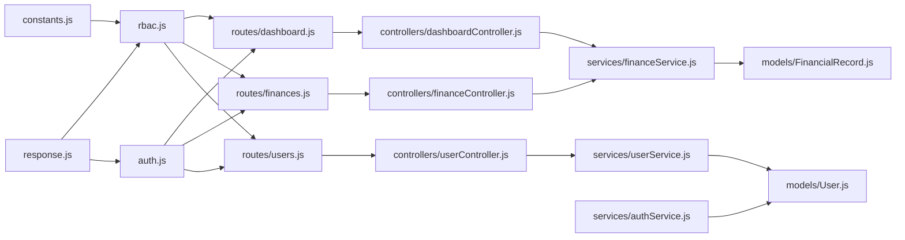

# Role-Based Access Control (RBAC)

<cite>
**Referenced Files in This Document**
- [rbac.js](file://backend/middleware/rbac.js)
- [auth.js](file://backend/middleware/auth.js)
- [constants.js](file://backend/utils/constants.js)
- [response.js](file://backend/utils/response.js)
- [User.js](file://backend/models/User.js)
- [FinancialRecord.js](file://backend/models/FinancialRecord.js)
- [routes/auth.js](file://backend/routes/auth.js)
- [routes/dashboard.js](file://backend/routes/dashboard.js)
- [routes/finances.js](file://backend/routes/finances.js)
- [routes/users.js](file://backend/routes/users.js)
- [controllers/authController.js](file://backend/controllers/authController.js)
- [controllers/dashboardController.js](file://backend/controllers/dashboardController.js)
- [controllers/financeController.js](file://backend/controllers/financeController.js)
- [controllers/userController.js](file://backend/controllers/userController.js)
- [services/authService.js](file://backend/services/authService.js)
- [services/userService.js](file://backend/services/userService.js)
- [services/financeService.js](file://backend/services/financeService.js)
- [middleware/validation.js](file://backend/middleware/validation.js)
</cite>

## Table of Contents
1. [Introduction](#introduction)
2. [Project Structure](#project-structure)
3. [Core Components](#core-components)
4. [Architecture Overview](#architecture-overview)
5. [Detailed Component Analysis](#detailed-component-analysis)
6. [Dependency Analysis](#dependency-analysis)
7. [Performance Considerations](#performance-considerations)
8. [Troubleshooting Guide](#troubleshooting-guide)
9. [Conclusion](#conclusion)
10. [Appendices](#appendices)

## Introduction
This document describes the role-based access control (RBAC) system implemented in the backend. It explains the three-tier permission model (Viewer, Analyst, Admin), the permission matrix, middleware enforcement, and practical examples of role assignment and access checks. It also covers role hierarchy, permission inheritance, and security boundaries enforced by the system.

## Project Structure
The RBAC system spans middleware, routes, controllers, services, models, and shared constants. Authentication attaches the user to the request, while RBAC middleware enforces role and permission checks. Controllers orchestrate requests and delegate to services, which implement business logic and data access rules.

**Diagram sources**
- [auth.js:14-59](file://backend/middleware/auth.js#L14-L59)
- [rbac.js:14-66](file://backend/middleware/rbac.js#L14-L66)
- [constants.js:6-57](file://backend/utils/constants.js#L6-L57)
- [response.js:56-77](file://backend/utils/response.js#L56-L77)
- [routes/auth.js:14-46](file://backend/routes/auth.js#L14-L46)
- [routes/dashboard.js:14-54](file://backend/routes/dashboard.js#L14-L54)
- [routes/finances.js:24-64](file://backend/routes/finances.js#L24-L64)
- [routes/users.js:14-61](file://backend/routes/users.js#L14-L61)
- [controllers/authController.js:13-105](file://backend/controllers/authController.js#L13-L105)
- [controllers/dashboardController.js:13-134](file://backend/controllers/dashboardController.js#L13-L134)
- [controllers/financeController.js:13-110](file://backend/controllers/financeController.js#L13-L110)
- [controllers/userController.js:13-103](file://backend/controllers/userController.js#L13-L103)
- [services/authService.js:15-93](file://backend/services/authService.js#L15-L93)
- [services/userService.js:14-181](file://backend/services/userService.js#L14-L181)
- [services/financeService.js:38-125](file://backend/services/financeService.js#L38-L125)
- [models/User.js:10-127](file://backend/models/User.js#L10-L127)
- [models/FinancialRecord.js:9-130](file://backend/models/FinancialRecord.js#L9-L130)

**Section sources**
- [routes/auth.js:14-46](file://backend/routes/auth.js#L14-L46)
- [routes/dashboard.js:14-54](file://backend/routes/dashboard.js#L14-L54)
- [routes/finances.js:24-64](file://backend/routes/finances.js#L24-L64)
- [routes/users.js:14-61](file://backend/routes/users.js#L14-L61)

## Core Components
- Roles and Permissions
  - Roles: viewer, analyst, admin
  - Permissions: VIEW_DASHBOARD, VIEW_RECORDS, CREATE_RECORDS, UPDATE_RECORDS, DELETE_RECORDS, MANAGE_USERS, VIEW_ANALYTICS
- Authentication Middleware
  - Verifies JWT, attaches user, enforces active status
- RBAC Middleware
  - Role-based gating (requireRole)
  - Permission-based gating (requirePermission)
  - Owner-or-admin enforcement (requireOwnerOrAdmin)
- Models
  - User: role and status with helpers
  - FinancialRecord: soft-delete and ownership helpers
- Controllers and Services
  - Orchestrate requests and enforce resource-level access rules

**Section sources**
- [constants.js:6-57](file://backend/utils/constants.js#L6-L57)
- [auth.js:14-59](file://backend/middleware/auth.js#L14-L59)
- [rbac.js:14-136](file://backend/middleware/rbac.js#L14-L136)
- [User.js:34-112](file://backend/models/User.js#L34-L112)
- [FinancialRecord.js:50-108](file://backend/models/FinancialRecord.js#L50-L108)

## Architecture Overview
The RBAC architecture enforces access control at two layers:
- Route-level role/permission checks via RBAC middleware
- Resource-level checks via service-layer logic and owner/admin overrides

**Diagram sources**
- [auth.js:14-59](file://backend/middleware/auth.js#L14-L59)
- [rbac.js:14-136](file://backend/middleware/rbac.js#L14-L136)
- [routes/dashboard.js:19-26](file://backend/routes/dashboard.js#L19-L26)
- [routes/finances.js:29-57](file://backend/routes/finances.js#L29-L57)
- [routes/users.js:19-61](file://backend/routes/users.js#L19-L61)
- [controllers/dashboardController.js:13-27](file://backend/controllers/dashboardController.js#L13-L27)
- [controllers/financeController.js:13-27](file://backend/controllers/financeController.js#L13-L27)
- [controllers/userController.js:13-24](file://backend/controllers/userController.js#L13-L24)
- [services/financeService.js:38-125](file://backend/services/financeService.js#L38-L125)
- [services/userService.js:14-58](file://backend/services/userService.js#L14-L58)
- [services/authService.js:15-51](file://backend/services/authService.js#L15-L51)

## Detailed Component Analysis

### Three-Tier Role Model and Capabilities
- Viewer
  - Can view dashboard summaries and records
  - Cannot create/update/delete records
  - Cannot manage users
- Analyst
  - Inherits Viewer capabilities
  - Can create records
  - Can view analytics
  - Cannot update/delete records or manage users
- Admin
  - Highest privilege
  - Can manage users (CRUD, status toggle)
  - Can create, update, and delete records
  - Can view analytics and full dashboard

**Diagram sources**
- [constants.js:6-57](file://backend/utils/constants.js#L6-L57)
- [rbac.js:14-136](file://backend/middleware/rbac.js#L14-L136)

**Section sources**
- [constants.js:6-57](file://backend/utils/constants.js#L6-L57)
- [rbac.js:14-136](file://backend/middleware/rbac.js#L14-L136)

### Permission Matrix
The following matrix defines which roles can perform each operation. It is enforced by RBAC middleware and route definitions.

- VIEW_DASHBOARD: viewer, analyst, admin
- VIEW_RECORDS: viewer, analyst, admin
- CREATE_RECORDS: analyst, admin
- UPDATE_RECORDS: admin
- DELETE_RECORDS: admin
- MANAGE_USERS: admin
- VIEW_ANALYTICS: analyst, admin

**Diagram sources**
- [constants.js:48-57](file://backend/utils/constants.js#L48-L57)

**Section sources**
- [constants.js:48-57](file://backend/utils/constants.js#L48-L57)

### RBAC Middleware Implementation
- requireRole
  - Accepts one or more roles; rejects if user lacks any of them
  - Also checks user isActive()
- requirePermission
  - Resolves allowed roles for a permission key from constants
  - Rejects if key is undefined or user lacks required role
  - Also checks user isActive()
- requireAdmin, requireAnalystOrAdmin, requireAnyRole
  - Convenience wrappers around requireRole
- canManageUsers, canCreateRecords, canUpdateRecords, canDeleteRecords, canViewAnalytics
  - Convenience wrappers around requirePermission
- requireOwnerOrAdmin
  - Allows admins immediate access
  - For non-admins, delegates to a resolver function to check resource ownership
  - Returns 403 if ownership check fails

**Diagram sources**
- [rbac.js:14-66](file://backend/middleware/rbac.js#L14-L66)
- [response.js:56-77](file://backend/utils/response.js#L56-L77)

**Section sources**
- [rbac.js:14-136](file://backend/middleware/rbac.js#L14-L136)
- [response.js:56-77](file://backend/utils/response.js#L56-L77)

### Route Protection and Dynamic Enforcement
- Authentication
  - All protected routes use authenticate middleware to attach req.user and enforce active status
- Role and Permission Guards
  - Dashboard: analytics endpoints use canViewAnalytics; general summaries use requireAnyRole
  - Finances: CRUD endpoints use canCreateRecords/canUpdateRecords/canDeleteRecords; read endpoints use requireAnyRole
  - Users: all endpoints guarded by canManageUsers (admin only)
- Owner-or-Admin Enforcement
  - Implemented in services to restrict record access to owners (unless admin)

**Diagram sources**
- [routes/finances.js:43-43](file://backend/routes/finances.js#L43-L43)
- [auth.js:14-59](file://backend/middleware/auth.js#L14-L59)
- [rbac.js:40-66](file://backend/middleware/rbac.js#L40-L66)
- [controllers/financeController.js:13-27](file://backend/controllers/financeController.js#L13-L27)
- [services/financeService.js:15-29](file://backend/services/financeService.js#L15-L29)

**Section sources**
- [routes/dashboard.js:19-54](file://backend/routes/dashboard.js#L19-L54)
- [routes/finances.js:29-64](file://backend/routes/finances.js#L29-L64)
- [routes/users.js:19-61](file://backend/routes/users.js#L19-L61)

### Practical Examples

- Assigning a role
  - On user creation, role defaults to viewer unless overridden by an admin
  - Example path: [services/authService.js:24-51](file://backend/services/authService.js#L24-L51), [services/userService.js:88-113](file://backend/services/userService.js#L88-L113)
- Validating permissions
  - Use canCreateRecords for creation endpoints; use canUpdateRecords/canDeleteRecords for updates/deletes
  - Example path: [routes/finances.js:43-64](file://backend/routes/finances.js#L43-L64)
- Enforcing resource ownership
  - Non-admins can only access their own records; admin can access all
  - Example path: [services/financeService.js:119-122](file://backend/services/financeService.js#L119-L122)
- Admin-only user management
  - Use canManageUsers for all user endpoints
  - Example path: [routes/users.js:19-61](file://backend/routes/users.js#L19-L61)

**Section sources**
- [services/authService.js:24-51](file://backend/services/authService.js#L24-L51)
- [services/userService.js:88-113](file://backend/services/userService.js#L88-L113)
- [routes/finances.js:43-64](file://backend/routes/finances.js#L43-L64)
- [services/financeService.js:119-122](file://backend/services/financeService.js#L119-L122)
- [routes/users.js:19-61](file://backend/routes/users.js#L19-L61)

### Role Hierarchy and Permission Inheritance
- Role hierarchy
  - Admin > Analyst > Viewer
- Permission inheritance
  - Analyst inherits Viewer permissions
  - Admin inherits Analyst and Viewer permissions
- Enforcement
  - requireRole and requirePermission enforce strict role membership
  - requireOwnerOrAdmin adds a resource-level override for ownership

**Section sources**
- [constants.js:6-57](file://backend/utils/constants.js#L6-L57)
- [rbac.js:14-136](file://backend/middleware/rbac.js#L14-L136)

### Security Boundary Enforcement
- Authentication boundary
  - JWT verification and active status check occur before any RBAC checks
- Authorization boundary
  - RBAC middleware validates roles/permissions
  - Services enforce ownership and visibility rules (e.g., non-admins only see their records)
- Response boundary
  - Standardized 401/403 responses via response utilities

**Section sources**
- [auth.js:14-59](file://backend/middleware/auth.js#L14-L59)
- [rbac.js:14-136](file://backend/middleware/rbac.js#L14-L136)
- [response.js:56-77](file://backend/utils/response.js#L56-L77)
- [services/financeService.js:119-122](file://backend/services/financeService.js#L119-L122)

## Dependency Analysis
RBAC depends on constants for roles and permissions, and on response utilities for consistent error signaling. Controllers depend on services, which depend on models and constants.

**Diagram sources**
- [constants.js:6-57](file://backend/utils/constants.js#L6-L57)
- [response.js:56-77](file://backend/utils/response.js#L56-L77)
- [auth.js:14-59](file://backend/middleware/auth.js#L14-L59)
- [rbac.js:14-136](file://backend/middleware/rbac.js#L14-L136)
- [routes/dashboard.js:19-26](file://backend/routes/dashboard.js#L19-L26)
- [routes/finances.js:29-57](file://backend/routes/finances.js#L29-L57)
- [routes/users.js:19-61](file://backend/routes/users.js#L19-L61)
- [controllers/dashboardController.js:13-27](file://backend/controllers/dashboardController.js#L13-L27)
- [controllers/financeController.js:13-27](file://backend/controllers/financeController.js#L13-L27)
- [controllers/userController.js:13-24](file://backend/controllers/userController.js#L13-L24)
- [services/financeService.js:38-125](file://backend/services/financeService.js#L38-L125)
- [services/userService.js:14-58](file://backend/services/userService.js#L14-L58)
- [services/authService.js:15-51](file://backend/services/authService.js#L15-L51)
- [models/User.js:10-127](file://backend/models/User.js#L10-L127)
- [models/FinancialRecord.js:9-130](file://backend/models/FinancialRecord.js#L9-L130)

**Section sources**
- [constants.js:6-57](file://backend/utils/constants.js#L6-L57)
- [rbac.js:14-136](file://backend/middleware/rbac.js#L14-L136)
- [auth.js:14-59](file://backend/middleware/auth.js#L14-L59)
- [response.js:56-77](file://backend/utils/response.js#L56-L77)

## Performance Considerations
- Keep RBAC checks early in the middleware chain to fail fast
- Use targeted indexes on user role/status and record ownership fields
- Avoid unnecessary population in service queries when not required
- Cache frequently accessed permission sets if needed, though current design resolves permissions from constants

## Troubleshooting Guide
Common issues and debugging steps:
- 401 Unauthorized
  - Cause: missing or invalid/expired token, or inactive account
  - Check: token presence/header format, JWT secret configuration, user status
  - References: [auth.js:14-59](file://backend/middleware/auth.js#L14-L59), [response.js:56-63](file://backend/utils/response.js#L56-L63)
- 403 Forbidden
  - Role mismatch: user lacks required role
  - Permission mismatch: permission key not defined or role not allowed
  - Inactive user during permission check
  - Ownership mismatch for resource-level checks
  - References: [rbac.js:14-136](file://backend/middleware/rbac.js#L14-L136), [response.js:70-77](file://backend/utils/response.js#L70-L77)
- Unexpected access to records
  - Non-admin users should only see their own records
  - Verify service-level ownership checks
  - References: [services/financeService.js:119-122](file://backend/services/financeService.js#L119-L122)
- Admin actions failing
  - Ensure user role is admin and account is active
  - Confirm permission keys align with constants
  - References: [constants.js:6-57](file://backend/utils/constants.js#L6-L57), [rbac.js:40-66](file://backend/middleware/rbac.js#L40-L66)

**Section sources**
- [auth.js:14-59](file://backend/middleware/auth.js#L14-L59)
- [rbac.js:14-136](file://backend/middleware/rbac.js#L14-L136)
- [response.js:56-77](file://backend/utils/response.js#L56-L77)
- [services/financeService.js:119-122](file://backend/services/financeService.js#L119-L122)
- [constants.js:6-57](file://backend/utils/constants.js#L6-L57)

## Conclusion
The RBAC system enforces a clear, layered access control model: authentication establishes identity and active status, RBAC middleware enforces role and permission gates, and services implement resource-level ownership and visibility rules. The permission matrix and convenience guards simplify route protection and ensure consistent enforcement across endpoints.

## Appendices

### Endpoint Access Reference
- Authentication
  - POST /api/auth/register: public
  - POST /api/auth/login: public
  - GET /api/auth/profile: private (any role)
  - PUT /api/auth/change-password: private (any role)
  - POST /api/auth/setup-admin: public (one-time setup)
- Dashboard
  - GET /api/dashboard: private (analyst, admin)
  - GET /api/dashboard/summary: private (any role)
  - GET /api/dashboard/category-summary: private (analyst, admin)
  - GET /api/dashboard/recent-activity: private (any role)
  - GET /api/dashboard/trends/monthly: private (analyst, admin)
  - GET /api/dashboard/trends/weekly: private (analyst, admin)
- Finances
  - GET /api/finances: private (any role)
  - GET /api/finances/categories: private (any role)
  - POST /api/finances: private (analyst, admin)
  - GET /api/finances/:id: private (any role)
  - PUT /api/finances/:id: private (admin)
  - DELETE /api/finances/:id: private (admin)
- Users
  - GET /api/users: private (admin)
  - GET /api/users/stats: private (admin)
  - POST /api/users: private (admin)
  - GET /api/users/:id: private (admin)
  - PUT /api/users/:id: private (admin)
  - DELETE /api/users/:id: private (admin)
  - PUT /api/users/:id/status: private (admin)

**Section sources**
- [routes/auth.js:14-46](file://backend/routes/auth.js#L14-L46)
- [routes/dashboard.js:14-54](file://backend/routes/dashboard.js#L14-L54)
- [routes/finances.js:24-64](file://backend/routes/finances.js#L24-L64)
- [routes/users.js:14-61](file://backend/routes/users.js#L14-L61)