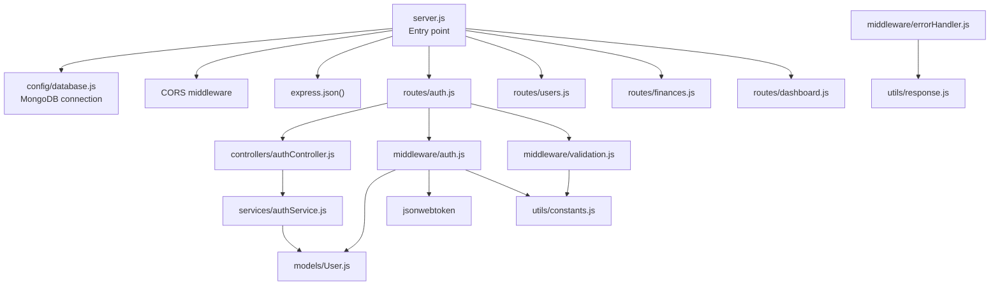
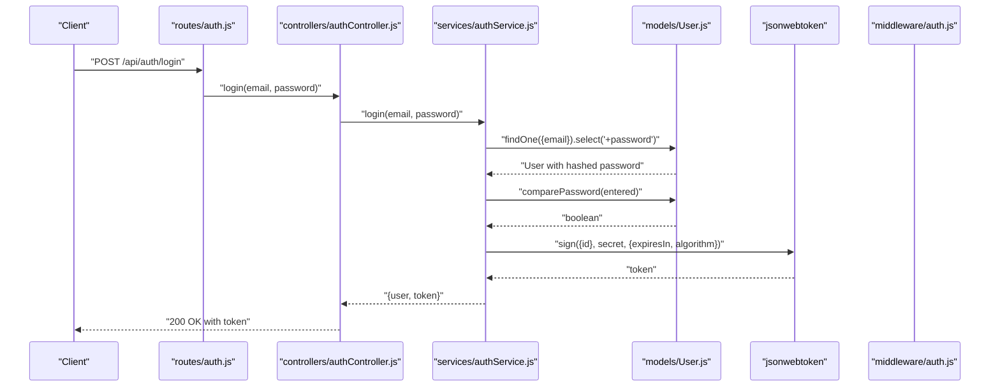
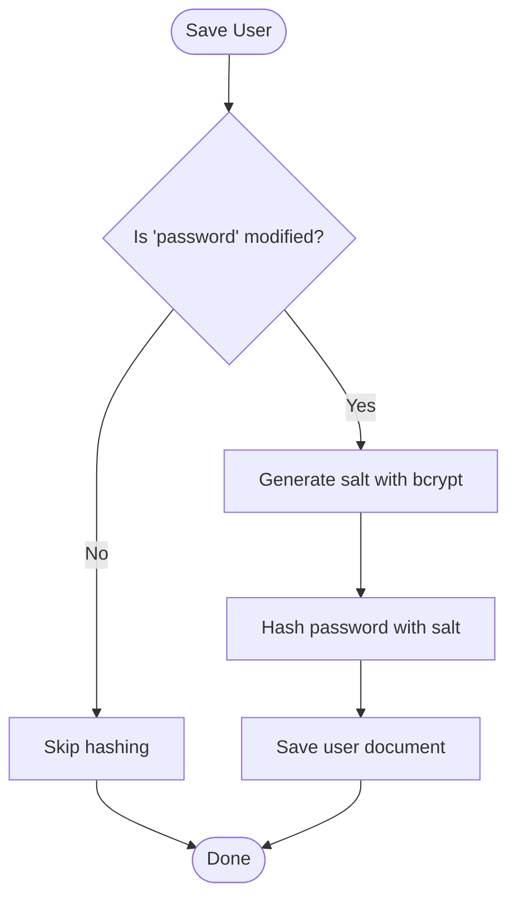
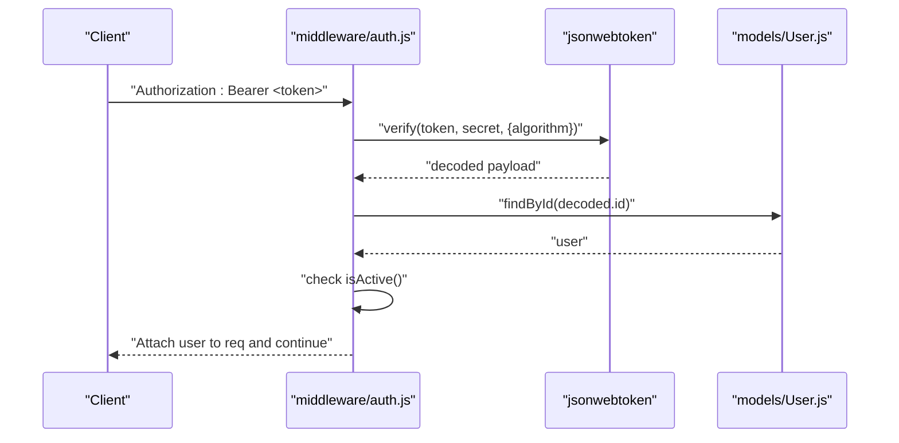
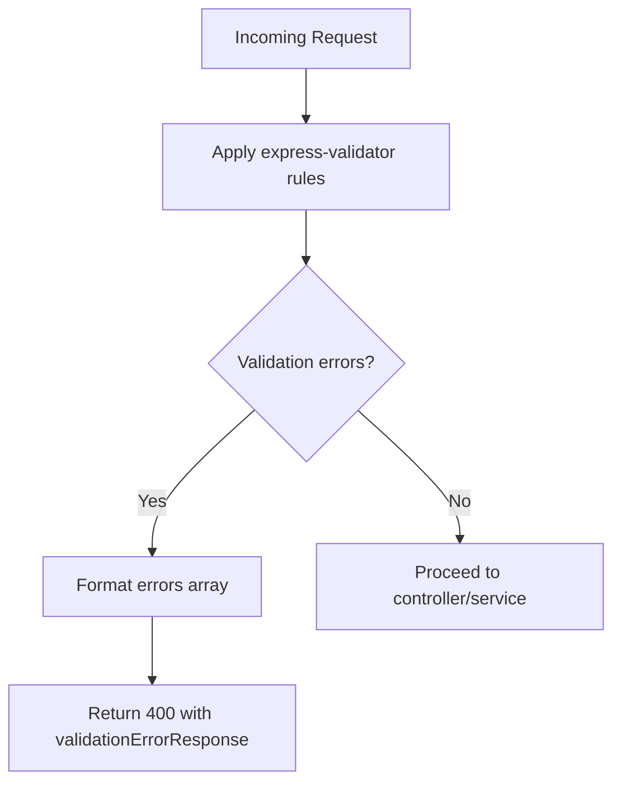
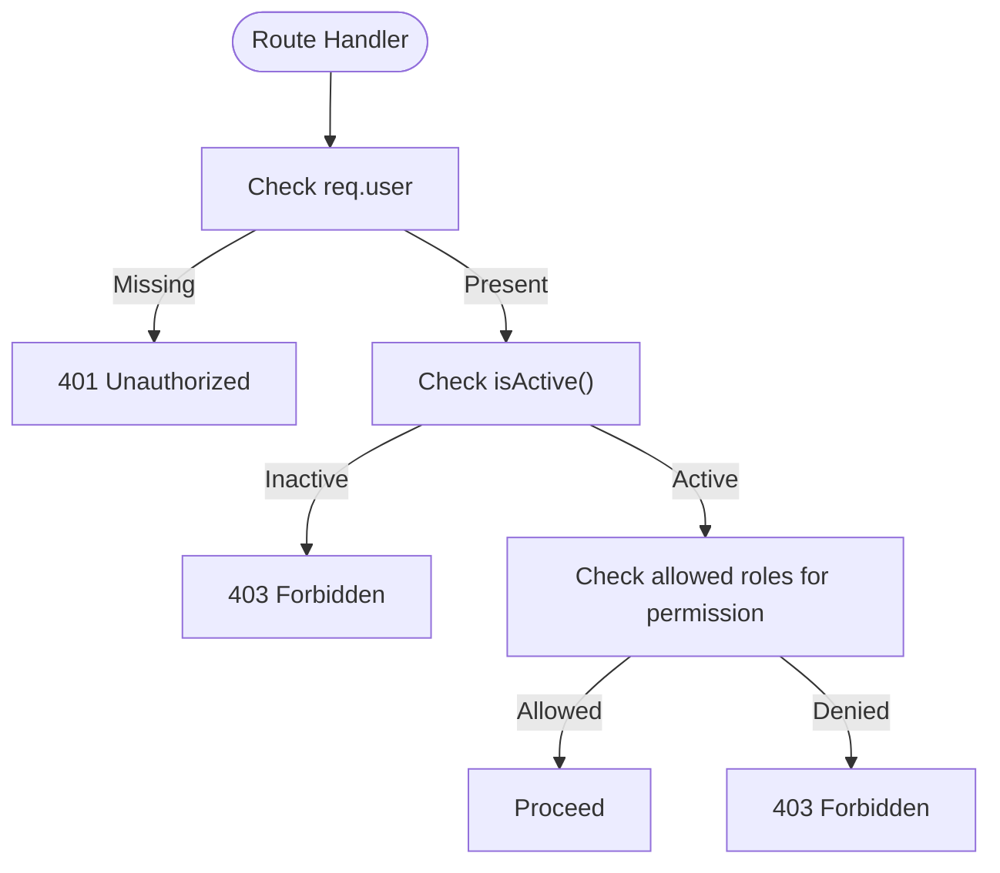
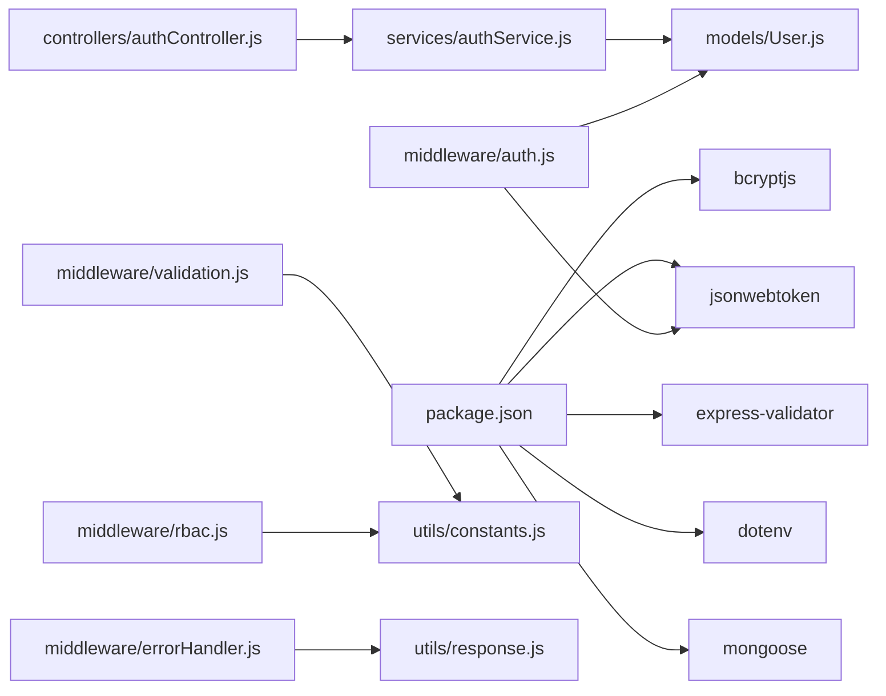

# Security Considerations

<cite>
**Referenced Files in This Document**
- [server.js](file://backend/server.js)
- [package.json](file://backend/package.json)
- [config/database.js](file://backend/config/database.js)
- [utils/constants.js](file://backend/utils/constants.js)
- [utils/response.js](file://backend/utils/response.js)
- [middleware/auth.js](file://backend/middleware/auth.js)
- [middleware/rbac.js](file://backend/middleware/rbac.js)
- [middleware/validation.js](file://backend/middleware/validation.js)
- [middleware/errorHandler.js](file://backend/middleware/errorHandler.js)
- [models/User.js](file://backend/models/User.js)
- [services/authService.js](file://backend/services/authService.js)
- [controllers/authController.js](file://backend/controllers/authController.js)
- [routes/auth.js](file://backend/routes/auth.js)
</cite>

## Table of Contents
1. [Introduction](#introduction)
2. [Project Structure](#project-structure)
3. [Core Components](#core-components)
4. [Architecture Overview](#architecture-overview)
5. [Detailed Component Analysis](#detailed-component-analysis)
6. [Dependency Analysis](#dependency-analysis)
7. [Performance Considerations](#performance-considerations)
8. [Troubleshooting Guide](#troubleshooting-guide)
9. [Conclusion](#conclusion)
10. [Appendices](#appendices)

## Introduction
This document provides comprehensive security documentation for the authentication and authorization system. It covers password security (hashing, salt generation, and strength requirements), token security (storage, transmission, and rotation), input validation and sanitization, access control (permissions, sessions, and audit logging), production hardening, environment variable management, vulnerability mitigation, and operational security monitoring and incident response.

## Project Structure
The backend follows a layered architecture:
- Entry point initializes environment, connects to the database, registers middleware, and mounts routes.
- Routes define HTTP endpoints and apply validation and authentication middleware.
- Controllers orchestrate request handling and delegate to services.
- Services encapsulate business logic and coordinate with models.
- Models define schemas, enforce constraints, and implement hashing and comparison logic.
- Middleware enforces authentication, RBAC, input validation, and centralized error handling.
- Utilities provide shared constants, JWT configuration, and standardized responses.

**Diagram sources**
- [server.js:1-113](file://backend/server.js#L1-L113)
- [routes/auth.js:1-49](file://backend/routes/auth.js#L1-L49)
- [controllers/authController.js:1-114](file://backend/controllers/authController.js#L1-L114)
- [services/authService.js:1-195](file://backend/services/authService.js#L1-L195)
- [models/User.js:1-130](file://backend/models/User.js#L1-L130)
- [middleware/auth.js:1-116](file://backend/middleware/auth.js#L1-L116)
- [middleware/validation.js:1-309](file://backend/middleware/validation.js#L1-L309)
- [middleware/errorHandler.js:1-179](file://backend/middleware/errorHandler.js#L1-L179)
- [utils/constants.js:1-81](file://backend/utils/constants.js#L1-L81)
- [utils/response.js:1-101](file://backend/utils/response.js#L1-L101)
- [config/database.js:1-43](file://backend/config/database.js#L1-L43)

**Section sources**
- [server.js:1-113](file://backend/server.js#L1-L113)
- [routes/auth.js:1-49](file://backend/routes/auth.js#L1-L49)

## Core Components
- Authentication middleware validates JWT tokens, attaches user context, and enforces active account checks.
- RBAC middleware enforces role-based permissions and resource ownership checks.
- Input validation middleware uses express-validator to sanitize and validate request payloads and query parameters.
- User model implements bcrypt-based password hashing, password comparison, and role/status helpers.
- Error handling middleware centralizes error responses and handles JWT-specific errors.
- Constants define roles, statuses, permissions, and JWT configuration.

**Section sources**
- [middleware/auth.js:1-116](file://backend/middleware/auth.js#L1-L116)
- [middleware/rbac.js:1-151](file://backend/middleware/rbac.js#L1-L151)
- [middleware/validation.js:1-309](file://backend/middleware/validation.js#L1-L309)
- [models/User.js:1-130](file://backend/models/User.js#L1-L130)
- [middleware/errorHandler.js:1-179](file://backend/middleware/errorHandler.js#L1-L179)
- [utils/constants.js:1-81](file://backend/utils/constants.js#L1-L81)

## Architecture Overview
The authentication and authorization flow integrates middleware, services, and models to provide secure user management and access control.

**Diagram sources**
- [routes/auth.js:1-49](file://backend/routes/auth.js#L1-L49)
- [controllers/authController.js:1-114](file://backend/controllers/authController.js#L1-L114)
- [services/authService.js:1-195](file://backend/services/authService.js#L1-L195)
- [models/User.js:1-130](file://backend/models/User.js#L1-L130)
- [middleware/auth.js:1-116](file://backend/middleware/auth.js#L1-L116)

## Detailed Component Analysis

### Password Security
- Hashing and Salt Generation
  - Passwords are hashed using bcrypt with a configurable cost factor during save hooks.
  - Salt is generated automatically by the library and combined with the password before hashing.
  - The pre-save hook ensures hashing only occurs when the password field is modified.
- Password Strength Requirements
  - Minimum length enforced at the schema level.
  - Email validation and normalization occur at the schema and validation layers.
- Password Comparison
  - A dedicated method compares the provided password against the stored hash.

**Diagram sources**
- [models/User.js:64-86](file://backend/models/User.js#L64-L86)

**Section sources**
- [models/User.js:28-33](file://backend/models/User.js#L28-L33)
- [models/User.js:64-86](file://backend/models/User.js#L64-L86)
- [middleware/validation.js:48-52](file://backend/middleware/validation.js#L48-L52)

### Token Security Practices
- Secret Management
  - JWT secret is loaded from environment variables; a fallback is present in code for development.
  - Expiration and algorithm are configured centrally.
- Token Verification and Storage
  - Tokens are verified using the configured algorithm and secret.
  - Active account enforcement prevents use of disabled accounts.
- Transmission and Rotation
  - Tokens are transmitted via the Authorization header as Bearer tokens.
  - Rotation strategies are not implemented; consider short-lived tokens with refresh mechanisms for production.

**Diagram sources**
- [middleware/auth.js:14-59](file://backend/middleware/auth.js#L14-L59)
- [utils/constants.js:66-70](file://backend/utils/constants.js#L66-L70)
- [models/User.js:97-103](file://backend/models/User.js#L97-L103)

**Section sources**
- [middleware/auth.js:100-109](file://backend/middleware/auth.js#L100-L109)
- [utils/constants.js:66-70](file://backend/utils/constants.js#L66-L70)
- [middleware/auth.js:28-54](file://backend/middleware/auth.js#L28-L54)

### Input Validation and Sanitization
- Validation Rules
  - Names are trimmed and bounded in length.
  - Emails are normalized and validated with regex.
  - Passwords enforce minimum length.
  - Enumerated fields use allowed values from constants.
  - Numeric and date fields are validated with numeric/date constraints.
- Error Handling
  - Validation errors are aggregated and returned with structured messages.

**Diagram sources**
- [middleware/validation.js:13-27](file://backend/middleware/validation.js#L13-L27)
- [utils/response.js:42-49](file://backend/utils/response.js#L42-L49)

**Section sources**
- [middleware/validation.js:32-60](file://backend/middleware/validation.js#L32-L60)
- [middleware/validation.js:129-168](file://backend/middleware/validation.js#L129-L168)
- [middleware/validation.js:229-273](file://backend/middleware/validation.js#L229-L273)

### Access Control Security (RBAC)
- Role-Based Access Control
  - Permission matrix defines allowed roles per action.
  - Middleware checks authentication, active status, and role/permission eligibility.
- Resource Ownership Checks
  - Specialized middleware verifies ownership or admin privileges for resource-level access.

**Diagram sources**
- [middleware/rbac.js:40-66](file://backend/middleware/rbac.js#L40-L66)
- [models/User.js:97-112](file://backend/models/User.js#L97-L112)
- [utils/constants.js:48-57](file://backend/utils/constants.js#L48-L57)

**Section sources**
- [middleware/rbac.js:14-33](file://backend/middleware/rbac.js#L14-L33)
- [middleware/rbac.js:109-136](file://backend/middleware/rbac.js#L109-L136)
- [utils/constants.js:48-57](file://backend/utils/constants.js#L48-L57)

### Session Management and Audit Logging
- Sessionless JWT
  - Stateless authentication with JWT tokens; no server-side session storage.
- Audit Logging
  - No explicit audit logging is implemented in the reviewed code.
  - Recommendation: Add structured logs for authentication events, permission denials, and sensitive actions.

[No sources needed since this section provides general guidance]

### Error Handling and Security Implications
- Centralized Error Handling
  - Converts validation, cast, duplicate key, and JWT errors into standardized responses.
  - Prevents stack traces from leaking in production.
- Uncaught Exceptions and Rejections
  - Graceful shutdown on unhandled exceptions and rejections.

**Section sources**
- [middleware/errorHandler.js:89-145](file://backend/middleware/errorHandler.js#L89-L145)
- [middleware/errorHandler.js:150-171](file://backend/middleware/errorHandler.js#L150-L171)

## Dependency Analysis
- External Dependencies
  - bcryptjs for password hashing.
  - jsonwebtoken for JWT signing and verification.
  - express-validator for input validation.
  - dotenv for environment variable loading.
- Internal Dependencies
  - Controllers depend on services.
  - Services depend on models and JWT middleware.
  - RBAC and auth middleware depend on constants and models.

**Diagram sources**
- [package.json:16-27](file://backend/package.json#L16-L27)
- [controllers/authController.js:6](file://backend/controllers/authController.js#L6)
- [services/authService.js:6-8](file://backend/services/authService.js#L6-L8)
- [middleware/auth.js:6-9](file://backend/middleware/auth.js#L6-L9)
- [middleware/validation.js:6-8](file://backend/middleware/validation.js#L6-L8)
- [middleware/rbac.js:7](file://backend/middleware/rbac.js#L7)
- [middleware/errorHandler.js:6](file://backend/middleware/errorHandler.js#L6)
- [utils/response.js:1-101](file://backend/utils/response.js#L1-L101)

**Section sources**
- [package.json:16-27](file://backend/package.json#L16-L27)

## Performance Considerations
- Password hashing cost affects CPU usage; adjust based on hardware capacity.
- JWT verification overhead is minimal compared to database lookups.
- Validation middleware adds negligible overhead and improves reliability.

[No sources needed since this section provides general guidance]

## Troubleshooting Guide
- Authentication Failures
  - Missing or invalid Authorization header yields 401.
  - Expired tokens yield 401 with token-expired messaging.
  - Invalid tokens yield 401 with invalid-token messaging.
- Validation Errors
  - Structured 400 responses enumerate field-level issues.
- Database Errors
  - Duplicate keys produce 409 with field-specific messages.
  - Cast errors (invalid ObjectId) produce 400 with field-specific messages.
- Operational Errors
  - Uncaught exceptions and unhandled rejections trigger graceful shutdown.

**Section sources**
- [middleware/auth.js:24-54](file://backend/middleware/auth.js#L24-L54)
- [middleware/errorHandler.js:102-136](file://backend/middleware/errorHandler.js#L102-L136)
- [middleware/errorHandler.js:150-171](file://backend/middleware/errorHandler.js#L150-L171)
- [utils/response.js:42-49](file://backend/utils/response.js#L42-L49)

## Conclusion
The authentication and authorization system implements robust password hashing, input validation, and RBAC. JWT-based authentication is stateless and scalable. Recommendations for production include rotating secrets, short-lived tokens with refresh, audit logging, stricter environment variable management, and proactive monitoring.

[No sources needed since this section summarizes without analyzing specific files]

## Appendices

### Security Best Practices Checklist
- Environment Variables
  - Store JWT_SECRET and MONGODB_URI in environment variables; never commit secrets to source control.
- Token Management
  - Use short-lived access tokens and refresh tokens; rotate secrets periodically.
  - Enforce HTTPS and secure cookie flags for refresh tokens if used.
- Input Validation
  - Continue leveraging express-validator; add rate limiting and request size limits.
- Access Control
  - Implement audit logs for authentication, authorization, and sensitive actions.
- Monitoring and Incident Response
  - Monitor authentication failures, token expirations, and permission denials.
  - Define runbooks for incident response and remediation.

[No sources needed since this section provides general guidance]