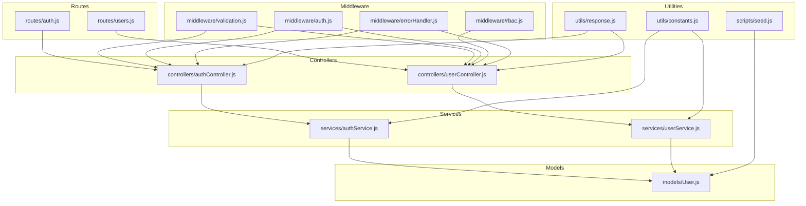
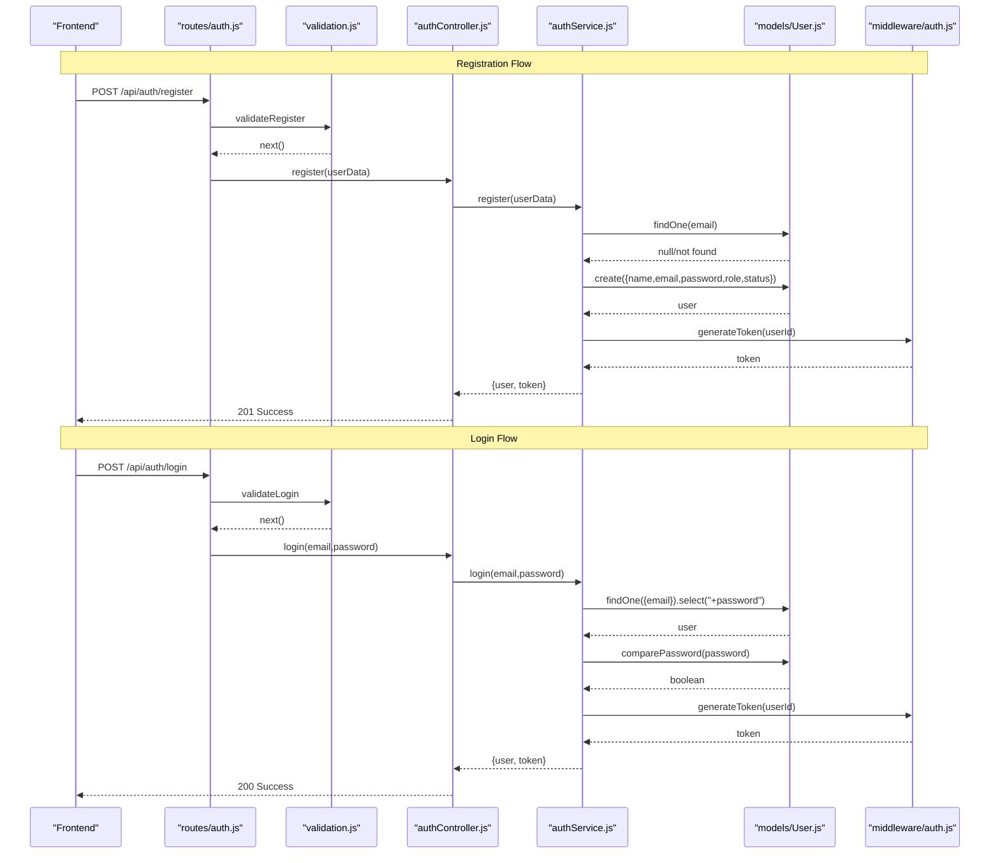
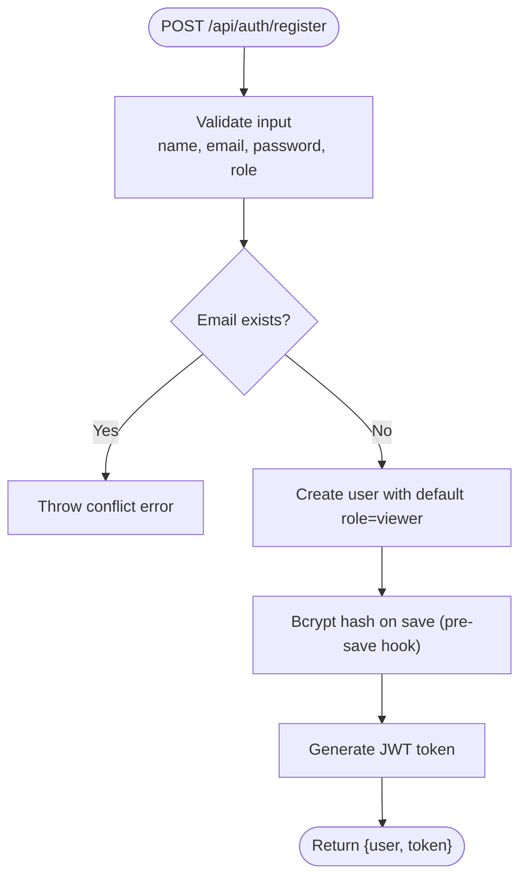
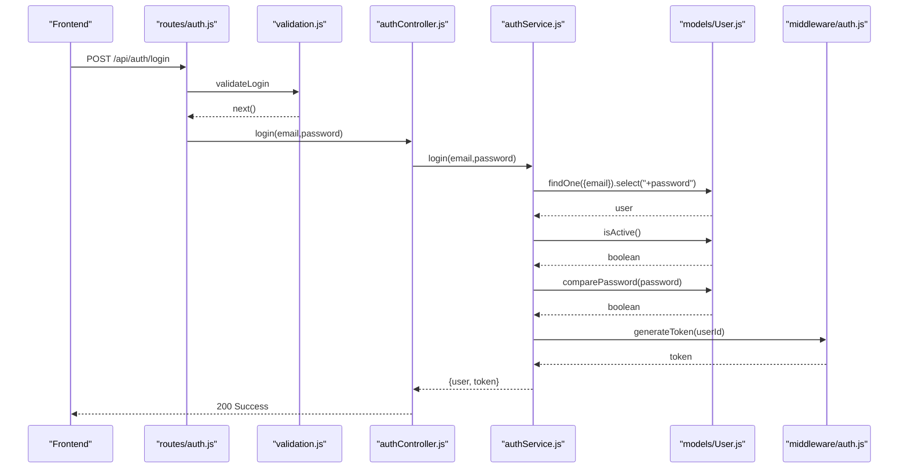
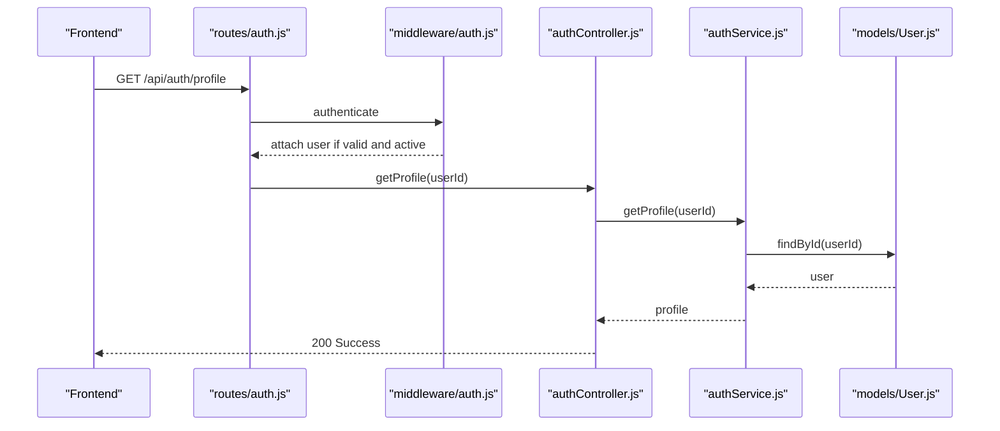
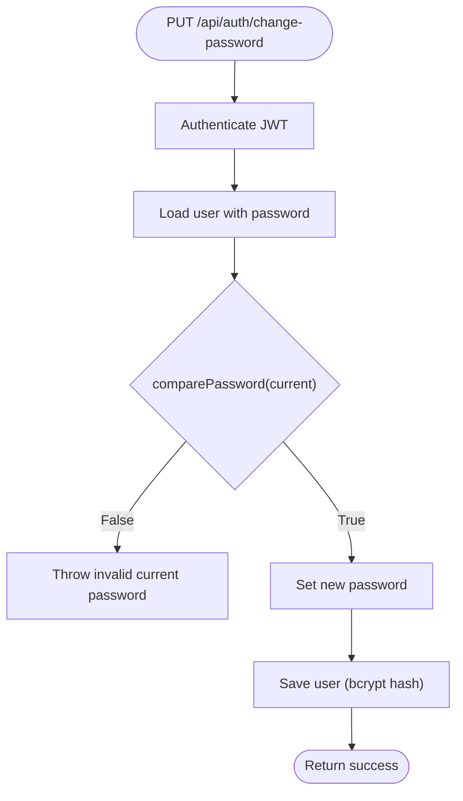
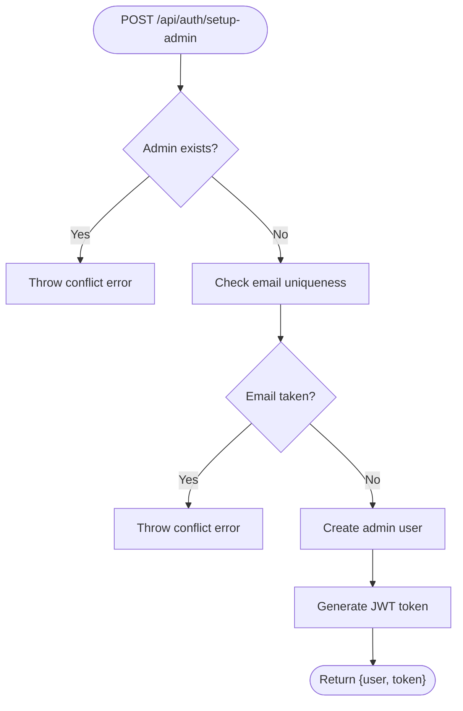
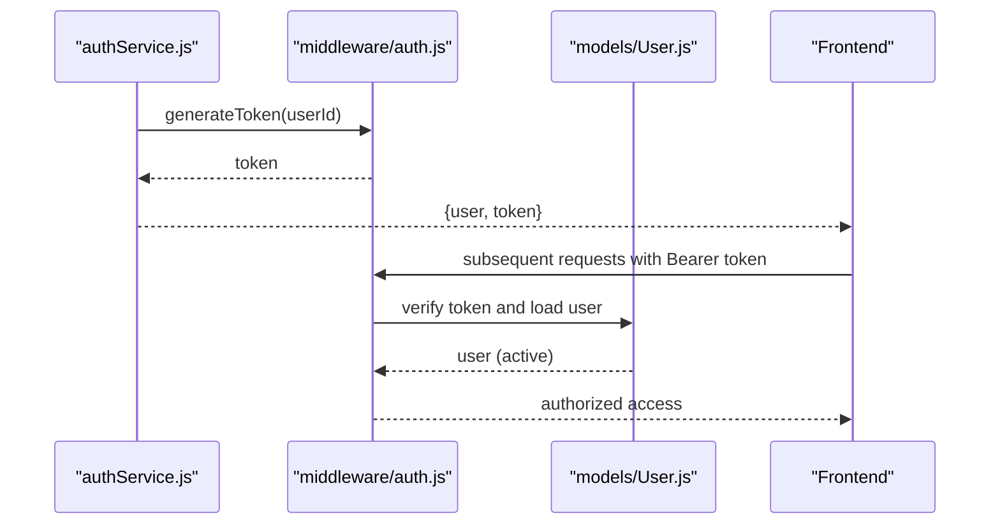
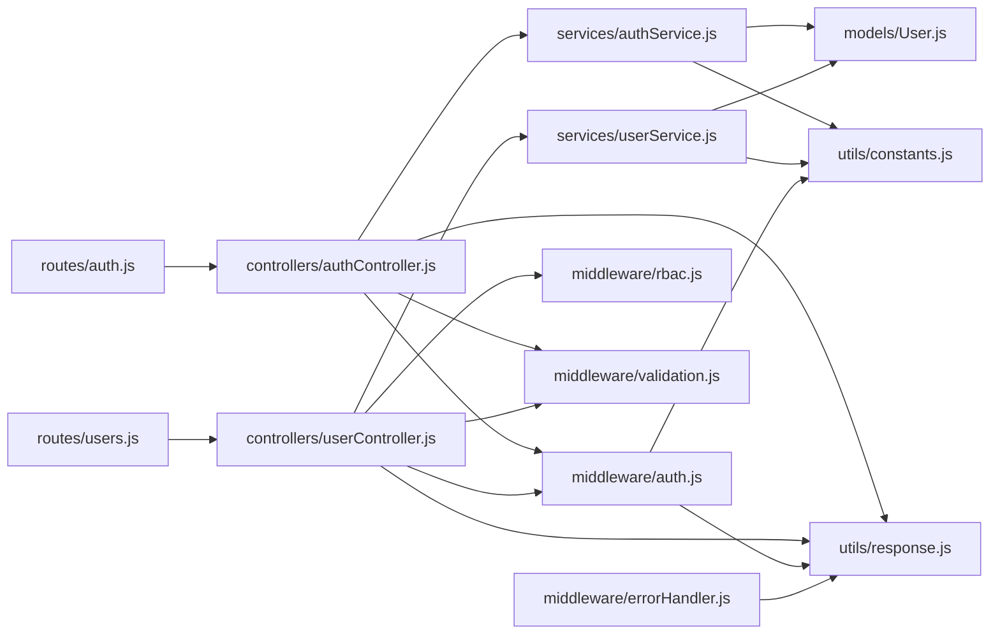

# User Authentication Workflow

<cite>
**Referenced Files in This Document**
- [authController.js](file://backend/controllers/authController.js)
- [authService.js](file://backend/services/authService.js)
- [auth.js](file://backend/routes/auth.js)
- [validation.js](file://backend/middleware/validation.js)
- [auth.js](file://backend/middleware/auth.js)
- [constants.js](file://backend/utils/constants.js)
- [response.js](file://backend/utils/response.js)
- [errorHandler.js](file://backend/middleware/errorHandler.js)
- [User.js](file://backend/models/User.js)
- [rbac.js](file://backend/middleware/rbac.js)
- [userController.js](file://backend/controllers/userController.js)
- [userService.js](file://backend/services/userService.js)
- [users.js](file://backend/routes/users.js)
- [seed.js](file://backend/scripts/seed.js)
- [auth.test.js](file://backend/tests/auth.test.js)
</cite>

## Table of Contents
1. [Introduction](#introduction)
2. [Project Structure](#project-structure)
3. [Core Components](#core-components)
4. [Architecture Overview](#architecture-overview)
5. [Detailed Component Analysis](#detailed-component-analysis)
6. [Dependency Analysis](#dependency-analysis)
7. [Performance Considerations](#performance-considerations)
8. [Troubleshooting Guide](#troubleshooting-guide)
9. [Conclusion](#conclusion)
10. [Appendices](#appendices)

## Introduction
This document explains the complete user authentication workflow for the backend system. It covers registration, login, profile retrieval, password changes, and initial admin setup. It also documents input validation, password hashing, token generation and verification, role-based access control, error handling, and integration patterns for frontend applications. Step-by-step authentication flows, error scenarios, and user state management are included to help developers implement secure and reliable authentication.

## Project Structure
The authentication system is organized around controllers, services, routes, middleware, models, and utilities. Controllers expose HTTP endpoints, services encapsulate business logic, middleware validates inputs and enforces authentication/authorization, models define schemas and hashing, and utilities standardize responses and constants.

**Diagram sources**
- [auth.js:1-49](file://backend/routes/auth.js#L1-L49)
- [users.js:1-64](file://backend/routes/users.js#L1-L64)
- [authController.js:1-114](file://backend/controllers/authController.js#L1-L114)
- [userController.js:1-152](file://backend/controllers/userController.js#L1-L152)
- [authService.js:1-195](file://backend/services/authService.js#L1-L195)
- [userService.js:1-276](file://backend/services/userService.js#L1-L276)
- [validation.js:1-309](file://backend/middleware/validation.js#L1-L309)
- [auth.js:1-116](file://backend/middleware/auth.js#L1-L116)
- [rbac.js:1-151](file://backend/middleware/rbac.js#L1-L151)
- [errorHandler.js:1-179](file://backend/middleware/errorHandler.js#L1-L179)
- [User.js:1-130](file://backend/models/User.js#L1-L130)
- [constants.js:1-81](file://backend/utils/constants.js#L1-L81)
- [response.js:1-101](file://backend/utils/response.js#L1-L101)
- [seed.js:1-132](file://backend/scripts/seed.js#L1-L132)

**Section sources**
- [auth.js:1-49](file://backend/routes/auth.js#L1-L49)
- [users.js:1-64](file://backend/routes/users.js#L1-L64)
- [authController.js:1-114](file://backend/controllers/authController.js#L1-L114)
- [userController.js:1-152](file://backend/controllers/userController.js#L1-L152)
- [authService.js:1-195](file://backend/services/authService.js#L1-L195)
- [userService.js:1-276](file://backend/services/userService.js#L1-L276)
- [validation.js:1-309](file://backend/middleware/validation.js#L1-L309)
- [auth.js:1-116](file://backend/middleware/auth.js#L1-L116)
- [rbac.js:1-151](file://backend/middleware/rbac.js#L1-L151)
- [errorHandler.js:1-179](file://backend/middleware/errorHandler.js#L1-L179)
- [User.js:1-130](file://backend/models/User.js#L1-L130)
- [constants.js:1-81](file://backend/utils/constants.js#L1-L81)
- [response.js:1-101](file://backend/utils/response.js#L1-L101)
- [seed.js:1-132](file://backend/scripts/seed.js#L1-L132)

## Core Components
- Authentication Controller: Exposes endpoints for registration, login, profile retrieval, password change, and initial admin setup.
- Authentication Service: Implements business logic for registration, login, profile retrieval, password change, and initial admin creation.
- Validation Middleware: Provides input validation for registration, login, user updates, and IDs.
- Authentication Middleware: Verifies JWT tokens and attaches the user to the request.
- RBAC Middleware: Enforces role-based permissions for protected routes.
- User Model: Defines schema, indexes, password hashing, and helper methods.
- Response Utilities: Standardizes success, error, validation, unauthorized, forbidden, and not-found responses.
- Error Handler: Centralizes error handling for validation, duplicates, casting, JWT errors, and unhandled conditions.
- Constants: Defines roles, statuses, permissions, pagination defaults, and JWT configuration.
- User Management: Separate controllers/services/routes for admin-managed user CRUD and status toggling.

**Section sources**
- [authController.js:1-114](file://backend/controllers/authController.js#L1-L114)
- [authService.js:1-195](file://backend/services/authService.js#L1-L195)
- [validation.js:1-309](file://backend/middleware/validation.js#L1-L309)
- [auth.js:1-116](file://backend/middleware/auth.js#L1-L116)
- [rbac.js:1-151](file://backend/middleware/rbac.js#L1-L151)
- [User.js:1-130](file://backend/models/User.js#L1-L130)
- [response.js:1-101](file://backend/utils/response.js#L1-L101)
- [errorHandler.js:1-179](file://backend/middleware/errorHandler.js#L1-L179)
- [constants.js:1-81](file://backend/utils/constants.js#L1-L81)
- [userController.js:1-152](file://backend/controllers/userController.js#L1-L152)
- [userService.js:1-276](file://backend/services/userService.js#L1-L276)

## Architecture Overview
The authentication workflow follows a layered architecture:
- Routes define endpoints and apply validation and authentication/authorization middleware.
- Controllers delegate to services and return standardized responses.
- Services interact with the User model, generate tokens, and enforce business rules.
- Middleware handles JWT verification, optional auth, input validation, and RBAC checks.
- Models provide schema, indexes, and password hashing via bcrypt.
- Utilities and error handler standardize responses and error propagation.

**Diagram sources**
- [auth.js:1-49](file://backend/routes/auth.js#L1-L49)
- [validation.js:1-309](file://backend/middleware/validation.js#L1-L309)
- [authController.js:1-114](file://backend/controllers/authController.js#L1-L114)
- [authService.js:1-195](file://backend/services/authService.js#L1-L195)
- [User.js:1-130](file://backend/models/User.js#L1-L130)
- [auth.js:1-116](file://backend/middleware/auth.js#L1-L116)

## Detailed Component Analysis

### Registration Process
- Endpoint: POST /api/auth/register
- Validation: Name, email, password, optional role.
- Business logic:
  - Check for existing user by email.
  - Default role to viewer if not provided.
  - Create user with hashed password (schema pre-save hook).
  - Generate JWT token.
  - Return user and token.
- Security:
  - Password hashing via bcrypt.
  - Unique email constraint enforced by schema and service check.
  - Validation prevents malformed inputs.

**Diagram sources**
- [auth.js:14-18](file://backend/routes/auth.js#L14-L18)
- [validation.js:32-60](file://backend/middleware/validation.js#L32-L60)
- [authService.js:15-51](file://backend/services/authService.js#L15-L51)
- [User.js:64-86](file://backend/models/User.js#L64-L86)
- [auth.js:100-109](file://backend/middleware/auth.js#L100-L109)

**Section sources**
- [auth.js:14-18](file://backend/routes/auth.js#L14-L18)
- [validation.js:32-60](file://backend/middleware/validation.js#L32-L60)
- [authService.js:15-51](file://backend/services/authService.js#L15-L51)
- [User.js:64-86](file://backend/models/User.js#L64-L86)
- [auth.js:100-109](file://backend/middleware/auth.js#L100-L109)

### Login Procedure
- Endpoint: POST /api/auth/login
- Validation: Email and password presence.
- Business logic:
  - Find user by email with password selected.
  - Check active status.
  - Compare password using bcrypt.
  - Generate JWT token.
  - Return user and token.
- Security:
  - Password comparison via bcrypt.
  - Active status enforcement.
  - Token generation with configured algorithm and expiry.

**Diagram sources**
- [auth.js:21-25](file://backend/routes/auth.js#L21-L25)
- [validation.js:65-78](file://backend/middleware/validation.js#L65-L78)
- [authController.js:32-46](file://backend/controllers/authController.js#L32-L46)
- [authService.js:59-93](file://backend/services/authService.js#L59-L93)
- [User.js:98-112](file://backend/models/User.js#L98-L112)
- [auth.js:100-109](file://backend/middleware/auth.js#L100-L109)

**Section sources**
- [auth.js:21-25](file://backend/routes/auth.js#L21-L25)
- [validation.js:65-78](file://backend/middleware/validation.js#L65-L78)
- [authController.js:32-46](file://backend/controllers/authController.js#L32-L46)
- [authService.js:59-93](file://backend/services/authService.js#L59-L93)
- [User.js:98-112](file://backend/models/User.js#L98-L112)
- [auth.js:100-109](file://backend/middleware/auth.js#L100-L109)

### Profile Management Operations
- Retrieve Profile: GET /api/auth/profile (private)
  - Requires valid JWT; attached user must be active.
  - Returns user profile fields.
- Admin User Management: GET/POST/PUT/DELETE /api/users (admin-only)
  - Protected by RBAC middleware.
  - Includes pagination, filtering, updating, soft deletion (set status to inactive), and toggling status.
  - Prevents deletion of the last active admin.

**Diagram sources**
- [auth.js:28-32](file://backend/routes/auth.js#L28-L32)
- [auth.js:14-59](file://backend/middleware/auth.js#L14-L59)
- [authController.js:52-66](file://backend/controllers/authController.js#L52-L66)
- [authService.js:100-116](file://backend/services/authService.js#L100-L116)
- [User.js:1-130](file://backend/models/User.js#L1-L130)

**Section sources**
- [auth.js:28-32](file://backend/routes/auth.js#L28-L32)
- [auth.js:14-59](file://backend/middleware/auth.js#L14-L59)
- [authController.js:52-66](file://backend/controllers/authController.js#L52-L66)
- [authService.js:100-116](file://backend/services/authService.js#L100-L116)
- [users.js:1-64](file://backend/routes/users.js#L1-L64)
- [rbac.js:1-151](file://backend/middleware/rbac.js#L1-L151)
- [userController.js:1-152](file://backend/controllers/userController.js#L1-L152)
- [userService.js:1-276](file://backend/services/userService.js#L1-L276)

### Password Change Functionality
- Endpoint: PUT /api/auth/change-password (private)
- Validation: None applied at route level; relies on controller/service logic.
- Business logic:
  - Authenticate user via JWT.
  - Load user with password selected.
  - Verify current password using bcrypt.
  - Update password (schema pre-save hashes automatically).
  - Save user and return success.

**Diagram sources**
- [auth.js:35-39](file://backend/routes/auth.js#L35-L39)
- [auth.js:14-59](file://backend/middleware/auth.js#L14-L59)
- [authController.js:72-86](file://backend/controllers/authController.js#L72-L86)
- [authService.js:125-144](file://backend/services/authService.js#L125-L144)
- [User.js:64-86](file://backend/models/User.js#L64-L86)

**Section sources**
- [auth.js:35-39](file://backend/routes/auth.js#L35-L39)
- [auth.js:14-59](file://backend/middleware/auth.js#L14-L59)
- [authController.js:72-86](file://backend/controllers/authController.js#L72-L86)
- [authService.js:125-144](file://backend/services/authService.js#L125-L144)
- [User.js:64-86](file://backend/models/User.js#L64-L86)

### Initial Admin Setup
- Endpoint: POST /api/auth/setup-admin (public)
- Business logic:
  - Ensure no admin exists.
  - Check email uniqueness.
  - Create admin user with default active status.
  - Generate JWT token.
  - Return admin user and token.
- Purpose: One-time setup to bootstrap the system with an admin.

**Diagram sources**
- [auth.js:42-46](file://backend/routes/auth.js#L42-L46)
- [authController.js:92-105](file://backend/controllers/authController.js#L92-L105)
- [authService.js:151-186](file://backend/services/authService.js#L151-L186)
- [constants.js:5-16](file://backend/utils/constants.js#L5-L16)

**Section sources**
- [auth.js:42-46](file://backend/routes/auth.js#L42-L46)
- [authController.js:92-105](file://backend/controllers/authController.js#L92-L105)
- [authService.js:151-186](file://backend/services/authService.js#L151-L186)
- [constants.js:5-16](file://backend/utils/constants.js#L5-L16)

### Token Generation and Session Establishment
- Token generation uses JWT with HS256 algorithm and 7-day expiry by default.
- Tokens are attached to login and registration responses.
- Authentication middleware verifies tokens, attaches user to request, and enforces active status.

**Diagram sources**
- [authService.js:38-50](file://backend/services/authService.js#L38-L50)
- [auth.js:100-109](file://backend/middleware/auth.js#L100-L109)
- [User.js:98-112](file://backend/models/User.js#L98-L112)
- [constants.js:66-70](file://backend/utils/constants.js#L66-L70)

**Section sources**
- [authService.js:38-50](file://backend/services/authService.js#L38-L50)
- [auth.js:100-109](file://backend/middleware/auth.js#L100-L109)
- [User.js:98-112](file://backend/models/User.js#L98-L112)
- [constants.js:66-70](file://backend/utils/constants.js#L66-L70)

### Input Validation and Error Handling
- Validation:
  - Registration: name required (<=100 chars), email valid and normalized, password required (>=6).
  - Login: email and password required.
  - User updates: ID validation, name/email validation, role/status validation.
- Error handling:
  - Centralized error handler converts validation, duplicate key, cast, and JWT errors to standardized responses.
  - Validation errors return structured arrays with field, message, and value.

**Section sources**
- [validation.js:32-60](file://backend/middleware/validation.js#L32-L60)
- [validation.js:65-78](file://backend/middleware/validation.js#L65-L78)
- [validation.js:83-114](file://backend/middleware/validation.js#L83-L114)
- [errorHandler.js:25-84](file://backend/middleware/errorHandler.js#L25-L84)
- [response.js:42-49](file://backend/utils/response.js#L42-L49)

### Role-Based Access Control (RBAC)
- Enforces permissions for user management and other protected actions.
- Examples:
  - requireAdmin: admin-only routes.
  - canManageUsers: MANAGE_USERS permission.
  - requireAnyRole: allows all authenticated roles.
- Combined with authentication middleware to ensure active, authenticated users.

**Section sources**
- [rbac.js:14-33](file://backend/middleware/rbac.js#L14-L33)
- [rbac.js:40-66](file://backend/middleware/rbac.js#L40-L66)
- [users.js:19-61](file://backend/routes/users.js#L19-L61)

## Dependency Analysis
The authentication system exhibits clean separation of concerns:
- Routes depend on controllers and middleware.
- Controllers depend on services and response utilities.
- Services depend on models and JWT utilities.
- Middleware depends on models, constants, and response utilities.
- RBAC middleware depends on constants for roles and permissions.
- Error handler centralizes error translation.

**Diagram sources**
- [auth.js:1-49](file://backend/routes/auth.js#L1-L49)
- [users.js:1-64](file://backend/routes/users.js#L1-L64)
- [authController.js:1-114](file://backend/controllers/authController.js#L1-L114)
- [userController.js:1-152](file://backend/controllers/userController.js#L1-L152)
- [authService.js:1-195](file://backend/services/authService.js#L1-L195)
- [userService.js:1-276](file://backend/services/userService.js#L1-L276)
- [User.js:1-130](file://backend/models/User.js#L1-L130)
- [auth.js:1-116](file://backend/middleware/auth.js#L1-L116)
- [rbac.js:1-151](file://backend/middleware/rbac.js#L1-L151)
- [validation.js:1-309](file://backend/middleware/validation.js#L1-L309)
- [constants.js:1-81](file://backend/utils/constants.js#L1-L81)
- [response.js:1-101](file://backend/utils/response.js#L1-L101)
- [errorHandler.js:1-179](file://backend/middleware/errorHandler.js#L1-L179)

**Section sources**
- [auth.js:1-49](file://backend/routes/auth.js#L1-L49)
- [users.js:1-64](file://backend/routes/users.js#L1-L64)
- [authController.js:1-114](file://backend/controllers/authController.js#L1-L114)
- [userController.js:1-152](file://backend/controllers/userController.js#L1-L152)
- [authService.js:1-195](file://backend/services/authService.js#L1-L195)
- [userService.js:1-276](file://backend/services/userService.js#L1-L276)
- [User.js:1-130](file://backend/models/User.js#L1-L130)
- [auth.js:1-116](file://backend/middleware/auth.js#L1-L116)
- [rbac.js:1-151](file://backend/middleware/rbac.js#L1-L151)
- [validation.js:1-309](file://backend/middleware/validation.js#L1-L309)
- [constants.js:1-81](file://backend/utils/constants.js#L1-L81)
- [response.js:1-101](file://backend/utils/response.js#L1-L101)
- [errorHandler.js:1-179](file://backend/middleware/errorHandler.js#L1-L179)

## Performance Considerations
- Password hashing uses bcrypt with a salt; hashing occurs on save via a pre-save hook, ensuring consistent and secure storage.
- Database indexes on email, role, and status improve query performance for authentication and filtering.
- Pagination defaults and limits prevent excessive loads on user listing endpoints.
- JWT token verification is lightweight; ensure secret rotation and secure storage in production.

[No sources needed since this section provides general guidance]

## Troubleshooting Guide
Common issues and resolutions:
- Invalid email or password during login:
  - Cause: Incorrect credentials or user does not exist.
  - Resolution: Confirm credentials; ensure user is active.
- Account inactive:
  - Cause: User status set to inactive.
  - Resolution: Contact administrator to activate the account.
- Token errors:
  - Expired token: Request a new token after re-authentication.
  - Invalid token: Ensure correct JWT secret and algorithm configuration.
- Validation failures:
  - Registration/Login: Check required fields and formats.
  - User updates: Ensure ID is a valid ObjectId and values are within allowed enums.
- Duplicate email:
  - Registration or user creation fails if email already exists.
- Last admin protection:
  - Cannot delete or deactivate the last active admin.
- Test accounts and seeding:
  - Use seed script to provision test users and verify flows.

**Section sources**
- [authService.js:63-77](file://backend/services/authService.js#L63-L77)
- [authService.js:128-141](file://backend/services/authService.js#L128-L141)
- [authService.js:155-164](file://backend/services/authService.js#L155-L164)
- [auth.js:49-54](file://backend/middleware/auth.js#L49-L54)
- [errorHandler.js:67-84](file://backend/middleware/errorHandler.js#L67-L84)
- [validation.js:14-26](file://backend/middleware/validation.js#L14-L26)
- [userService.js:168-174](file://backend/services/userService.js#L168-L174)
- [seed.js:14-43](file://backend/scripts/seed.js#L14-L43)

## Conclusion
The authentication system provides a secure, modular, and maintainable foundation for user registration, login, profile management, password changes, and initial admin setup. It leverages bcrypt for password hashing, JWT for tokenization, express-validator for input validation, and RBAC for access control. Standardized responses and centralized error handling improve reliability and developer experience. Following the documented flows and best practices ensures robust integration with frontend applications.

[No sources needed since this section summarizes without analyzing specific files]

## Appendices

### Step-by-Step Authentication Flows

- Registration
  - Send POST /api/auth/register with name, email, password, optional role.
  - Validation middleware enforces constraints.
  - Service creates user and generates token.
  - Response includes user and token.

- Login
  - Send POST /api/auth/login with email and password.
  - Validation middleware enforces presence.
  - Service verifies credentials and active status.
  - Response includes user and token.

- Profile Retrieval
  - Send GET /api/auth/profile with Bearer token.
  - Authentication middleware verifies token and active status.
  - Service returns profile data.

- Password Change
  - Send PUT /api/auth/change-password with currentPassword and newPassword.
  - Authentication middleware verifies token.
  - Service validates current password and updates to new password.

- Initial Admin Setup
  - Send POST /api/auth/setup-admin with name, email, password.
  - Service ensures no admin exists and email is unique.
  - Creates admin and returns user and token.

**Section sources**
- [auth.js:14-46](file://backend/routes/auth.js#L14-L46)
- [validation.js:32-78](file://backend/middleware/validation.js#L32-L78)
- [authController.js:13-105](file://backend/controllers/authController.js#L13-L105)
- [authService.js:15-186](file://backend/services/authService.js#L15-L186)
- [auth.js:14-59](file://backend/middleware/auth.js#L14-L59)

### Security Best Practices
- Use HTTPS in production to protect tokens and credentials.
- Rotate JWT secrets regularly and store securely.
- Enforce strong password policies and consider multi-factor authentication.
- Limit token expiry and implement refresh token strategies if needed.
- Sanitize and validate all inputs; avoid exposing sensitive fields.
- Regularly audit roles and permissions; monitor failed login attempts.

[No sources needed since this section provides general guidance]

### Integration Patterns for Frontend Applications
- Store tokens securely (HttpOnly cookies or secure storage with strict SameSite attributes).
- Automatically attach Authorization: Bearer <token> headers for private endpoints.
- Handle token expiration gracefully by prompting re-login.
- Display structured validation errors returned by the validationErrorResponse utility.
- Use standardized response fields (success, message, data, error) for consistent UI handling.

**Section sources**
- [response.js:12-49](file://backend/utils/response.js#L12-L49)
- [auth.js:18-26](file://backend/middleware/auth.js#L18-L26)