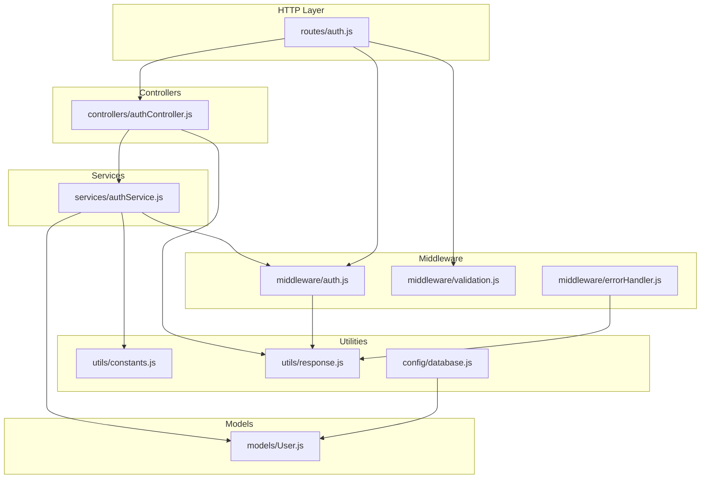
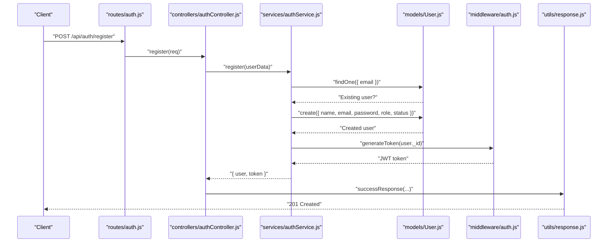
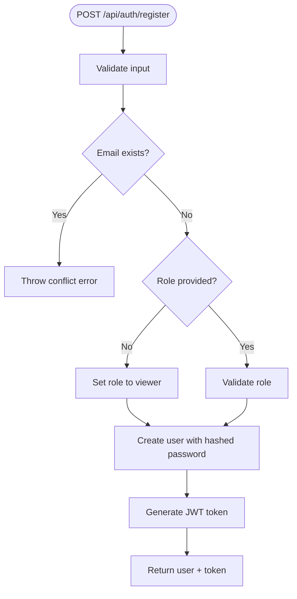
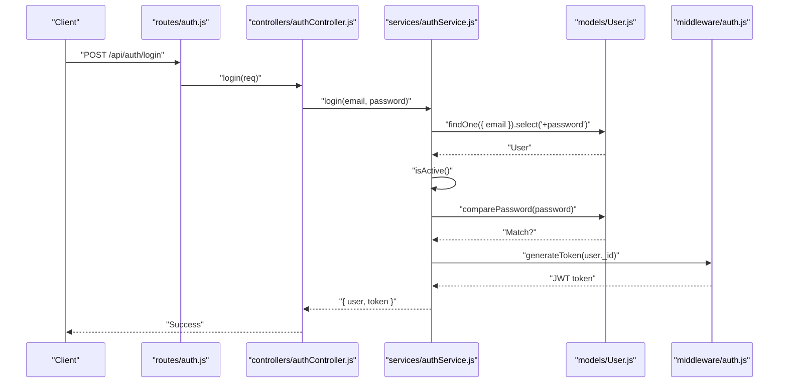
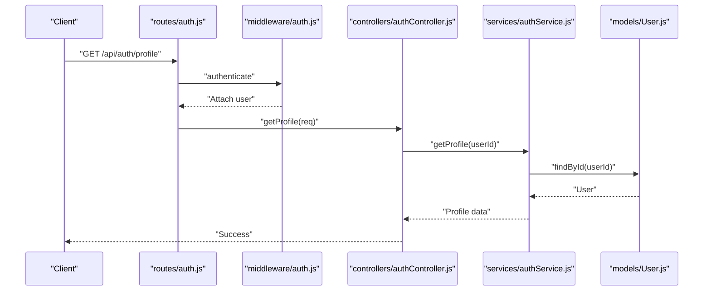
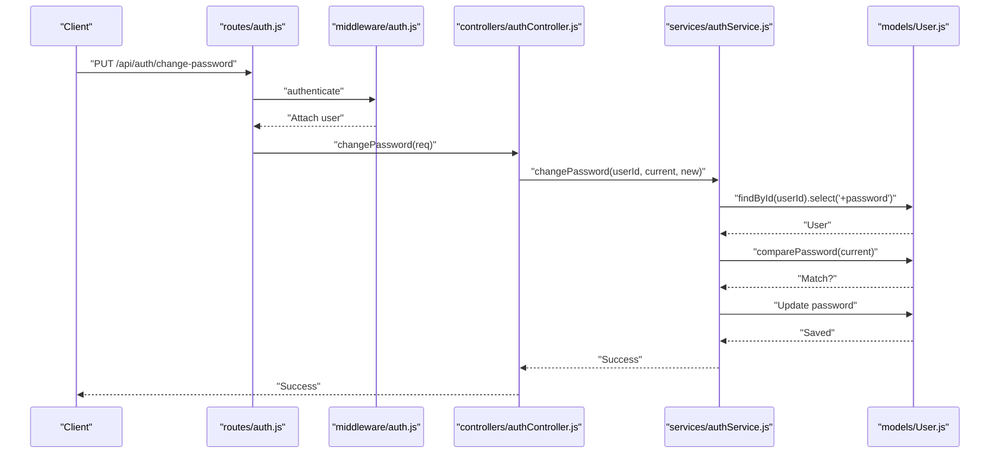
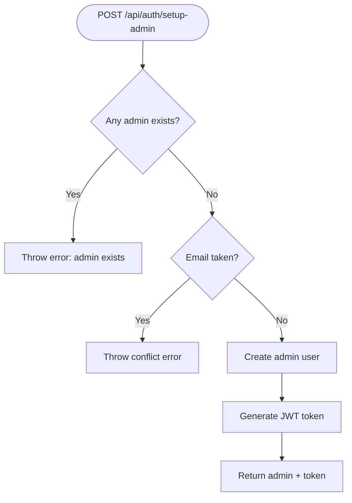
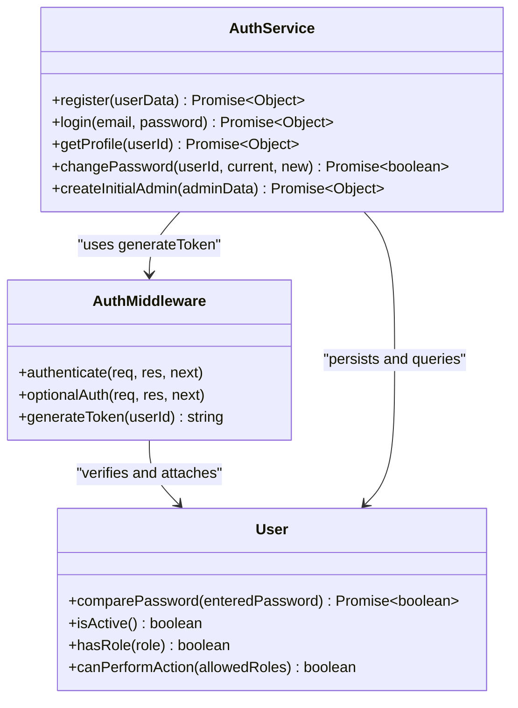
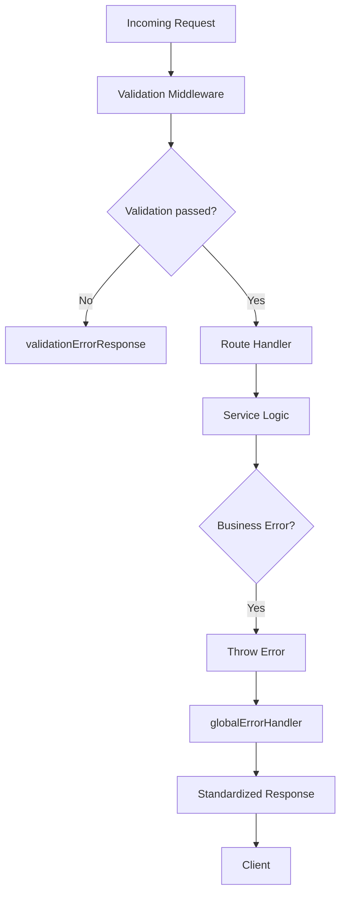
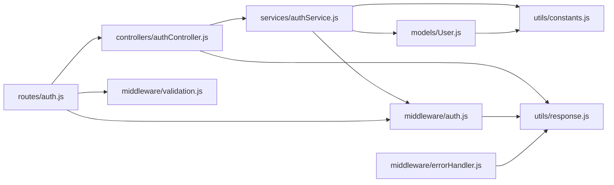

# Authentication Service

<cite>
**Referenced Files in This Document**
- [server.js](file://backend/server.js)
- [routes/auth.js](file://backend/routes/auth.js)
- [controllers/authController.js](file://backend/controllers/authController.js)
- [services/authService.js](file://backend/services/authService.js)
- [models/User.js](file://backend/models/User.js)
- [middleware/auth.js](file://backend/middleware/auth.js)
- [middleware/validation.js](file://backend/middleware/validation.js)
- [middleware/errorHandler.js](file://backend/middleware/errorHandler.js)
- [utils/constants.js](file://backend/utils/constants.js)
- [utils/response.js](file://backend/utils/response.js)
- [config/database.js](file://backend/config/database.js)
- [scripts/seed.js](file://backend/scripts/seed.js)
- [tests/auth.test.js](file://backend/tests/auth.test.js)
</cite>

## Table of Contents
1. [Introduction](#introduction)
2. [Project Structure](#project-structure)
3. [Core Components](#core-components)
4. [Architecture Overview](#architecture-overview)
5. [Detailed Component Analysis](#detailed-component-analysis)
6. [Dependency Analysis](#dependency-analysis)
7. [Performance Considerations](#performance-considerations)
8. [Troubleshooting Guide](#troubleshooting-guide)
9. [Conclusion](#conclusion)
10. [Appendices](#appendices)

## Introduction
This document provides comprehensive documentation for the authentication service implementation. It covers user registration, login, profile retrieval, password change, and initial admin creation. It explains validation, role assignment, password hashing, JWT token generation, and middleware integration. It also includes error handling patterns, security considerations, and typical usage scenarios.

## Project Structure
The authentication service is organized around a layered architecture:
- Routes define HTTP endpoints and apply validation and authentication middleware.
- Controllers handle HTTP requests and delegate to services.
- Services encapsulate business logic for registration, login, profile retrieval, password change, and initial admin creation.
- Models define the User schema, including validation, hashing, and helper methods.
- Middleware handles JWT authentication, optional authentication, token generation, input validation, and centralized error handling.
- Utilities provide constants, standardized responses, and database configuration.
- Scripts and tests support seeding and testing.

**Diagram sources**
- [routes/auth.js:1-49](file://backend/routes/auth.js#L1-L49)
- [controllers/authController.js:1-114](file://backend/controllers/authController.js#L1-L114)
- [services/authService.js:1-195](file://backend/services/authService.js#L1-L195)
- [models/User.js:1-130](file://backend/models/User.js#L1-L130)
- [middleware/auth.js:1-116](file://backend/middleware/auth.js#L1-L116)
- [middleware/validation.js:1-309](file://backend/middleware/validation.js#L1-L309)
- [middleware/errorHandler.js:1-179](file://backend/middleware/errorHandler.js#L1-L179)
- [utils/constants.js:1-81](file://backend/utils/constants.js#L1-L81)
- [utils/response.js:1-101](file://backend/utils/response.js#L1-L101)
- [config/database.js:1-43](file://backend/config/database.js#L1-L43)

**Section sources**
- [server.js:1-113](file://backend/server.js#L1-L113)
- [routes/auth.js:1-49](file://backend/routes/auth.js#L1-L49)

## Core Components
- Routes: Define public and private endpoints for authentication and apply validation and authentication middleware.
- Controllers: Thin HTTP handlers that call service methods and return standardized responses.
- Services: Encapsulate business logic for registration, login, profile retrieval, password change, and initial admin creation.
- Model: User schema with validation, password hashing, and helper methods.
- Middleware: Authentication, optional authentication, token generation, input validation, and error handling.
- Utilities: Constants for roles, statuses, permissions, JWT configuration; standardized response helpers; database configuration.

**Section sources**
- [routes/auth.js:1-49](file://backend/routes/auth.js#L1-L49)
- [controllers/authController.js:1-114](file://backend/controllers/authController.js#L1-L114)
- [services/authService.js:1-195](file://backend/services/authService.js#L1-L195)
- [models/User.js:1-130](file://backend/models/User.js#L1-L130)
- [middleware/auth.js:1-116](file://backend/middleware/auth.js#L1-L116)
- [middleware/validation.js:1-309](file://backend/middleware/validation.js#L1-L309)
- [middleware/errorHandler.js:1-179](file://backend/middleware/errorHandler.js#L1-L179)
- [utils/constants.js:1-81](file://backend/utils/constants.js#L1-L81)
- [utils/response.js:1-101](file://backend/utils/response.js#L1-L101)
- [config/database.js:1-43](file://backend/config/database.js#L1-L43)

## Architecture Overview
The authentication flow spans HTTP routes, controllers, services, models, and middleware. Requests pass through validation and authentication middleware before reaching controllers, which delegate to services. Services interact with the model for persistence and use middleware for JWT token generation. Errors are handled centrally.

**Diagram sources**
- [routes/auth.js:18](file://backend/routes/auth.js#L18)
- [controllers/authController.js:13-26](file://backend/controllers/authController.js#L13-L26)
- [services/authService.js:15-51](file://backend/services/authService.js#L15-L51)
- [models/User.js:10-54](file://backend/models/User.js#L10-L54)
- [middleware/auth.js:100-109](file://backend/middleware/auth.js#L100-L109)
- [utils/response.js:12-19](file://backend/utils/response.js#L12-L19)

## Detailed Component Analysis

### Registration Workflow
- Input validation ensures name, email, password, and optional role meet criteria.
- Duplicate email check prevents conflicts.
- Role defaults to viewer if not provided; otherwise validated against constants.
- User is created with hashed password and active status.
- JWT token is generated and returned alongside user data.

**Diagram sources**
- [routes/auth.js:18](file://backend/routes/auth.js#L18)
- [middleware/validation.js:32-60](file://backend/middleware/validation.js#L32-L60)
- [services/authService.js:15-51](file://backend/services/authService.js#L15-L51)
- [models/User.js:28-33](file://backend/models/User.js#L28-L33)
- [middleware/auth.js:100-109](file://backend/middleware/auth.js#L100-L109)

**Section sources**
- [routes/auth.js:18](file://backend/routes/auth.js#L18)
- [middleware/validation.js:32-60](file://backend/middleware/validation.js#L32-L60)
- [services/authService.js:15-51](file://backend/services/authService.js#L15-L51)
- [models/User.js:28-33](file://backend/models/User.js#L28-L33)

### Login Workflow
- Validates email and password presence.
- Finds user with password included.
- Checks active status.
- Compares password using bcrypt.
- Generates JWT token upon success.

**Diagram sources**
- [routes/auth.js:25](file://backend/routes/auth.js#L25)
- [controllers/authController.js:32-46](file://backend/controllers/authController.js#L32-L46)
- [services/authService.js:59-93](file://backend/services/authService.js#L59-L93)
- [models/User.js:84-86](file://backend/models/User.js#L84-L86)
- [middleware/auth.js:100-109](file://backend/middleware/auth.js#L100-L109)

**Section sources**
- [routes/auth.js:25](file://backend/routes/auth.js#L25)
- [controllers/authController.js:32-46](file://backend/controllers/authController.js#L32-L46)
- [services/authService.js:59-93](file://backend/services/authService.js#L59-L93)
- [models/User.js:84-86](file://backend/models/User.js#L84-L86)

### Profile Retrieval
- Requires authentication middleware.
- Fetches user by ID and returns sanitized profile data.

**Diagram sources**
- [routes/auth.js:32](file://backend/routes/auth.js#L32)
- [middleware/auth.js:14-59](file://backend/middleware/auth.js#L14-L59)
- [controllers/authController.js:52-66](file://backend/controllers/authController.js#L52-L66)
- [services/authService.js:100-116](file://backend/services/authService.js#L100-L116)
- [models/User.js:101-103](file://backend/models/User.js#L101-L103)

**Section sources**
- [routes/auth.js:32](file://backend/routes/auth.js#L32)
- [middleware/auth.js:14-59](file://backend/middleware/auth.js#L14-L59)
- [controllers/authController.js:52-66](file://backend/controllers/authController.js#L52-L66)
- [services/authService.js:100-116](file://backend/services/authService.js#L100-L116)

### Password Change
- Requires authentication middleware.
- Verifies current password using bcrypt.
- Updates password and saves user.

**Diagram sources**
- [routes/auth.js:39](file://backend/routes/auth.js#L39)
- [middleware/auth.js:14-59](file://backend/middleware/auth.js#L14-L59)
- [controllers/authController.js:72-86](file://backend/controllers/authController.js#L72-L86)
- [services/authService.js:125-144](file://backend/services/authService.js#L125-L144)
- [models/User.js:84-86](file://backend/models/User.js#L84-L86)

**Section sources**
- [routes/auth.js:39](file://backend/routes/auth.js#L39)
- [middleware/auth.js:14-59](file://backend/middleware/auth.js#L14-L59)
- [controllers/authController.js:72-86](file://backend/controllers/authController.js#L72-L86)
- [services/authService.js:125-144](file://backend/services/authService.js#L125-L144)

### Initial Admin Creation
- Enforces one-time setup by checking for existing admin.
- Validates uniqueness of email.
- Creates admin with admin role and active status.
- Generates JWT token.

**Diagram sources**
- [routes/auth.js:46](file://backend/routes/auth.js#L46)
- [services/authService.js:151-186](file://backend/services/authService.js#L151-L186)
- [models/User.js:34-49](file://backend/models/User.js#L34-L49)
- [middleware/auth.js:100-109](file://backend/middleware/auth.js#L100-L109)

**Section sources**
- [routes/auth.js:46](file://backend/routes/auth.js#L46)
- [services/authService.js:151-186](file://backend/services/authService.js#L151-L186)
- [models/User.js:34-49](file://backend/models/User.js#L34-L49)

### JWT Token Generation and Middleware
- Token payload contains user ID.
- Expiration and algorithm configured via constants and environment variables.
- Authentication middleware verifies token, attaches user, and enforces active status.
- Optional authentication attaches user if present and valid, otherwise proceeds without user.

**Diagram sources**
- [middleware/auth.js:14-59](file://backend/middleware/auth.js#L14-L59)
- [middleware/auth.js:64-93](file://backend/middleware/auth.js#L64-L93)
- [middleware/auth.js:100-109](file://backend/middleware/auth.js#L100-L109)
- [services/authService.js:15-51](file://backend/services/authService.js#L15-L51)
- [services/authService.js:59-93](file://backend/services/authService.js#L59-L93)
- [services/authService.js:100-116](file://backend/services/authService.js#L100-L116)
- [services/authService.js:125-144](file://backend/services/authService.js#L125-L144)
- [services/authService.js:151-186](file://backend/services/authService.js#L151-L186)
- [models/User.js:84-86](file://backend/models/User.js#L84-L86)
- [models/User.js:101-103](file://backend/models/User.js#L101-L103)

**Section sources**
- [middleware/auth.js:14-59](file://backend/middleware/auth.js#L14-L59)
- [middleware/auth.js:64-93](file://backend/middleware/auth.js#L64-L93)
- [middleware/auth.js:100-109](file://backend/middleware/auth.js#L100-L109)
- [services/authService.js:15-51](file://backend/services/authService.js#L15-L51)
- [services/authService.js:59-93](file://backend/services/authService.js#L59-L93)
- [services/authService.js:100-116](file://backend/services/authService.js#L100-L116)
- [services/authService.js:125-144](file://backend/services/authService.js#L125-L144)
- [services/authService.js:151-186](file://backend/services/authService.js#L151-L186)
- [models/User.js:84-86](file://backend/models/User.js#L84-L86)
- [models/User.js:101-103](file://backend/models/User.js#L101-L103)

### Validation and Error Handling Patterns
- Validation middleware enforces field presence, length, format, and allowed values; returns structured validation errors.
- Centralized error handler converts Mongoose validation/duplicate/cast errors and JWT errors into standardized responses.
- Authentication middleware returns unauthorized responses for missing/expired/invalid tokens and inactive accounts.

**Diagram sources**
- [middleware/validation.js:13-27](file://backend/middleware/validation.js#L13-L27)
- [middleware/errorHandler.js:89-145](file://backend/middleware/errorHandler.js#L89-L145)
- [utils/response.js:42-49](file://backend/utils/response.js#L42-L49)
- [middleware/auth.js:24-58](file://backend/middleware/auth.js#L24-L58)

**Section sources**
- [middleware/validation.js:13-27](file://backend/middleware/validation.js#L13-L27)
- [middleware/errorHandler.js:89-145](file://backend/middleware/errorHandler.js#L89-L145)
- [utils/response.js:42-49](file://backend/utils/response.js#L42-L49)
- [middleware/auth.js:24-58](file://backend/middleware/auth.js#L24-L58)

## Dependency Analysis
- Routes depend on controllers and middleware.
- Controllers depend on services and response utilities.
- Services depend on models, constants, and auth middleware.
- Models depend on constants and bcrypt.
- Middleware depends on JWT, models, and response utilities.
- Error handler depends on response utilities.

**Diagram sources**
- [routes/auth.js:1-49](file://backend/routes/auth.js#L1-L49)
- [controllers/authController.js:1-114](file://backend/controllers/authController.js#L1-L114)
- [services/authService.js:1-195](file://backend/services/authService.js#L1-L195)
- [models/User.js:1-130](file://backend/models/User.js#L1-L130)
- [middleware/auth.js:1-116](file://backend/middleware/auth.js#L1-L116)
- [middleware/validation.js:1-309](file://backend/middleware/validation.js#L1-L309)
- [middleware/errorHandler.js:1-179](file://backend/middleware/errorHandler.js#L1-L179)
- [utils/constants.js:1-81](file://backend/utils/constants.js#L1-L81)
- [utils/response.js:1-101](file://backend/utils/response.js#L1-L101)

**Section sources**
- [routes/auth.js:1-49](file://backend/routes/auth.js#L1-L49)
- [controllers/authController.js:1-114](file://backend/controllers/authController.js#L1-L114)
- [services/authService.js:1-195](file://backend/services/authService.js#L1-L195)
- [models/User.js:1-130](file://backend/models/User.js#L1-L130)
- [middleware/auth.js:1-116](file://backend/middleware/auth.js#L1-L116)
- [middleware/validation.js:1-309](file://backend/middleware/validation.js#L1-L309)
- [middleware/errorHandler.js:1-179](file://backend/middleware/errorHandler.js#L1-L179)
- [utils/constants.js:1-81](file://backend/utils/constants.js#L1-L81)
- [utils/response.js:1-101](file://backend/utils/response.js#L1-L101)

## Performance Considerations
- Password hashing uses a cost factor suitable for production; ensure environment variables are configured appropriately.
- Indexes on email, role, and status improve query performance.
- Token generation is lightweight; avoid unnecessary token refreshes.
- Validation middleware short-circuits early on errors to reduce downstream processing.
- Consider rate limiting for login attempts to mitigate brute force attacks.

[No sources needed since this section provides general guidance]

## Troubleshooting Guide
Common issues and resolutions:
- Invalid email or password during login: Ensure credentials match and user is active.
- Account inactive: Activate the user or contact administrator.
- Missing or invalid JWT token: Provide a valid Bearer token; check expiration.
- Validation errors: Review field constraints and allowed values.
- Duplicate email: Use a unique email address.
- Cast errors: Ensure IDs are valid ObjectId format.

**Section sources**
- [services/authService.js:63-77](file://backend/services/authService.js#L63-L77)
- [services/authService.js:128-137](file://backend/services/authService.js#L128-L137)
- [middleware/auth.js:24-58](file://backend/middleware/auth.js#L24-L58)
- [middleware/validation.js:13-27](file://backend/middleware/validation.js#L13-L27)
- [middleware/errorHandler.js:102-136](file://backend/middleware/errorHandler.js#L102-L136)

## Conclusion
The authentication service follows a clean layered architecture with explicit separation of concerns. It enforces strong validation, secure password handling, robust JWT-based authentication, and centralized error handling. The design supports extensibility and maintainability while providing clear integration points for middleware and services.

[No sources needed since this section summarizes without analyzing specific files]

## Appendices

### Typical Usage Scenarios
- Register a new user: POST /api/auth/register with name, email, password, optional role.
- Login: POST /api/auth/login with email and password.
- Retrieve profile: GET /api/auth/profile with Authorization: Bearer <token>.
- Change password: PUT /api/auth/change-password with currentPassword and newPassword.
- Setup initial admin: POST /api/auth/setup-admin with name, email, password.

**Section sources**
- [routes/auth.js:18](file://backend/routes/auth.js#L18)
- [routes/auth.js:25](file://backend/routes/auth.js#L25)
- [routes/auth.js:32](file://backend/routes/auth.js#L32)
- [routes/auth.js:39](file://backend/routes/auth.js#L39)
- [routes/auth.js:46](file://backend/routes/auth.js#L46)

### Integration with Authentication Middleware
- Apply authenticate to private routes to enforce JWT verification and active status.
- Use optionalAuth for routes that should function regardless of token validity.

**Section sources**
- [routes/auth.js:32](file://backend/routes/auth.js#L32)
- [routes/auth.js:39](file://backend/routes/auth.js#L39)
- [middleware/auth.js:14-59](file://backend/middleware/auth.js#L14-L59)
- [middleware/auth.js:64-93](file://backend/middleware/auth.js#L64-L93)

### Security Considerations
- Passwords are hashed using bcrypt before storage.
- Password fields are excluded from default queries; included only when necessary for comparison.
- Active status checked during login and middleware to prevent access for inactive users.
- JWT secret and algorithm configured via environment variables and constants.

**Section sources**
- [models/User.js:28-33](file://backend/models/User.js#L28-L33)
- [models/User.js:64-77](file://backend/models/User.js#L64-L77)
- [services/authService.js:67-70](file://backend/services/authService.js#L67-L70)
- [middleware/auth.js:42-44](file://backend/middleware/auth.js#L42-L44)
- [utils/constants.js:67-70](file://backend/utils/constants.js#L67-L70)

### Testing Notes
- Tests cover registration, login, and profile retrieval flows.
- Test setup cleans up test users to avoid conflicts.

**Section sources**
- [tests/auth.test.js:42-58](file://backend/tests/auth.test.js#L42-L58)
- [tests/auth.test.js:65-84](file://backend/tests/auth.test.js#L65-L84)
- [tests/auth.test.js:94-110](file://backend/tests/auth.test.js#L94-L110)