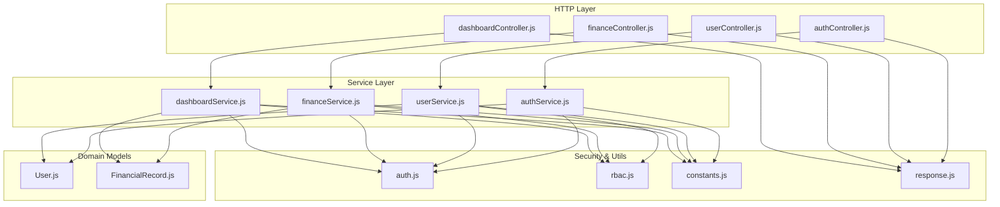
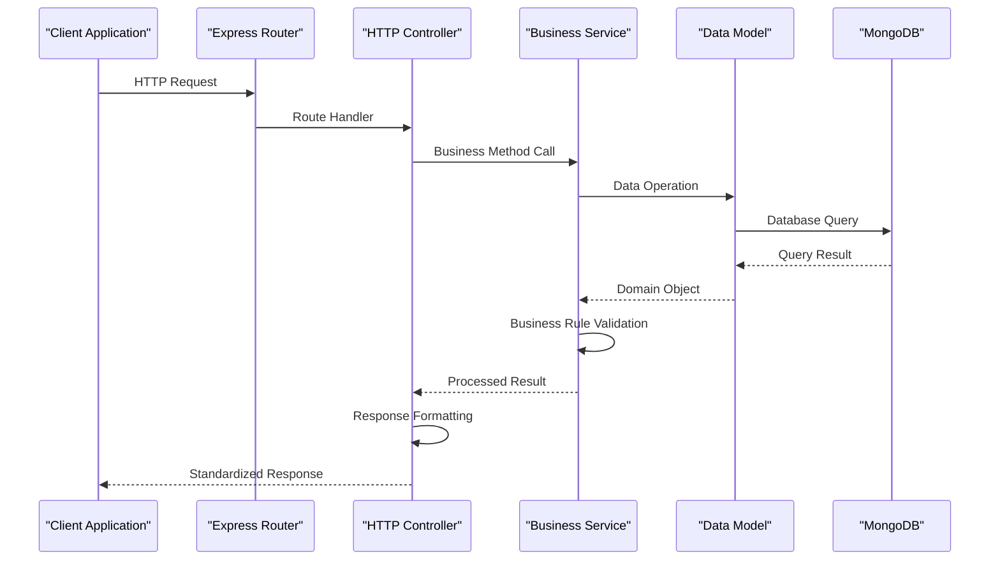
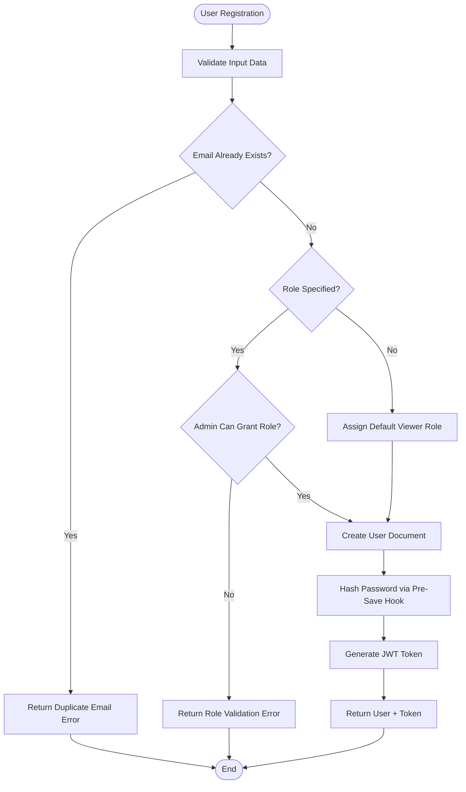
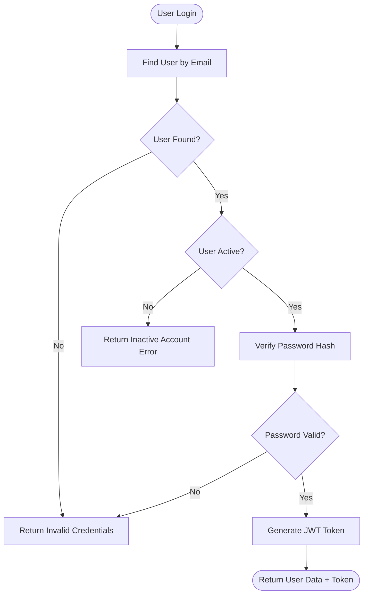
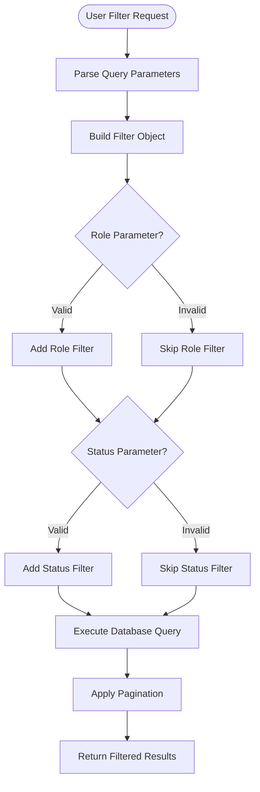
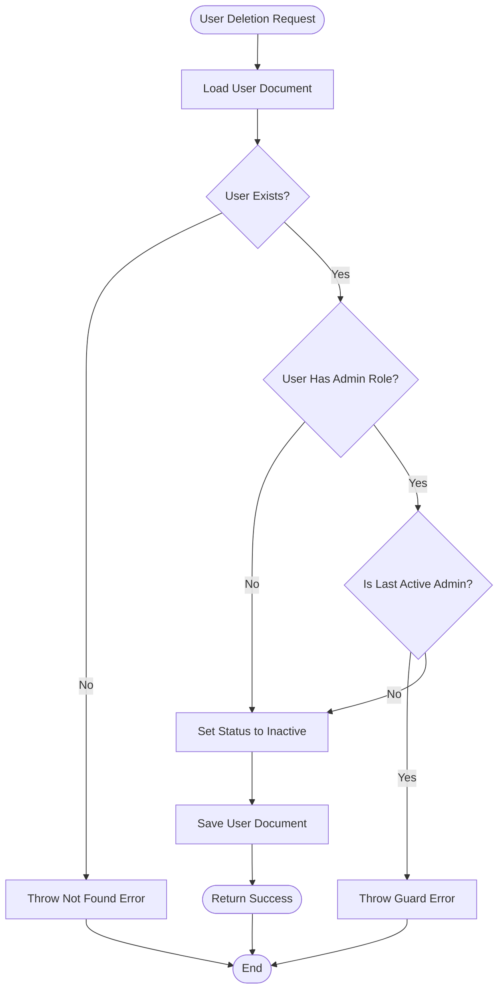
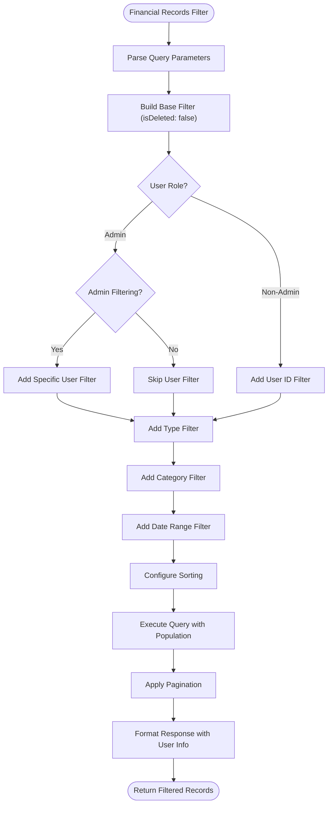
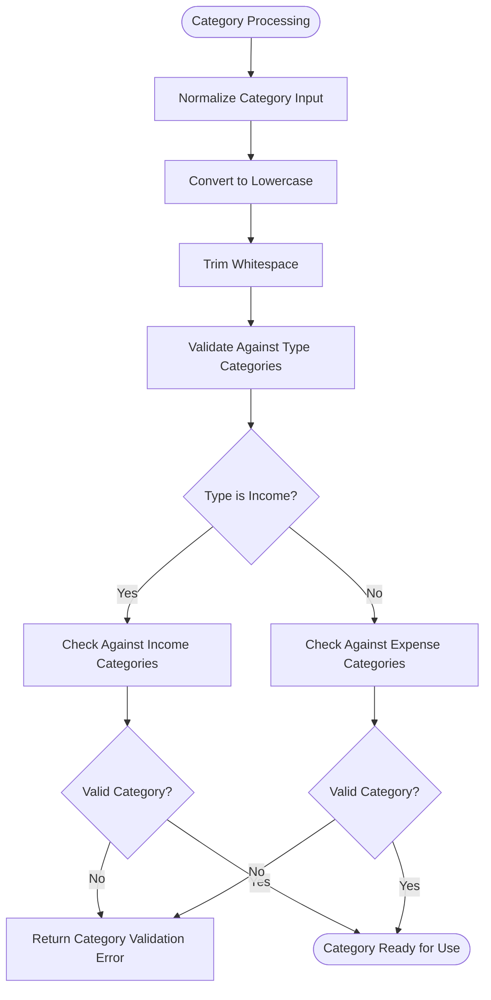
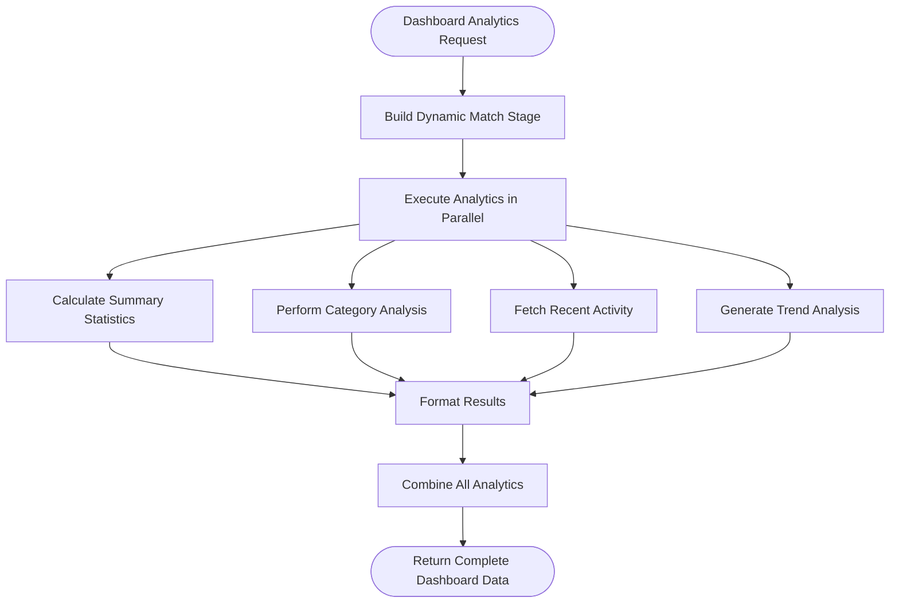
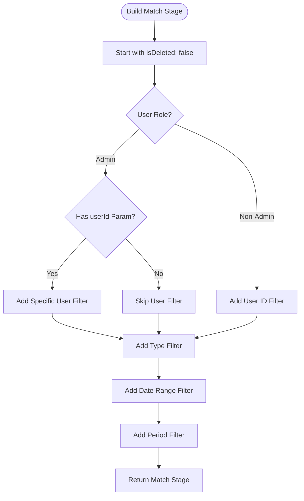

# Business Logic Layer

<cite>
**Referenced Files in This Document**
- [authService.js](file://backend/services/authService.js)
- [userService.js](file://backend/services/userService.js)
- [financeService.js](file://backend/services/financeService.js)
- [dashboardService.js](file://backend/services/dashboardService.js)
- [authController.js](file://backend/controllers/authController.js)
- [userController.js](file://backend/controllers/userController.js)
- [financeController.js](file://backend/controllers/financeController.js)
- [dashboardController.js](file://backend/controllers/dashboardController.js)
- [User.js](file://backend/models/User.js)
- [FinancialRecord.js](file://backend/models/FinancialRecord.js)
- [auth.js](file://backend/middleware/auth.js)
- [rbac.js](file://backend/middleware/rbac.js)
- [constants.js](file://backend/utils/constants.js)
- [response.js](file://backend/utils/response.js)
</cite>

## Update Summary
**Changes Made**
- Enhanced authentication service with comprehensive user registration and login flows
- Expanded user management service with advanced filtering, pagination, and role-based access control
- Implemented sophisticated financial records service with soft deletion, advanced categorization, and analytics
- Developed comprehensive dashboard service with complex aggregation pipelines and trend analysis
- Added robust error handling, validation, and security measures throughout all services

## Table of Contents
1. [Introduction](#introduction)
2. [Project Structure](#project-structure)
3. [Core Components](#core-components)
4. [Architecture Overview](#architecture-overview)
5. [Detailed Component Analysis](#detailed-component-analysis)
6. [Advanced Features](#advanced-features)
7. [Security Implementation](#security-implementation)
8. [Performance Optimization](#performance-optimization)
9. [Error Handling Strategy](#error-handling-strategy)
10. [Testing and Validation](#testing-and-validation)
11. [Conclusion](#conclusion)

## Introduction
This document explains the comprehensive business logic layer implementation that orchestrates core domain operations across four specialized services: authentication, user management, financial records, and dashboard analytics. The system implements advanced CRUD operations with sophisticated filtering capabilities, enhanced security measures, and complex financial analytics using MongoDB aggregation pipelines. Each service encapsulates domain-specific business rules while maintaining clean separation of concerns and robust error handling.

## Project Structure
The backend follows a layered architecture with comprehensive service layer implementation:
- **Controllers**: HTTP entry points with standardized request parsing and response formatting
- **Services**: Business logic layer with advanced operations, validation, and complex analytics
- **Models**: Mongoose schemas with pre-save hooks, virtual properties, and comprehensive indexing
- **Middleware**: Authentication, RBAC, and request validation with JWT token management
- **Utilities**: Shared constants, response formatting, and configuration management

**Diagram sources**
- [authController.js:1-114](file://backend/controllers/authController.js#L1-L114)
- [userController.js:1-152](file://backend/controllers/userController.js#L1-L152)
- [financeController.js:1-138](file://backend/controllers/financeController.js#L1-L138)
- [dashboardController.js:1-144](file://backend/controllers/dashboardController.js#L1-L144)
- [authService.js:1-195](file://backend/services/authService.js#L1-L195)
- [userService.js:1-276](file://backend/services/userService.js#L1-L276)
- [financeService.js:1-276](file://backend/services/financeService.js#L1-L276)
- [dashboardService.js:1-345](file://backend/services/dashboardService.js#L1-L345)
- [User.js:1-125](file://backend/models/User.js#L1-L125)
- [FinancialRecord.js:1-133](file://backend/models/FinancialRecord.js#L1-L133)
- [auth.js:1-116](file://backend/middleware/auth.js#L1-L116)
- [rbac.js:1-151](file://backend/middleware/rbac.js#L1-L151)
- [constants.js:1-81](file://backend/utils/constants.js#L1-L81)
- [response.js:1-101](file://backend/utils/response.js#L1-L101)

## Core Components

### Authentication Service
Encapsulates comprehensive user authentication and authorization operations:
- **Registration**: Validates uniqueness constraints, handles role assignment with administrative oversight, and generates secure JWT tokens
- **Login**: Implements secure credential verification with account status validation and token generation
- **Profile Management**: Provides user profile retrieval and password change functionality with current password verification
- **System Setup**: Specialized endpoint for initial admin creation with duplicate prevention

### User Management Service
Implements enterprise-grade user management with advanced capabilities:
- **Advanced Filtering**: Supports role-based filtering, status filtering, and comprehensive search capabilities
- **Pagination System**: Implements configurable pagination with metadata for client-side navigation
- **Soft Deletion**: Maintains audit trail through status-based deactivation rather than permanent removal
- **Role-Based Access Control**: Enforces business rules preventing critical role transitions and maintaining system integrity
- **Statistics Generation**: Provides comprehensive user analytics including role distribution and status metrics

### Financial Records Service
Delivers sophisticated financial management with robust data integrity:
- **Advanced Categorization**: Implements normalized category management with type-specific category validation
- **Complex Filtering**: Supports multi-dimensional filtering including date ranges, type filters, and user-specific queries
- **Soft Deletion System**: Maintains data integrity through soft deletion with timestamp tracking
- **Population Management**: Efficiently handles user relationship population with configurable depth
- **Analytics Integration**: Provides category aggregation and statistical reporting for financial insights

### Dashboard Service
Offers comprehensive analytics through sophisticated aggregation pipelines:
- **Multi-Tier Analytics**: Combines summary statistics, category breakdowns, recent activity feeds, and trend analysis
- **Dynamic Filtering**: Builds complex match stages based on user roles and query parameters
- **Time Series Analysis**: Provides monthly and weekly trend analysis with configurable periods
- **Performance Optimization**: Utilizes parallel processing for composite dashboard generation
- **Flexible Reporting**: Supports various time frames and analytical perspectives

**Section sources**
- [authService.js:1-195](file://backend/services/authService.js#L1-L195)
- [userService.js:1-276](file://backend/services/userService.js#L1-L276)
- [financeService.js:1-276](file://backend/services/financeService.js#L1-L276)
- [dashboardService.js:1-345](file://backend/services/dashboardService.js#L1-L345)

## Architecture Overview
The business logic layer implements a clean, layered architecture with comprehensive separation of concerns:

**Diagram sources**
- [authController.js:13-26](file://backend/controllers/authController.js#L13-L26)
- [authService.js:15-51](file://backend/services/authService.js#L15-L51)
- [User.js:64-81](file://backend/models/User.js#L64-L81)

## Detailed Component Analysis

### Authentication Service Implementation

#### Registration Flow
The registration service implements comprehensive user onboarding with security-first design:

**Diagram sources**
- [authService.js:15-51](file://backend/services/authService.js#L15-L51)
- [User.js:64-72](file://backend/models/User.js#L64-L72)

#### Login Security Implementation
The login service implements multi-layered security validation:

**Diagram sources**
- [authService.js:59-93](file://backend/services/authService.js#L59-L93)
- [User.js:79-81](file://backend/models/User.js#L79-L81)

**Section sources**
- [authService.js:1-195](file://backend/services/authService.js#L1-L195)
- [authController.js:1-114](file://backend/controllers/authController.js#L1-L114)
- [User.js:1-125](file://backend/models/User.js#L1-L125)

### User Management Service Advanced Features

#### Comprehensive Filtering System
The user management service implements sophisticated filtering with role-aware access control:

**Diagram sources**
- [userService.js:14-58](file://backend/services/userService.js#L14-L58)

#### Soft Deletion Business Rules
The service enforces critical business rules during user deletion:

**Diagram sources**
- [userService.js:161-181](file://backend/services/userService.js#L161-L181)

**Section sources**
- [userService.js:1-276](file://backend/services/userService.js#L1-L276)
- [userController.js:1-152](file://backend/controllers/userController.js#L1-L152)

### Financial Records Service Sophisticated Analytics

#### Advanced Filtering and Pagination
The financial records service implements enterprise-grade filtering with comprehensive capabilities:

**Diagram sources**
- [financeService.js:38-102](file://backend/services/financeService.js#L38-L102)

#### Category Management and Normalization
The service implements sophisticated category handling with type-specific validation:

**Diagram sources**
- [financeService.js:15-29](file://backend/services/financeService.js#L15-L29)
- [FinancialRecord.js:120-127](file://backend/models/FinancialRecord.js#L120-L127)

**Section sources**
- [financeService.js:1-276](file://backend/services/financeService.js#L1-L276)
- [financeController.js:1-138](file://backend/controllers/financeController.js#L1-L138)
- [FinancialRecord.js:1-133](file://backend/models/FinancialRecord.js#L1-L133)

### Dashboard Service Complex Analytics

#### Multi-Dimensional Aggregation Pipeline
The dashboard service implements sophisticated analytics through MongoDB aggregation:

**Diagram sources**
- [dashboardService.js:256-272](file://backend/services/dashboardService.js#L256-L272)
- [dashboardService.js:281-334](file://backend/services/dashboardService.js#L281-L334)

#### Dynamic Filter Construction
The service builds complex filters based on user roles and query parameters:

**Diagram sources**
- [dashboardService.js:281-334](file://backend/services/dashboardService.js#L281-L334)

**Section sources**
- [dashboardService.js:1-345](file://backend/services/dashboardService.js#L1-L345)
- [dashboardController.js:1-144](file://backend/controllers/dashboardController.js#L1-L144)

## Advanced Features

### Enhanced CRUD Operations
All services implement comprehensive CRUD operations with advanced capabilities:

- **Create Operations**: Input validation, default value assignment, and automatic timestamp generation
- **Read Operations**: Advanced filtering, pagination, sorting, and population of related entities
- **Update Operations**: Field-level validation, atomic updates, and cascading effects
- **Delete Operations**: Soft deletion with audit trail and recovery capabilities

### Sophisticated Filtering Capabilities
The system implements multi-dimensional filtering across all services:

- **Type-based Filtering**: Income/expense categorization with type-specific validation
- **Date Range Filtering**: Flexible date range queries with timezone awareness
- **Role-based Access Control**: Automatic filtering based on user permissions
- **Category Normalization**: Consistent category handling across different record types

### Advanced Analytics and Reporting
The dashboard service provides comprehensive analytics:

- **Real-time Calculations**: Live computation of financial metrics
- **Trend Analysis**: Monthly and weekly trend identification
- **Category Breakdowns**: Detailed spending and income categorization
- **Performance Metrics**: System performance monitoring and optimization

**Section sources**
- [financeService.js:38-102](file://backend/services/financeService.js#L38-L102)
- [dashboardService.js:16-55](file://backend/services/dashboardService.js#L16-L55)
- [dashboardService.js:138-188](file://backend/services/dashboardService.js#L138-L188)

## Security Implementation

### Authentication and Authorization
The system implements comprehensive security measures:

- **JWT Token Management**: Secure token generation, validation, and refresh mechanisms
- **Role-Based Access Control**: Fine-grained permission system with role hierarchies
- **Input Validation**: Comprehensive validation at multiple layers
- **Password Security**: Secure hashing with bcrypt and secure comparison

### Data Integrity and Validation
Robust validation ensures data quality and system reliability:

- **Schema-Level Validation**: Mongoose schema validation with custom validators
- **Business Rule Enforcement**: Critical business rules enforced at service level
- **Access Control**: Resource-level access control with ownership verification
- **Audit Trail**: Comprehensive logging of sensitive operations

**Section sources**
- [auth.js:1-116](file://backend/middleware/auth.js#L1-L116)
- [rbac.js:1-151](file://backend/middleware/rbac.js#L1-L151)
- [User.js:1-125](file://backend/models/User.js#L1-L125)
- [FinancialRecord.js:1-133](file://backend/models/FinancialRecord.js#L1-L133)

## Performance Optimization

### Database Optimization
The system implements several performance optimization strategies:

- **Indexing Strategy**: Strategic indexing on frequently queried fields
- **Aggregation Pipelines**: Efficient analytics using MongoDB aggregation
- **Population Management**: Configurable population depth to minimize payload size
- **Pagination Implementation**: Efficient pagination with cursor-based navigation

### Caching and Parallel Processing
Performance enhancements include:

- **Parallel Execution**: Concurrent execution of independent analytics
- **Response Caching**: Strategic caching of frequently accessed data
- **Lazy Loading**: On-demand loading of related resources
- **Connection Pooling**: Efficient database connection management

**Section sources**
- [constants.js:1-81](file://backend/utils/constants.js#L1-L81)
- [User.js:56-60](file://backend/models/User.js#L56-L60)
- [FinancialRecord.js:65-71](file://backend/models/FinancialRecord.js#L65-L71)

## Error Handling Strategy

### Comprehensive Error Management
The system implements structured error handling:

- **Standardized Responses**: Consistent error response format across all services
- **Business Logic Errors**: Descriptive errors for business rule violations
- **System Errors**: Graceful handling of database and system failures
- **Validation Errors**: Detailed validation feedback for client-side corrections

### Exception Handling Patterns
Robust exception handling ensures system stability:

- **Centralized Error Processing**: Unified error handling in controllers
- **Business Rule Validation**: Early validation to prevent invalid operations
- **Transaction Safety**: Atomic operations with rollback capabilities
- **Logging Integration**: Comprehensive error logging for debugging and monitoring

**Section sources**
- [response.js:1-101](file://backend/utils/response.js#L1-L101)
- [authService.js:20](file://backend/services/authService.js#L20)
- [userService.js:94](file://backend/services/userService.js#L94)

## Testing and Validation

### Unit Testing Framework
Comprehensive testing ensures reliability and maintainability:

- **Service-Level Testing**: Individual service method testing with mock dependencies
- **Integration Testing**: End-to-end testing of complete workflows
- **Database Testing**: Test isolation with separate test databases
- **Performance Testing**: Load testing and performance benchmarking

### Validation Testing
Extensive validation ensures data integrity:

- **Input Validation**: Comprehensive validation of all user inputs
- **Business Rule Testing**: Verification of critical business constraints
- **Security Testing**: Penetration testing and vulnerability assessment
- **Regression Testing**: Automated testing for feature regression detection

**Section sources**
- [auth.test.js](file://backend/tests/auth.test.js)
- [constants.js:59-64](file://backend/utils/constants.js#L59-L64)

## Conclusion
The business logic layer implementation demonstrates enterprise-grade software engineering practices with comprehensive service layer architecture. The system successfully balances functionality, security, performance, and maintainability through:

- **Clean Architecture**: Clear separation of concerns with well-defined service boundaries
- **Advanced Features**: Sophisticated filtering, analytics, and business rule enforcement
- **Security Implementation**: Comprehensive authentication, authorization, and data protection
- **Performance Optimization**: Efficient database operations and responsive user experiences
- **Maintainable Design**: Well-documented code, comprehensive testing, and clear error handling

The implementation provides a solid foundation for scalable financial management applications with robust business logic, comprehensive analytics, and enterprise-grade security measures. The modular design ensures easy maintenance, extensibility, and adaptation to evolving business requirements.