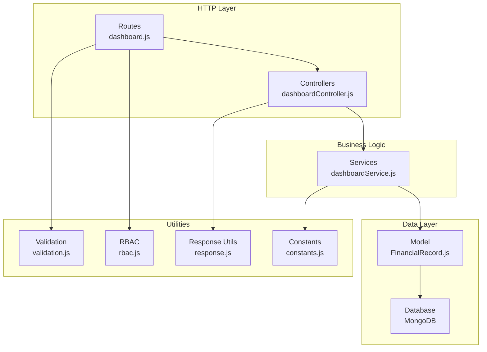
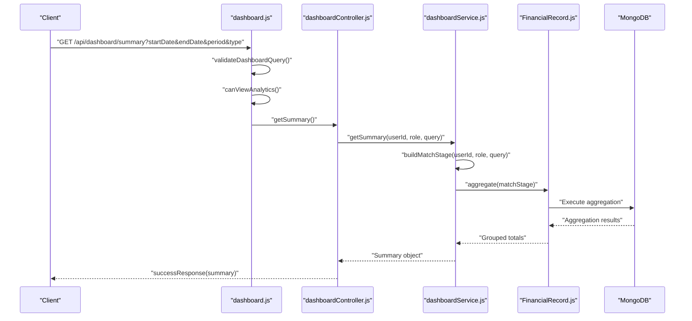
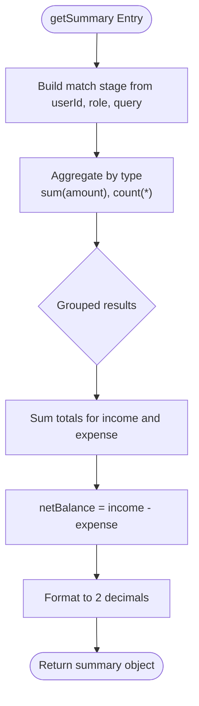
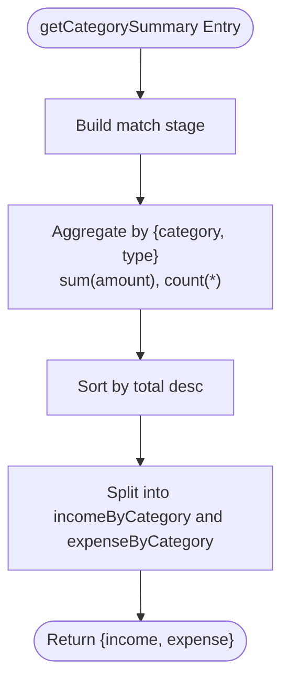
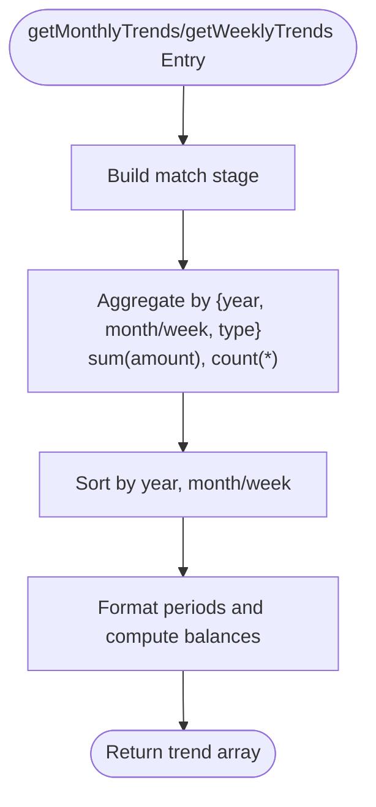
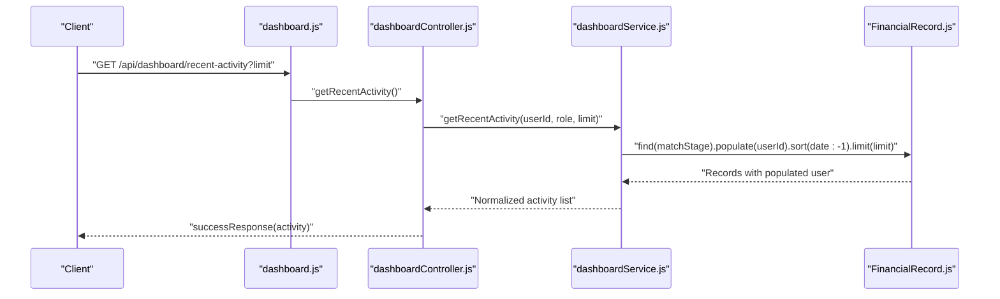
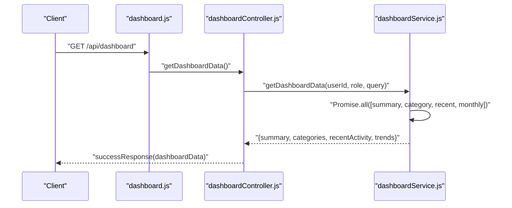
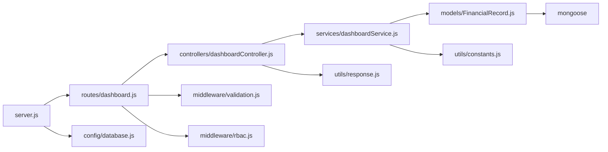

# Dashboard Analytics Service

<cite>
**Referenced Files in This Document**
- [dashboardController.js](file://backend/controllers/dashboardController.js)
- [dashboardService.js](file://backend/services/dashboardService.js)
- [FinancialRecord.js](file://backend/models/FinancialRecord.js)
- [dashboard.js](file://backend/routes/dashboard.js)
- [constants.js](file://backend/utils/constants.js)
- [rbac.js](file://backend/middleware/rbac.js)
- [validation.js](file://backend/middleware/validation.js)
- [response.js](file://backend/utils/response.js)
- [database.js](file://backend/config/database.js)
- [server.js](file://backend/server.js)
- [package.json](file://backend/package.json)
</cite>

## Table of Contents
1. [Introduction](#introduction)
2. [Project Structure](#project-structure)
3. [Core Components](#core-components)
4. [Architecture Overview](#architecture-overview)
5. [Detailed Component Analysis](#detailed-component-analysis)
6. [Dependency Analysis](#dependency-analysis)
7. [Performance Considerations](#performance-considerations)
8. [Troubleshooting Guide](#troubleshooting-guide)
9. [Conclusion](#conclusion)

## Introduction
This document provides comprehensive documentation for the dashboard analytics service, focusing on analytics calculations, summary statistics, category-wise analysis, trend analysis, and recent activity feed generation. It explains how the service aggregates financial data using MongoDB aggregation pipelines, applies time-based filtering, enforces permission-based access control, and structures responses for frontend consumption. It also covers performance optimization techniques, caching strategies, and implementation patterns for real-time data processing and scalable analytics computation.

## Project Structure
The dashboard analytics service is organized using a layered architecture:
- Routes define HTTP endpoints and apply middleware for authentication, authorization, and validation.
- Controllers handle request parsing and delegate business logic to services.
- Services encapsulate analytics computations and MongoDB aggregation pipelines.
- Models define the data schema and indexes for efficient querying.
- Utilities provide shared constants, response formatting, and validation rules.
- Configuration manages database connections and server setup.

**Diagram sources**
- [dashboard.js:1-57](file://backend/routes/dashboard.js#L1-L57)
- [dashboardController.js:1-144](file://backend/controllers/dashboardController.js#L1-L144)
- [dashboardService.js:1-345](file://backend/services/dashboardService.js#L1-L345)
- [FinancialRecord.js:1-134](file://backend/models/FinancialRecord.js#L1-L134)
- [validation.js:1-309](file://backend/middleware/validation.js#L1-L309)
- [rbac.js:1-151](file://backend/middleware/rbac.js#L1-L151)
- [response.js:1-101](file://backend/utils/response.js#L1-L101)
- [constants.js:1-81](file://backend/utils/constants.js#L1-L81)

**Section sources**
- [server.js:1-113](file://backend/server.js#L1-L113)
- [package.json:1-29](file://backend/package.json#L1-L29)

## Core Components
This section documents the primary analytics capabilities exposed by the dashboard service.

- Summary Statistics: Computes total income, total expense, net balance, and counts for income and expense records within a filtered time window.
- Category-Wise Analysis: Aggregates amounts and counts by category and type, returning sorted lists for income and expense.
- Trend Analysis: Generates monthly and weekly aggregated totals and balances using MongoDB date extraction operators.
- Recent Activity Feed: Retrieves recent financial records with user metadata, respecting permission-based filtering and limits.
- Comprehensive Dashboard Data: Bundles summary, category breakdown, recent activity, and monthly trends into a single response.

**Section sources**
- [dashboardService.js:16-55](file://backend/services/dashboardService.js#L16-L55)
- [dashboardService.js:64-100](file://backend/services/dashboardService.js#L64-L100)
- [dashboardService.js:138-188](file://backend/services/dashboardService.js#L138-L188)
- [dashboardService.js:197-247](file://backend/services/dashboardService.js#L197-L247)
- [dashboardService.js:256-272](file://backend/services/dashboardService.js#L256-L272)

## Architecture Overview
The analytics pipeline follows a clear separation of concerns:
- Route handlers validate query parameters and enforce permissions.
- Controllers pass validated parameters to services.
- Services construct MongoDB aggregation pipelines and permission-aware match stages.
- Models define indexes that optimize analytics queries.
- Responses are standardized using utility functions.

**Diagram sources**
- [dashboard.js:14-26](file://backend/routes/dashboard.js#L14-L26)
- [dashboardController.js:13-28](file://backend/controllers/dashboardController.js#L13-L28)
- [dashboardService.js:16-55](file://backend/services/dashboardService.js#L16-L55)
- [FinancialRecord.js:1-134](file://backend/models/FinancialRecord.js#L1-L134)

## Detailed Component Analysis

### Summary Statistics Generation
The summary endpoint computes:
- Total income and total expense within the filtered time range.
- Net balance as the difference between income and expense.
- Counts for income and expense records.
- Total number of records.

Implementation highlights:
- Uses a MongoDB aggregation group stage keyed by record type to sum amounts and counts.
- Applies a dynamic match stage built from user role and query parameters.
- Formats numeric results to two decimal places.

**Diagram sources**
- [dashboardService.js:16-55](file://backend/services/dashboardService.js#L16-L55)

**Section sources**
- [dashboardService.js:16-55](file://backend/services/dashboardService.js#L16-L55)

### Category-Wise Analysis
Category-wise analysis aggregates:
- Amount and count grouped by category and type.
- Sorts by total descending to highlight top contributors.
- Separates income and expense categories into distinct arrays.

Implementation highlights:
- Aggregation groups by a composite key of category and type.
- Post-processing separates income and expense items.
- Returns structured objects for frontend rendering.

**Diagram sources**
- [dashboardService.js:64-100](file://backend/services/dashboardService.js#L64-L100)

**Section sources**
- [dashboardService.js:64-100](file://backend/services/dashboardService.js#L64-L100)

### Trend Analysis (Monthly and Weekly)
Trend analysis produces:
- Monthly trends: grouped by year-month and type, sorted chronologically, with computed balances.
- Weekly trends: grouped by year-week and type, sorted chronologically, with computed balances.

Implementation highlights:
- Uses MongoDB date extraction operators to derive year-month and year-week.
- Formats keys consistently for easy chart rendering.
- Computes balances as income minus expense per period.

**Diagram sources**
- [dashboardService.js:138-188](file://backend/services/dashboardService.js#L138-L188)
- [dashboardService.js:197-247](file://backend/services/dashboardService.js#L197-L247)

**Section sources**
- [dashboardService.js:138-188](file://backend/services/dashboardService.js#L138-L188)
- [dashboardService.js:197-247](file://backend/services/dashboardService.js#L197-L247)

### Recent Activity Feed
The recent activity feed:
- Applies permission-aware filtering via the match stage.
- Populates user metadata for display.
- Sorts by date descending and limits results.

Implementation highlights:
- Uses find with populate for user details.
- Maps to a normalized shape for frontend consumption.
- Respects role-based visibility rules.

**Diagram sources**
- [dashboard.js:35-40](file://backend/routes/dashboard.js#L35-L40)
- [dashboardController.js:55-71](file://backend/controllers/dashboardController.js#L55-L71)
- [dashboardService.js:109-129](file://backend/services/dashboardService.js#L109-L129)
- [FinancialRecord.js:10-14](file://backend/models/FinancialRecord.js#L10-L14)

**Section sources**
- [dashboardService.js:109-129](file://backend/services/dashboardService.js#L109-L129)

### Comprehensive Dashboard Data
The combined endpoint:
- Executes summary, category summary, recent activity, and monthly trends concurrently.
- Returns a unified payload for client-side rendering.

Implementation highlights:
- Uses Promise.all to parallelize analytics computations.
- Bundles results into a single response object.

**Diagram sources**
- [dashboard.js:14-19](file://backend/routes/dashboard.js#L14-L19)
- [dashboardController.js:119-134](file://backend/controllers/dashboardController.js#L119-L134)
- [dashboardService.js:256-272](file://backend/services/dashboardService.js#L256-L272)

**Section sources**
- [dashboardService.js:256-272](file://backend/services/dashboardService.js#L256-L272)

## Dependency Analysis
The dashboard analytics service relies on several key modules and their relationships:

- Routes depend on controllers and middleware for validation and authorization.
- Controllers depend on services for analytics logic.
- Services depend on the model for data access and on constants for enums and categories.
- Models depend on Mongoose for schema definition and indexing.
- Utilities provide shared constants, response formatting, and validation rules.

**Diagram sources**
- [dashboard.js:1-57](file://backend/routes/dashboard.js#L1-L57)
- [dashboardController.js:1-144](file://backend/controllers/dashboardController.js#L1-L144)
- [dashboardService.js:1-345](file://backend/services/dashboardService.js#L1-L345)
- [FinancialRecord.js:1-134](file://backend/models/FinancialRecord.js#L1-L134)
- [constants.js:1-81](file://backend/utils/constants.js#L1-L81)
- [validation.js:1-309](file://backend/middleware/validation.js#L1-L309)
- [rbac.js:1-151](file://backend/middleware/rbac.js#L1-L151)
- [response.js:1-101](file://backend/utils/response.js#L1-L101)
- [server.js:1-113](file://backend/server.js#L1-L113)
- [database.js:1-43](file://backend/config/database.js#L1-L43)

**Section sources**
- [dashboard.js:1-57](file://backend/routes/dashboard.js#L1-L57)
- [dashboardController.js:1-144](file://backend/controllers/dashboardController.js#L1-L144)
- [dashboardService.js:1-345](file://backend/services/dashboardService.js#L1-L345)
- [FinancialRecord.js:1-134](file://backend/models/FinancialRecord.js#L1-L134)
- [constants.js:1-81](file://backend/utils/constants.js#L1-L81)
- [validation.js:1-309](file://backend/middleware/validation.js#L1-L309)
- [rbac.js:1-151](file://backend/middleware/rbac.js#L1-L151)
- [response.js:1-101](file://backend/utils/response.js#L1-L101)
- [server.js:1-113](file://backend/server.js#L1-L113)
- [database.js:1-43](file://backend/config/database.js#L1-L43)

## Performance Considerations
This section outlines performance characteristics and optimization strategies for the dashboard analytics service.

- Indexes on FinancialRecord:
  - userId with date descending to accelerate time-range queries per user.
  - userId with type to support quick filtering by record type.
  - userId with category to support category-based analytics.
  - userId with isDeleted to efficiently exclude soft-deleted records.
  - type with date descending to support analytics across all users by type and date.
  - Compound indexes reduce collection scans during aggregation and find operations.

- Aggregation Pipelines:
  - Grouping by type, category, and date extracts enables efficient rollups.
  - Sorting by date ensures chronological ordering for trends.
  - Pre-find middleware excludes soft-deleted records by default, reducing dataset size.

- Concurrency:
  - Promise.all executes multiple analytics computations concurrently, minimizing total latency for the combined dashboard endpoint.

- Caching Strategies:
  - Implement Redis caching for frequently accessed dashboards (e.g., last 7 days, last 30 days) with cache keys derived from userId, role, and query parameters.
  - Cache invalidation on write operations (create/update/delete) to maintain freshness.
  - Use cache tags to invalidate related analytics when underlying data changes.

- Pagination and Limits:
  - Apply reasonable limits for recent activity feeds to prevent large payloads.
  - Consider pagination for category summaries if datasets grow large.

- Real-Time Data Processing:
  - Use change streams on FinancialRecord to incrementally update cached analytics.
  - Maintain materialized summary collections for high-frequency metrics (e.g., daily totals) with periodic refresh jobs.

[No sources needed since this section provides general guidance]

## Troubleshooting Guide
Common issues and resolutions:

- Authentication and Authorization Failures:
  - Ensure the user is authenticated and active before accessing analytics endpoints.
  - Verify required permissions for sensitive endpoints (e.g., VIEW_ANALYTICS).

- Validation Errors:
  - Confirm query parameters meet validation criteria (date formats, allowed periods, type values).
  - Review validation error responses for specific field issues.

- Permission-Based Filtering:
  - Non-admin users can only view their own records unless an admin passes a userId query parameter.
  - Ensure match stage construction handles role and filters correctly.

- Aggregation Performance:
  - Verify indexes exist on userId, date, type, category, and isDeleted fields.
  - Monitor slow query logs and adjust aggregation stages if needed.

- Soft-Deleted Records:
  - Pre-find middleware excludes deleted records by default; confirm isDeleted is not explicitly queried to retain this behavior.

**Section sources**
- [rbac.js:14-33](file://backend/middleware/rbac.js#L14-L33)
- [validation.js:278-295](file://backend/middleware/validation.js#L278-L295)
- [dashboardService.js:281-334](file://backend/services/dashboardService.js#L281-L334)
- [FinancialRecord.js:75-81](file://backend/models/FinancialRecord.js#L75-L81)

## Conclusion
The dashboard analytics service provides a robust foundation for financial insights with:
- Clear separation of concerns across routes, controllers, services, and models.
- Strong permission enforcement and validation.
- Efficient MongoDB aggregation pipelines tailored for time-based and categorical analytics.
- Scalable patterns through concurrency, caching, and indexing.

Future enhancements could include:
- Materialized summaries for high-frequency metrics.
- Change streams for near real-time updates.
- Advanced caching with cache warming and invalidation strategies.
- Enhanced error handling and observability for production deployments.

[No sources needed since this section summarizes without analyzing specific files]