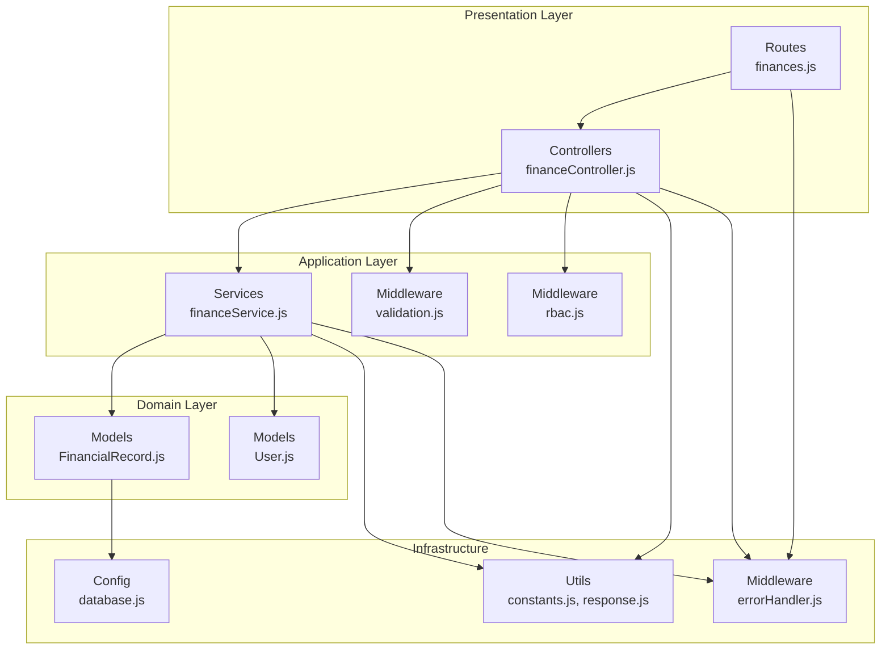
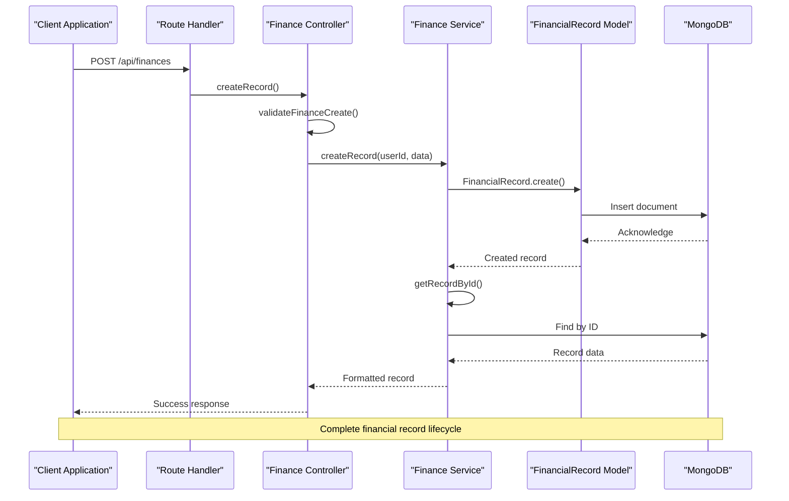
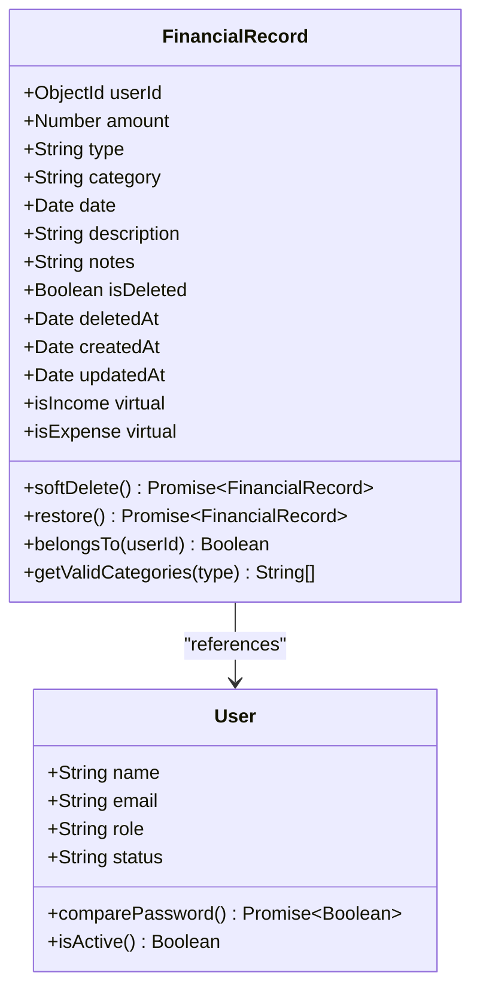
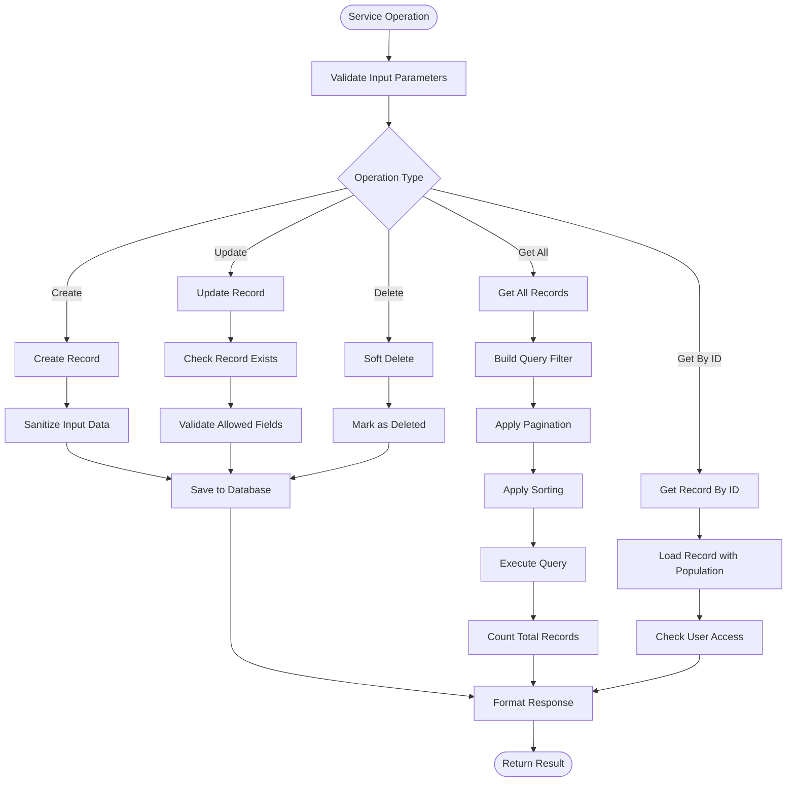
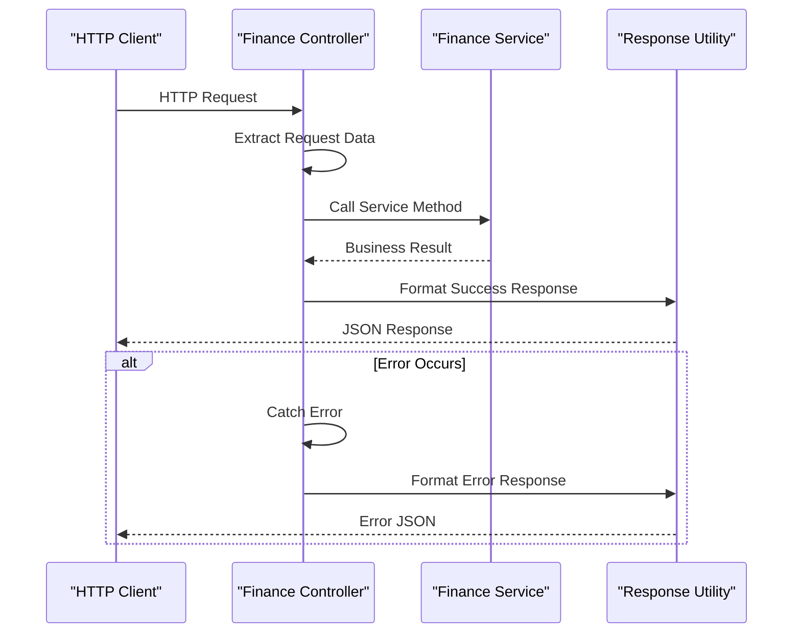
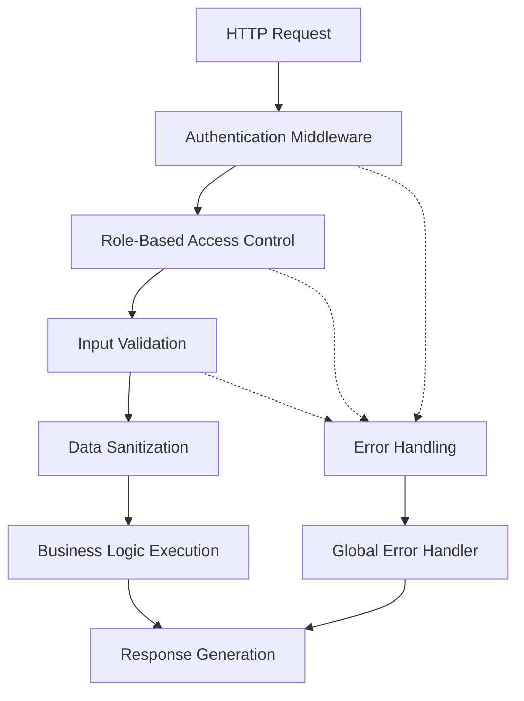
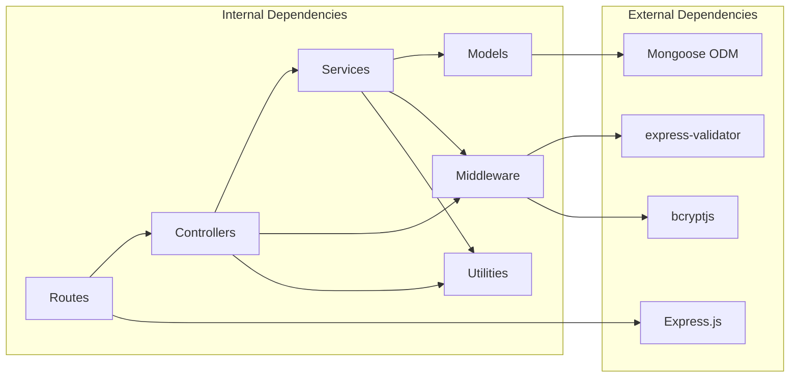

# Financial Records Service

<cite>
**Referenced Files in This Document**
- [FinancialRecord.js](file://backend/models/FinancialRecord.js)
- [financeService.js](file://backend/services/financeService.js)
- [financeController.js](file://backend/controllers/financeController.js)
- [finances.js](file://backend/routes/finances.js)
- [validation.js](file://backend/middleware/validation.js)
- [rbac.js](file://backend/middleware/rbac.js)
- [constants.js](file://backend/utils/constants.js)
- [response.js](file://backend/utils/response.js)
- [errorHandler.js](file://backend/middleware/errorHandler.js)
- [database.js](file://backend/config/database.js)
- [server.js](file://backend/server.js)
- [User.js](file://backend/models/User.js)
</cite>

## Table of Contents
1. [Introduction](#introduction)
2. [Project Structure](#project-structure)
3. [Core Components](#core-components)
4. [Architecture Overview](#architecture-overview)
5. [Detailed Component Analysis](#detailed-component-analysis)
6. [Dependency Analysis](#dependency-analysis)
7. [Performance Considerations](#performance-considerations)
8. [Troubleshooting Guide](#troubleshooting-guide)
9. [Conclusion](#conclusion)

## Introduction
This document provides comprehensive documentation for the Financial Records Service implementation. It covers record creation with validation rules, categorization logic, and amount processing; retrieval methods including filtering by date ranges, categories, and user permissions; soft deletion with restore functionality and data integrity preservation; record updates with validation and audit trail considerations; data validation processes, input sanitization, and business rule enforcement; and implementation patterns for bulk operations, search functionality, and performance optimization for large datasets.

## Project Structure
The backend follows a layered architecture with clear separation of concerns:
- Models define the data schema and business logic for financial records
- Services encapsulate business logic and coordinate model operations
- Controllers handle HTTP requests and responses
- Routes define API endpoints and apply middleware
- Middleware enforces validation, authentication, and authorization
- Utilities provide shared constants and response formatting
- Configuration manages database connections

**Diagram sources**
- [finances.js:1-67](file://backend/routes/finances.js#L1-L67)
- [financeController.js:1-138](file://backend/controllers/financeController.js#L1-L138)
- [financeService.js:1-264](file://backend/services/financeService.js#L1-L264)
- [FinancialRecord.js:1-134](file://backend/models/FinancialRecord.js#L1-L134)
- [User.js:1-130](file://backend/models/User.js#L1-L130)
- [rbac.js:1-151](file://backend/middleware/rbac.js#L1-L151)
- [validation.js:1-309](file://backend/middleware/validation.js#L1-L309)
- [database.js:1-43](file://backend/config/database.js#L1-L43)
- [constants.js:1-81](file://backend/utils/constants.js#L1-L81)
- [response.js:1-101](file://backend/utils/response.js#L1-L101)
- [errorHandler.js:1-179](file://backend/middleware/errorHandler.js#L1-L179)

**Section sources**
- [server.js:1-113](file://backend/server.js#L1-L113)
- [package.json:1-29](file://backend/package.json#L1-L29)

## Core Components
The Financial Records Service consists of several interconnected components that work together to provide a robust financial record management system.

### Data Model Layer
The FinancialRecord model defines the core schema with built-in validation and business logic:
- Strong typing with required fields and constraints
- Automatic indexing for performance optimization
- Soft deletion with restoration capabilities
- Category validation based on record type
- Virtual properties for income/expense detection

### Service Layer
The financeService provides comprehensive business logic:
- Record creation with input sanitization and validation
- Advanced filtering and pagination for large datasets
- User permission enforcement and access control
- Category aggregation and reporting capabilities
- Response formatting and data normalization

### Controller Layer
The financeController handles HTTP interactions:
- Standardized request/response patterns
- Error handling and validation integration
- Permission-aware access control
- Resource-level validation and sanitization

### Middleware Layer
Comprehensive middleware stack ensures security and data integrity:
- Input validation using express-validator
- Role-based access control (RBAC)
- Authentication and authorization
- Error handling and response formatting

**Section sources**
- [FinancialRecord.js:9-134](file://backend/models/FinancialRecord.js#L9-L134)
- [financeService.js:15-264](file://backend/services/financeService.js#L15-L264)
- [financeController.js:13-138](file://backend/controllers/financeController.js#L13-L138)
- [validation.js:130-273](file://backend/middleware/validation.js#L130-L273)
- [rbac.js:14-150](file://backend/middleware/rbac.js#L14-L150)

## Architecture Overview
The Financial Records Service follows a clean architecture pattern with clear separation between presentation, application, and domain layers.

**Diagram sources**
- [finances.js:43](file://backend/routes/finances.js#L43)
- [financeController.js:13-28](file://backend/controllers/financeController.js#L13-L28)
- [financeService.js:15-29](file://backend/services/financeService.js#L15-L29)
- [FinancialRecord.js:18-26](file://backend/models/FinancialRecord.js#L18-L26)

The architecture implements several key design patterns:
- **Layered Architecture**: Clear separation between presentation, application, and persistence layers
- **Repository Pattern**: FinancialRecord model acts as a repository for financial data
- **Service Layer Pattern**: Business logic encapsulated in dedicated service methods
- **Middleware Pattern**: Cross-cutting concerns handled through middleware chain
- **Factory Pattern**: Response formatting through standardized utilities

**Section sources**
- [server.js:52-84](file://backend/server.js#L52-L84)
- [finances.js:9-67](file://backend/routes/finances.js#L9-L67)

## Detailed Component Analysis

### Financial Record Model
The FinancialRecord model serves as the foundation for all financial data operations, implementing comprehensive validation and business logic.

**Diagram sources**
- [FinancialRecord.js:9-134](file://backend/models/FinancialRecord.js#L9-L134)
- [User.js:10-130](file://backend/models/User.js#L10-L130)

#### Data Schema and Validation
The model implements comprehensive validation at multiple levels:
- **Required Fields**: userId, amount, type, category, date
- **Type Constraints**: Amount must be positive number, type must be income/expense
- **Format Validation**: Email addresses, ISO dates, character limits
- **Business Rules**: Category validation based on record type

#### Indexing Strategy
Strategic indexing for optimal query performance:
- Compound indexes for common query patterns
- Separate indexes for filtering and sorting operations
- Performance-optimized for typical use cases

#### Soft Deletion Implementation
Built-in soft deletion with automatic restoration:
- Non-destructive deletion preserving data integrity
- Automatic exclusion from queries without explicit inclusion
- Restoration capability for recovered data

**Section sources**
- [FinancialRecord.js:9-71](file://backend/models/FinancialRecord.js#L9-L71)
- [FinancialRecord.js:86-108](file://backend/models/FinancialRecord.js#L86-L108)

### Finance Service Operations
The financeService provides comprehensive business logic for financial record management.

**Diagram sources**
- [financeService.js:15-264](file://backend/services/financeService.js#L15-L264)

#### Record Creation Process
The createRecord operation implements comprehensive input processing:
- **Input Sanitization**: Amount conversion, category normalization, date handling
- **Data Validation**: Type checking, range validation, format verification
- **Business Rule Enforcement**: Category validation against type-specific lists
- **Response Formatting**: Consistent data structure for client consumption

#### Retrieval and Filtering Logic
Advanced filtering capabilities for flexible data access:
- **User-Level Filtering**: Non-admin users restricted to their own records
- **Administrative Access**: Admin users can filter by any user
- **Multi-Criteria Filtering**: Type, category, date range, and custom filters
- **Pagination Support**: Configurable page sizes with total count calculation

#### Update Operations
Controlled update mechanism with field-level validation:
- **Allowed Fields**: Only specific fields can be updated
- **Field-Specific Processing**: Amount parsing, category normalization
- **Consistency Maintenance**: Preserved timestamps and relationships

**Section sources**
- [financeService.js:15-157](file://backend/services/financeService.js#L15-L157)
- [financeService.js:38-102](file://backend/services/financeService.js#L38-L102)
- [financeService.js:181-210](file://backend/services/financeService.js#L181-L210)

### Controller Layer Implementation
The financeController manages HTTP interactions with standardized patterns.

**Diagram sources**
- [financeController.js:13-138](file://backend/controllers/financeController.js#L13-L138)
- [response.js:12-49](file://backend/utils/response.js#L12-L49)

#### Request Processing Patterns
Standardized request handling across all operations:
- **Parameter Extraction**: User context, route parameters, query parameters
- **Service Coordination**: Delegation to service layer with proper context
- **Response Standardization**: Consistent success/error response formats
- **Error Propagation**: Proper error handling and forwarding

#### Access Control Integration
Seamless integration with RBAC middleware:
- **Role-Based Permissions**: Different operations require different roles
- **Resource Ownership**: Ownership checks for user-specific operations
- **Permission Validation**: Middleware ensures proper authorization

**Section sources**
- [financeController.js:13-138](file://backend/controllers/financeController.js#L13-L138)
- [finances.js:9-67](file://backend/routes/finances.js#L9-L67)

### Validation and Security Middleware
Comprehensive validation and security implementation ensures data integrity and system security.

**Diagram sources**
- [validation.js:130-273](file://backend/middleware/validation.js#L130-L273)
- [rbac.js:14-66](file://backend/middleware/rbac.js#L14-L66)
- [errorHandler.js:89-145](file://backend/middleware/errorHandler.js#L89-L145)

#### Input Validation Strategy
Multi-layered validation approach:
- **Route-Level Validation**: Parameter and query validation
- **Body Validation**: Request body field validation
- **Format Validation**: Data type and format verification
- **Business Validation**: Domain-specific business rule enforcement

#### Security Implementation
Comprehensive security measures:
- **Authentication**: JWT-based authentication for all protected routes
- **Authorization**: Role-based access control with permission matrices
- **Input Sanitization**: Automatic trimming and normalization
- **Error Handling**: Structured error responses without information leakage

**Section sources**
- [validation.js:130-273](file://backend/middleware/validation.js#L130-L273)
- [rbac.js:40-66](file://backend/middleware/rbac.js#L40-L66)
- [constants.js:48-57](file://backend/utils/constants.js#L48-L57)

## Dependency Analysis
The Financial Records Service demonstrates excellent dependency management with clear boundaries and minimal coupling.

**Diagram sources**
- [package.json:16-27](file://backend/package.json#L16-L27)
- [server.js:14-18](file://backend/server.js#L14-L18)

### Internal Module Dependencies
The internal dependency graph shows clear separation of concerns:
- **Routes depend only on Controllers**: No business logic in routes
- **Controllers depend on Services**: Business logic encapsulated in services
- **Services depend on Models**: Data access through models
- **Middleware depends on Utilities**: Shared functionality across modules

### External Dependencies
Strategic external library selection:
- **Express**: Lightweight and feature-complete web framework
- **Mongoose**: Rich ODM with schema validation and middleware
- **express-validator**: Comprehensive validation library
- **bcryptjs**: Secure password hashing implementation

**Section sources**
- [package.json:16-27](file://backend/package.json#L16-L27)
- [server.js:14-18](file://backend/server.js#L14-L18)

## Performance Considerations
The Financial Records Service implements several performance optimization strategies for handling large datasets efficiently.

### Database Optimization
- **Strategic Indexing**: Multiple compound indexes for common query patterns
- **Query Optimization**: Efficient filtering and sorting mechanisms
- **Population Strategies**: Selective population to minimize data transfer
- **Pagination Implementation**: Configurable limits to prevent memory issues

### Caching and Response Optimization
- **Response Formatting**: Efficient data structures for client consumption
- **Selective Field Loading**: Only necessary fields are retrieved
- **Virtual Properties**: Computed properties calculated on demand
- **Batch Operations**: Support for bulk operations where applicable

### Scalability Features
- **Configurable Pagination**: Adjustable page sizes for different use cases
- **Index-Driven Queries**: Optimized for typical financial record access patterns
- **Memory Management**: Proper cleanup and resource management
- **Connection Pooling**: Efficient database connection handling

**Section sources**
- [FinancialRecord.js:65-71](file://backend/models/FinancialRecord.js#L65-L71)
- [financeService.js:38-102](file://backend/services/financeService.js#L38-L102)
- [constants.js:60-64](file://backend/utils/constants.js#L60-L64)

## Troubleshooting Guide

### Common Issues and Solutions

#### Validation Errors
- **Cause**: Input data fails validation rules
- **Symptoms**: 400 Bad Request with validation error details
- **Solution**: Review validation rules in middleware and adjust input data accordingly

#### Authorization Errors
- **Cause**: Insufficient permissions or invalid authentication
- **Symptoms**: 401 Unauthorized or 403 Forbidden responses
- **Solution**: Verify user role and ensure proper authentication token

#### Database Connection Issues
- **Cause**: MongoDB connectivity problems
- **Symptoms**: Application startup failures or runtime connection errors
- **Solution**: Check MongoDB server status and connection string configuration

#### Data Integrity Issues
- **Cause**: Attempting to access deleted records or invalid IDs
- **Symptoms**: Record not found errors or unexpected data behavior
- **Solution**: Use proper soft deletion and ID validation patterns

### Debugging Strategies
- **Development Logging**: Enable request logging in development mode
- **Error Stack Traces**: Full stack traces in development for detailed debugging
- **Database Queries**: Monitor query performance and execution plans
- **Response Analysis**: Examine response structures for data consistency

**Section sources**
- [errorHandler.js:89-145](file://backend/middleware/errorHandler.js#L89-L145)
- [validation.js:13-27](file://backend/middleware/validation.js#L13-L27)
- [rbac.js:16-32](file://backend/middleware/rbac.js#L16-L32)

## Conclusion
The Financial Records Service provides a comprehensive, secure, and scalable solution for financial record management. Its layered architecture ensures maintainability and extensibility, while comprehensive validation and security measures protect data integrity. The implementation demonstrates best practices in modern web application development, including proper separation of concerns, robust error handling, and performance optimization strategies.

Key strengths of the implementation include:
- **Security-First Design**: Comprehensive validation and RBAC implementation
- **Data Integrity**: Soft deletion with restoration capabilities
- **Performance Optimization**: Strategic indexing and pagination
- **Maintainable Architecture**: Clear separation of concerns and modular design
- **Developer Experience**: Consistent patterns and standardized error handling

The service is well-positioned to handle growing datasets and evolving business requirements while maintaining high standards for security, performance, and reliability.