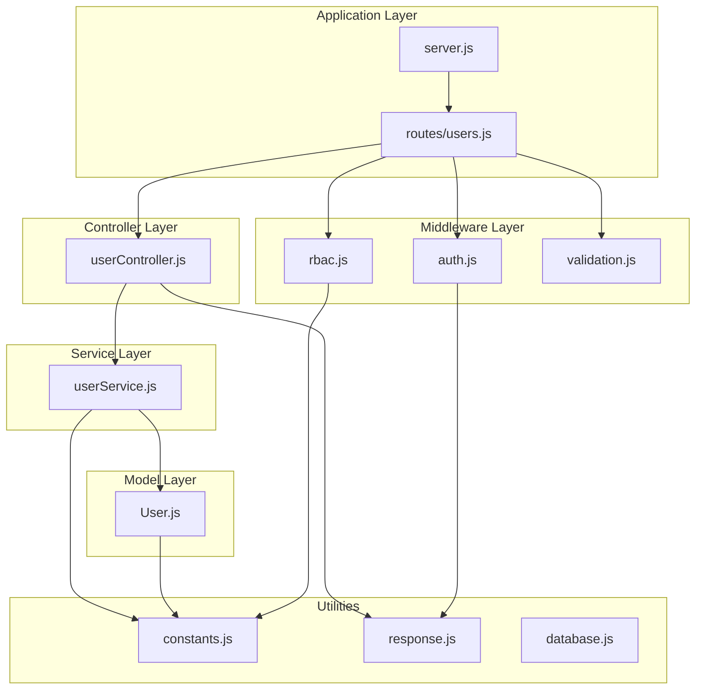
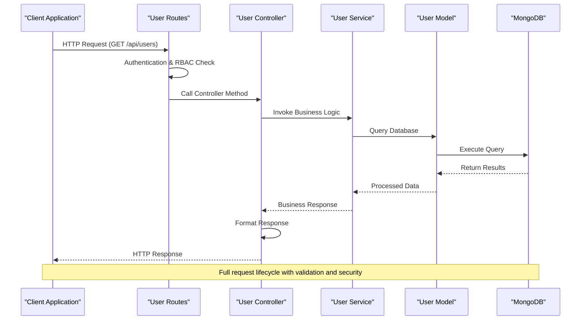
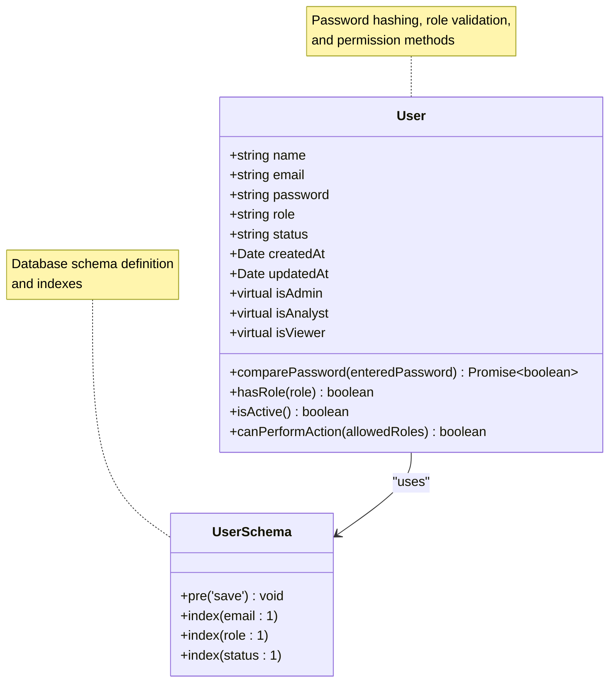
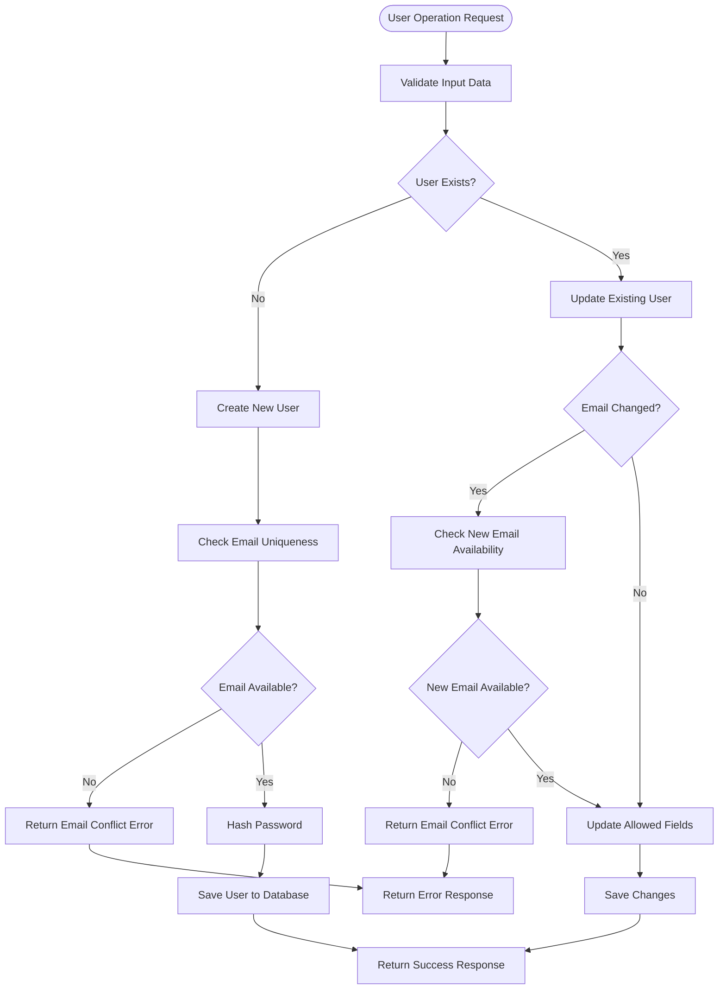
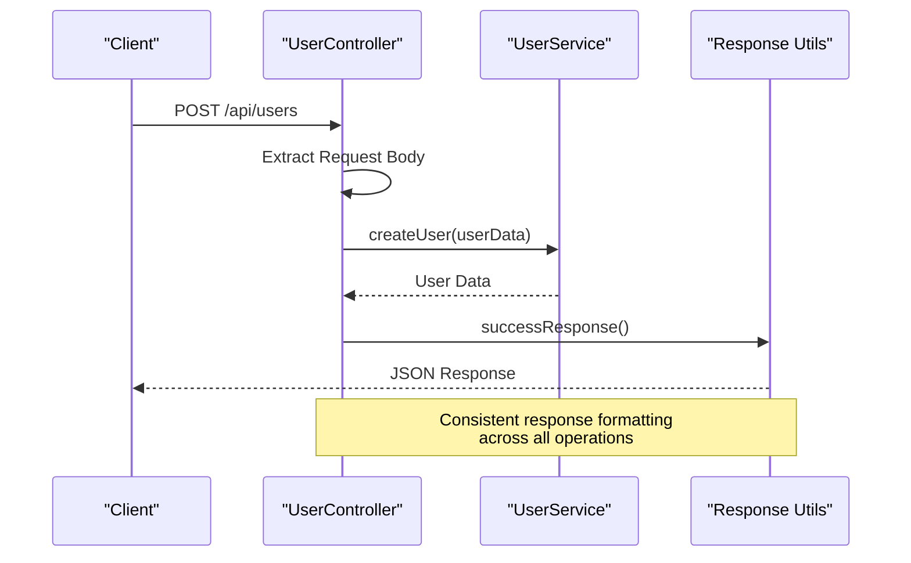
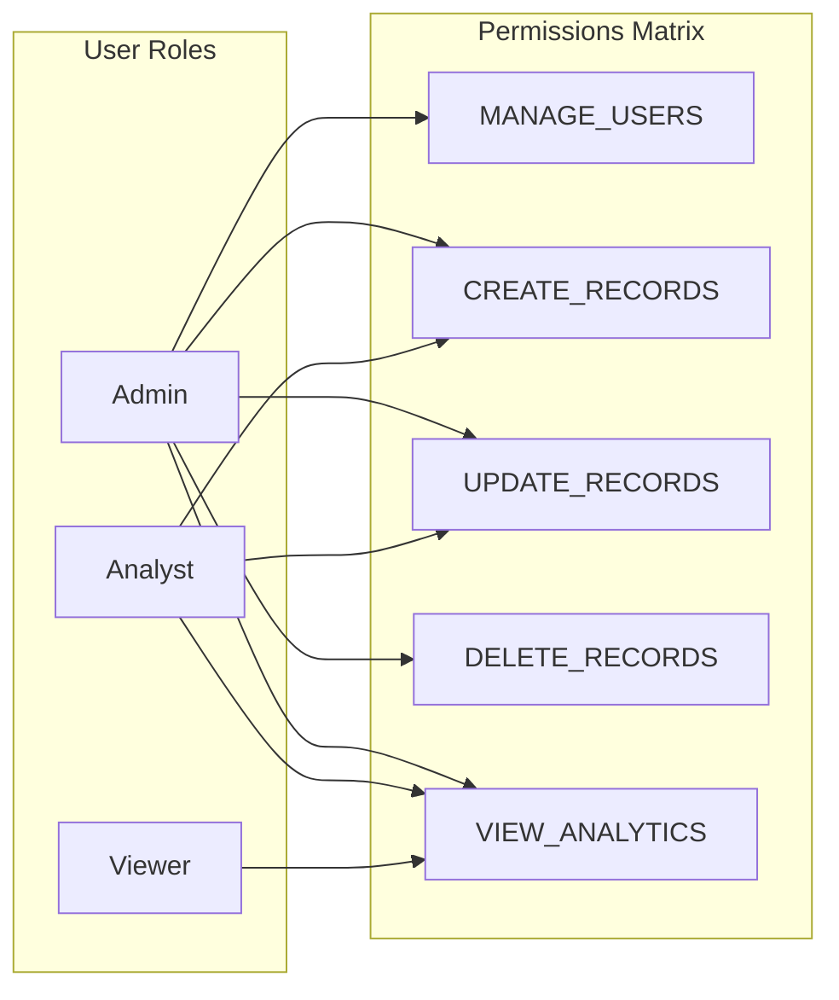
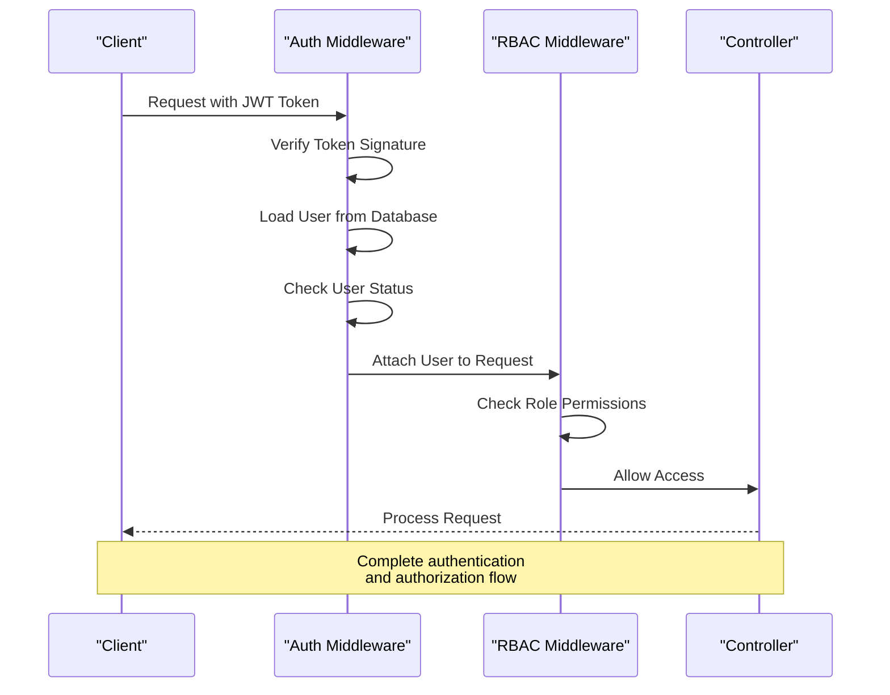
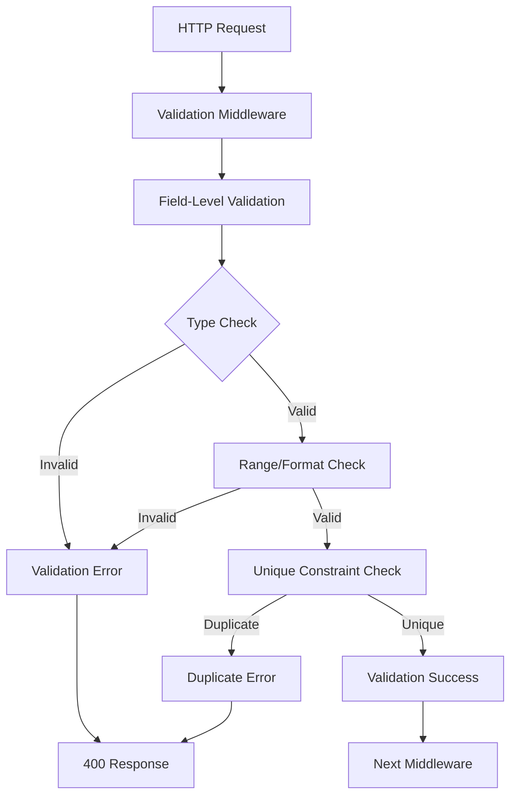

# User Management Service

<cite>
**Referenced Files in This Document**
- [userController.js](file://backend/controllers/userController.js)
- [userService.js](file://backend/services/userService.js)
- [User.js](file://backend/models/User.js)
- [users.js](file://backend/routes/users.js)
- [rbac.js](file://backend/middleware/rbac.js)
- [validation.js](file://backend/middleware/validation.js)
- [constants.js](file://backend/utils/constants.js)
- [auth.js](file://backend/middleware/auth.js)
- [response.js](file://backend/utils/response.js)
- [database.js](file://backend/config/database.js)
- [server.js](file://backend/server.js)
</cite>

## Table of Contents
1. [Introduction](#introduction)
2. [Project Structure](#project-structure)
3. [Core Components](#core-components)
4. [Architecture Overview](#architecture-overview)
5. [Detailed Component Analysis](#detailed-component-analysis)
6. [User Management Operations](#user-management-operations)
7. [Security and Access Control](#security-and-access-control)
8. [Data Validation and Error Handling](#data-validation-and-error-handling)
9. [Performance Considerations](#performance-considerations)
10. [Troubleshooting Guide](#troubleshooting-guide)
11. [Conclusion](#conclusion)

## Introduction

The User Management Service is a comprehensive backend system built with Node.js, Express, and MongoDB that provides full CRUD operations for user management with robust role-based access control (RBAC). This service handles user creation, retrieval, updates, deletions, and administrative functions while enforcing strict security policies and maintaining data integrity.

The system follows a layered architecture pattern with clear separation of concerns between controllers, services, models, middleware, and utilities. It implements modern security practices including JWT authentication, password hashing, input validation, and comprehensive access control mechanisms.

## Project Structure

The user management service is organized in a modular structure that promotes maintainability and scalability:

**Diagram sources**
- [server.js:1-113](file://backend/server.js#L1-L113)
- [users.js:1-64](file://backend/routes/users.js#L1-L64)

**Section sources**
- [server.js:1-113](file://backend/server.js#L1-L113)
- [users.js:1-64](file://backend/routes/users.js#L1-L64)

## Core Components

### User Model
The User model defines the data structure and business logic for user entities:

- **Schema Fields**: name, email, password, role, status with comprehensive validation
- **Indexes**: Optimized for email, role, and status queries
- **Methods**: Password hashing, role checking, status validation, and permission verification
- **Virtual Properties**: Role-based virtual fields for simplified role checking

### User Service
The service layer implements all business logic with:
- **CRUD Operations**: Complete user lifecycle management
- **Validation**: Input validation and business rule enforcement
- **Security**: Role-based restrictions and permission checks
- **Statistics**: User analytics and reporting capabilities

### User Controller
The controller handles HTTP requests and responses:
- **RESTful Endpoints**: Standard CRUD operations with proper HTTP status codes
- **Response Formatting**: Consistent API response structure
- **Error Handling**: Proper error propagation and user-friendly messages

**Section sources**
- [User.js:1-130](file://backend/models/User.js#L1-L130)
- [userService.js:1-276](file://backend/services/userService.js#L1-L276)
- [userController.js:1-152](file://backend/controllers/userController.js#L1-L152)

## Architecture Overview

The user management service follows a clean architecture pattern with clear separation of concerns:

**Diagram sources**
- [users.js:14-61](file://backend/routes/users.js#L14-L61)
- [userController.js:13-25](file://backend/controllers/userController.js#L13-L25)
- [userService.js:14-58](file://backend/services/userService.js#L14-L58)

The architecture ensures that:
- **Controllers** handle only HTTP concerns
- **Services** encapsulate business logic
- **Models** manage data persistence
- **Middleware** enforces cross-cutting concerns
- **Utilities** provide shared functionality

## Detailed Component Analysis

### User Model Implementation

The User model implements comprehensive validation and security features:

**Diagram sources**
- [User.js:10-127](file://backend/models/User.js#L10-L127)

**Key Features:**
- **Password Security**: Automatic bcrypt hashing with salt rounds
- **Input Validation**: Comprehensive field validation with custom error messages
- **Role Management**: Enum-based role validation with virtual properties
- **Status Tracking**: Active/inactive status with automatic timestamps

**Section sources**
- [User.js:1-130](file://backend/models/User.js#L1-L130)

### Service Layer Implementation

The service layer implements sophisticated business logic:

**Diagram sources**
- [userService.js:88-154](file://backend/services/userService.js#L88-L154)

**Section sources**
- [userService.js:1-276](file://backend/services/userService.js#L1-L276)

### Controller Layer Implementation

The controller layer manages HTTP request/response cycles:

**Diagram sources**
- [userController.js:51-64](file://backend/controllers/userController.js#L51-L64)

**Section sources**
- [userController.js:1-152](file://backend/controllers/userController.js#L1-L152)

## User Management Operations

### CRUD Operations

The user management service provides comprehensive CRUD functionality:

#### Create User
- **Endpoint**: POST `/api/users`
- **Authentication**: Required (Admin only)
- **Validation**: Complete user data validation
- **Security**: Role-based restrictions enforced
- **Default Values**: Viewer role and active status by default

#### Retrieve Users
- **Get All Users**: GET `/api/users` with pagination support
- **Get Single User**: GET `/api/users/:id`
- **Filtering**: Role and status filtering capabilities
- **Pagination**: Configurable page size with total count

#### Update User
- **Endpoint**: PUT `/api/users/:id`
- **Field Restrictions**: Only name, email, role, status can be updated
- **Email Validation**: Prevents duplicate email addresses
- **Permission Validation**: Enforces role hierarchy

#### Delete User
- **Endpoint**: DELETE `/api/users/:id`
- **Soft Delete**: Sets user status to inactive instead of permanent deletion
- **Admin Protection**: Prevents deletion of the last active admin

**Section sources**
- [users.js:14-61](file://backend/routes/users.js#L14-L61)
- [userService.js:14-221](file://backend/services/userService.js#L14-L221)

### Administrative Functions

#### Status Management
- **Toggle Status**: PUT `/api/users/:id/status`
- **Automatic Protection**: Prevents deactivation of the last active admin
- **Consistent Responses**: Clear feedback on status changes

#### Statistics Generation
- **Endpoint**: GET `/api/users/stats`
- **Metrics**: Total users, active users, inactive users
- **Role Distribution**: Count of users by role
- **Real-time Data**: Aggregated statistics from database

**Section sources**
- [userController.js:129-141](file://backend/controllers/userController.js#L129-L141)
- [userService.js:248-264](file://backend/services/userService.js#L248-L264)

## Security and Access Control

### Role-Based Access Control (RBAC)

The system implements a comprehensive RBAC system:

**Diagram sources**
- [constants.js:49-57](file://backend/utils/constants.js#L49-L57)
- [rbac.js:14-86](file://backend/middleware/rbac.js#L14-L86)

### Authentication Flow

**Diagram sources**
- [auth.js:14-59](file://backend/middleware/auth.js#L14-L59)
- [rbac.js:14-33](file://backend/middleware/rbac.js#L14-L33)

**Section sources**
- [rbac.js:1-151](file://backend/middleware/rbac.js#L1-L151)
- [auth.js:1-116](file://backend/middleware/auth.js#L1-L116)

## Data Validation and Error Handling

### Input Validation

The system implements comprehensive input validation:

**Diagram sources**
- [validation.js:13-27](file://backend/middleware/validation.js#L13-L27)

### Error Handling

The system provides consistent error handling:

| Error Type | HTTP Status | Response Format | Description |
|------------|-------------|----------------|-------------|
| Validation Error | 400 | `{success: false, error: [...]}` | Input validation failures |
| Authentication Error | 401 | `{success: false, error: "Unauthorized"}` | Missing/expired tokens |
| Authorization Error | 403 | `{success: false, error: "Forbidden"}` | Insufficient permissions |
| Not Found | 404 | `{success: false, error: "Not Found"}` | Resource not found |
| Server Error | 500 | `{success: false, error: "Error occurred"}` | Internal server errors |

**Section sources**
- [validation.js:1-309](file://backend/middleware/validation.js#L1-L309)
- [response.js:1-101](file://backend/utils/response.js#L1-L101)

## Performance Considerations

### Database Optimization

The system implements several performance optimizations:

- **Indexing Strategy**: Composite indexes on frequently queried fields
- **Query Optimization**: Efficient aggregation queries for statistics
- **Pagination**: Server-side pagination to prevent large result sets
- **Connection Pooling**: MongoDB connection pooling for concurrent requests

### Caching Opportunities

Potential caching strategies:
- **Role Permissions**: Cache permission lookups for authenticated users
- **User Profiles**: Cache frequently accessed user data
- **Statistics**: Cache aggregated statistics with TTL

### Scalability Considerations

- **Horizontal Scaling**: Stateless design allows easy horizontal scaling
- **Database Sharding**: Potential for sharding user collections
- **Load Balancing**: Round-robin load balancing across instances

## Troubleshooting Guide

### Common Issues and Solutions

#### Authentication Problems
- **Symptom**: 401 Unauthorized responses
- **Cause**: Invalid or missing JWT token
- **Solution**: Ensure proper token inclusion in Authorization header

#### Permission Denied
- **Symptom**: 403 Forbidden responses
- **Cause**: Insufficient role permissions
- **Solution**: Verify user role and required permissions

#### Validation Errors
- **Symptom**: 400 Bad Request with validation details
- **Cause**: Invalid input data format
- **Solution**: Review validation error messages for specific field issues

#### Database Connection Issues
- **Symptom**: Application fails to start
- **Cause**: MongoDB connection failure
- **Solution**: Verify database URI and network connectivity

**Section sources**
- [auth.js:14-59](file://backend/middleware/auth.js#L14-L59)
- [rbac.js:14-33](file://backend/middleware/rbac.js#L14-L33)

## Conclusion

The User Management Service provides a robust, secure, and scalable solution for user administration in financial dashboard applications. The implementation demonstrates best practices in:

- **Security**: Comprehensive authentication, authorization, and data protection
- **Architecture**: Clean separation of concerns with proper layering
- **Maintainability**: Modular design with clear interfaces and documentation
- **Performance**: Optimized database queries and efficient resource management
- **Extensibility**: Well-defined patterns for adding new features and functionality

The service successfully balances security requirements with usability, providing administrators with powerful tools for user management while maintaining strict access controls and data integrity. The comprehensive error handling, validation, and response formatting ensure reliable operation across various deployment scenarios.