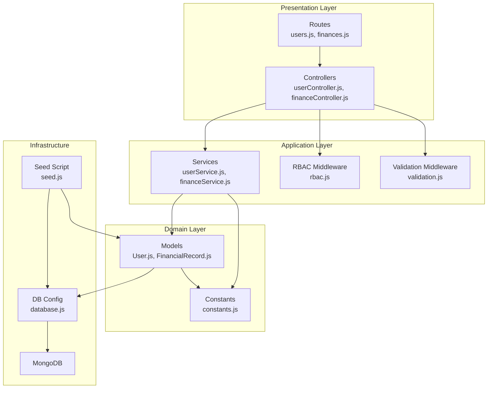
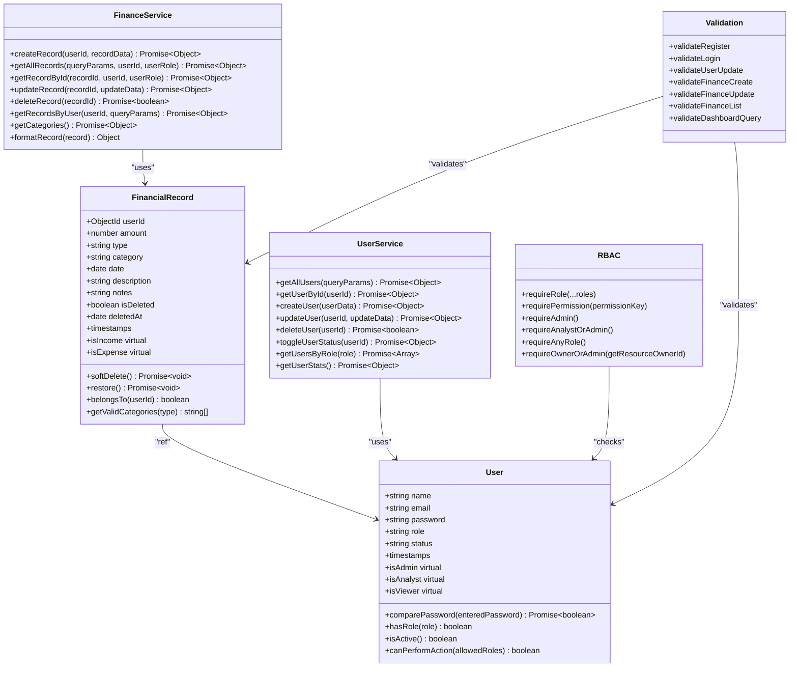
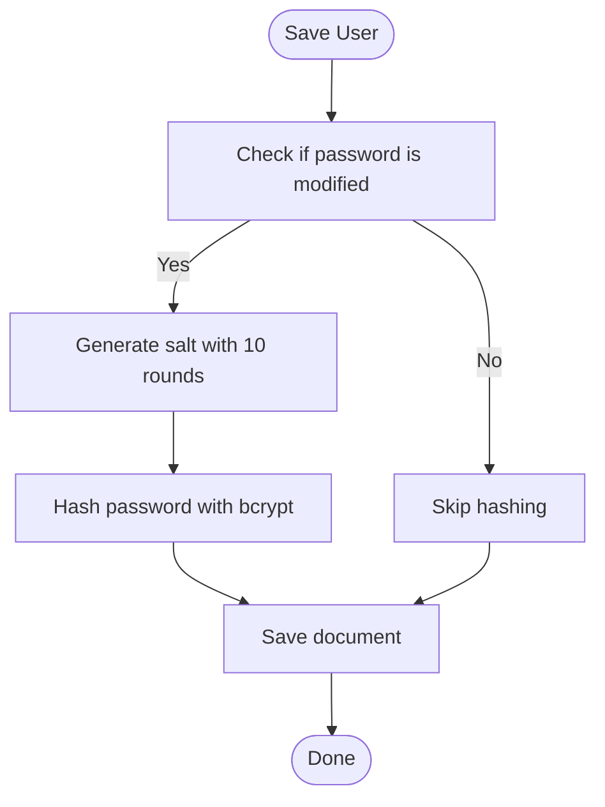
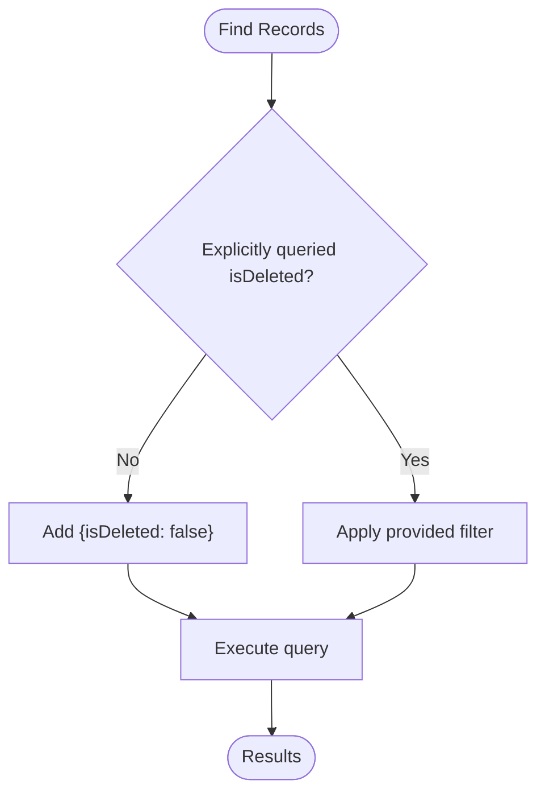
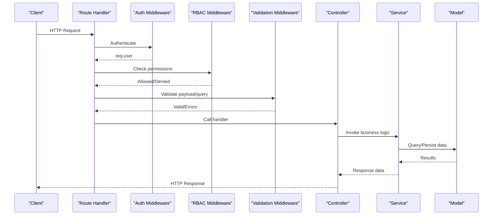
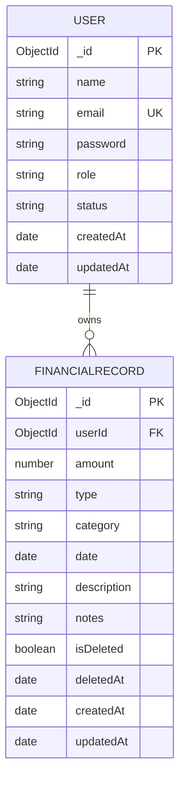
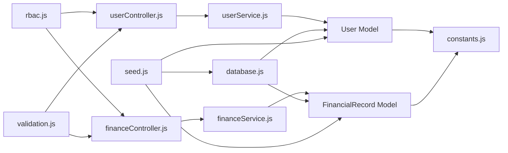

# Data Models & Database Schema

<cite>
**Referenced Files in This Document**
- [User.js](file://backend/models/User.js)
- [FinancialRecord.js](file://backend/models/FinancialRecord.js)
- [constants.js](file://backend/utils/constants.js)
- [database.js](file://backend/config/database.js)
- [validation.js](file://backend/middleware/validation.js)
- [rbac.js](file://backend/middleware/rbac.js)
- [userService.js](file://backend/services/userService.js)
- [financeService.js](file://backend/services/financeService.js)
- [userController.js](file://backend/controllers/userController.js)
- [financeController.js](file://backend/controllers/financeController.js)
- [users.js](file://backend/routes/users.js)
- [finances.js](file://backend/routes/finances.js)
- [seed.js](file://backend/scripts/seed.js)
</cite>

## Update Summary
**Changes Made**
- Enhanced User model with comprehensive validation rules and improved security measures
- Modernized FinancialRecord model with advanced indexing strategies and soft deletion capabilities
- Strengthened validation middleware with extensive input sanitization and constraint enforcement
- Improved RBAC middleware with granular permission matrix and resource ownership checks
- Enhanced service layer with sophisticated query building and data formatting
- Expanded constant definitions with comprehensive permission matrix and configuration settings

## Table of Contents
1. [Introduction](#introduction)
2. [Project Structure](#project-structure)
3. [Core Components](#core-components)
4. [Architecture Overview](#architecture-overview)
5. [Detailed Component Analysis](#detailed-component-analysis)
6. [Dependency Analysis](#dependency-analysis)
7. [Performance Considerations](#performance-considerations)
8. [Troubleshooting Guide](#troubleshooting-guide)
9. [Conclusion](#conclusion)
10. [Appendices](#appendices)

## Introduction
This document provides comprehensive data model documentation for the FDPAC Finance Dashboard. It covers the User and FinancialRecord models, including schema definitions, validation rules, business constraints, soft deletion mechanisms, indexing strategies, data access patterns, performance considerations, and security/access control measures. The system has been modernized with enhanced validation, improved indexing strategies, and comprehensive business logic enforcement.

## Project Structure
The backend follows a modern layered architecture with clear separation of concerns and comprehensive validation:
- Models define the data schemas with robust validation and business logic for persistence
- Services encapsulate complex business rules and coordinate model operations with sophisticated query building
- Controllers handle HTTP requests/responses and delegate to services with enhanced error handling
- Middleware enforces comprehensive validation and fine-grained access control
- Routes define the API surface with explicit middleware binding
- Utilities centralize shared constants, configurations, and permission matrices
- Scripts support database initialization and comprehensive seeding

**Diagram sources**
- [users.js:1-64](file://backend/routes/users.js#L1-L64)
- [finances.js:1-67](file://backend/routes/finances.js#L1-L67)
- [userController.js:1-152](file://backend/controllers/userController.js#L1-L152)
- [financeController.js:1-138](file://backend/controllers/financeController.js#L1-L138)
- [userService.js:1-276](file://backend/services/userService.js#L1-L276)
- [financeService.js:1-276](file://backend/services/financeService.js#L1-L276)
- [rbac.js:1-151](file://backend/middleware/rbac.js#L1-L151)
- [validation.js:1-309](file://backend/middleware/validation.js#L1-L309)
- [User.js:1-125](file://backend/models/User.js#L1-L125)
- [FinancialRecord.js:1-133](file://backend/models/FinancialRecord.js#L1-L133)
- [constants.js:1-81](file://backend/utils/constants.js#L1-L81)
- [database.js:1-43](file://backend/config/database.js#L1-L43)
- [seed.js:1-132](file://backend/scripts/seed.js#L1-L132)

**Section sources**
- [users.js:1-64](file://backend/routes/users.js#L1-L64)
- [finances.js:1-67](file://backend/routes/finances.js#L1-L67)
- [userController.js:1-152](file://backend/controllers/userController.js#L1-L152)
- [financeController.js:1-138](file://backend/controllers/financeController.js#L1-L138)
- [userService.js:1-276](file://backend/services/userService.js#L1-L276)
- [financeService.js:1-276](file://backend/services/financeService.js#L1-L276)
- [rbac.js:1-151](file://backend/middleware/rbac.js#L1-L151)
- [validation.js:1-309](file://backend/middleware/validation.js#L1-L309)
- [User.js:1-125](file://backend/models/User.js#L1-L125)
- [FinancialRecord.js:1-133](file://backend/models/FinancialRecord.js#L1-L133)
- [constants.js:1-81](file://backend/utils/constants.js#L1-L81)
- [database.js:1-43](file://backend/config/database.js#L1-L43)
- [seed.js:1-132](file://backend/scripts/seed.js#L1-L132)

## Core Components
This section documents the two primary data models and their associated business logic, now enhanced with comprehensive validation and modernized architecture.

### User Model
The User model defines the schema for user management with enhanced validation and security:
- Fields: name, email, password, role, status with comprehensive validation rules
- Validation rules: required fields, length limits, format checks, enum constraints, email normalization
- Business constraints: default role and status, password hashing, role-based access helpers, account lifecycle management
- Indexes: email, role, status for efficient querying and filtering
- Lifecycle: timestamps, virtuals for role checks, password comparison method, activity status management

Enhanced validation and constraints:
- Name: required, trimmed, max length 100, alphanumeric and space validation
- Email: required, unique, normalized, validated format with comprehensive regex pattern
- Password: required, minimum 6 characters, hashed before save, select=false to exclude from queries by default
- Role: enum with values from constants (viewer, analyst, admin), defaults to viewer
- Status: enum with values from constants (active, inactive), defaults to active

Business logic improvements:
- Password hashing using bcrypt with salt rounds 10 before save
- Enhanced methods for password comparison, role checks, activity status, and action permissions
- Virtual getters for role identification with comprehensive role checking
- Account lifecycle management with prevention of critical account deletions

Indexes enhancement:
- Single-field indexes on email, role, status for efficient filtering
- Timestamps enabled for createdAt and updatedAt
- Comprehensive indexing strategy for role-based queries

**Section sources**
- [User.js:10-54](file://backend/models/User.js#L10-L54)
- [User.js:64-81](file://backend/models/User.js#L64-L81)
- [User.js:88-107](file://backend/models/User.js#L88-L107)
- [User.js:110-120](file://backend/models/User.js#L110-L120)
- [constants.js:5-16](file://backend/utils/constants.js#L5-L16)

### FinancialRecord Model
The FinancialRecord model defines the schema for financial entries with advanced validation and modernized indexing:
- Fields: userId (foreign key), amount, type, category, date, description, notes, isDeleted, deletedAt with comprehensive validation
- Validation rules: required fields, numeric bounds, enum constraints, length limits, date validation
- Business constraints: soft deletion, default values, belongsTo check, category validation helpers, comprehensive data sanitization
- Indexes: individual and compound indexes for efficient queries with advanced optimization
- Lifecycle: timestamps, populate userId, pre-find middleware to exclude soft-deleted records by default

Enhanced validation and constraints:
- Amount: required, positive number with minimum 0 constraint
- Type: enum with values from constants (income/expense), required field
- Category: required, trimmed, max length 50, case-insensitive storage
- Date: required, defaults to now, supports range queries with ISO8601 validation
- Description/Notes: trimmed, max lengths 500 and 1000 respectively
- Soft deletion: isDeleted flag with default false, deletedAt timestamp with comprehensive tracking

Advanced business logic:
- Pre-find middleware excludes deleted records unless explicitly queried
- Enhanced methods for soft delete and restore with comprehensive state management
- Methods for ownership verification with robust user ID comparison
- Helper to check ownership with secure string comparison
- Static method to get valid categories based on type with comprehensive validation
- Virtual getters for income/expense classification with enhanced type checking

Enhanced indexing strategy:
- Individual indexes on userId, date, isDeleted for common query patterns
- Advanced compound indexes for optimal query performance:
  - userId + date (descending) for chronological queries
  - userId + type for role-based filtering
  - userId + category for category-based queries
  - userId + isDeleted for soft-deletion queries
  - type + date (descending) for global type queries
- Comprehensive indexing for performance optimization

**Section sources**
- [FinancialRecord.js:9-63](file://backend/models/FinancialRecord.js#L9-L63)
- [FinancialRecord.js:75-80](file://backend/models/FinancialRecord.js#L75-L80)
- [FinancialRecord.js:85-98](file://backend/models/FinancialRecord.js#L85-L98)
- [FinancialRecord.js:105-107](file://backend/models/FinancialRecord.js#L105-L107)
- [FinancialRecord.js:120-127](file://backend/models/FinancialRecord.js#L120-L127)
- [constants.js:18-46](file://backend/utils/constants.js#L18-L46)

## Architecture Overview
The data architecture integrates models with services, controllers, and middleware to enforce comprehensive validation and access control. The modernized system includes advanced validation, enhanced security, and sophisticated query optimization:

**Diagram sources**
- [User.js:1-125](file://backend/models/User.js#L1-L125)
- [FinancialRecord.js:1-133](file://backend/models/FinancialRecord.js#L1-L133)
- [userService.js:1-276](file://backend/services/userService.js#L1-L276)
- [financeService.js:1-276](file://backend/services/financeService.js#L1-L276)
- [rbac.js:1-151](file://backend/middleware/rbac.js#L1-L151)
- [validation.js:1-309](file://backend/middleware/validation.js#L1-L309)

## Detailed Component Analysis

### User Model Schema and Enhanced Validation
The User model now enforces comprehensive validation and business rules with enhanced security:
- Name: required, trimmed, max 100 chars, alphanumeric and space validation
- Email: required, unique, normalized, validated format with comprehensive regex pattern
- Password: required, minimum 6 characters, hashed before save, excluded from default queries
- Role: enum from constants (viewer, analyst, admin), default viewer
- Status: enum from constants (active, inactive), default active
- Indexes: email, role, status for efficient filtering and sorting
- Lifecycle: timestamps, virtuals for role checks, password comparison, activity checks, and permission evaluation

**Diagram sources**
- [User.js:64-81](file://backend/models/User.js#L64-L81)

**Section sources**
- [User.js:10-54](file://backend/models/User.js#L10-L54)
- [User.js:64-81](file://backend/models/User.js#L64-L81)
- [User.js:88-107](file://backend/models/User.js#L88-L107)
- [User.js:110-120](file://backend/models/User.js#L110-L120)
- [constants.js:5-16](file://backend/utils/constants.js#L5-L16)

### FinancialRecord Model Schema and Advanced Validation
The FinancialRecord model includes robust validation and enhanced soft deletion with comprehensive indexing:
- Amount: required, positive number with minimum 0 constraint
- Type: enum from constants (income/expense), required field
- Category: required, trimmed, max length 50, case-insensitive storage
- Date: required, defaults to now, supports range queries with ISO8601 validation
- Description/Notes: trimmed, max lengths 500 and 1000 respectively
- Soft deletion: isDeleted flag with default false, deletedAt timestamp
- Indexes: individual and compound indexes for common query patterns with advanced optimization
- Lifecycle: timestamps, populate userId, pre-find middleware to exclude deleted records

**Diagram sources**
- [FinancialRecord.js:75-80](file://backend/models/FinancialRecord.js#L75-L80)

**Section sources**
- [FinancialRecord.js:9-63](file://backend/models/FinancialRecord.js#L9-L63)
- [FinancialRecord.js:75-80](file://backend/models/FinancialRecord.js#L75-L80)
- [FinancialRecord.js:85-98](file://backend/models/FinancialRecord.js#L85-L98)
- [constants.js:18-46](file://backend/utils/constants.js#L18-L46)

### Enhanced Data Access Patterns and Security
Data access is governed by comprehensive middleware and service logic with advanced validation:
- Authentication middleware ensures requests are authenticated
- RBAC middleware enforces role-based permissions with granular control and ownership checks
- Validation middleware validates request payloads with extensive sanitization and constraint enforcement
- Services implement sophisticated business rules, filtering, and population of related data
- Comprehensive error handling and response formatting

**Diagram sources**
- [users.js:1-64](file://backend/routes/users.js#L1-L64)
- [finances.js:1-67](file://backend/routes/finances.js#L1-L67)
- [rbac.js:1-151](file://backend/middleware/rbac.js#L1-L151)
- [validation.js:1-309](file://backend/middleware/validation.js#L1-L309)
- [userController.js:1-152](file://backend/controllers/userController.js#L1-L152)
- [financeController.js:1-138](file://backend/controllers/financeController.js#L1-L138)
- [userService.js:1-276](file://backend/services/userService.js#L1-L276)
- [financeService.js:1-276](file://backend/services/financeService.js#L1-L276)

**Section sources**
- [rbac.js:1-151](file://backend/middleware/rbac.js#L1-L151)
- [validation.js:1-309](file://backend/middleware/validation.js#L1-L309)
- [userController.js:1-152](file://backend/controllers/userController.js#L1-L152)
- [financeController.js:1-138](file://backend/controllers/financeController.js#L1-L138)
- [userService.js:1-276](file://backend/services/userService.js#L1-L276)
- [financeService.js:1-276](file://backend/services/financeService.js#L1-L276)

### Database Schema and Enhanced Entity Relationships
The database schema consists of two collections with a one-to-many relationship and comprehensive indexing:
- User collection stores user profiles and credentials with enhanced validation
- FinancialRecord collection stores financial entries linked to users via userId with advanced indexing

**Diagram sources**
- [User.js:1-125](file://backend/models/User.js#L1-L125)
- [FinancialRecord.js:1-133](file://backend/models/FinancialRecord.js#L1-L133)

**Section sources**
- [User.js:1-125](file://backend/models/User.js#L1-L125)
- [FinancialRecord.js:1-133](file://backend/models/FinancialRecord.js#L1-L133)

## Dependency Analysis
The models depend on comprehensive constants for enums and validation, while services orchestrate sophisticated model operations and controllers expose endpoints with enhanced middleware integration.

**Diagram sources**
- [User.js:1-125](file://backend/models/User.js#L1-L125)
- [FinancialRecord.js:1-133](file://backend/models/FinancialRecord.js#L1-L133)
- [constants.js:1-81](file://backend/utils/constants.js#L1-L81)
- [userService.js:1-276](file://backend/services/userService.js#L1-L276)
- [financeService.js:1-276](file://backend/services/financeService.js#L1-L276)
- [userController.js:1-152](file://backend/controllers/userController.js#L1-L152)
- [financeController.js:1-138](file://backend/controllers/financeController.js#L1-L138)
- [rbac.js:1-151](file://backend/middleware/rbac.js#L1-L151)
- [validation.js:1-309](file://backend/middleware/validation.js#L1-L309)
- [database.js:1-43](file://backend/config/database.js#L1-L43)
- [seed.js:1-132](file://backend/scripts/seed.js#L1-L132)

**Section sources**
- [constants.js:1-81](file://backend/utils/constants.js#L1-L81)
- [userService.js:1-276](file://backend/services/userService.js#L1-L276)
- [financeService.js:1-276](file://backend/services/financeService.js#L1-L276)
- [userController.js:1-152](file://backend/controllers/userController.js#L1-L152)
- [financeController.js:1-138](file://backend/controllers/financeController.js#L1-L138)
- [rbac.js:1-151](file://backend/middleware/rbac.js#L1-L151)
- [validation.js:1-309](file://backend/middleware/validation.js#L1-L309)
- [database.js:1-43](file://backend/config/database.js#L1-L43)
- [seed.js:1-132](file://backend/scripts/seed.js#L1-L132)

## Performance Considerations
Enhanced indexing strategy with comprehensive optimization:
- User model: indexes on email, role, status to optimize filtering and sorting with case-insensitive email handling
- FinancialRecord model: advanced indexes on userId, date, isDeleted, plus sophisticated compound indexes:
  - userId + date (descending) for chronological queries with optimal sorting
  - userId + type for role-based filtering with type-based queries
  - userId + category for category-based queries with case-insensitive category storage
  - userId + isDeleted for soft-deletion queries with comprehensive filtering
  - type + date (descending) for global type queries with performance optimization

Advanced query optimization:
- Pre-find middleware excludes soft-deleted records by default with explicit query parameter handling
- Population of userId with selective field projection to reduce data transfer
- Sophisticated pagination with configurable limits and comprehensive validation
- Query building with dynamic filter construction and parameter validation

Enhanced security considerations:
- Passwords are hashed with bcrypt salt rounds 10 before save and excluded from default queries
- RBAC middleware prevents unauthorized access based on roles, status, and ownership
- Comprehensive validation middleware ensures input sanitization, constraint enforcement, and XSS protection
- Enhanced error handling with detailed validation error reporting

## Troubleshooting Guide
Enhanced troubleshooting with comprehensive error handling:
- Authentication failures: Ensure authentication middleware is applied and tokens are valid with detailed error messages
- Authorization failures: Verify RBAC permissions, user roles, and status; inactive users are blocked with specific error codes
- Validation errors: Review comprehensive validation middleware messages for required fields, formats, and constraints with detailed field information
- Soft-deleted records: Queries exclude deleted records by default; explicitly set isDeleted in filters to include them with query parameter guidance
- Ownership violations: Resource-level permissions require the logged-in user to own the resource or be admin with specific ownership verification
- Database connection issues: Check MongoDB connection configuration and network connectivity with detailed error logging
- Index performance issues: Monitor query execution plans and consider additional indexing strategies for specific query patterns

**Section sources**
- [rbac.js:1-151](file://backend/middleware/rbac.js#L1-L151)
- [validation.js:1-309](file://backend/middleware/validation.js#L1-L309)
- [financeService.js:111-131](file://backend/services/financeService.js#L111-L131)
- [database.js:11-25](file://backend/config/database.js#L11-L25)

## Conclusion
The FDPAC Finance Dashboard employs well-defined data models with comprehensive validation, clear business constraints, and robust security controls. The modernized User and FinancialRecord models provide a solid foundation for user management and financial record keeping with enhanced validation, improved indexing strategies, and sophisticated business logic. The combination of middleware-driven validation, comprehensive RBAC, and advanced query optimization ensures data integrity, access control, and optimal performance. The enhanced indexing strategy and query patterns are designed for scalability and maintainability.

## Appendices

### Enhanced Data Lifecycle Management
- User lifecycle: creation with comprehensive validation and hashed passwords, role assignment with security constraints, status management with prevention of critical account deletions, and soft deactivation with audit trail
- FinancialRecord lifecycle: creation with advanced validation and sanitization, categorization with case-insensitive storage, soft deletion with comprehensive tracking, and restoration with state recovery

**Section sources**
- [User.js:64-81](file://backend/models/User.js#L64-L81)
- [User.js:88-107](file://backend/models/User.js#L88-L107)
- [FinancialRecord.js:75-80](file://backend/models/FinancialRecord.js#L75-L80)
- [FinancialRecord.js:85-98](file://backend/models/FinancialRecord.js#L85-L98)

### Enhanced Database Initialization and Seeding
The seed script initializes the database with comprehensive sample users and financial records, demonstrating the enhanced data model with sophisticated validation and realistic financial data patterns.

**Section sources**
- [seed.js:82-132](file://backend/scripts/seed.js#L82-L132)