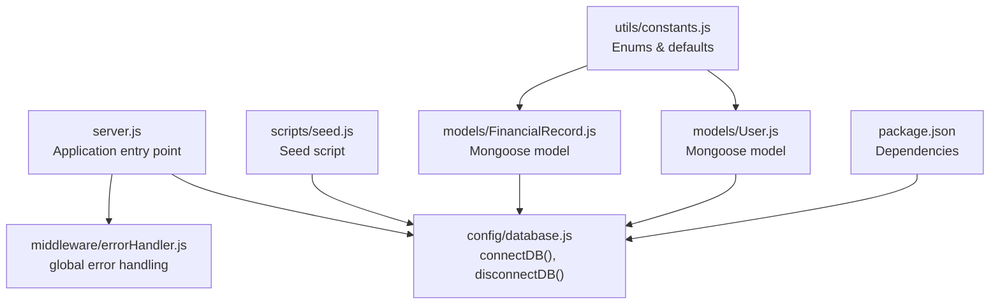
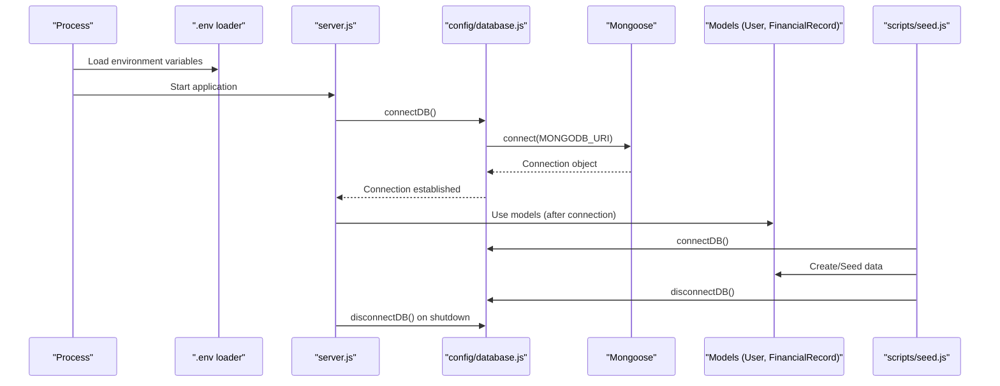
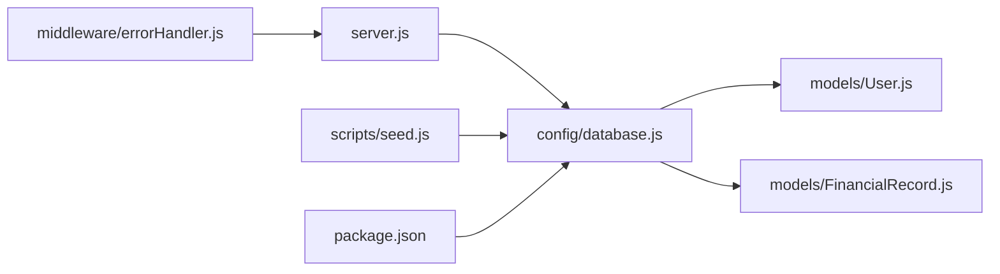

# Database Configuration & Connection

<cite>
**Referenced Files in This Document**
- [database.js](file://backend/config/database.js)
- [server.js](file://backend/server.js)
- [errorHandler.js](file://backend/middleware/errorHandler.js)
- [seed.js](file://backend/scripts/seed.js)
- [User.js](file://backend/models/User.js)
- [FinancialRecord.js](file://backend/models/FinancialRecord.js)
- [constants.js](file://backend/utils/constants.js)
- [package.json](file://backend/package.json)
- [README.md](file://backend/README.md)
</cite>

## Table of Contents
1. [Introduction](#introduction)
2. [Project Structure](#project-structure)
3. [Core Components](#core-components)
4. [Architecture Overview](#architecture-overview)
5. [Detailed Component Analysis](#detailed-component-analysis)
6. [Dependency Analysis](#dependency-analysis)
7. [Performance Considerations](#performance-considerations)
8. [Troubleshooting Guide](#troubleshooting-guide)
9. [Conclusion](#conclusion)
10. [Appendices](#appendices)

## Introduction
This document provides comprehensive guidance for MongoDB database configuration and connection management in the backend. It covers connection setup, environment variable requirements, connection lifecycle, error handling, graceful shutdown, and operational best practices. It also outlines environment-specific configurations and highlights how the application initializes the database and manages connections during development, staging, and production.

## Project Structure
The database configuration and connection management are centralized in a dedicated module and integrated into the application’s startup flow. Supporting components include models that rely on the connection, a seed script that exercises the connection lifecycle, and error handling middleware that ensures robustness.

**Diagram sources**
- [server.js:1-113](file://backend/server.js#L1-L113)
- [database.js:1-43](file://backend/config/database.js#L1-L43)
- [errorHandler.js:1-179](file://backend/middleware/errorHandler.js#L1-L179)
- [seed.js:1-132](file://backend/scripts/seed.js#L1-L132)
- [User.js:1-130](file://backend/models/User.js#L1-L130)
- [FinancialRecord.js:1-134](file://backend/models/FinancialRecord.js#L1-L134)
- [constants.js:1-81](file://backend/utils/constants.js#L1-L81)
- [package.json:1-29](file://backend/package.json#L1-L29)

**Section sources**
- [server.js:1-113](file://backend/server.js#L1-L113)
- [database.js:1-43](file://backend/config/database.js#L1-L43)
- [seed.js:1-132](file://backend/scripts/seed.js#L1-L132)
- [User.js:1-130](file://backend/models/User.js#L1-L130)
- [FinancialRecord.js:1-134](file://backend/models/FinancialRecord.js#L1-L134)
- [constants.js:1-81](file://backend/utils/constants.js#L1-L81)
- [package.json:1-29](file://backend/package.json#L1-L29)

## Core Components
- Database connection module: Provides asynchronous connection and disconnection functions using Mongoose.
- Application entry point: Loads environment variables, connects to the database, sets up middleware and routes, and starts the server.
- Error handling middleware: Centralizes error processing, including database-related errors.
- Seed script: Demonstrates connection lifecycle management and cleanup.
- Models: Define schemas that depend on the established connection.

Key responsibilities:
- Establish a persistent connection to MongoDB at startup.
- Provide a clean disconnect for maintenance and shutdown.
- Surface connection failures early to prevent silent failures.
- Ensure graceful shutdown on unhandled rejections.

**Section sources**
- [database.js:11-42](file://backend/config/database.js#L11-L42)
- [server.js:6-27](file://backend/server.js#L6-L27)
- [errorHandler.js:89-145](file://backend/middleware/errorHandler.js#L89-L145)
- [seed.js:82-124](file://backend/scripts/seed.js#L82-L124)
- [User.js:10-54](file://backend/models/User.js#L10-L54)
- [FinancialRecord.js:9-63](file://backend/models/FinancialRecord.js#L9-L63)

## Architecture Overview
The application initializes the database connection during startup and integrates it with the Express server lifecycle. Models are defined against Mongoose and rely on the connection established by the configuration module. The seed script demonstrates a typical connection-disconnect cycle for data initialization.

**Diagram sources**
- [server.js:6-27](file://backend/server.js#L6-L27)
- [database.js:11-25](file://backend/config/database.js#L11-L25)
- [seed.js:82-124](file://backend/scripts/seed.js#L82-L124)
- [User.js:127](file://backend/models/User.js#L127)
- [FinancialRecord.js:130](file://backend/models/FinancialRecord.js#L130)

## Detailed Component Analysis

### Database Connection Module
- Purpose: Encapsulates MongoDB connection and disconnection using Mongoose.
- Connection string: Uses an environment variable with a local fallback.
- Error handling: Logs connection errors and exits the process on failure.
- Disconnection: Provides a controlled disconnection routine.

Implementation highlights:
- Asynchronous connection and error propagation.
- Logging of connection host upon success.
- Exported functions for reuse across the application.

Operational notes:
- The module does not set explicit connection pool options; defaults apply.
- There is no built-in retry loop; failures cause immediate process exit.

**Section sources**
- [database.js:11-25](file://backend/config/database.js#L11-L25)
- [database.js:30-37](file://backend/config/database.js#L30-L37)

### Application Entry Point and Lifecycle
- Environment loading: Loads environment variables before any other logic.
- Database connection: Calls the connection function synchronously at startup.
- Middleware and routes: Sets up CORS, JSON parsing, logging (development), and routes.
- Health endpoint: Exposes a simple health check.
- Unhandled rejections: Graceful shutdown with server closure.
- Server startup: Starts the Express server on a configurable port.

Lifecycle implications:
- Early connection failure terminates the process.
- Graceful shutdown hooks ensure resources are released.

**Section sources**
- [server.js:6-27](file://backend/server.js#L6-L27)
- [server.js:86-110](file://backend/server.js#L86-L110)

### Error Handling and Database Errors
- Centralized error handler: Normalizes responses and handles various error types.
- Database-specific handling: Converts Mongoose validation, duplicate key, and cast errors into structured responses.
- Uncaught exceptions and unhandled rejections: Ensures process termination with logs.

Impact on database operations:
- Validation and uniqueness violations are surfaced with clear messages.
- Cast errors (e.g., invalid ObjectId) are handled gracefully.
- Unhandled database errors propagate through the global handler.

**Section sources**
- [errorHandler.js:89-145](file://backend/middleware/errorHandler.js#L89-L145)
- [errorHandler.js:150-171](file://backend/middleware/errorHandler.js#L150-L171)

### Seed Script and Connection Lifecycle
- Environment loading: Loads variables before connecting.
- Connection: Establishes a connection prior to seeding.
- Data creation: Uses models to create users and financial records.
- Cleanup: Disconnects and exits cleanly.

Lifecycle pattern:
- connect -> operate -> disconnect -> exit.

**Section sources**
- [seed.js:6-8](file://backend/scripts/seed.js#L6-L8)
- [seed.js:82-124](file://backend/scripts/seed.js#L82-L124)

### Models and Connection Dependencies
- User model: Defines schema, indexes, and methods; relies on an active connection.
- Financial record model: Defines schema, compound indexes, and pre-find middleware; relies on an active connection.
- Constants: Enums and defaults used by models.

Connection impact:
- Schemas are registered with Mongoose when models are imported.
- Queries and operations depend on the connection established by the configuration module.

**Section sources**
- [User.js:10-54](file://backend/models/User.js#L10-L54)
- [FinancialRecord.js:9-63](file://backend/models/FinancialRecord.js#L9-L63)
- [constants.js:6-57](file://backend/utils/constants.js#L6-L57)

### Environment Variables and Configuration
- Required variables:
  - MONGODB_URI: MongoDB connection string.
  - JWT_SECRET: JWT signing secret.
  - Optional variables:
    - PORT: Server port.
    - NODE_ENV: Environment mode (development by default).

Defaults:
- Local MongoDB URI fallback is used when the environment variable is missing.

Operational guidance:
- Ensure MONGODB_URI is set for production and staging.
- Set NODE_ENV appropriately to enable development logging and route behavior.

**Section sources**
- [database.js:13](file://backend/config/database.js#L13)
- [README.md:283-292](file://backend/README.md#L283-L292)
- [server.js:35-40](file://backend/server.js#L35-L40)

### SSL/TLS and Secure Connections
- The current configuration does not expose explicit SSL/TLS options.
- For secure cloud deployments, configure MONGODB_URI with TLS options as needed.
- Consider using environment-specific URIs for different environments.

[No sources needed since this section provides general guidance]

### Connection Pooling and Timeouts
- The configuration module does not set explicit pool or timeout options.
- Default Mongoose/MongoDB driver behavior applies.
- For production, consider adding connection pool and socket timeout options to the connection call.

[No sources needed since this section provides general guidance]

### Connection Retry Strategies
- The current implementation does not include automatic retry logic.
- On connection failure, the process exits immediately.
- Implement a retry loop with exponential backoff if resilience is required.

[No sources needed since this section provides general guidance]

### Connection Initialization and Health Monitoring
- Initialization: The server calls the connection function at startup and logs the connection host.
- Health monitoring: A simple GET endpoint returns server status and environment metadata.
- Recommendations:
  - Add a database health check endpoint that pings the connection.
  - Monitor connection state and log reconnect attempts if retries are implemented.

**Section sources**
- [database.js:19](file://backend/config/database.js#L19)
- [server.js:42-50](file://backend/server.js#L42-L50)

### Graceful Shutdown Procedures
- Unhandled rejections: The process listens for unhandled rejections, logs the error, closes the server, and exits.
- Disconnection: The configuration module provides a disconnect function for cleanup.
- Seed script: Demonstrates disconnect before process exit.

**Section sources**
- [server.js:101-110](file://backend/server.js#L101-L110)
- [database.js:30-37](file://backend/config/database.js#L30-L37)
- [seed.js:121](file://backend/scripts/seed.js#L121)

### Environment-Specific Configurations
- Development:
  - NODE_ENV set to development enables request logging middleware.
  - Default MONGODB_URI points to a local MongoDB instance.
- Staging/Production:
  - Set MONGODB_URI to a managed MongoDB instance.
  - Configure JWT_SECRET and other secrets via environment variables.
  - Ensure proper firewall and network policies for the database endpoint.

**Section sources**
- [server.js:35-40](file://backend/server.js#L35-L40)
- [database.js:13](file://backend/config/database.js#L13)
- [README.md:283-292](file://backend/README.md#L283-L292)

## Dependency Analysis
The database module is a core dependency for models and scripts. The server depends on the database module for connectivity, while the seed script uses it for initialization and cleanup. Error handling middleware interacts with database errors to produce consistent responses.

**Diagram sources**
- [database.js:1-43](file://backend/config/database.js#L1-L43)
- [User.js:1-130](file://backend/models/User.js#L1-L130)
- [FinancialRecord.js:1-134](file://backend/models/FinancialRecord.js#L1-L134)
- [server.js:1-113](file://backend/server.js#L1-L113)
- [seed.js:1-132](file://backend/scripts/seed.js#L1-L132)
- [errorHandler.js:1-179](file://backend/middleware/errorHandler.js#L1-L179)
- [package.json:1-29](file://backend/package.json#L1-L29)

**Section sources**
- [database.js:1-43](file://backend/config/database.js#L1-L43)
- [User.js:1-130](file://backend/models/User.js#L1-L130)
- [FinancialRecord.js:1-134](file://backend/models/FinancialRecord.js#L1-L134)
- [server.js:1-113](file://backend/server.js#L1-L113)
- [seed.js:1-132](file://backend/scripts/seed.js#L1-L132)
- [errorHandler.js:1-179](file://backend/middleware/errorHandler.js#L1-L179)
- [package.json:1-29](file://backend/package.json#L1-L29)

## Performance Considerations
- Connection pooling: Consider configuring pool size and timeouts for production workloads.
- Indexes: Models define indexes to optimize queries; ensure they align with expected access patterns.
- Logging overhead: Development logging adds overhead; disable in production.
- Graceful shutdown: Ensure server closure completes before process exit to avoid resource leaks.

[No sources needed since this section provides general guidance]

## Troubleshooting Guide
Common issues and resolutions:
- Connection fails on startup:
  - Verify MONGODB_URI is set and reachable.
  - Check MongoDB service availability and network/firewall rules.
  - Review logs for the exact error message.
- Duplicate key errors:
  - The error handler converts duplicate key errors into structured responses; adjust inputs to ensure uniqueness.
- Validation errors:
  - Inputs must satisfy schema constraints; review error details for affected fields.
- Cast errors:
  - Invalid ObjectId values cause cast errors; validate identifiers passed to endpoints.
- Unhandled rejections:
  - The server listens for unhandled rejections and shuts down gracefully; investigate logs to identify root causes.

**Section sources**
- [errorHandler.js:101-136](file://backend/middleware/errorHandler.js#L101-L136)
- [server.js:101-110](file://backend/server.js#L101-L110)

## Conclusion
The backend’s database configuration is straightforward and robust for development and basic production scenarios. It establishes a connection at startup, exposes a health endpoint, and provides a clean disconnect routine. For production, consider adding connection pooling, explicit SSL/TLS options, retry logic, and a database health check endpoint. Proper environment variable management and graceful shutdown procedures ensure reliable operation across environments.

[No sources needed since this section summarizes without analyzing specific files]

## Appendices

### Best Practices for Connection Management
- Set MONGODB_URI in all environments.
- Use environment-specific URIs for cloud providers.
- Implement retry logic with exponential backoff for resilience.
- Configure connection pool size and socket timeouts for production.
- Add a database health check endpoint.
- Monitor connection state and logs.

[No sources needed since this section provides general guidance]

### Example Patterns
- Proper connection setup:
  - Load environment variables.
  - Call the connection function at startup.
  - Log success and proceed with model usage.
- Error handling patterns:
  - Use the global error handler for database errors.
  - Convert validation and duplicate key errors into user-friendly messages.
- Environment-specific configurations:
  - Development: Local MongoDB URI, development logging enabled.
  - Staging/Production: Managed MongoDB URI, strict secrets, minimal logging.

[No sources needed since this section provides general guidance]