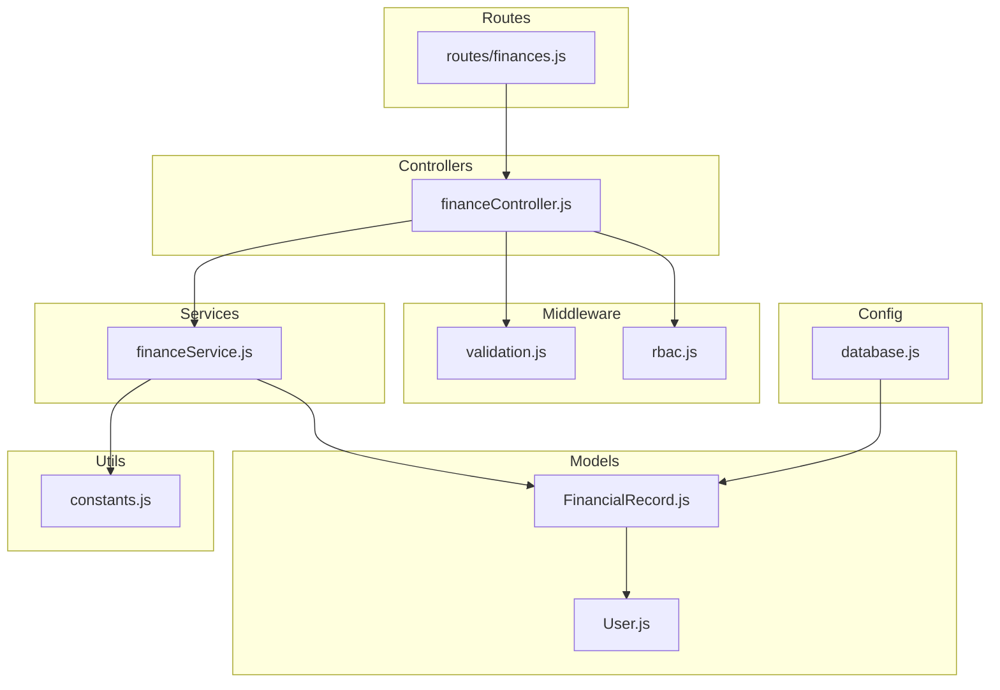
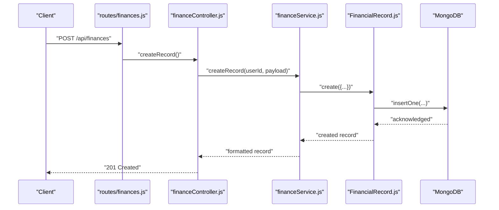
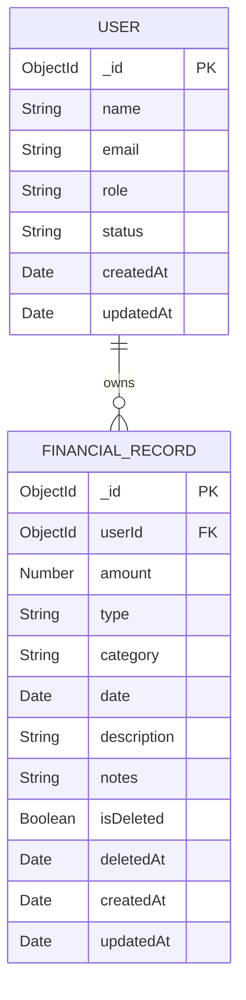
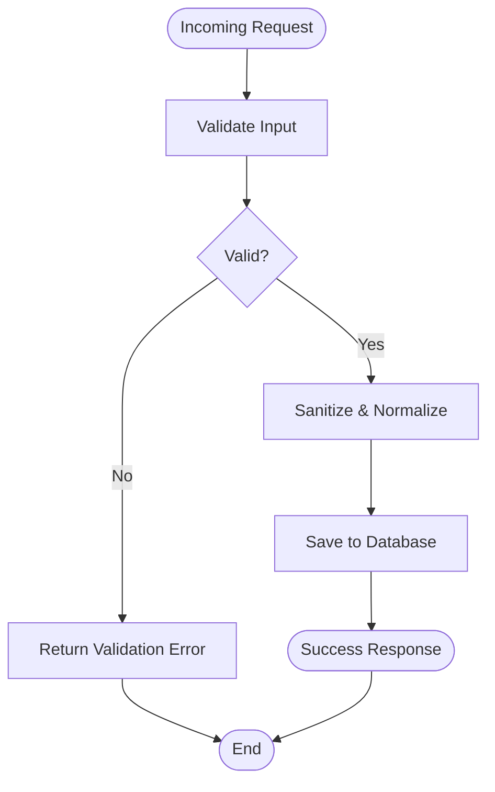
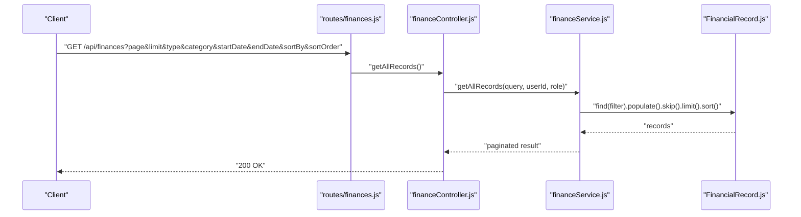
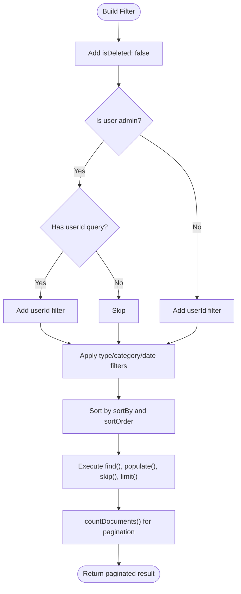
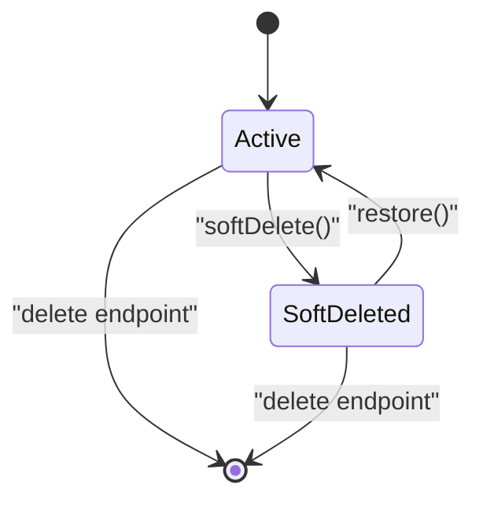
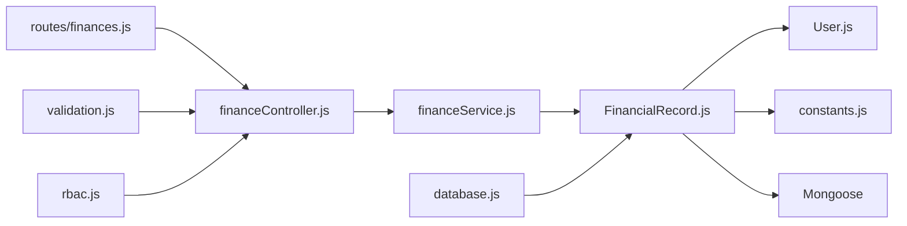

# Financial Record Model Schema

<cite>
**Referenced Files in This Document**
- [FinancialRecord.js](file://backend/models/FinancialRecord.js)
- [User.js](file://backend/models/User.js)
- [constants.js](file://backend/utils/constants.js)
- [financeController.js](file://backend/controllers/financeController.js)
- [financeService.js](file://backend/services/financeService.js)
- [finances.js](file://backend/routes/finances.js)
- [validation.js](file://backend/middleware/validation.js)
- [rbac.js](file://backend/middleware/rbac.js)
- [database.js](file://backend/config/database.js)
</cite>

## Table of Contents
1. [Introduction](#introduction)
2. [Project Structure](#project-structure)
3. [Core Components](#core-components)
4. [Architecture Overview](#architecture-overview)
5. [Detailed Component Analysis](#detailed-component-analysis)
6. [Dependency Analysis](#dependency-analysis)
7. [Performance Considerations](#performance-considerations)
8. [Troubleshooting Guide](#troubleshooting-guide)
9. [Conclusion](#conclusion)
10. [Appendices](#appendices)

## Introduction
This document provides comprehensive data model documentation for the FinancialRecord model schema used in the Finance Dashboard application. It covers the complete schema definition, relationships with the User model, soft deletion mechanism, indexing strategy, validation rules, business constraints, CRUD operations, query patterns, aggregation capabilities, and lifecycle management. The goal is to enable developers and stakeholders to understand how financial records are modeled, validated, stored, queried, and managed within the system.

## Project Structure
The FinancialRecord model resides in the models directory alongside the User model. Supporting components include controllers, services, routes, middleware for validation and RBAC, shared constants, and database configuration.



**Diagram sources**
- [FinancialRecord.js:1-134](file://backend/models/FinancialRecord.js#L1-L134)
- [User.js:1-130](file://backend/models/User.js#L1-L130)
- [financeController.js:1-138](file://backend/controllers/financeController.js#L1-L138)
- [financeService.js:1-264](file://backend/services/financeService.js#L1-L264)
- [finances.js:1-67](file://backend/routes/finances.js#L1-L67)
- [validation.js:1-309](file://backend/middleware/validation.js#L1-L309)
- [rbac.js:1-151](file://backend/middleware/rbac.js#L1-L151)
- [database.js:1-43](file://backend/config/database.js#L1-L43)
- [constants.js:1-81](file://backend/utils/constants.js#L1-L81)

**Section sources**
- [FinancialRecord.js:1-134](file://backend/models/FinancialRecord.js#L1-L134)
- [User.js:1-130](file://backend/models/User.js#L1-L130)
- [financeController.js:1-138](file://backend/controllers/financeController.js#L1-L138)
- [financeService.js:1-264](file://backend/services/financeService.js#L1-L264)
- [finances.js:1-67](file://backend/routes/finances.js#L1-L67)
- [validation.js:1-309](file://backend/middleware/validation.js#L1-L309)
- [rbac.js:1-151](file://backend/middleware/rbac.js#L1-L151)
- [database.js:1-43](file://backend/config/database.js#L1-L43)
- [constants.js:1-81](file://backend/utils/constants.js#L1-L81)

## Core Components
- FinancialRecord model: Defines the schema for financial entries (income/expense), including relationships, validations, indexes, and soft deletion helpers.
- User model: Defines user management with roles and status, referenced by FinancialRecord.
- Constants: Centralized definitions for record types, categories, permissions, pagination defaults, and JWT configuration.
- Services: Business logic for CRUD operations, filtering, pagination, and category retrieval.
- Controllers: HTTP handlers delegating to services.
- Routes: Expose CRUD endpoints with authentication and authorization.
- Validation and RBAC middleware: Enforce input validation and role-based access control.
- Database configuration: Mongoose connection setup.

**Section sources**
- [FinancialRecord.js:1-134](file://backend/models/FinancialRecord.js#L1-L134)
- [User.js:1-130](file://backend/models/User.js#L1-L130)
- [constants.js:1-81](file://backend/utils/constants.js#L1-L81)
- [financeService.js:1-264](file://backend/services/financeService.js#L1-L264)
- [financeController.js:1-138](file://backend/controllers/financeController.js#L1-L138)
- [finances.js:1-67](file://backend/routes/finances.js#L1-L67)
- [validation.js:1-309](file://backend/middleware/validation.js#L1-L309)
- [rbac.js:1-151](file://backend/middleware/rbac.js#L1-L151)
- [database.js:1-43](file://backend/config/database.js#L1-L43)

## Architecture Overview
The FinancialRecord model participates in a layered architecture:
- Data layer: Mongoose models define schemas and indexes.
- Service layer: Encapsulates business logic, validation, and query construction.
- Controller layer: Handles HTTP requests and responses.
- Route layer: Exposes endpoints with middleware for authentication, authorization, and validation.
- Shared utilities: Constants and response helpers.



**Diagram sources**
- [finances.js:38-43](file://backend/routes/finances.js#L38-L43)
- [financeController.js:10-28](file://backend/controllers/financeController.js#L10-L28)
- [financeService.js:15-29](file://backend/services/financeService.js#L15-L29)
- [FinancialRecord.js:16-26](file://backend/models/FinancialRecord.js#L16-L26)

## Detailed Component Analysis

### FinancialRecord Model Schema
The FinancialRecord schema defines the structure and constraints for financial entries. It includes:
- userId: ObjectId referencing User, indexed for fast joins and filtering.
- amount: Number, required, with a minimum of zero.
- type: Enumerated type restricted to income or expense.
- category: String, required, trimmed.
- date: Date, required, defaults to current time, indexed for range queries.
- description: String, trimmed, with a maximum length.
- notes: String, trimmed, with a maximum length.
- isDeleted: Boolean, default false, enabling soft deletion.
- deletedAt: Date, nullable, stores deletion timestamp.
- createdAt and updatedAt: Timestamps added automatically.

Indexing strategy:
- Single-field indexes: userId, date, isDeleted.
- Compound indexes: (userId, date), (userId, type), (userId, category), (userId, isDeleted), (type, date).
These indexes optimize common queries such as per-user filtering, type/category filtering, date range queries, and default exclusion of soft-deleted records.

Soft deletion mechanism:
- Pre-find middleware excludes records where isDeleted is not explicitly queried.
- Instance methods softDelete and restore toggle isDeleted and set deletedAt accordingly.
- belongsTo helper checks ownership.

Virtuals:
- isIncome and isExpense computed from type using constants.

Static method:
- getValidCategories(type): returns allowed categories based on type.

```mermaid
classDiagram
class FinancialRecord {
+ObjectId userId
+Number amount
+String type
+String category
+Date date
+String description
+String notes
+Boolean isDeleted
+Date deletedAt
+Date createdAt
+Date updatedAt
+softDelete() Promise~void~
+restore() Promise~void~
+belongsTo(userId) Boolean
+isIncome Boolean
+isExpense Boolean
+getValidCategories(type) String[]
}
class User {
+ObjectId _id
+String name
+String email
+String role
+String status
+Date createdAt
+Date updatedAt
}
FinancialRecord --> User : "ref : 'User'"
```

**Diagram sources**
- [FinancialRecord.js:9-63](file://backend/models/FinancialRecord.js#L9-L63)
- [User.js:10-54](file://backend/models/User.js#L10-L54)

**Section sources**
- [FinancialRecord.js:9-63](file://backend/models/FinancialRecord.js#L9-L63)
- [FinancialRecord.js:65-71](file://backend/models/FinancialRecord.js#L65-L71)
- [FinancialRecord.js:75-81](file://backend/models/FinancialRecord.js#L75-L81)
- [FinancialRecord.js:86-99](file://backend/models/FinancialRecord.js#L86-L99)
- [FinancialRecord.js:106-118](file://backend/models/FinancialRecord.js#L106-L118)
- [FinancialRecord.js:121-128](file://backend/models/FinancialRecord.js#L121-L128)
- [constants.js:18-46](file://backend/utils/constants.js#L18-L46)

### Relationships with User Model
- Foreign key relationship: FinancialRecord.userId references User._id.
- Population: Queries populate userId with name and email for richer responses.
- Ownership checks: Controllers and services verify that non-admin users can only access their own records.



**Diagram sources**
- [User.js:10-54](file://backend/models/User.js#L10-L54)
- [FinancialRecord.js:10-14](file://backend/models/FinancialRecord.js#L10-L14)
- [financeService.js:83-86](file://backend/services/financeService.js#L83-L86)

**Section sources**
- [User.js:10-54](file://backend/models/User.js#L10-L54)
- [FinancialRecord.js:10-14](file://backend/models/FinancialRecord.js#L10-L14)
- [financeService.js:83-86](file://backend/services/financeService.js#L83-L86)

### Validation Rules and Business Constraints
Validation is enforced at multiple layers:
- Input validation middleware ensures payload correctness before reaching services.
- Model-level constraints enforce required fields, numeric bounds, and string limits.
- Service-level logic enforces business rules such as trimming and lowercasing categories, and type-aware category validation.

Key validations:
- Amount must be a positive number.
- Type must be income or expense.
- Category must be non-empty and within length limits.
- Date must be a valid ISO date if provided.
- Description and notes have maximum lengths.
- Pagination limits are enforced (default page and limit, max limit).
- Sort fields and order are constrained.



**Diagram sources**
- [validation.js:130-168](file://backend/middleware/validation.js#L130-L168)
- [validation.js:229-273](file://backend/middleware/validation.js#L229-L273)
- [FinancialRecord.js:16-49](file://backend/models/FinancialRecord.js#L16-L49)

**Section sources**
- [validation.js:130-168](file://backend/middleware/validation.js#L130-L168)
- [validation.js:229-273](file://backend/middleware/validation.js#L229-L273)
- [FinancialRecord.js:16-49](file://backend/models/FinancialRecord.js#L16-L49)

### CRUD Operations
Supported operations:
- Create: POST /api/finances
- Read all: GET /api/finances
- Read by ID: GET /api/finances/:id
- Update: PUT /api/finances/:id
- Delete: DELETE /api/finances/:id (soft delete)

Access control:
- Create: Analyst or Admin
- Update/Delete: Admin only
- Read: Any authenticated user (Viewer, Analyst, Admin)

Ownership enforcement:
- Non-admin users can only access their own records.
- Admin can filter by userId.

Pagination and sorting:
- Default page and limit configurable.
- Sortable fields include date, amount, category, type, createdAt.



**Diagram sources**
- [finances.js:24-29](file://backend/routes/finances.js#L24-L29)
- [financeController.js:30-49](file://backend/controllers/financeController.js#L30-L49)
- [financeService.js:38-102](file://backend/services/financeService.js#L38-L102)

**Section sources**
- [finances.js:24-64](file://backend/routes/finances.js#L24-L64)
- [financeController.js:9-110](file://backend/controllers/financeController.js#L9-L110)
- [financeService.js:38-102](file://backend/services/financeService.js#L38-L102)

### Query Patterns and Filtering
Common filters:
- By user: Non-admin users filtered by userId; Admin can filter by userId.
- By type: income or expense.
- By category: exact match (lowercased and trimmed).
- By date range: startDate and endDate.
- Pagination: page and limit with default and max limits.
- Sorting: sortBy and sortOrder with allowed fields.

Examples of query patterns:
- Filter by date range: startDate and endDate.
- Filter by category: category query parameter.
- Filter by type: type query parameter.
- Admin filtering by user: userId query parameter.



**Diagram sources**
- [financeService.js:38-102](file://backend/services/financeService.js#L38-L102)
- [validation.js:229-273](file://backend/middleware/validation.js#L229-L273)

**Section sources**
- [financeService.js:38-102](file://backend/services/financeService.js#L38-L102)
- [validation.js:229-273](file://backend/middleware/validation.js#L229-L273)

### Aggregation Capabilities
The service exposes category discovery via distinct operations:
- Income categories: distinct('category', { type: 'income' })
- Expense categories: distinct('category', { type: 'expense' })
- Combined categories: union of income and expense sets

These operations support dynamic category lists for UI and validation.

**Section sources**
- [financeService.js:216-225](file://backend/services/financeService.js#L216-L225)

### Data Lifecycle Management
Lifecycle stages:
- Creation: Normal insert with sanitized fields.
- Access: Default pre-find middleware excludes soft-deleted records unless explicitly queried.
- Soft deletion: Toggle isDeleted and set deletedAt; subsequent reads exclude deleted records.
- Restoration: Reset isDeleted and deletedAt to null.
- Deletion: Endpoint triggers soft delete.



**Diagram sources**
- [FinancialRecord.js:75-81](file://backend/models/FinancialRecord.js#L75-L81)
- [FinancialRecord.js:86-99](file://backend/models/FinancialRecord.js#L86-L99)
- [financeService.js:164-173](file://backend/services/financeService.js#L164-L173)

**Section sources**
- [FinancialRecord.js:75-81](file://backend/models/FinancialRecord.js#L75-L81)
- [FinancialRecord.js:86-99](file://backend/models/FinancialRecord.js#L86-L99)
- [financeService.js:164-173](file://backend/services/financeService.js#L164-L173)

### Examples
- Record creation: POST /api/finances with amount, type, category, optional date, description, notes.
- Categorization: Categories are normalized to lowercase and trimmed; valid categories depend on type.
- Filtering: GET /api/finances with type, category, startDate, endDate, page, limit, sortBy, sortOrder.
- Analytics queries: Use category discovery endpoints to build category lists for dashboards.

Note: Specific code examples are omitted; refer to the referenced files for implementation details.

**Section sources**
- [financeController.js:13-28](file://backend/controllers/financeController.js#L13-L28)
- [financeService.js:15-29](file://backend/services/financeService.js#L15-L29)
- [financeService.js:216-225](file://backend/services/financeService.js#L216-L225)

## Dependency Analysis
The FinancialRecord model depends on:
- User model for foreign key relationship and population.
- Constants for record types and categories.
- Mongoose for schema definition, indexes, and middleware hooks.
- Services for business logic and query construction.
- Controllers for HTTP handling.
- Routes for endpoint exposure.
- Validation and RBAC middleware for input and access control.



**Diagram sources**
- [FinancialRecord.js:6-7](file://backend/models/FinancialRecord.js#L6-L7)
- [User.js](file://backend/models/User.js#L6)
- [constants.js:7-8](file://backend/utils/constants.js#L7-L8)
- [financeService.js:6-7](file://backend/services/financeService.js#L6-L7)
- [financeController.js](file://backend/controllers/financeController.js#L6)
- [finances.js:6-22](file://backend/routes/finances.js#L6-L22)
- [validation.js](file://backend/middleware/validation.js#L6)
- [rbac.js](file://backend/middleware/rbac.js#L6)
- [database.js](file://backend/config/database.js#L6)

**Section sources**
- [FinancialRecord.js:6-7](file://backend/models/FinancialRecord.js#L6-L7)
- [User.js](file://backend/models/User.js#L6)
- [constants.js:7-8](file://backend/utils/constants.js#L7-L8)
- [financeService.js:6-7](file://backend/services/financeService.js#L6-L7)
- [financeController.js](file://backend/controllers/financeController.js#L6)
- [finances.js:6-22](file://backend/routes/finances.js#L6-L22)
- [validation.js](file://backend/middleware/validation.js#L6)
- [rbac.js](file://backend/middleware/rbac.js#L6)
- [database.js](file://backend/config/database.js#L6)

## Performance Considerations
Indexing strategy:
- Single-field indexes on userId, date, isDeleted to support filtering and default exclusion of soft-deleted records.
- Compound indexes optimized for frequent queries:
  - (userId, date) for per-user chronological queries.
  - (userId, type) for per-user type filtering.
  - (userId, category) for per-user category filtering.
  - (userId, isDeleted) for per-user soft-deleted exclusion.
  - (type, date) for global type-date queries.

Default pre-find middleware:
- Automatically appends isDeleted: false to queries unless explicitly overridden, reducing accidental retrieval of soft-deleted records.

Population overhead:
- Populate userId with name and email adds join cost; consider projection or denormalization if performance becomes a concern.

Pagination:
- Default page and limit with a maximum limit prevent excessive memory usage and improve responsiveness.

**Section sources**
- [FinancialRecord.js:65-71](file://backend/models/FinancialRecord.js#L65-L71)
- [FinancialRecord.js:75-81](file://backend/models/FinancialRecord.js#L75-L81)
- [financeService.js:82-86](file://backend/services/financeService.js#L82-L86)
- [constants.js:59-64](file://backend/utils/constants.js#L59-L64)

## Troubleshooting Guide
Common issues and resolutions:
- Validation errors: Review validation middleware messages for missing or invalid fields (amount, type, category, dates).
- Access denied: Ensure the user has the correct role and that the record belongs to the user (non-admins cannot access others’ records).
- Record not found: Verify the record ID format and existence; confirm soft deletion status if applicable.
- Unexpected soft-deleted records: Confirm whether the query explicitly includes isDeleted or relies on default middleware behavior.
- Category mismatch: Ensure category normalization (lowercase and trimmed) aligns with stored values.

**Section sources**
- [validation.js:13-27](file://backend/middleware/validation.js#L13-L27)
- [financeService.js:111-125](file://backend/services/financeService.js#L111-L125)
- [financeService.js:164-173](file://backend/services/financeService.js#L164-L173)
- [FinancialRecord.js:75-81](file://backend/models/FinancialRecord.js#L75-L81)

## Conclusion
The FinancialRecord model provides a robust, secure, and performant foundation for managing financial entries. Its schema enforces strong validation, integrates seamlessly with the User model, and implements soft deletion for safe lifecycle management. The indexing strategy and service-layer query construction enable efficient filtering, pagination, and analytics. Together with RBAC and validation middleware, the system ensures data integrity and access control across all CRUD operations.

## Appendices

### Schema Reference
- Fields:
  - userId: ObjectId, required, indexed, references User.
  - amount: Number, required, min 0.
  - type: String, enum [income, expense], required.
  - category: String, required, trimmed.
  - date: Date, required, default now, indexed.
  - description: String, max length 500, trimmed.
  - notes: String, max length 1000, trimmed.
  - isDeleted: Boolean, default false, indexed.
  - deletedAt: Date, nullable.
  - createdAt, updatedAt: Timestamps.

**Section sources**
- [FinancialRecord.js:9-63](file://backend/models/FinancialRecord.js#L9-L63)

### Enums and Categories
- RECORD_TYPES: income, expense.
- CATEGORIES: income and expense category arrays.

**Section sources**
- [constants.js:18-46](file://backend/utils/constants.js#L18-L46)

### Permissions Matrix
- VIEW_DASHBOARD, VIEW_RECORDS: Viewer, Analyst, Admin.
- CREATE_RECORDS: Analyst, Admin.
- UPDATE_RECORDS: Admin.
- DELETE_RECORDS: Admin.
- VIEW_ANALYTICS: Analyst, Admin.

**Section sources**
- [constants.js:48-57](file://backend/utils/constants.js#L48-L57)