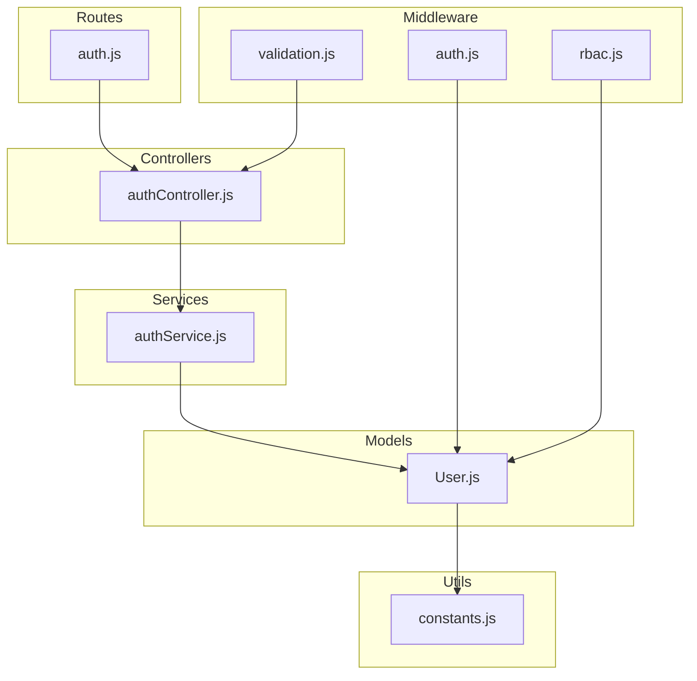
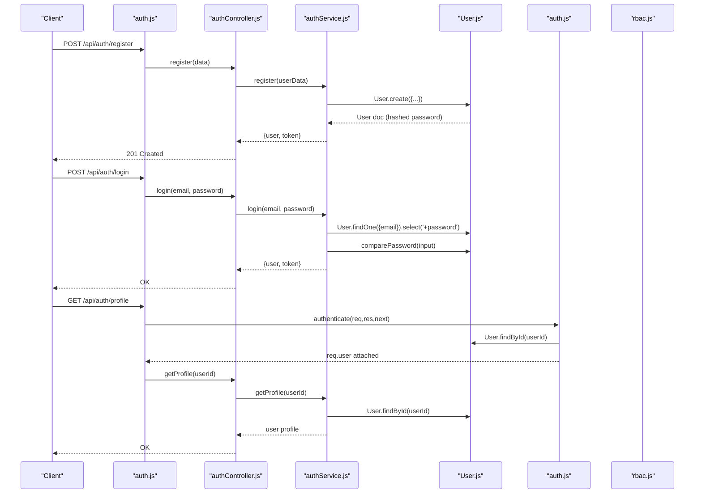
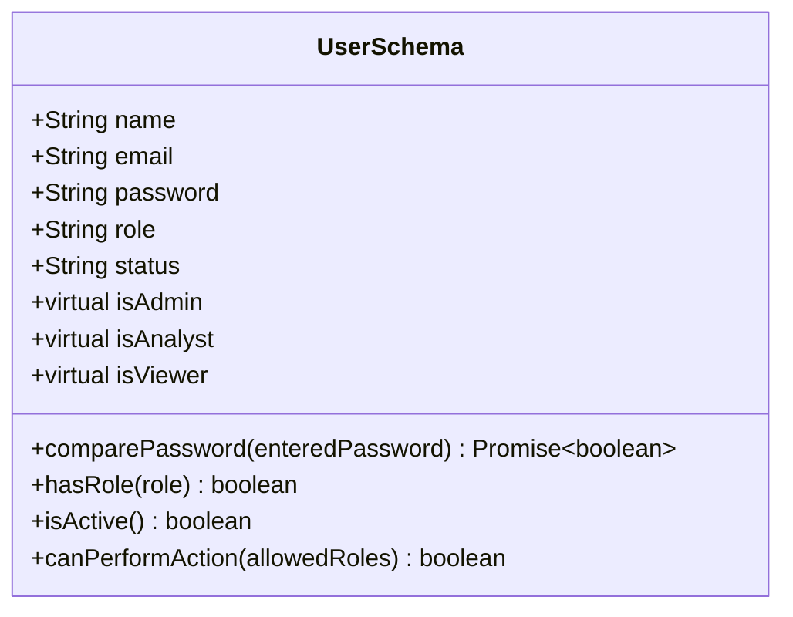
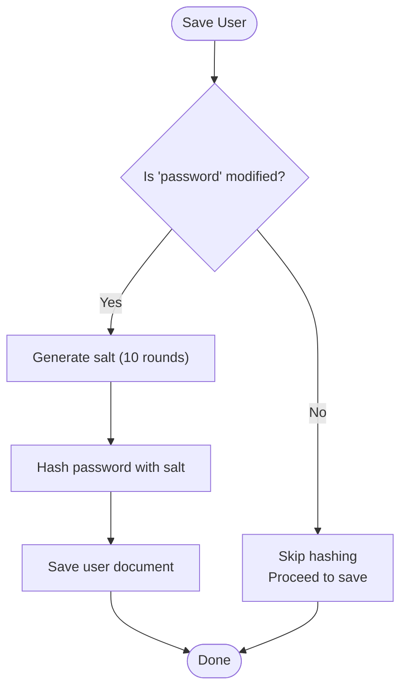
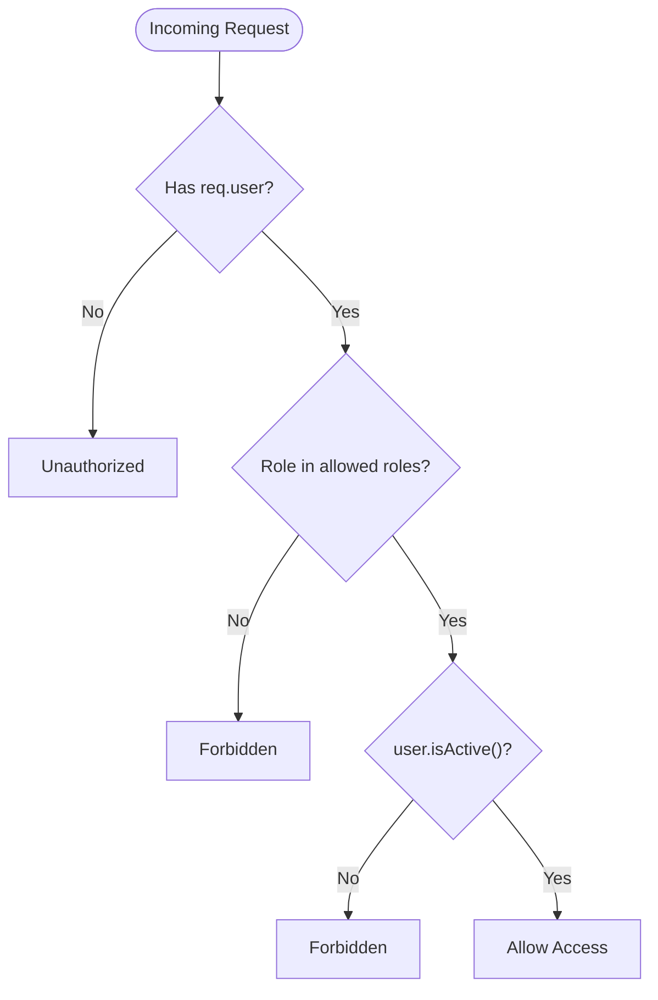
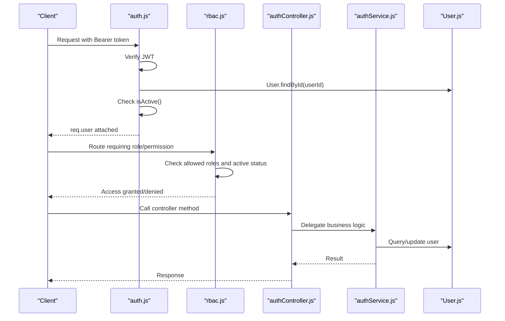
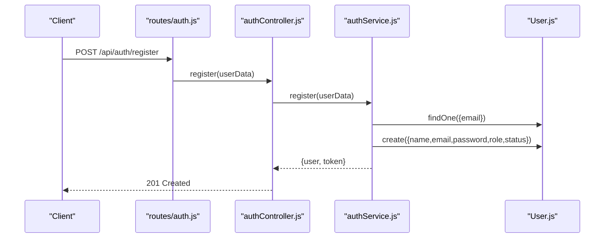
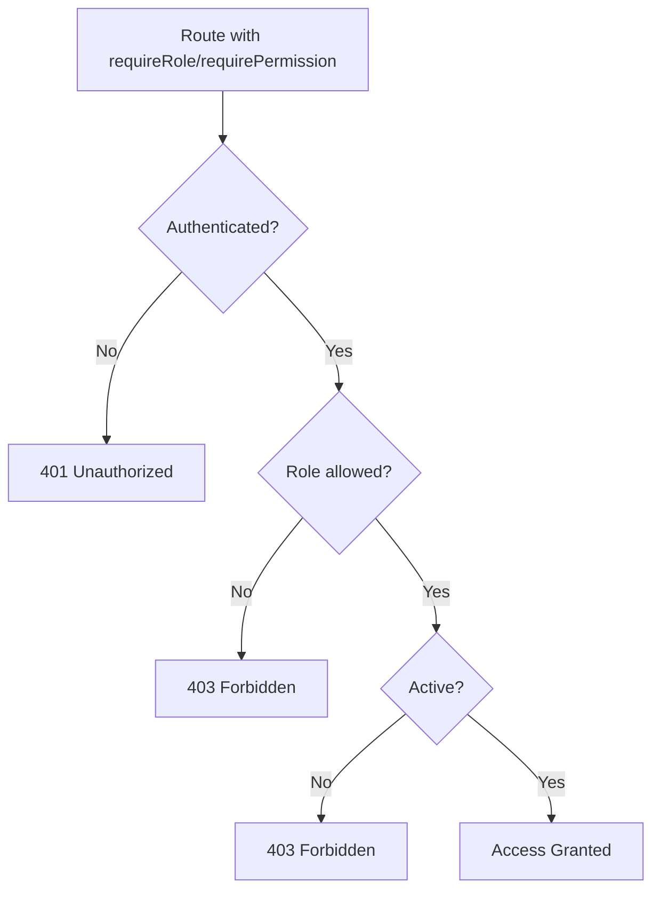
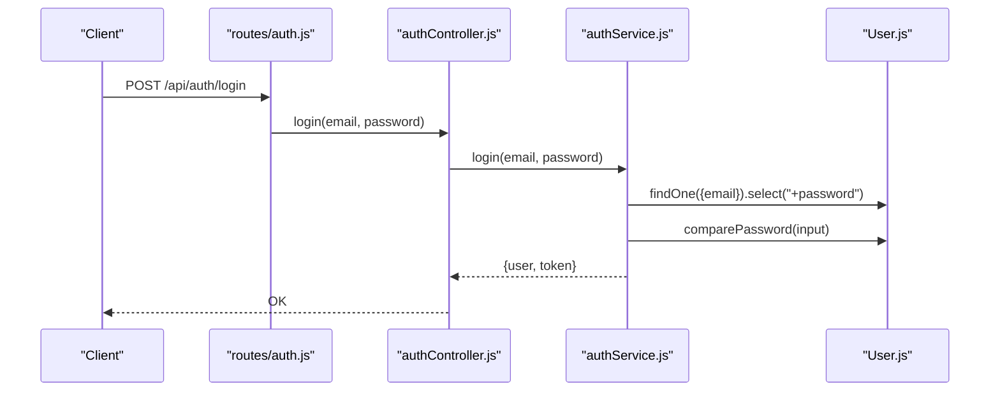
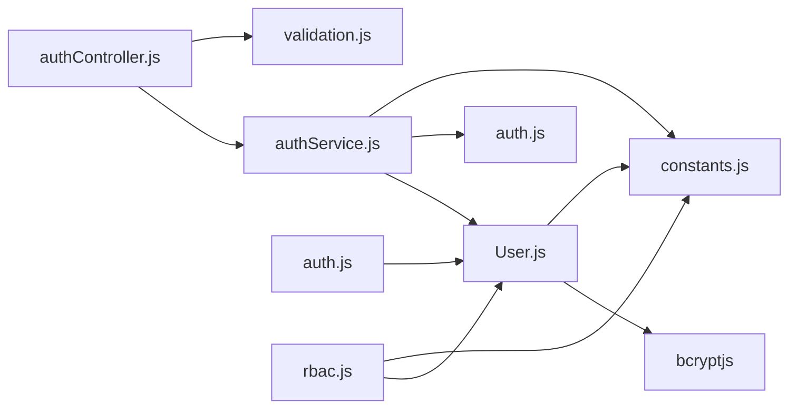

# User Model Schema

<cite>
**Referenced Files in This Document**
- [User.js](file://backend/models/User.js)
- [constants.js](file://backend/utils/constants.js)
- [authService.js](file://backend/services/authService.js)
- [authController.js](file://backend/controllers/authController.js)
- [auth.js](file://backend/middleware/auth.js)
- [rbac.js](file://backend/middleware/rbac.js)
- [validation.js](file://backend/middleware/validation.js)
- [auth.js](file://backend/routes/auth.js)
</cite>

## Table of Contents
1. [Introduction](#introduction)
2. [Project Structure](#project-structure)
3. [Core Components](#core-components)
4. [Architecture Overview](#architecture-overview)
5. [Detailed Component Analysis](#detailed-component-analysis)
6. [Dependency Analysis](#dependency-analysis)
7. [Performance Considerations](#performance-considerations)
8. [Troubleshooting Guide](#troubleshooting-guide)
9. [Conclusion](#conclusion)

## Introduction
This document provides comprehensive data model documentation for the User model schema used in the Finance Dashboard Application. It details all field definitions, validation rules, business constraints, password hashing mechanism, role-based access control (RBAC), and user status management. It also documents the pre-save hooks, virtual properties, utility methods, and database indexes. Practical examples demonstrate user creation, role validation, and password comparison operations.

## Project Structure
The User model is part of the backend module structure and integrates with controllers, services, middleware, and routes to enforce authentication, authorization, and validation.

**Diagram sources**
- [User.js:1-130](file://backend/models/User.js#L1-L130)
- [authService.js:1-195](file://backend/services/authService.js#L1-L195)
- [authController.js:1-114](file://backend/controllers/authController.js#L1-L114)
- [auth.js:1-116](file://backend/middleware/auth.js#L1-L116)
- [rbac.js:1-151](file://backend/middleware/rbac.js#L1-L151)
- [validation.js:1-309](file://backend/middleware/validation.js#L1-L309)
- [auth.js:1-49](file://backend/routes/auth.js#L1-L49)
- [constants.js:1-81](file://backend/utils/constants.js#L1-L81)

**Section sources**
- [User.js:1-130](file://backend/models/User.js#L1-L130)
- [constants.js:1-81](file://backend/utils/constants.js#L1-L81)

## Core Components
- User Model: Defines schema, validation, indexes, pre-save hooks, and utility methods.
- Constants: Centralized definitions for roles, statuses, permissions, and JWT configuration.
- Authentication Service: Implements registration, login, profile retrieval, password change, and initial admin setup.
- Authentication Controller: Exposes HTTP endpoints for authentication operations.
- Authentication Middleware: Validates JWT tokens and attaches user context.
- RBAC Middleware: Enforces role-based permissions and access control.
- Validation Middleware: Validates request payloads for registration, login, and updates.

**Section sources**
- [User.js:10-130](file://backend/models/User.js#L10-L130)
- [constants.js:5-80](file://backend/utils/constants.js#L5-L80)
- [authService.js:15-195](file://backend/services/authService.js#L15-L195)
- [authController.js:13-113](file://backend/controllers/authController.js#L13-L113)
- [auth.js:14-109](file://backend/middleware/auth.js#L14-L109)
- [rbac.js:14-150](file://backend/middleware/rbac.js#L14-L150)
- [validation.js:32-78](file://backend/middleware/validation.js#L32-L78)

## Architecture Overview
The User model participates in a layered architecture:
- Data Layer: Mongoose schema with indexes and hooks.
- Service Layer: Business logic for authentication and user operations.
- Controller Layer: HTTP endpoints delegating to services.
- Middleware Layer: Authentication, RBAC, and input validation.
- Route Layer: Public and private endpoints.

**Diagram sources**
- [auth.js:18-48](file://backend/routes/auth.js#L18-L48)
- [authController.js:13-113](file://backend/controllers/authController.js#L13-L113)
- [authService.js:15-195](file://backend/services/authService.js#L15-L195)
- [User.js:64-86](file://backend/models/User.js#L64-L86)
- [auth.js:14-109](file://backend/middleware/auth.js#L14-L109)

## Detailed Component Analysis

### User Model Schema
The User model defines the following fields and constraints:

- name
  - Type: String
  - Required: Yes
  - Constraints: Trimmed, max length 100
  - Validation: Schema-level and middleware-level checks
- email
  - Type: String
  - Required: Yes
  - Constraints: Unique, lowercase, trimmed, normalized
  - Validation: Regex pattern for email format
  - Index: email (1)
- password
  - Type: String
  - Required: Yes
  - Constraints: Min length 6, hidden by default (select: false)
  - Validation: Schema-level and middleware-level checks
  - Pre-save Hook: Hash using bcryptjs with salt rounds 10
- role
  - Type: String
  - Enum: viewer, analyst, admin
  - Default: viewer
  - Validation: Enum constraint
  - Index: role (1)
- status
  - Type: String
  - Enum: active, inactive
  - Default: active
  - Validation: Enum constraint
  - Index: status (1)

Additional schema features:
- Timestamps: createdAt, updatedAt
- Virtuals: isAdmin, isAnalyst, isViewer
- toJSON/toObject: enabled for virtuals

Utility Methods:
- comparePassword(enteredPassword): Returns Promise<boolean> using bcrypt.compare
- hasRole(role): Returns boolean if user has the specified role
- isActive(): Returns boolean if status equals active
- canPerformAction(allowedRoles): Returns boolean if user’s role is included in allowedRoles and isActive()

Indexes:
- email: 1
- role: 1
- status: 1

Pre-save Hook:
- Hashes password only when modified
- Uses bcrypt.genSalt(10) and bcrypt.hash

**Section sources**
- [User.js:10-130](file://backend/models/User.js#L10-L130)

#### Class Diagram for User Model

**Diagram sources**
- [User.js:10-130](file://backend/models/User.js#L10-L130)

### Password Hashing Mechanism
- bcryptjs is used for password hashing.
- Pre-save hook triggers only when password is modified.
- Salt rounds: 10.
- Hashed password replaces plaintext before save.
- Utility method comparePassword uses bcrypt.compare for verification.

**Diagram sources**
- [User.js:64-77](file://backend/models/User.js#L64-L77)

**Section sources**
- [User.js:28-33](file://backend/models/User.js#L28-L33)
- [User.js:64-77](file://backend/models/User.js#L64-L77)
- [User.js:84-86](file://backend/models/User.js#L84-L86)

### Role-Based Access Control (RBAC)
- Roles: viewer, analyst, admin
- Permissions matrix defines allowed roles per action.
- Middleware requireRole checks authentication, role inclusion, and active status.
- Middleware requirePermission resolves allowed roles from PERMISSIONS and enforces access.
- Virtual properties (isAdmin, isAnalyst, isViewer) support role checks in queries and views.

**Diagram sources**
- [rbac.js:14-33](file://backend/middleware/rbac.js#L14-L33)
- [rbac.js:40-66](file://backend/middleware/rbac.js#L40-L66)
- [User.js:101-112](file://backend/models/User.js#L101-L112)

**Section sources**
- [constants.js:6-16](file://backend/utils/constants.js#L6-L16)
- [constants.js:49-57](file://backend/utils/constants.js#L49-L57)
- [rbac.js:14-150](file://backend/middleware/rbac.js#L14-L150)
- [User.js:115-125](file://backend/models/User.js#L115-L125)

### User Status Management
- Status defaults to active.
- isActive() utility method checks against USER_STATUS.ACTIVE.
- Authentication middleware and RBAC middleware reject inactive users.
- Status can be managed via update validations.

**Section sources**
- [User.js:42-49](file://backend/models/User.js#L42-L49)
- [User.js:101-103](file://backend/models/User.js#L101-L103)
- [auth.js:42-44](file://backend/middleware/auth.js#L42-L44)
- [rbac.js:26-29](file://backend/middleware/rbac.js#L26-L29)

### Validation Rules and Business Constraints
- Registration validation enforces:
  - name: required, max 100
  - email: required, valid format, normalized
  - password: required, min 6
  - role: optional, must be one of ROLES
- Login validation enforces:
  - email: required, valid format
  - password: required
- Update validation enforces:
  - id: valid ObjectId
  - name/email/role/status: optional with respective constraints

**Section sources**
- [validation.js:32-60](file://backend/middleware/validation.js#L32-L60)
- [validation.js:65-78](file://backend/middleware/validation.js#L65-L78)
- [validation.js:83-114](file://backend/middleware/validation.js#L83-L114)

### Authentication and Authorization Flow
- Authentication:
  - Token extraction from Authorization header (Bearer).
  - JWT verification using secret and algorithm.
  - User lookup and active status check.
  - Attaches user to req.user for subsequent middleware.
- Authorization:
  - RBAC middleware validates role and active status.
  - Permission-based enforcement via PERMISSIONS matrix.

**Diagram sources**
- [auth.js:14-59](file://backend/middleware/auth.js#L14-L59)
- [rbac.js:14-66](file://backend/middleware/rbac.js#L14-L66)
- [authController.js:13-113](file://backend/controllers/authController.js#L13-L113)
- [authService.js:15-195](file://backend/services/authService.js#L15-L195)
- [User.js:101-112](file://backend/models/User.js#L101-L112)

**Section sources**
- [auth.js:14-109](file://backend/middleware/auth.js#L14-L109)
- [rbac.js:14-150](file://backend/middleware/rbac.js#L14-L150)

### Database Indexes
- email: 1
- role: 1
- status: 1

These indexes optimize queries filtering by email, role, and status.

**Section sources**
- [User.js:56-59](file://backend/models/User.js#L56-L59)

### Examples

#### Example 1: User Creation
- Endpoint: POST /api/auth/register
- Validation: name, email, password, optional role
- Behavior:
  - Checks for existing email
  - Creates user with default role viewer (or provided role)
  - Generates JWT token
  - Returns user and token

**Diagram sources**
- [auth.js:18](file://backend/routes/auth.js#L18)
- [authController.js:13-26](file://backend/controllers/authController.js#L13-L26)
- [authService.js:15-51](file://backend/services/authService.js#L15-L51)
- [User.js:19,29,34,42](file://backend/models/User.js#L19,L29,L34,L42)

**Section sources**
- [auth.js:18](file://backend/routes/auth.js#L18)
- [authController.js:13-26](file://backend/controllers/authController.js#L13-L26)
- [authService.js:15-51](file://backend/services/authService.js#L15-L51)

#### Example 2: Role Validation
- Endpoint: Protected route using RBAC middleware
- Validation:
  - Authentication required
  - Role must be in allowed roles
  - User must be active

**Diagram sources**
- [rbac.js:14-33](file://backend/middleware/rbac.js#L14-L33)
- [rbac.js:40-66](file://backend/middleware/rbac.js#L40-L66)

**Section sources**
- [rbac.js:14-66](file://backend/middleware/rbac.js#L14-L66)

#### Example 3: Password Comparison
- Endpoint: POST /api/auth/login
- Validation: email and password required
- Behavior:
  - Find user with password selected
  - Check active status
  - Compare password using comparePassword
  - Generate token on success

**Diagram sources**
- [auth.js:25](file://backend/routes/auth.js#L25)
- [authController.js:32-46](file://backend/controllers/authController.js#L32-L46)
- [authService.js:59-93](file://backend/services/authService.js#L59-L93)
- [User.js:84-86](file://backend/models/User.js#L84-L86)

**Section sources**
- [auth.js:25](file://backend/routes/auth.js#L25)
- [authController.js:32-46](file://backend/controllers/authController.js#L32-L46)
- [authService.js:59-93](file://backend/services/authService.js#L59-L93)
- [User.js:84-86](file://backend/models/User.js#L84-L86)

## Dependency Analysis
- User model depends on:
  - bcryptjs for password hashing
  - constants.js for ROLES and USER_STATUS
- Services depend on:
  - User model for persistence
  - auth middleware for token generation
  - constants.js for enums and permissions
- Controllers depend on:
  - Services for business logic
  - Validation middleware for input checks
- Middleware depends on:
  - User model for user lookup
  - constants.js for JWT configuration and permissions

**Diagram sources**
- [User.js:6-8](file://backend/models/User.js#L6-L8)
- [constants.js:6-16](file://backend/utils/constants.js#L6-L16)
- [authService.js:6-8](file://backend/services/authService.js#L6-L8)
- [auth.js:6-9](file://backend/middleware/auth.js#L6-L9)
- [rbac.js:6-7](file://backend/middleware/rbac.js#L6-L7)

**Section sources**
- [User.js:6-8](file://backend/models/User.js#L6-L8)
- [authService.js:6-8](file://backend/services/authService.js#L6-L8)
- [auth.js:6-9](file://backend/middleware/auth.js#L6-L9)
- [rbac.js:6-7](file://backend/middleware/rbac.js#L6-L7)

## Performance Considerations
- Indexes:
  - email: 1 improves uniqueness and lookup performance
  - role: 1 and status: 1 improve filtering performance
- Password hashing:
  - Salt rounds 10 balances security and performance
  - Pre-save hook runs only when password is modified
- Query optimization:
  - select: false prevents password leakage and reduces payload size
  - isActive() and role checks minimize unnecessary processing

[No sources needed since this section provides general guidance]

## Troubleshooting Guide
Common issues and resolutions:
- Invalid email format during registration:
  - Validation error indicates invalid email; ensure format compliance.
- Password too short:
  - Validation error requires minimum 6 characters.
- Duplicate email:
  - Registration fails if email already exists; choose a unique email.
- Invalid credentials during login:
  - Incorrect email/password combination; verify credentials and active status.
- Inactive account:
  - Login rejected if status is inactive; contact administrator.
- Insufficient permissions:
  - RBAC denies access if role not permitted; verify role and permissions matrix.
- Token errors:
  - Missing/expired/invalid token; re-authenticate or refresh token.

**Section sources**
- [validation.js:32-60](file://backend/middleware/validation.js#L32-L60)
- [validation.js:65-78](file://backend/middleware/validation.js#L65-L78)
- [authService.js:18-22](file://backend/services/authService.js#L18-L22)
- [authService.js:63-70](file://backend/services/authService.js#L63-L70)
- [auth.js:24-26](file://backend/middleware/auth.js#L24-L26)
- [rbac.js:17-29](file://backend/middleware/rbac.js#L17-L29)

## Conclusion
The User model schema enforces strict validation, secure password handling, and robust role-based access control. Its design ensures data integrity, efficient querying through indexes, and clear separation of concerns across layers. The provided examples illustrate practical usage patterns for user creation, role validation, and password comparison, aligning with the application’s authentication and authorization requirements.