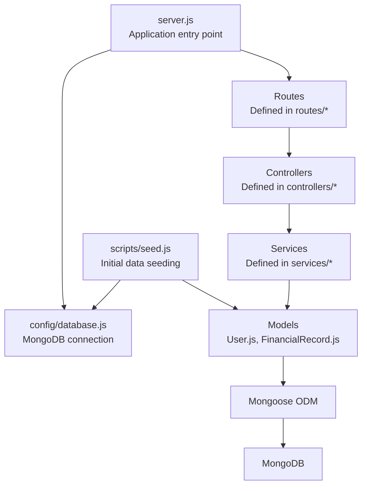
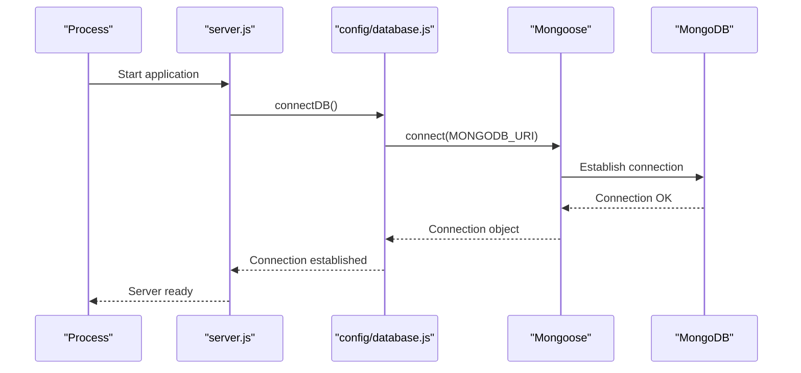
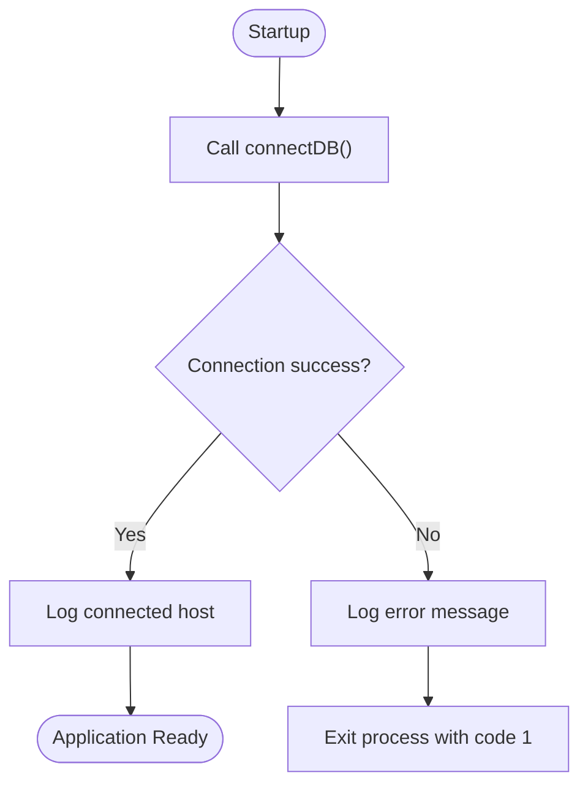
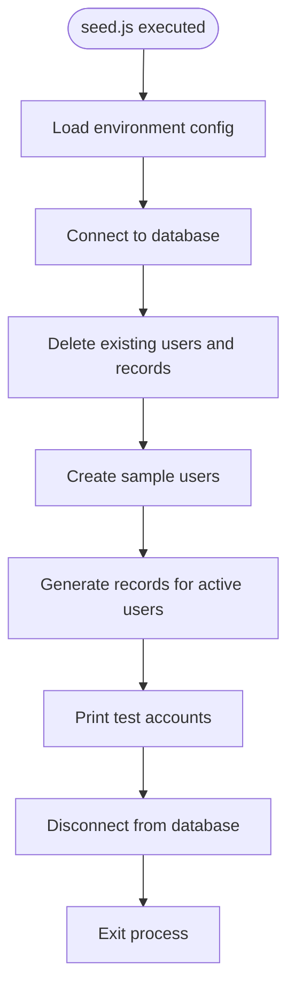
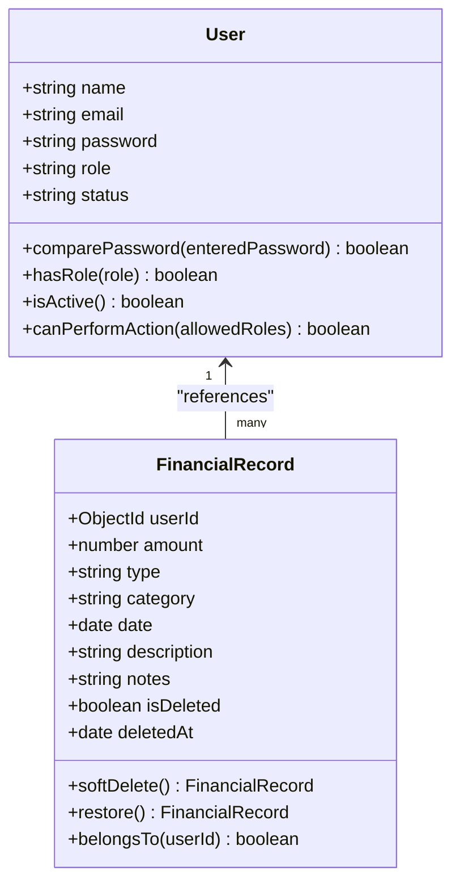
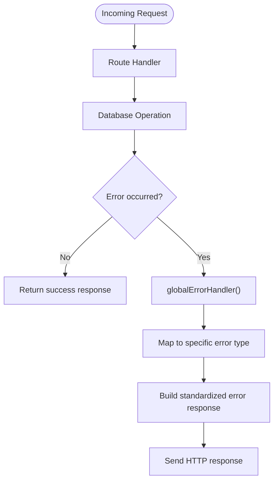
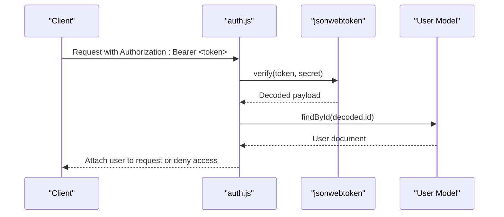
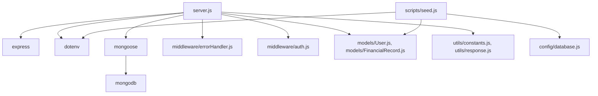

# Database Configuration

<cite>
**Referenced Files in This Document**
- [database.js](file://backend/config/database.js)
- [seed.js](file://backend/scripts/seed.js)
- [server.js](file://backend/server.js)
- [package.json](file://backend/package.json)
- [README.md](file://backend/README.md)
- [User.js](file://backend/models/User.js)
- [FinancialRecord.js](file://backend/models/FinancialRecord.js)
- [errorHandler.js](file://backend/middleware/errorHandler.js)
- [auth.js](file://backend/middleware/auth.js)
- [constants.js](file://backend/utils/constants.js)
- [response.js](file://backend/utils/response.js)
</cite>

## Table of Contents
1. [Introduction](#introduction)
2. [Project Structure](#project-structure)
3. [Core Components](#core-components)
4. [Architecture Overview](#architecture-overview)
5. [Detailed Component Analysis](#detailed-component-analysis)
6. [Dependency Analysis](#dependency-analysis)
7. [Performance Considerations](#performance-considerations)
8. [Troubleshooting Guide](#troubleshooting-guide)
9. [Conclusion](#conclusion)
10. [Appendices](#appendices)

## Introduction
This document provides comprehensive guidance for database configuration and management in the backend. It covers MongoDB connection setup, connection lifecycle management, error handling strategies, initialization and seeding of data, environment-specific configurations, connection string formats, authentication and security considerations, troubleshooting, performance tuning, backup and restore procedures, and production deployment best practices.

## Project Structure
The backend follows a modular structure with dedicated modules for configuration, models, middleware, utilities, and scripts. The database configuration is centralized in a single module that handles connection and disconnection using Mongoose. The application initializes the database connection during startup and uses a seed script to populate initial data.

**Diagram sources**
- [server.js:1-113](file://backend/server.js#L1-L113)
- [database.js:1-43](file://backend/config/database.js#L1-L43)
- [seed.js:1-132](file://backend/scripts/seed.js#L1-L132)
- [User.js:1-130](file://backend/models/User.js#L1-L130)
- [FinancialRecord.js:1-134](file://backend/models/FinancialRecord.js#L1-L134)

**Section sources**
- [server.js:1-113](file://backend/server.js#L1-L113)
- [database.js:1-43](file://backend/config/database.js#L1-L43)
- [seed.js:1-132](file://backend/scripts/seed.js#L1-L132)

## Core Components
- Database configuration and connection management via Mongoose
- Seeding script for initial data setup including default admin creation and sample data generation
- Centralized error handling for database-related errors
- Environment-specific configuration via environment variables

Key responsibilities:
- Establish and terminate MongoDB connections
- Provide connection lifecycle hooks
- Seed database with predefined users and financial records
- Handle operational errors consistently across the application

**Section sources**
- [database.js:11-42](file://backend/config/database.js#L11-L42)
- [seed.js:82-132](file://backend/scripts/seed.js#L82-L132)
- [errorHandler.js:89-145](file://backend/middleware/errorHandler.js#L89-L145)

## Architecture Overview
The application connects to MongoDB using Mongoose at startup. The connection is established synchronously during server initialization. Models define schemas and indexes for efficient querying. The seeding script clears existing data and creates users and financial records. Error handling is centralized to provide consistent responses for database and validation errors.

**Diagram sources**
- [server.js:26-27](file://backend/server.js#L26-L27)
- [database.js:11-25](file://backend/config/database.js#L11-L25)

**Section sources**
- [server.js:26-27](file://backend/server.js#L26-L27)
- [database.js:11-25](file://backend/config/database.js#L11-L25)

## Detailed Component Analysis

### Database Connection and Lifecycle
- Connection establishment: The application connects to MongoDB using a URI from environment variables with a fallback to a local development URI.
- Connection lifecycle: The connection is established at startup and can be explicitly disconnected using a dedicated function.
- Error handling: Connection failures are logged and the process exits with a non-zero status to prevent running without database connectivity.

**Diagram sources**
- [database.js:11-25](file://backend/config/database.js#L11-L25)

**Section sources**
- [database.js:11-25](file://backend/config/database.js#L11-L25)

### Seeding Script for Initial Data
- Purpose: Populate the database with sample users and financial records for testing and demonstration.
- Behavior:
  - Loads environment configuration
  - Connects to the database
  - Clears existing data
  - Creates predefined users with roles and statuses
  - Generates financial records for active users
  - Prints test account credentials
  - Disconnects and exits

**Diagram sources**
- [seed.js:82-129](file://backend/scripts/seed.js#L82-L129)

**Section sources**
- [seed.js:82-132](file://backend/scripts/seed.js#L82-L132)

### Models and Indexes
- User model:
  - Enforces unique email, role, and status constraints
  - Hashes passwords before saving
  - Provides helper methods for role checks and activity status
  - Includes indexes on email, role, and status for efficient queries
- Financial record model:
  - References users and includes soft-delete capability
  - Includes compound indexes for common query patterns
  - Excludes soft-deleted records by default in find operations

**Diagram sources**
- [User.js:10-127](file://backend/models/User.js#L10-L127)
- [FinancialRecord.js:9-130](file://backend/models/FinancialRecord.js#L9-L130)

**Section sources**
- [User.js:10-127](file://backend/models/User.js#L10-L127)
- [FinancialRecord.js:9-130](file://backend/models/FinancialRecord.js#L9-L130)

### Error Handling Strategy
- Centralized error handling:
  - Handles Mongoose validation errors, duplicate key errors, and cast errors
  - Handles JWT-related errors for authentication failures
  - Returns standardized error responses with appropriate status codes
- Uncaught exception and unhandled rejection handling:
  - Logs critical errors and shuts down the process gracefully

**Diagram sources**
- [errorHandler.js:89-145](file://backend/middleware/errorHandler.js#L89-L145)

**Section sources**
- [errorHandler.js:89-145](file://backend/middleware/errorHandler.js#L89-L145)

### Authentication and Security
- JWT-based authentication:
  - Tokens are verified against a secret configured via environment variables
  - Supports optional authentication for public endpoints
  - Token expiration is configurable
- Password security:
  - Passwords are hashed using bcrypt with a salt factor suitable for production
- Role-based access control:
  - Permissions are enforced based on user roles defined in constants

**Diagram sources**
- [auth.js:14-59](file://backend/middleware/auth.js#L14-L59)
- [User.js:84-112](file://backend/models/User.js#L84-L112)

**Section sources**
- [auth.js:14-109](file://backend/middleware/auth.js#L14-L109)
- [User.js:84-112](file://backend/models/User.js#L84-L112)

## Dependency Analysis
- Database driver stack:
  - Mongoose ORM depends on MongoDB driver
  - MongoDB driver supports modern Node.js versions and connection string parsing
- Application dependencies:
  - Express web framework
  - dotenv for environment variable loading
  - bcryptjs for password hashing
  - jsonwebtoken for JWT operations

**Diagram sources**
- [package.json:16-27](file://backend/package.json#L16-L27)
- [server.js:11-12](file://backend/server.js#L11-L12)
- [seed.js:6-11](file://backend/scripts/seed.js#L6-L11)

**Section sources**
- [package.json:16-27](file://backend/package.json#L16-L27)
- [server.js:11-12](file://backend/server.js#L11-L12)
- [seed.js:6-11](file://backend/scripts/seed.js#L6-L11)

## Performance Considerations
- Connection management:
  - Keep a single persistent connection managed by Mongoose for the lifetime of the process
  - Avoid frequent connect/disconnect cycles in production
- Indexing strategy:
  - User model: indexes on email, role, status
  - FinancialRecord model: compound indexes on (userId, date), (userId, type), (userId, category), (userId, isDeleted), and (type, date)
  - Use targeted queries to leverage these indexes effectively
- Query patterns:
  - Filter by userId to limit scope to individual users
  - Use date ranges and type/category filters to reduce result sets
  - Prefer projection to avoid unnecessary fields
- Caching:
  - Consider caching frequently accessed dashboard summaries
  - Use database cursors for large result sets to reduce memory usage
- Monitoring:
  - Enable MongoDB profiling in development to identify slow queries
  - Monitor connection pool utilization and timeouts

[No sources needed since this section provides general guidance]

## Troubleshooting Guide
Common database connectivity issues and resolutions:
- Connection refused:
  - Verify MongoDB service is running
  - Check network connectivity and firewall rules
  - Confirm MONGODB_URI format and credentials
- Authentication failure:
  - Ensure correct username/password or token
  - Verify database user privileges
  - Check JWT_SECRET configuration for authentication middleware
- Duplicate key errors:
  - Unique constraint violation on email or other unique fields
  - Use conflict resolution to update existing records
- Cast errors (invalid ObjectId):
  - Validate request parameters conform to ObjectId format
  - Sanitize inputs before database operations
- Connection timeouts:
  - Increase timeout values in connection string
  - Check network latency and server load
  - Review connection pool settings

Operational error handling:
- Validation errors: Return detailed field-level validation messages
- Duplicate key errors: Return conflict error with field information
- JWT errors: Return unauthorized responses for invalid/expired tokens
- Uncaught exceptions: Log and shut down gracefully to prevent inconsistent state

**Section sources**
- [errorHandler.js:25-136](file://backend/middleware/errorHandler.js#L25-L136)
- [auth.js:28-54](file://backend/middleware/auth.js#L28-L54)

## Conclusion
The backend provides a robust foundation for MongoDB integration with Mongoose, including centralized connection management, comprehensive error handling, and a practical seeding mechanism for initial data. By following the environment-specific configuration guidelines, implementing proper indexing strategies, and adopting the troubleshooting and performance recommendations, you can deploy a reliable and scalable financial dashboard backend.

[No sources needed since this section summarizes without analyzing specific files]

## Appendices

### Environment Variables
- MONGODB_URI: MongoDB connection string (required)
- JWT_SECRET: Secret key for JWT signing (required)
- JWT_EXPIRE: Token expiration time (default: 7d)
- NODE_ENV: Environment mode (development/production)
- PORT: Server port (default: 5000)

**Section sources**
- [README.md:283-292](file://backend/README.md#L283-L292)
- [database.js:13](file://backend/config/database.js#L13)
- [auth.js:100-109](file://backend/middleware/auth.js#L100-L109)

### Connection String Formats
- Local development: mongodb://localhost:27017/<database_name>
- Replica set: mongodb://host1:port1,host2:port2,host3:port3/<database_name>?replicaSet=<rs-name>
- Atlas/MongoDB Cloud: mongodb+srv://<username>:<password>@<cluster-url>/<database_name>?retryWrites=true&w=majority

**Section sources**
- [database.js:13](file://backend/config/database.js#L13)
- [README.md:289](file://backend/README.md#L289)

### Backup and Restore Procedures
- Backup:
  - Use mongodump for logical backups
  - Schedule regular automated backups
  - Store backups in secure, offsite locations
- Restore:
  - Use mongorestore for point-in-time recovery
  - Test restore procedures regularly
  - Validate data integrity after restoration

[No sources needed since this section provides general guidance]

### Production Deployment Best Practices
- Connection pooling:
  - Configure appropriate pool sizes based on workload
  - Enable connection keep-alive and idle timeouts
- Security:
  - Use TLS/SSL for encrypted connections
  - Restrict network access to database servers
  - Rotate secrets and credentials regularly
- Monitoring:
  - Monitor database performance metrics
  - Track connection pool utilization
  - Set up alerts for connection failures and timeouts
- Scaling:
  - Consider read replicas for reporting workloads
  - Use sharding for very large datasets
  - Implement horizontal scaling with multiple application instances

[No sources needed since this section provides general guidance]