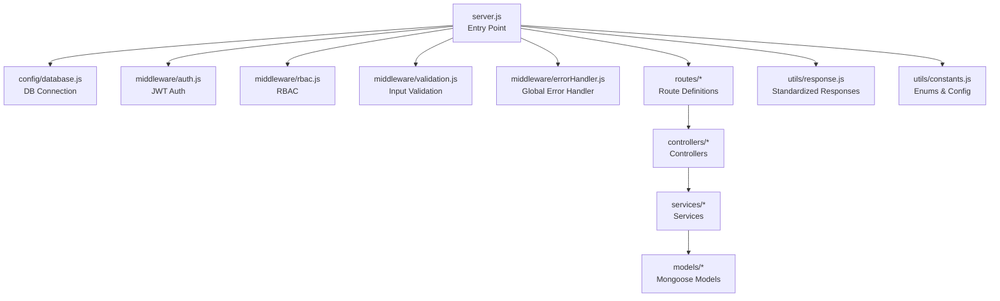
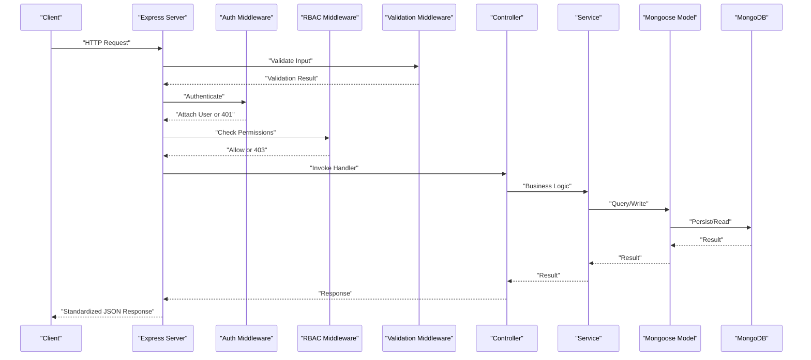
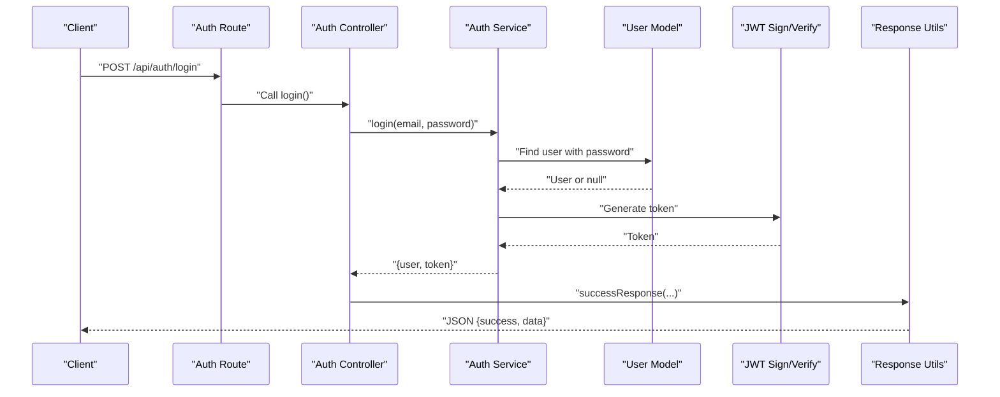
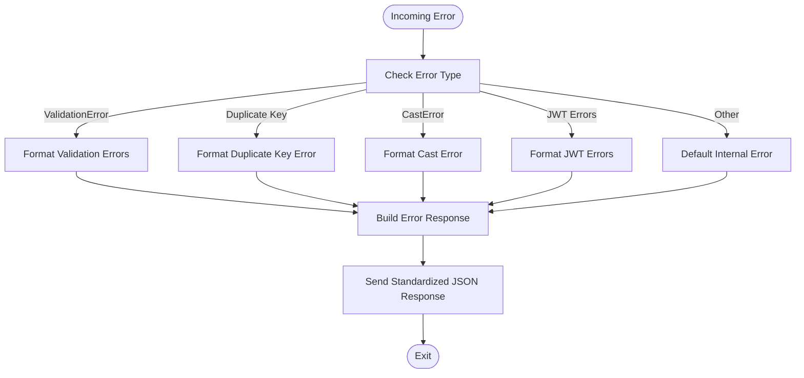
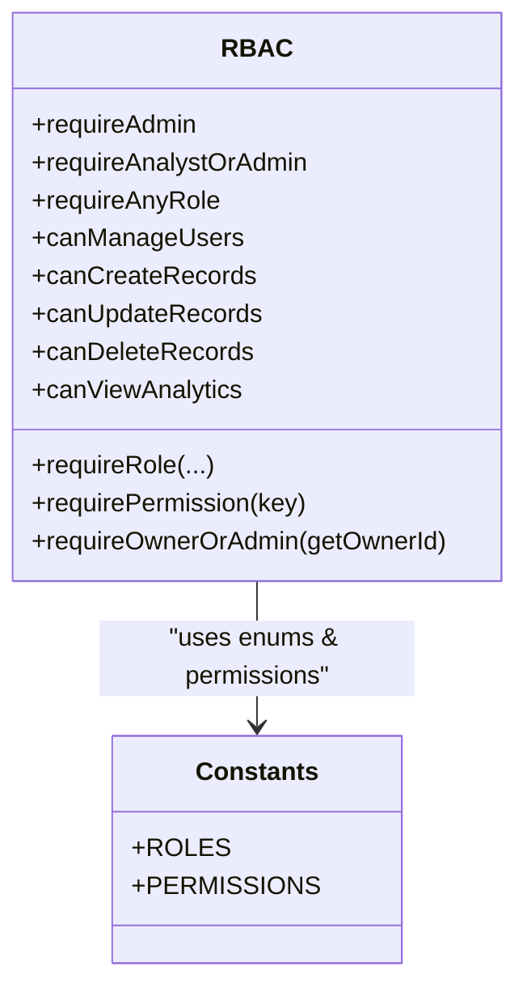
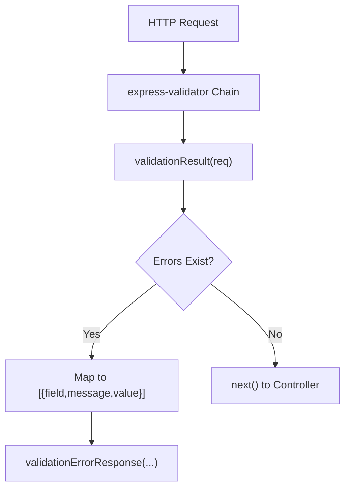
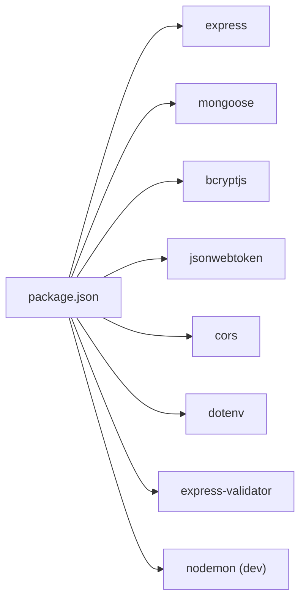

# Deployment Guide

<cite>
**Referenced Files in This Document**
- [package.json](file://backend/package.json)
- [server.js](file://backend/server.js)
- [database.js](file://backend/config/database.js)
- [constants.js](file://backend/utils/constants.js)
- [response.js](file://backend/utils/response.js)
- [errorHandler.js](file://backend/middleware/errorHandler.js)
- [auth.js](file://backend/middleware/auth.js)
- [validation.js](file://backend/middleware/validation.js)
- [rbac.js](file://backend/middleware/rbac.js)
- [authController.js](file://backend/controllers/authController.js)
- [authService.js](file://backend/services/authService.js)
- [User.js](file://backend/models/User.js)
- [seed.js](file://backend/scripts/seed.js)
- [README.md](file://backend/README.md)
</cite>

## Table of Contents
1. [Introduction](#introduction)
2. [Project Structure](#project-structure)
3. [Core Components](#core-components)
4. [Architecture Overview](#architecture-overview)
5. [Detailed Component Analysis](#detailed-component-analysis)
6. [Dependency Analysis](#dependency-analysis)
7. [Production Configuration](#production-configuration)
8. [Environment Variables](#environment-variables)
9. [Security Hardening](#security-hardening)
10. [Containerization with Docker](#containerization-with-docker)
11. [Cloud Platform Deployment](#cloud-platform-deployment)
12. [Server Configuration Requirements](#server-configuration-requirements)
13. [Load Balancing Strategies](#load-balancing-strategies)
14. [SSL/TLS Certificate Management](#ssl-tls-certificate-management)
15. [Reverse Proxy Setup](#reverse-proxy-setup)
16. [Monitoring and Logging](#monitoring-and-logging)
17. [Health Checks](#health-checks)
18. [Performance Optimization](#performance-optimization)
19. [Deployment Automation and CI/CD](#deployment-automation-and-cicd)
20. [Rollback Procedures](#rollback-procedures)
21. [Scaling Considerations](#scaling-considerations)
22. [Database Deployment Strategies](#database-deployment-strategies)
23. [Disaster Recovery Planning](#disaster-recovery-planning)
24. [Troubleshooting Guide](#troubleshooting-guide)
25. [Production Maintenance Procedures](#production-maintenance-procedures)
26. [Conclusion](#conclusion)

## Introduction
This document provides comprehensive deployment guidance for the Finance Dashboard Backend in production environments. It covers configuration, environment management, security hardening, containerization, cloud deployment, server setup, load balancing, SSL/TLS, reverse proxies, monitoring/logging, health checks, performance optimization, automation, rollback, scaling, database strategies, disaster recovery, troubleshooting, and maintenance.

## Project Structure
The backend follows a layered architecture:
- Entry point initializes Express, loads environment variables, connects to MongoDB, registers middleware, routes, and error handlers.
- Configuration encapsulates database connectivity.
- Middleware enforces authentication, RBAC, input validation, and centralized error handling.
- Controllers orchestrate HTTP requests and delegate to services.
- Services implement business logic and interact with models.
- Models define schemas and data access patterns.
- Utilities provide standardized responses and shared constants.
- Scripts support seeding and testing.

**Diagram sources**
- [server.js:1-113](file://backend/server.js#L1-L113)
- [database.js:1-43](file://backend/config/database.js#L1-L43)
- [auth.js:1-116](file://backend/middleware/auth.js#L1-L116)
- [rbac.js:1-151](file://backend/middleware/rbac.js#L1-L151)
- [validation.js:1-309](file://backend/middleware/validation.js#L1-L309)
- [errorHandler.js:1-179](file://backend/middleware/errorHandler.js#L1-L179)
- [response.js:1-101](file://backend/utils/response.js#L1-L101)
- [constants.js:1-81](file://backend/utils/constants.js#L1-L81)

**Section sources**
- [README.md:23-58](file://backend/README.md#L23-L58)
- [server.js:1-113](file://backend/server.js#L1-L113)

## Core Components
- Express server initialization, CORS, JSON parsing, development logging, health check endpoint, routing, 404 handling, and graceful shutdown on unhandled rejections.
- Database connection via Mongoose with environment-driven URI and error handling.
- Centralized error handling for validation, duplicates, casting, JWT errors, and uncaught exceptions.
- Authentication middleware using JWT with bearer token extraction, verification, and user attachment.
- RBAC middleware enforcing role-based permissions and resource ownership checks.
- Input validation using express-validator with standardized error responses.
- Standardized API response utilities for success, error, validation, unauthorized, forbidden, and not-found scenarios.
- Constants for roles, statuses, categories, permissions, pagination defaults, and JWT configuration.

**Section sources**
- [server.js:1-113](file://backend/server.js#L1-L113)
- [database.js:1-43](file://backend/config/database.js#L1-L43)
- [errorHandler.js:1-179](file://backend/middleware/errorHandler.js#L1-L179)
- [auth.js:1-116](file://backend/middleware/auth.js#L1-L116)
- [rbac.js:1-151](file://backend/middleware/rbac.js#L1-L151)
- [validation.js:1-309](file://backend/middleware/validation.js#L1-L309)
- [response.js:1-101](file://backend/utils/response.js#L1-L101)
- [constants.js:1-81](file://backend/utils/constants.js#L1-L81)

## Architecture Overview
The system is a Node.js/Express application with MongoDB persistence. Requests flow through middleware layers (auth, RBAC, validation) before reaching controllers and services, which interact with Mongoose models. Errors are handled centrally, and responses are standardized.

**Diagram sources**
- [server.js:1-113](file://backend/server.js#L1-L113)
- [auth.js:14-59](file://backend/middleware/auth.js#L14-L59)
- [rbac.js:14-66](file://backend/middleware/rbac.js#L14-L66)
- [validation.js:13-27](file://backend/middleware/validation.js#L13-L27)
- [authController.js:13-105](file://backend/controllers/authController.js#L13-L105)
- [authService.js:15-51](file://backend/services/authService.js#L15-L51)
- [User.js:10-127](file://backend/models/User.js#L10-L127)

## Detailed Component Analysis

### Authentication Flow

**Diagram sources**
- [routes/auth.js:14-25](file://backend/routes/auth.js#L14-L25)
- [authController.js:32-46](file://backend/controllers/authController.js#L32-L46)
- [authService.js:59-93](file://backend/services/authService.js#L59-L93)
- [User.js:84-86](file://backend/models/User.js#L84-L86)
- [auth.js:100-109](file://backend/middleware/auth.js#L100-L109)
- [response.js:12-19](file://backend/utils/response.js#L12-L19)

**Section sources**
- [routes/auth.js:1-49](file://backend/routes/auth.js#L1-L49)
- [authController.js:1-114](file://backend/controllers/authController.js#L1-L114)
- [authService.js:1-195](file://backend/services/authService.js#L1-L195)
- [User.js:1-130](file://backend/models/User.js#L1-L130)
- [auth.js:1-116](file://backend/middleware/auth.js#L1-L116)
- [response.js:1-101](file://backend/utils/response.js#L1-L101)

### Error Handling Pipeline

**Diagram sources**
- [errorHandler.js:89-145](file://backend/middleware/errorHandler.js#L89-L145)
- [response.js:28-35](file://backend/utils/response.js#L28-L35)

**Section sources**
- [errorHandler.js:1-179](file://backend/middleware/errorHandler.js#L1-L179)
- [response.js:1-101](file://backend/utils/response.js#L1-L101)

### RBAC Permission Matrix

**Diagram sources**
- [rbac.js:14-150](file://backend/middleware/rbac.js#L14-L150)
- [constants.js:6,48-57](file://backend/utils/constants.js#L6,L48-L57)

**Section sources**
- [rbac.js:1-151](file://backend/middleware/rbac.js#L1-L151)
- [constants.js:1-81](file://backend/utils/constants.js#L1-L81)

### Input Validation Workflow

**Diagram sources**
- [validation.js:13-27](file://backend/middleware/validation.js#L13-L27)
- [response.js:42-49](file://backend/utils/response.js#L42-L49)

**Section sources**
- [validation.js:1-309](file://backend/middleware/validation.js#L1-L309)
- [response.js:1-101](file://backend/utils/response.js#L1-L101)

## Dependency Analysis
Key runtime dependencies include Express, Mongoose, bcryptjs, jsonwebtoken, cors, dotenv, and express-validator. Development dependencies include nodemon. The application relies on environment variables for configuration.

**Diagram sources**
- [package.json:16-27](file://backend/package.json#L16-L27)

**Section sources**
- [package.json:1-29](file://backend/package.json#L1-L29)

## Production Configuration
- Set NODE_ENV to production for optimized behavior and reduced logging.
- Configure PORT for the listening socket.
- Provide MONGODB_URI pointing to a production-ready MongoDB instance (replica set or cloud provider).
- Set JWT_SECRET to a strong, random secret and keep it out of version control.
- Configure JWT_EXPIRE to a suitable duration (e.g., 7d).
- Enable HTTPS termination at a reverse proxy or load balancer; configure TLS certificates externally.

**Section sources**
- [server.js:87-99](file://backend/server.js#L87-L99)
- [database.js:11-25](file://backend/config/database.js#L11-L25)
- [auth.js:30,100-109](file://backend/middleware/auth.js#L30,L100-L109)
- [README.md:283-292](file://backend/README.md#L283-L292)

## Environment Variables
Essential variables for production:
- PORT: Listening port (default 5000)
- NODE_ENV: Environment mode (production)
- MONGODB_URI: MongoDB connection string
- JWT_SECRET: Secret for signing JWTs
- JWT_EXPIRE: Token expiration (e.g., 7d)

Recommended additional variables for robust deployments:
- LOG_LEVEL: Logging verbosity (warn, error, info, debug)
- DB_POOL_SIZE: Connection pool size for MongoDB
- REQUEST_TIMEOUT_MS: Request timeout for long operations
- RATE_LIMIT_WINDOW: Rate limiting window
- RATE_LIMIT_MAX: Max requests per window

**Section sources**
- [server.js:6,87-99](file://backend/server.js#L6,L87-L99)
- [database.js:13](file://backend/config/database.js#L13)
- [auth.js:30,103](file://backend/middleware/auth.js#L30,L103)
- [README.md:283-292](file://backend/README.md#L283-L292)

## Security Hardening
- Enforce HTTPS at the reverse proxy/load balancer; disable cleartext exposure.
- Store secrets in secure vaults or platform-managed secrets; avoid committing secrets to repositories.
- Rotate JWT_SECRET periodically and invalidate sessions during rotation.
- Apply rate limiting at the edge (proxy or API gateway).
- Sanitize and validate all inputs; leverage existing validation middleware.
- Use RBAC to enforce least privilege.
- Harden Node.js runtime (disable unnecessary privileges, use non-root user in containers).
- Monitor for suspicious activity and enable audit logs.

**Section sources**
- [auth.js:14-59](file://backend/middleware/auth.js#L14-L59)
- [rbac.js:14-66](file://backend/middleware/rbac.js#L14-L66)
- [validation.js:13-27](file://backend/middleware/validation.js#L13-L27)
- [errorHandler.js:150-171](file://backend/middleware/errorHandler.js#L150-L171)

## Containerization with Docker
- Create a minimal base image (e.g., node:alpine) and set a non-root user.
- Copy package files, install dependencies, build if needed, then copy application code.
- Set NODE_ENV=production and required environment variables.
- Expose the configured PORT.
- Use health checks pointing to the /health endpoint.
- Mount persistent volumes for logs if needed; avoid storing state in containers.
- Use multi-stage builds to reduce attack surface.

Example steps outline:
- Build stage: Install dependencies, build assets if applicable.
- Runtime stage: Copy only necessary files, set working directory, set non-root user, expose port, define health check, start command.

**Section sources**
- [server.js:42-50](file://backend/server.js#L42-L50)
- [server.js:87-99](file://backend/server.js#L87-L99)
- [package.json:6-11](file://backend/package.json#L6-L11)

## Cloud Platform Deployment
Choose a platform-aligned pattern:
- AWS: Deploy behind Application Load Balancer with ECS/Fargate or EC2 Auto Scaling Groups; use RDS/Aurora or DocumentDB; store secrets in Secrets Manager.
- Azure: Use Azure Load Balancer with Container Instances or AKS; use Azure Cosmos DB or Azure MongoDB Atlas; store secrets in Key Vault.
- GCP: Use Cloud Load Balancing with Cloud Run or GKE; use Cloud SQL or MongoDB Atlas; store secrets in Secret Manager.

Common practices:
- Use managed databases for high availability and backups.
- Enable automatic patching and backups.
- Configure VPC/subnets, security groups/firewalls, and private link where applicable.
- Use blue/green or rolling deployments with health checks.

[No sources needed since this section provides general guidance]

## Server Configuration Requirements
- OS: Minimal Linux distribution (prefer hardened images).
- Node.js: LTS version aligned with package.json engines.
- MongoDB: Supported version; ensure network accessibility and firewall rules.
- Reverse Proxy: Nginx/Apache terminating TLS and forwarding to application.
- Resource limits: CPU/memory quotas; configure restart policies.
- File descriptors: Increase limits for high concurrency.
- Time synchronization: Keep clocks accurate (NTP).

**Section sources**
- [package.json:16](file://backend/package.json#L16)
- [database.js:13](file://backend/config/database.js#L13)

## Load Balancing Strategies
- Round-robin or least-connections at the load balancer.
- Sticky sessions only if stateful; otherwise rely on stateless design.
- Health checks against /health endpoint; mark unhealthy instances out of service.
- Enable connection draining to finish in-flight requests.
- Use auto-scaling groups or cluster autoscaling based on CPU/memory or custom metrics.

**Section sources**
- [server.js:42-50](file://backend/server.js#L42-L50)

## SSL/TLS Certificate Management
- Obtain certificates from a trusted CA or ACME-compatible provider (e.g., Let's Encrypt).
- Terminate TLS at the reverse proxy/load balancer; use strong cipher suites and protocols.
- Automate renewal via cron or platform-native automation.
- Pin certificates and monitor expiry.

[No sources needed since this section provides general guidance]

## Reverse Proxy Setup
- Terminate TLS at the proxy; forward HTTP to the application.
- Set timeouts appropriate for your workload.
- Add security headers (HSTS, CSP, X-Frame-Options).
- Rate limit and block malicious traffic at the proxy level.
- Configure gzip/brotli compression for static and API responses.

[No sources needed since this section provides general guidance]

## Monitoring and Logging
- Structured logging: JSON logs with severity, timestamp, correlation IDs.
- Metrics: Request latency, throughput, error rates, database query times.
- Tracing: Correlate logs with distributed tracing IDs.
- Alerting: Threshold-based alerts for error spikes, latency, and resource exhaustion.
- Centralized logging: Send logs to SIEM or log aggregation systems.

[No sources needed since this section provides general guidance]

## Health Checks
- Use the built-in /health endpoint to report application status, environment, and timestamp.
- Configure periodic checks from load balancers, orchestrators, or external monitoring systems.
- Ensure the endpoint does not require authentication and is lightweight.

**Section sources**
- [server.js:42-50](file://backend/server.js#L42-L50)

## Performance Optimization
- Connection pooling: Tune MongoDB connection pool size.
- Caching: Use in-memory or external caching for read-heavy endpoints.
- Asynchronous processing: Offload heavy tasks to queues.
- Compression: Enable gzip/brotli at the proxy.
- CDN: Serve static assets via CDN.
- Database indexing: Ensure proper indexes for frequent queries.
- Optimize queries: Use projections and pagination.

[No sources needed since this section provides general guidance]

## Deployment Automation and CI/CD
- Build: Install dependencies, lint, test, build artifacts.
- Test: Unit/integration tests; security scans.
- Package: Produce container images with immutable tags.
- Deploy: Automated rollout with health checks; rollback on failure.
- Secrets: Inject via environment variables or secret managers.
- Infrastructure: Define infrastructure as code (Terraform/Helm/Kubernetes manifests).

[No sources needed since this section provides general guidance]

## Rollback Procedures
- Keep previous image/tag available for quick rollback.
- Use blue/green or canary deployments to minimize risk.
- Maintain database migration scripts and backup snapshots.
- Revert configuration changes alongside code rollback.
- Notify stakeholders and monitor post-rollback metrics.

[No sources needed since this section provides general guidance]

## Scaling Considerations
- Horizontal scaling: Stateless application pods/containers behind a load balancer.
- Vertical scaling: Increase resources for single instances under load.
- Database scaling: Sharding, replica sets, read replicas; optimize queries.
- Caching: Redis/Memcached for hot data.
- Background jobs: Use job queues for asynchronous workloads.

[No sources needed since this section provides general guidance]

## Database Deployment Strategies
- Use managed MongoDB services for high availability and automated backups.
- Enable replica sets and authentication.
- Configure read replicas for reporting/analytics.
- Use connection pooling and circuit breakers.
- Back up regularly and test restore procedures.

**Section sources**
- [database.js:11-25](file://backend/config/database.js#L11-L25)

## Disaster Recovery Planning
- Backup schedules: Automated daily/full backups with point-in-time recovery.
- Replication: Multi-region replica sets or cross-region clusters.
- Recovery drills: Regular tests of restore procedures.
- RTO/RPO targets: Define and measure against SLAs.
- Documentation: Maintain runbooks for incident response.

[No sources needed since this section provides general guidance]

## Troubleshooting Guide
Common issues and resolutions:
- Authentication failures: Verify JWT_SECRET correctness and token validity; check user status.
- Database connection errors: Confirm MONGODB_URI, credentials, and network/firewall rules.
- Validation errors: Review request payload against validation rules; check error responses.
- 500 errors: Inspect centralized error logs and stack traces; verify environment variables.
- Health check failures: Ensure /health endpoint responds and server listens on the configured port.

**Section sources**
- [auth.js:14-59](file://backend/middleware/auth.js#L14-L59)
- [database.js:21-24](file://backend/config/database.js#L21-L24)
- [validation.js:13-27](file://backend/middleware/validation.js#L13-L27)
- [errorHandler.js:89-145](file://backend/middleware/errorHandler.js#L89-L145)
- [server.js:42-50](file://backend/server.js#L42-L50)

## Production Maintenance Procedures
- Patch Node.js and dependencies regularly; test updates in staging.
- Rotate secrets and tokens; update environment variables across services.
- Monitor capacity and costs; scale resources proactively.
- Audit logs and compliance; retain logs per policy.
- Perform routine database maintenance (index rebuilds, stats updates).

[No sources needed since this section provides general guidance]

## Conclusion
This guide consolidates production-grade deployment practices for the Finance Dashboard Backend. By following the outlined configuration, security, containerization, cloud deployment, monitoring, scaling, and operational procedures, teams can achieve reliable, secure, and maintainable production deployments.