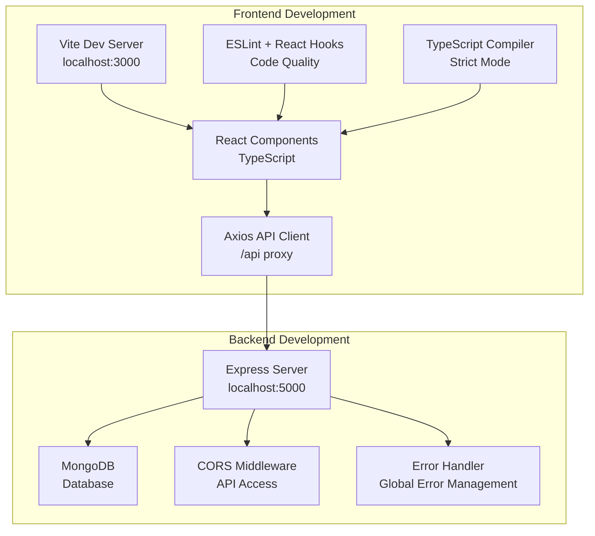
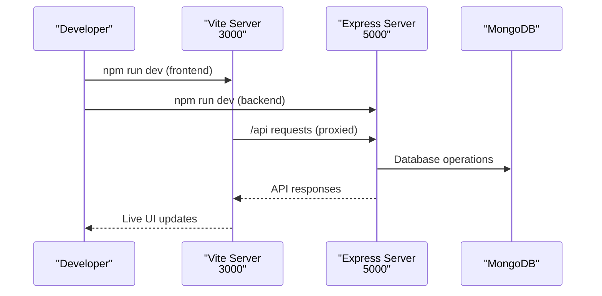

# Development Setup

<cite>
**Referenced Files in This Document**
- [vite.config.js](file://frontend/vite.config.js)
- [eslint.config.js](file://frontend/eslint.config.js)
- [package.json](file://frontend/package.json)
- [tsconfig.json](file://frontend/tsconfig.json)
- [server.js](file://backend/server.js)
- [database.js](file://backend/config/database.js)
- [README.md](file://backend/README.md)
- [errorHandler.js](file://backend/middleware/errorHandler.js)
- [constants.js](file://backend/utils/constants.js)
- [seed.js](file://backend/scripts/seed.js)
- [authController.js](file://backend/controllers/authController.js)
- [authService.js](file://backend/services/authService.js)
- [validation.js](file://backend/middleware/validation.js)
- [User.js](file://backend/models/User.js)
- [response.js](file://backend/utils/response.js)
- [auth.js](file://backend/middleware/auth.js)
- [auth.js](file://backend/routes/auth.js)
- [auth.test.js](file://backend/tests/auth.test.js)
- [main.jsx](file://frontend/src/main.jsx)
- [App.jsx](file://frontend/src/App.jsx)
- [AuthContext.jsx](file://frontend/src/context/AuthContext.jsx)
- [Layout.jsx](file://frontend/src/components/Layout.jsx)
- [index.js](file://frontend/src/api/index.js)
</cite>

## Update Summary
**Changes Made**
- Added comprehensive frontend development setup with Vite configuration and React ecosystem
- Integrated modern ESLint configuration with React-specific rules and TypeScript support
- Enhanced TypeScript configuration for strict type checking and modern JavaScript features
- Updated development workflow to include both frontend and backend development servers
- Added API client configuration with Axios and authentication interceptors
- Implemented React Router-based frontend architecture with protected routes
- Enhanced development scripts for both frontend and backend environments

## Table of Contents
1. [Introduction](#introduction)
2. [Project Structure](#project-structure)
3. [Core Components](#core-components)
4. [Architecture Overview](#architecture-overview)
5. [Detailed Component Analysis](#detailed-component-analysis)
6. [Development Environment Setup](#development-environment-setup)
7. [Frontend Development Configuration](#frontend-development-configuration)
8. [Backend Development Configuration](#backend-development-configuration)
9. [Modern Development Workflow](#modern-development-workflow)
10. [Code Quality and Tooling](#code-quality-and-tooling)
11. [Testing and Debugging](#testing-and-debugging)
12. [Performance Considerations](#performance-considerations)
13. [Troubleshooting Guide](#troubleshooting-guide)
14. [Conclusion](#conclusion)
15. [Appendices](#appendices)

## Introduction
This document provides a comprehensive development setup guide for contributors working on the FDPAC Finance Dashboard, now featuring a modernized development environment with Vite-powered frontend, comprehensive ESLint configuration, and integrated development workflow. The project now includes both frontend and backend development servers, modern React components with TypeScript support, automated linting, and streamlined development processes.

## Project Structure
The FDPAC Finance Dashboard now features a dual-environment architecture with modern development tools:
- **Frontend**: Vite-powered React application with TypeScript, ESLint configuration, and modern development server
- **Backend**: Express.js REST API with comprehensive middleware, authentication, and database integration
- **Development Workflow**: Parallel development servers with proxy configuration for seamless API integration
- **Code Quality**: Automated linting with React-specific rules and TypeScript support
- **Build System**: Optimized production builds for both frontend and backend

```mermaid
graph TB
A["Vite Dev Server<br/>Port 3000"] --> B["React Frontend<br/>TypeScript + ESLint"]
A --> C["Proxy /api -> Backend<br/>Port 5000"]
D["Express Backend<br/>Port 5000"] --> E["MongoDB Database"]
B --> F["Axios API Client<br/>Authentication Interceptors"]
F --> C
C --> D
G["ESLint Config<br/>React + Hooks + Refresh"] --> B
H["TypeScript Config<br/>Strict Mode"] --> B
```



**Diagram sources**
- [vite.config.js:5-16](file://frontend/vite.config.js#L5-L16)
- [eslint.config.js:7-29](file://frontend/eslint.config.js#L7-L29)
- [tsconfig.json:1-27](file://frontend/tsconfig.json#L1-L27)
- [server.js:87-99](file://backend/server.js#L87-L99)

**Section sources**
- [vite.config.js:1-17](file://frontend/vite.config.js#L1-L17)
- [eslint.config.js:1-30](file://frontend/eslint.config.js#L1-L30)
- [tsconfig.json:1-27](file://frontend/tsconfig.json#L1-L27)
- [server.js:14-56](file://backend/server.js#L14-L56)

## Core Components
The modernized development environment includes several key components:

### Frontend Development Stack
- **Vite Configuration**: Modern build tool with React plugin, development server, and proxy configuration
- **ESLint Setup**: Comprehensive linting with React hooks, React refresh, and browser globals
- **TypeScript Support**: Strict type checking with modern JavaScript features
- **React Ecosystem**: Component-based architecture with context providers and routing
- **API Client**: Axios-based client with automatic authentication and error handling

### Backend Development Stack
- **Express.js**: Modern REST API framework with enhanced error handling
- **Development Scripts**: Hot reloading with nodemon and comprehensive build commands
- **Environment Management**: Dotenv configuration and environment-specific settings
- **Database Integration**: Mongoose ORM with connection pooling and error handling

**Section sources**
- [vite.config.js:5-16](file://frontend/vite.config.js#L5-L16)
- [eslint.config.js:7-29](file://frontend/eslint.config.js#L7-L29)
- [tsconfig.json:17-24](file://frontend/tsconfig.json#L17-L24)
- [package.json:6-11](file://backend/package.json#L6-L11)

## Architecture Overview
The modernized architecture supports a full-stack development experience with seamless frontend-backend integration:



**Diagram sources**
- [vite.config.js:7-15](file://frontend/vite.config.js#L7-L15)
- [eslint.config.js:25-27](file://frontend/eslint.config.js#L25-L27)
- [tsconfig.json:17-24](file://frontend/tsconfig.json#L17-L24)
- [server.js:30-40](file://backend/server.js#L30-L40)

## Detailed Component Analysis

### Frontend Development Environment
The frontend leverages Vite for lightning-fast development with modern React features:

#### Vite Configuration
- **Development Server**: Runs on port 3000 with hot module replacement
- **React Plugin**: Optimized React development experience with Fast Refresh
- **Proxy Configuration**: Routes `/api` requests to backend server at localhost:5000
- **Build Optimization**: Production-ready builds with code splitting and asset optimization

#### ESLint Configuration
- **React Hooks**: Automatic detection and linting of hook usage patterns
- **React Refresh**: Supports Fast Refresh for instant UI updates
- **Browser Globals**: Proper handling of browser-specific APIs
- **Custom Rules**: Ignores uppercase variables and unused variables appropriately

#### TypeScript Configuration
- **Modern JavaScript**: ES2023 target with latest language features
- **Strict Type Checking**: Comprehensive type safety across the application
- **Module Resolution**: Bundler-compatible module resolution for optimal builds
- **Linting Integration**: TypeScript-aware linting with strict rules

**Section sources**
- [vite.config.js:5-16](file://frontend/vite.config.js#L5-L16)
- [eslint.config.js:7-29](file://frontend/eslint.config.js#L7-L29)
- [tsconfig.json:17-24](file://frontend/tsconfig.json#L17-L24)

### Backend Development Environment
The backend maintains its robust Express.js foundation with enhanced development capabilities:

#### Express Server Configuration
- **Development Logging**: Console logging for incoming requests in development mode
- **CORS Support**: Cross-origin resource sharing for frontend-backend communication
- **JSON Processing**: Automatic parsing of JSON request bodies
- **Health Check**: `/health` endpoint for monitoring server status

#### Database Integration
- **Connection Management**: Graceful connection handling with error recovery
- **Environment Configuration**: Flexible database URI configuration
- **Seed Script**: Automated data population for development and testing

**Section sources**
- [server.js:34-50](file://backend/server.js#L34-L50)
- [database.js:11-25](file://backend/config/database.js#L11-L25)

### API Client and Authentication
The frontend includes a comprehensive API client with authentication management:

#### Axios Configuration
- **Base URL**: Uses `/api` for all requests, proxied by Vite
- **Request Interceptors**: Automatic token injection from localStorage
- **Response Interceptors**: Automatic logout on 401 errors
- **API Endpoints**: Organized modules for auth, users, finances, and dashboard

#### Authentication Context
- **Token Management**: Secure storage and retrieval of authentication tokens
- **User State**: Centralized user information and permissions
- **Role-Based Access**: Dynamic navigation and feature access based on user roles
- **Protected Routes**: Automatic redirection for unauthorized access attempts

**Section sources**
- [index.js:3-30](file://frontend/src/api/index.js#L3-L30)
- [AuthContext.jsx:14-78](file://frontend/src/context/AuthContext.jsx#L14-L78)

## Development Environment Setup

### Prerequisites
- Node.js 16+ (recommended 18+)
- MongoDB instance (local or cloud)
- Git for version control
- Code editor with ESLint and TypeScript support

### Environment Variables
Both frontend and backend require specific environment variables:

#### Backend Environment Variables
- `PORT`: Server port (default: 5000)
- `NODE_ENV`: Environment mode (development/production)
- `MONGODB_URI`: MongoDB connection string
- `JWT_SECRET`: JWT signing secret (required for authentication)
- `JWT_EXPIRE`: JWT expiration time (default: 7d)

#### Frontend Environment Variables
- `VITE_API_URL`: Base API URL (default: http://localhost:5000)
- `VITE_APP_NAME`: Application name for display

**Section sources**
- [database.js:13](file://backend/config/database.js#L13)
- [auth.js:100-109](file://backend/middleware/auth.js#L100-L109)

### Installation Steps
1. Clone the repository
2. Install backend dependencies: `cd backend && npm install`
3. Install frontend dependencies: `cd frontend && npm install`
4. Set up environment variables in `.env` files
5. Start development servers: `npm run dev` (backend) and `npm run dev` (frontend)

## Frontend Development Configuration

### Vite Development Server
The frontend uses Vite for optimal development experience:

#### Key Features
- **Hot Module Replacement**: Instant UI updates without page refresh
- **Fast Build Times**: Optimized bundling for development and production
- **Plugin System**: React plugin with Fast Refresh support
- **Proxy Configuration**: Seamless API communication with backend

#### Development Commands
- `npm run dev`: Start development server with hot reload
- `npm run build`: Create optimized production build
- `npm run preview`: Preview production build locally
- `npm run lint`: Run ESLint for code quality

**Section sources**
- [vite.config.js:5-16](file://frontend/vite.config.js#L5-L16)
- [package.json:6-11](file://frontend/package.json#L6-L11)

### React Application Structure
The frontend follows modern React patterns with TypeScript:

#### Component Architecture
- **Main Entry**: `main.jsx` with React.StrictMode wrapper
- **Routing**: React Router DOM with protected routes
- **Context Providers**: Centralized authentication and state management
- **Layout System**: Responsive sidebar with dynamic navigation

#### Authentication Flow
- **Protected Routes**: Automatic authentication checks
- **Role-Based Navigation**: Dynamic menu items based on user roles
- **Automatic Logout**: Handles expired tokens gracefully
- **Loading States**: User-friendly loading indicators

**Section sources**
- [main.jsx:1-11](file://frontend/src/main.jsx#L1-L11)
- [App.jsx:23-63](file://frontend/src/App.jsx#L23-L63)
- [AuthContext.jsx:14-78](file://frontend/src/context/AuthContext.jsx#L14-L78)

## Backend Development Configuration

### Express Server Setup
The backend provides a robust foundation for API development:

#### Server Configuration
- **Middleware Pipeline**: CORS, JSON parsing, development logging
- **Route Organization**: Modular route definitions for auth, users, finances, dashboard
- **Error Handling**: Comprehensive error mapping and standardized responses
- **Health Monitoring**: `/health` endpoint for server status checks

#### Development Scripts
- `npm start`: Production server startup
- `npm run dev`: Development server with hot reload via nodemon
- `npm run seed`: Database seeding for development and testing

**Section sources**
- [server.js:14-56](file://backend/server.js#L14-L56)
- [package.json:6-11](file://backend/package.json#L6-L11)

### Database Integration
The backend uses Mongoose for MongoDB operations:

#### Connection Management
- **Connection Pooling**: Efficient database connection handling
- **Error Recovery**: Graceful handling of connection failures
- **Environment Flexibility**: Support for local and cloud database instances
- **Seed Operations**: Automated data population for development

**Section sources**
- [database.js:11-25](file://backend/config/database.js#L11-L25)
- [seed.js:82-124](file://backend/scripts/seed.js#L82-L124)

## Modern Development Workflow

### Parallel Development Servers
The modern workflow supports simultaneous frontend and backend development:



**Diagram sources**
- [vite.config.js:9-14](file://frontend/vite.config.js#L9-L14)
- [server.js:87-99](file://backend/server.js#L87-L99)

### Development Process
1. **Start Backend**: `cd backend && npm run dev`
2. **Start Frontend**: `cd frontend && npm run dev`
3. **Access Application**: Navigate to `http://localhost:3000`
4. **Automatic Updates**: Changes trigger hot reload in both servers
5. **API Communication**: Frontend automatically proxies to backend

### Build and Deployment
- **Frontend Build**: `npm run build` creates optimized production bundle
- **Backend Build**: Standard Node.js deployment with environment variables
- **Deployment**: Separate deployment processes for frontend and backend

**Section sources**
- [vite.config.js:5-16](file://frontend/vite.config.js#L5-L16)
- [package.json:6-11](file://backend/package.json#L6-L11)

## Code Quality and Tooling

### ESLint Configuration
The frontend includes comprehensive ESLint setup:

#### Configuration Features
- **Recommended Rules**: Base JavaScript recommendations
- **React Hooks**: Hook usage pattern validation
- **React Refresh**: Fast Refresh compatibility
- **Custom Rules**: Tailored to project needs and team preferences

#### Development Benefits
- **Real-time Feedback**: Inline linting in code editor
- **Consistent Style**: Automated code formatting and style enforcement
- **Bug Prevention**: Early detection of common programming errors
- **Team Standards**: Shared code quality standards across contributors

**Section sources**
- [eslint.config.js:7-29](file://frontend/eslint.config.js#L7-L29)

### TypeScript Integration
Comprehensive TypeScript support ensures type safety:

#### Compiler Options
- **Modern Target**: ES2023 with latest JavaScript features
- **Strict Mode**: Comprehensive type checking and error prevention
- **Module Resolution**: Optimized for bundler environments
- **Lint Integration**: TypeScript-aware linting rules

#### Development Experience
- **IntelliSense**: Full code completion and type information
- **Refactoring**: Safe code refactoring with type safety
- **Documentation**: Automatic API documentation generation
- **Error Detection**: Compile-time error detection

**Section sources**
- [tsconfig.json:17-24](file://frontend/tsconfig.json#L17-L24)

### Git-Based Workflow
The project follows modern Git-based development practices:

#### Branching Strategy
- **Main Branch**: Stable production code
- **Feature Branches**: Isolated development for new features
- **Pull Requests**: Code review and collaboration process
- **Version Tags**: Semantic versioning for releases

#### Development Practices
- **Commit Messages**: Descriptive commit messages following conventions
- **Pre-commit Hooks**: Automated code quality checks
- **Continuous Integration**: Automated testing and deployment pipelines
- **Documentation**: Up-to-date documentation with code changes

## Testing and Debugging

### Frontend Testing
The frontend supports modern testing approaches:

#### Test Configuration
- **Component Testing**: Individual component testing with React Testing Library
- **Integration Testing**: End-to-end testing with Cypress or Playwright
- **API Testing**: Mock API responses for isolated component testing
- **Performance Testing**: Bundle size analysis and performance metrics

#### Debugging Tools
- **React Developer Tools**: Component inspection and state debugging
- **Redux DevTools**: State management debugging (if applicable)
- **Network Inspection**: API call debugging and response analysis
- **Console Logging**: Development-specific logging and debugging

### Backend Testing
The backend maintains comprehensive testing capabilities:

#### Test Structure
- **Unit Tests**: Individual function and service testing
- **Integration Tests**: Database and API endpoint testing
- **Authentication Tests**: JWT token validation and role-based access
- **Error Handling Tests**: Edge case and error scenario validation

#### Debugging Approaches
- **Development Logging**: Detailed request/response logging
- **Database Queries**: Query analysis and performance monitoring
- **Error Tracing**: Comprehensive error stack traces and context
- **API Testing**: Manual testing with tools like Postman or curl

**Section sources**
- [auth.test.js:23-111](file://backend/tests/auth.test.js#L23-L111)

## Performance Considerations

### Frontend Performance
The modern frontend stack prioritizes performance:

#### Optimization Strategies
- **Code Splitting**: Lazy loading of components and routes
- **Bundle Analysis**: Regular bundle size monitoring and optimization
- **Asset Optimization**: Image compression and resource optimization
- **Caching Strategy**: Browser caching and service worker implementation

#### Development Performance
- **Fast Refresh**: Instant UI updates without full page reload
- **Hot Module Replacement**: Efficient module updates during development
- **Build Optimization**: Optimized development builds with minimal overhead
- **Memory Management**: Efficient memory usage and cleanup

### Backend Performance
The backend focuses on scalable and efficient API design:

#### Performance Features
- **Connection Pooling**: Efficient database connection management
- **Request Limiting**: Rate limiting and protection against abuse
- **Caching Strategy**: Application-level caching for frequently accessed data
- **Error Handling**: Graceful degradation and error recovery

#### Monitoring and Metrics
- **Health Checks**: Regular server health and performance monitoring
- **Database Performance**: Query optimization and index management
- **API Metrics**: Request/response time and error rate tracking
- **Resource Usage**: Memory and CPU utilization monitoring

**Section sources**
- [server.js:34-40](file://backend/server.js#L34-L40)
- [User.js:56-59](file://backend/models/User.js#L56-L59)

## Troubleshooting Guide

### Common Development Issues

#### Frontend Issues
- **Vite Server Problems**: Check port conflicts and proxy configuration
- **React Errors**: Verify component imports and prop types
- **ESLint Errors**: Fix linting violations or adjust configuration
- **TypeScript Errors**: Resolve type mismatches and import issues

#### Backend Issues
- **Database Connection**: Verify MongoDB URI and network connectivity
- **JWT Authentication**: Check secret key configuration and token validity
- **CORS Errors**: Configure proper origin and header settings
- **API Route Issues**: Verify route definitions and parameter handling

#### Environment Issues
- **Missing Dependencies**: Run `npm install` in both frontend and backend directories
- **Environment Variables**: Ensure all required variables are properly configured
- **Port Conflicts**: Change default ports if they're already in use
- **Git Issues**: Resolve merge conflicts and ensure proper branching

### Debugging Techniques

#### Frontend Debugging
- **React DevTools**: Inspect component hierarchy and state
- **Network Tab**: Monitor API requests and responses
- **Console Logging**: Use development-specific logging
- **Component Inspection**: Debug individual component behavior

#### Backend Debugging
- **Request Logging**: Enable detailed logging for development
- **Database Queries**: Monitor and optimize database operations
- **Error Stack Traces**: Analyze error contexts and root causes
- **API Testing**: Use tools like Postman for manual API testing

**Section sources**
- [vite.config.js:9-14](file://frontend/vite.config.js#L9-L14)
- [server.js:34-40](file://backend/server.js#L34-L40)
- [errorHandler.js:150-171](file://backend/middleware/errorHandler.js#L150-L171)

## Conclusion
The FDPAC Finance Dashboard now features a modernized development environment that combines the power of Vite, React, TypeScript, and comprehensive ESLint configuration with a robust Express.js backend. This setup provides developers with fast feedback loops, excellent code quality tools, and a streamlined development workflow that supports both frontend and backend development simultaneously. The integrated proxy configuration, automated linting, and TypeScript support ensure a professional development experience that scales from small projects to enterprise applications.

## Appendices

### Development Scripts Reference

#### Frontend Scripts
- `npm run dev`: Start Vite development server with hot reload
- `npm run build`: Create optimized production build
- `npm run preview`: Preview production build locally
- `npm run lint`: Run ESLint for code quality analysis

#### Backend Scripts
- `npm start`: Start production server
- `npm run dev`: Start development server with nodemon hot reload
- `npm run seed`: Seed database with sample data
- `npm test`: Run unit tests (placeholder for future implementation)

**Section sources**
- [package.json:6-11](file://frontend/package.json#L6-L11)
- [package.json:6-11](file://backend/package.json#L6-L11)

### Environment Variables Reference

#### Backend Variables
- `PORT`: Server port (default: 5000)
- `NODE_ENV`: Environment mode (development/production)
- `MONGODB_URI`: MongoDB connection string (required)
- `JWT_SECRET`: JWT signing secret (required for authentication)
- `JWT_EXPIRE`: JWT expiration time (default: 7d)

#### Frontend Variables
- `VITE_API_URL`: Base API URL (default: http://localhost:5000)
- `VITE_APP_NAME`: Application name for display

**Section sources**
- [database.js:13](file://backend/config/database.js#L13)
- [auth.js:100-109](file://backend/middleware/auth.js#L100-L109)

### Code Quality Tools

#### Frontend Tools
- **ESLint**: JavaScript/TypeScript linting with React-specific rules
- **TypeScript**: Strict type checking and compile-time error detection
- **Prettier**: Code formatting (recommended for consistent styling)
- **Husky**: Git hooks for automated quality checks

#### Backend Tools
- **ESLint**: JavaScript linting with Node.js best practices
- **Jest**: Testing framework for unit and integration tests
- **Mocha/Chai**: Alternative testing approach for API testing

### Contribution Workflow

#### Development Process
1. Fork repository and create feature branch
2. Set up development environment with required dependencies
3. Implement features with proper testing and documentation
4. Run linting and quality checks before committing
5. Submit pull request with clear description and testing results

#### Code Standards
- **Frontend**: TypeScript-first development with React best practices
- **Backend**: Modular Express.js architecture with proper error handling
- **Documentation**: Clear comments and README updates for new features
- **Testing**: Comprehensive test coverage for critical functionality

### API Client Usage

#### Authentication Flow
```javascript
// Login and store token
const { user, token } = await authAPI.login(email, password);
localStorage.setItem('token', token);
localStorage.setItem('user', JSON.stringify(user));

// Protected API calls automatically include token
const profile = await authAPI.getProfile();

// Automatic logout on 401 errors
// Token removed and user redirected to login
```

#### Error Handling
- **401 Unauthorized**: Automatic token removal and logout
- **Network Errors**: Retry logic and user-friendly error messages
- **Validation Errors**: Specific error messages for form validation
- **Server Errors**: Generic error handling with user feedback

**Section sources**
- [index.js:32-38](file://frontend/src/api/index.js#L32-L38)
- [AuthContext.jsx:22-36](file://frontend/src/context/AuthContext.jsx#L22-L36)