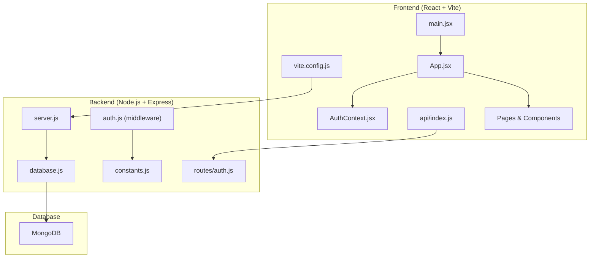
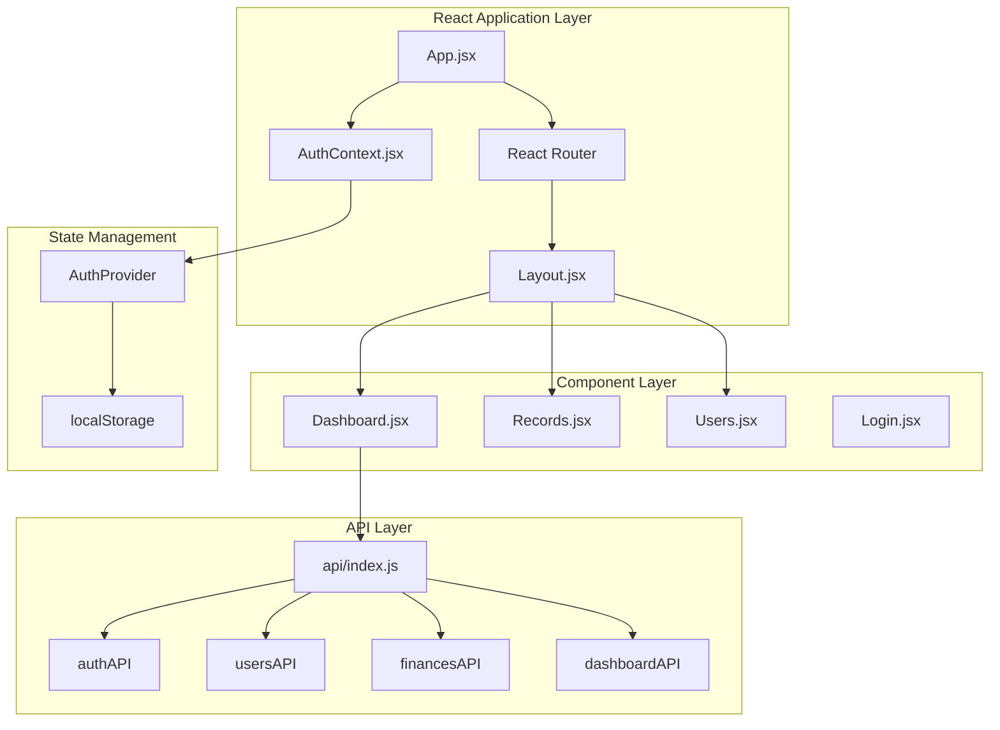
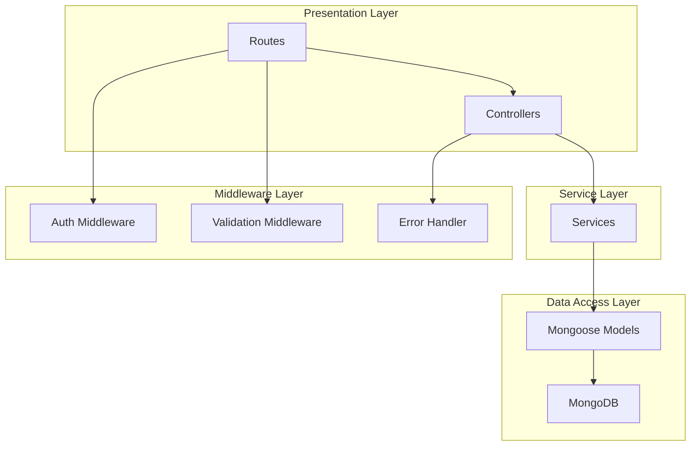
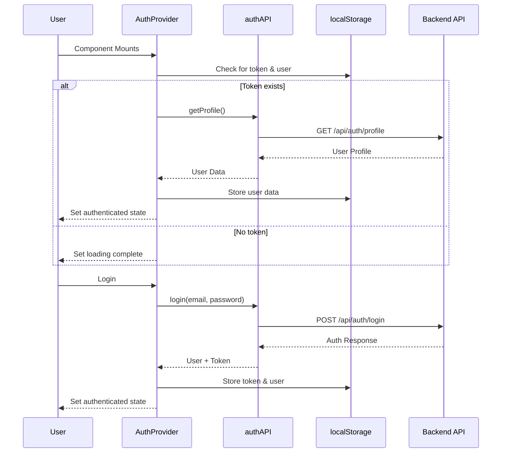
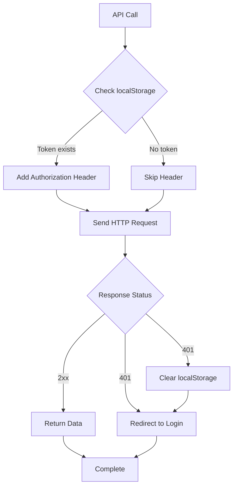
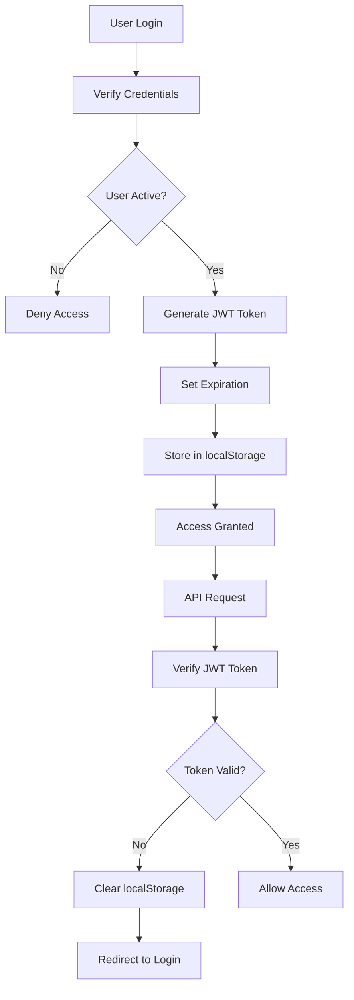
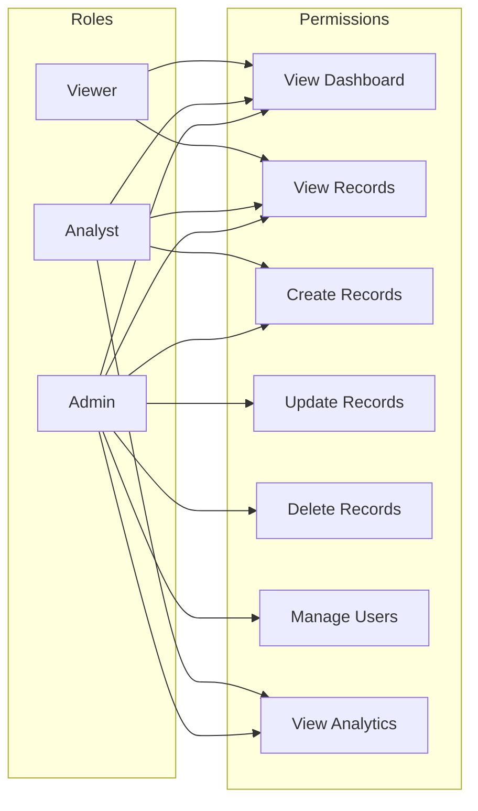
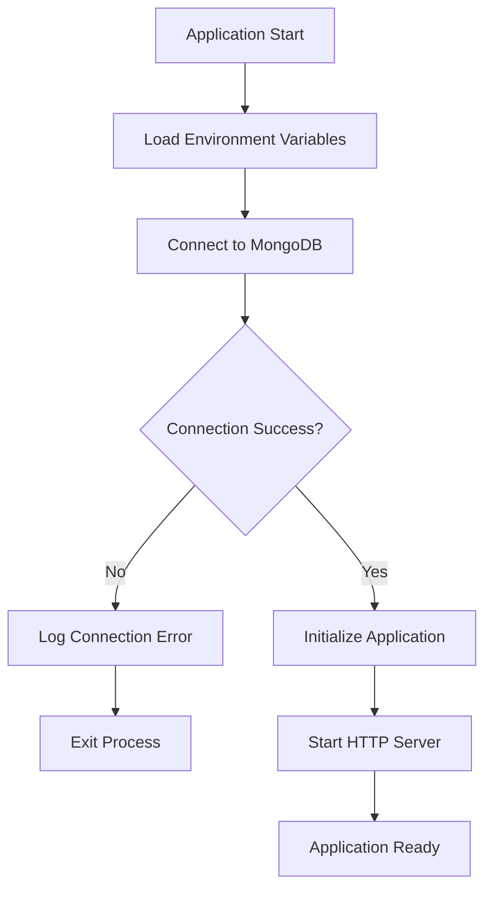

# Getting Started

<cite>
**Referenced Files in This Document**
- [package.json](file://frontend/package.json)
- [vite.config.js](file://frontend/vite.config.js)
- [main.jsx](file://frontend/src/main.jsx)
- [App.jsx](file://frontend/src/App.jsx)
- [AuthContext.jsx](file://frontend/src/context/AuthContext.jsx)
- [api/index.js](file://frontend/src/api/index.js)
- [Dashboard.jsx](file://frontend/src/pages/Dashboard.jsx)
- [Layout.jsx](file://frontend/src/components/Layout.jsx)
- [server.js](file://backend/server.js)
- [package.json](file://backend/package.json)
- [database.js](file://backend/config/database.js)
- [auth.js](file://backend/middleware/auth.js)
- [constants.js](file://backend/utils/constants.js)
- [auth.js](file://backend/routes/auth.js)
</cite>

## Update Summary
**Changes Made**
- Added comprehensive frontend React application setup with Vite build system
- Updated development workflow to include modern React + Node.js + MongoDB stack
- Integrated authentication context and API layer for seamless frontend-backend communication
- Added proxy configuration for development environment
- Updated project structure to reflect modern full-stack architecture

## Table of Contents
1. [Introduction](#introduction)
2. [Prerequisites](#prerequisites)
3. [Project Structure](#project-structure)
4. [Installation and Setup](#installation-and-setup)
5. [Environment Configuration](#environment-configuration)
6. [Development Workflow](#development-workflow)
7. [Application Architecture](#application-architecture)
8. [Frontend Application Features](#frontend-application-features)
9. [Backend API Endpoints](#backend-api-endpoints)
10. [Authentication and Authorization](#authentication-and-authorization)
11. [Database Setup](#database-setup)
12. [Running the Application](#running-the-application)
13. [Troubleshooting Guide](#troubleshooting-guide)
14. [Verification Steps](#verification-steps)

## Introduction
This guide provides a comprehensive walkthrough for setting up and running the FDPAC Finance Dashboard, a modern full-stack financial management application built with React, Node.js, Express, and MongoDB. The application features role-based access control, real-time financial analytics, and a responsive dashboard interface designed for financial data visualization and management.

The application follows a microservices-like architecture with separate frontend and backend repositories, utilizing Vite for fast development builds and Express for RESTful API services. The frontend is built with React 19, featuring modern hooks, context-based state management, and TypeScript support.

## Prerequisites
Before installing the FDPAC Finance Dashboard, ensure your system meets the following requirements:

### System Requirements
- **Node.js**: Version 18 or higher (recommended: LTS version)
- **npm**: Latest stable version
- **MongoDB**: Local or cloud instance (MongoDB Community Server 6.0+)
- **Git**: For repository cloning and version control

### Development Tools
- **Code Editor**: VS Code recommended with ESLint and Prettier extensions
- **Browser**: Modern browser with developer tools
- **Postman**: For API testing (optional)

**Section sources**
- [package.json:12-28](file://frontend/package.json#L12-L28)
- [package.json:16-24](file://backend/package.json#L16-L24)

## Project Structure
The FDPAC Finance Dashboard follows a modern monorepo structure with clear separation between frontend and backend components:

```
FDPAC/
├── frontend/           # React application with Vite build system
│   ├── src/
│   │   ├── api/        # API client configuration
│   │   ├── components/ # Reusable UI components
│   │   ├── context/    # React context providers
│   │   ├── pages/      # Page components
│   │   └── assets/     # Static assets
│   ├── public/         # Static public files
│   ├── vite.config.js  # Vite build configuration
│   └── package.json    # Frontend dependencies
└── backend/           # Node.js Express API
    ├── config/        # Database and configuration
    ├── controllers/   # Business logic handlers
    ├── middleware/    # Request processing middleware
    ├── models/        # Mongoose data models
    ├── routes/        # API route definitions
    ├── services/      # Service layer logic
    └── package.json   # Backend dependencies
```



**Diagram sources**
- [main.jsx:1-11](file://frontend/src/main.jsx#L1-L11)
- [App.jsx:1-66](file://frontend/src/App.jsx#L1-L66)
- [AuthContext.jsx:1-81](file://frontend/src/context/AuthContext.jsx#L1-L81)
- [api/index.js:1-71](file://frontend/src/api/index.js#L1-L71)
- [server.js:1-113](file://backend/server.js#L1-L113)
- [database.js:1-43](file://backend/config/database.js#L1-L43)
- [auth.js:1-116](file://backend/middleware/auth.js#L1-L116)
- [constants.js:1-81](file://backend/utils/constants.js#L1-L81)
- [auth.js:1-49](file://backend/routes/auth.js#L1-L49)

**Section sources**
- [main.jsx:1-11](file://frontend/src/main.jsx#L1-L11)
- [App.jsx:1-66](file://frontend/src/App.jsx#L1-L66)
- [server.js:1-113](file://backend/server.js#L1-L113)

## Installation and Setup

### Step 1: Clone the Repository
```bash
git clone https://github.com/your-username/FDPAC.git
cd FDPAC
```

### Step 2: Install Backend Dependencies
Navigate to the backend directory and install dependencies:
```bash
cd backend
npm install
```

### Step 3: Install Frontend Dependencies
Navigate to the frontend directory and install dependencies:
```bash
cd ../frontend
npm install
```

### Step 4: Create Environment Configuration
Create `.env` files in both backend and frontend directories:

**Backend .env (.env):**
```env
NODE_ENV=development
PORT=5000
MONGODB_URI=mongodb://localhost:27017/finance_dashboard
JWT_SECRET=your-super-secret-jwt-key-here
JWT_EXPIRE=7d
```

**Frontend .env (.env):**
```env
VITE_API_URL=http://localhost:5000
```

### Step 5: Configure Vite Proxy
The frontend uses Vite's proxy configuration to communicate with the backend API. The proxy is already configured in `vite.config.js` to forward `/api` requests to `http://localhost:5000`.

**Section sources**
- [package.json:6-11](file://frontend/package.json#L6-L11)
- [vite.config.js:7-16](file://frontend/vite.config.js#L7-L16)
- [server.js:87-99](file://backend/server.js#L87-L99)

## Environment Configuration

### Backend Environment Variables
The backend application requires the following environment variables:

| Variable | Description | Default Value | Required |
|----------|-------------|---------------|----------|
| `NODE_ENV` | Application environment | `development` | Yes |
| `PORT` | Server port number | `5000` | Yes |
| `MONGODB_URI` | MongoDB connection string | `mongodb://localhost:27017/finance_dashboard` | Yes |
| `JWT_SECRET` | JWT token secret key | `fallbacksecret` | Yes |
| `JWT_EXPIRE` | Token expiration time | `7d` | Yes |

### Frontend Environment Variables
The frontend application uses Vite's environment variables:

| Variable | Description | Default Value | Required |
|----------|-------------|---------------|----------|
| `VITE_API_URL` | Backend API base URL | `http://localhost:5000` | Yes |

**Section sources**
- [server.js:87-99](file://backend/server.js#L87-L99)
- [vite.config.js:3-8](file://frontend/vite.config.js#L3-L8)

## Development Workflow

### Development Mode
The application supports parallel development of both frontend and backend:

**Terminal 1 - Backend Development:**
```bash
cd backend
npm run dev
```

**Terminal 2 - Frontend Development:**
```bash
cd frontend
npm run dev
```

### Build Process
For production builds:

**Backend Build:**
```bash
cd backend
npm run build
```

**Frontend Build:**
```bash
cd frontend
npm run build
```

### Available Scripts
Both frontend and backend include the following npm scripts:

**Frontend Scripts:**
- `npm run dev`: Start development server with hot reload
- `npm run build`: Build production bundle
- `npm run lint`: Run ESLint for code quality
- `npm run preview`: Preview production build locally

**Backend Scripts:**
- `npm start`: Start production server
- `npm run dev`: Start development server with nodemon
- `npm run seed`: Seed database with sample data
- `npm run test`: Run application tests

**Section sources**
- [package.json:6-11](file://frontend/package.json#L6-L11)
- [package.json:6-11](file://backend/package.json#L6-L11)

## Application Architecture

### Frontend Architecture
The frontend is built with React 19 and follows modern React patterns:



**Diagram sources**
- [App.jsx:1-66](file://frontend/src/App.jsx#L1-L66)
- [Layout.jsx:1-61](file://frontend/src/components/Layout.jsx#L1-L61)
- [AuthContext.jsx:1-81](file://frontend/src/context/AuthContext.jsx#L1-L81)
- [api/index.js:1-71](file://frontend/src/api/index.js#L1-L71)
- [Dashboard.jsx:1-206](file://frontend/src/pages/Dashboard.jsx#L1-L206)

### Backend Architecture
The backend follows a layered architecture pattern:



**Diagram sources**
- [server.js:14-56](file://backend/server.js#L14-L56)
- [auth.js:1-116](file://backend/middleware/auth.js#L1-L116)
- [constants.js:1-81](file://backend/utils/constants.js#L1-L81)

**Section sources**
- [App.jsx:1-66](file://frontend/src/App.jsx#L1-L66)
- [server.js:14-56](file://backend/server.js#L14-L56)

## Frontend Application Features

### Authentication Context
The application implements a comprehensive authentication system using React Context:



**Diagram sources**
- [AuthContext.jsx:18-36](file://frontend/src/context/AuthContext.jsx#L18-L36)
- [AuthContext.jsx:38-47](file://frontend/src/context/AuthContext.jsx#L38-L47)
- [api/index.js:33-38](file://frontend/src/api/index.js#L33-L38)

### API Client Configuration
The frontend uses Axios for HTTP requests with automatic token injection:



**Diagram sources**
- [api/index.js:10-17](file://frontend/src/api/index.js#L10-L17)
- [api/index.js:20-30](file://frontend/src/api/index.js#L20-L30)

**Section sources**
- [AuthContext.jsx:1-81](file://frontend/src/context/AuthContext.jsx#L1-L81)
- [api/index.js:1-71](file://frontend/src/api/index.js#L1-L71)

## Backend API Endpoints

### Authentication Endpoints
The backend provides comprehensive authentication endpoints:

| Endpoint | Method | Description | Access Level |
|----------|--------|-------------|--------------|
| `/api/auth/register` | POST | Register new user | Public |
| `/api/auth/login` | POST | User login | Public |
| `/api/auth/profile` | GET | Get current user profile | Private |
| `/api/auth/change-password` | PUT | Change user password | Private |
| `/api/auth/setup-admin` | POST | Create initial admin user | Public |

### User Management Endpoints
| Endpoint | Method | Description | Access Level |
|----------|--------|-------------|--------------|
| `/api/users` | GET | Get all users | Analyst/Admin |
| `/api/users/:id` | GET | Get user by ID | Analyst/Admin |
| `/api/users` | POST | Create new user | Admin |
| `/api/users/:id` | PUT | Update user | Admin |
| `/api/users/:id` | DELETE | Delete user | Admin |
| `/api/users/:id/status` | PUT | Toggle user status | Admin |
| `/api/users/stats` | GET | Get user statistics | Admin |

### Financial Records Endpoints
| Endpoint | Method | Description | Access Level |
|----------|--------|-------------|--------------|
| `/api/finances` | GET | Get all financial records | Viewer/Analyst/Admin |
| `/api/finances/:id` | GET | Get record by ID | Viewer/Analyst/Admin |
| `/api/finances` | POST | Create new record | Analyst/Admin |
| `/api/finances/:id` | PUT | Update record | Admin |
| `/api/finances/:id` | DELETE | Delete record | Admin |
| `/api/finances/categories` | GET | Get available categories | Viewer/Analyst/Admin |

### Dashboard Endpoints
| Endpoint | Method | Description | Access Level |
|----------|--------|-------------|--------------|
| `/api/dashboard` | GET | Get dashboard overview | Viewer/Analyst/Admin |
| `/api/dashboard/summary` | GET | Get financial summary | Viewer/Analyst/Admin |
| `/api/dashboard/category-summary` | GET | Get category-wise summary | Analyst/Admin |
| `/api/dashboard/recent-activity` | GET | Get recent transactions | Viewer/Analyst/Admin |
| `/api/dashboard/trends/monthly` | GET | Get monthly trends | Analyst/Admin |

**Section sources**
- [auth.js:1-49](file://backend/routes/auth.js#L1-L49)
- [server.js:52-56](file://backend/server.js#L52-L56)

## Authentication and Authorization

### JWT Token Management
The application uses JSON Web Tokens for secure authentication:



**Diagram sources**
- [auth.js:14-59](file://backend/middleware/auth.js#L14-L59)
- [AuthContext.jsx:22-36](file://frontend/src/context/AuthContext.jsx#L22-L36)

### Role-Based Access Control (RBAC)
The application implements a hierarchical permission system:

| Role | Permissions |
|------|-------------|
| **Viewer** | View dashboard, view records |
| **Analyst** | All Viewer permissions + create records, view analytics |
| **Admin** | All permissions including user management |

### Permission Matrix


**Diagram sources**
- [constants.js:48-57](file://backend/utils/constants.js#L48-L57)

**Section sources**
- [auth.js:1-116](file://backend/middleware/auth.js#L1-L116)
- [constants.js:1-81](file://backend/utils/constants.js#L1-L81)

## Database Setup

### MongoDB Connection
The application uses Mongoose for MongoDB object modeling:



**Diagram sources**
- [database.js:11-25](file://backend/config/database.js#L11-L25)
- [server.js:26-27](file://backend/server.js#L26-L27)

### Database Models
The application uses two primary models:

**User Model**
- User identification and authentication
- Role-based permissions
- Account status management
- Password hashing and validation

**FinancialRecord Model**
- Income and expense tracking
- Category-based categorization
- Date and amount recording
- Soft-delete support

**Section sources**
- [database.js:1-43](file://backend/config/database.js#L1-L43)
- [server.js:26-27](file://backend/server.js#L26-L27)

## Running the Application

### Development Environment
1. **Start MongoDB**: Ensure MongoDB is running on your system
2. **Backend Development**: 
   ```bash
   cd backend
   npm run dev
   ```
3. **Frontend Development**:
   ```bash
   cd frontend
   npm run dev
   ```

### Production Environment
1. **Build Frontend**:
   ```bash
   cd frontend
   npm run build
   ```
2. **Start Backend**:
   ```bash
   cd backend
   npm start
   ```

### Health Check
Verify the application is running correctly:
```bash
curl http://localhost:5000/health
```

Expected response:
```json
{
  "success": true,
  "message": "Server is running",
  "timestamp": "2024-01-01T00:00:00.000Z",
  "environment": "development"
}
```

**Section sources**
- [server.js:42-50](file://backend/server.js#L42-L50)
- [server.js:89-99](file://backend/server.js#L89-L99)

## Troubleshooting Guide

### Common Issues and Solutions

#### 1. MongoDB Connection Errors
**Problem**: Application fails to connect to MongoDB
**Solution**:
```bash
# Check if MongoDB is running
mongosh --eval "db.adminCommand('ping')"

# Verify connection string in .env
# Test connection manually
mongo mongodb://localhost:27017/finance_dashboard
```

#### 2. Port Conflicts
**Problem**: Port 5000 or 3000 already in use
**Solution**:
```bash
# Find processes using the ports
lsof -i :5000
lsof -i :3000

# Kill conflicting processes
kill -9 $(lsof -t -i :5000)
kill -9 $(lsof -t -i :3000)

# Or change ports in .env files
```

#### 3. CORS Issues
**Problem**: Frontend cannot communicate with backend
**Solution**:
```javascript
// Check Vite proxy configuration in vite.config.js
// Should proxy /api requests to backend
```

#### 4. JWT Token Errors
**Problem**: Authentication failing with token errors
**Solution**:
```bash
# Verify JWT_SECRET in .env matches backend
# Clear browser localStorage and retry login
# Check token expiration settings
```

#### 5. API Proxy Issues
**Problem**: Frontend cannot reach backend API
**Solution**:
```bash
# Verify Vite proxy configuration
# Check if backend is running on http://localhost:5000
# Test API directly: curl http://localhost:5000/api/auth/login
```

### Debugging Tips
1. **Enable Detailed Logging**: Set `NODE_ENV=development` for verbose logging
2. **Check Network Tab**: Inspect browser network tab for API request failures
3. **Console Logs**: Monitor both frontend and backend console outputs
4. **Database Connectivity**: Verify MongoDB connection status
5. **Environment Variables**: Ensure all required environment variables are set

**Section sources**
- [server.js:35-40](file://backend/server.js#L35-L40)
- [server.js:102-110](file://backend/server.js#L102-L110)
- [vite.config.js:9-14](file://frontend/vite.config.js#L9-L14)

## Verification Steps

### Backend Verification
1. **Server Startup**:
   ```bash
   # Expected output should show server details
   # Environment: development
   # Port: 5000
   # API URL: http://localhost:5000
   ```

2. **Health Check Endpoint**:
   ```bash
   curl http://localhost:5000/health
   # Should return 200 status with success message
   ```

3. **Database Connection**:
   ```bash
   # Look for "MongoDB Connected: localhost:27017" in logs
   ```

### Frontend Verification
1. **Development Server**:
   ```bash
   # Should start on http://localhost:3000
   # Vite should show "ready" in console
   ```

2. **API Proxy Test**:
   ```bash
   # Test API proxy: curl http://localhost:3000/api/auth/login
   # Should return 400 (expected - no credentials provided)
   ```

3. **Authentication Flow**:
   ```bash
   # Login should redirect to dashboard
   # User data should be stored in localStorage
   # Navigation menu should reflect user role
   ```

### Complete System Test
1. **Full Stack Test**:
   - Start both servers
   - Access frontend at http://localhost:3000
   - Login with credentials
   - Verify dashboard loads successfully
   - Test navigation between different pages
   - Verify API calls are proxied correctly

2. **Role-Based Testing**:
   - Test viewer role restrictions
   - Test analyst role capabilities
   - Test admin role permissions
   - Verify proper navigation visibility

**Section sources**
- [server.js:89-99](file://backend/server.js#L89-L99)
- [App.jsx:23-63](file://frontend/src/App.jsx#L23-L63)
- [AuthContext.jsx:14-36](file://frontend/src/context/AuthContext.jsx#L14-L36)