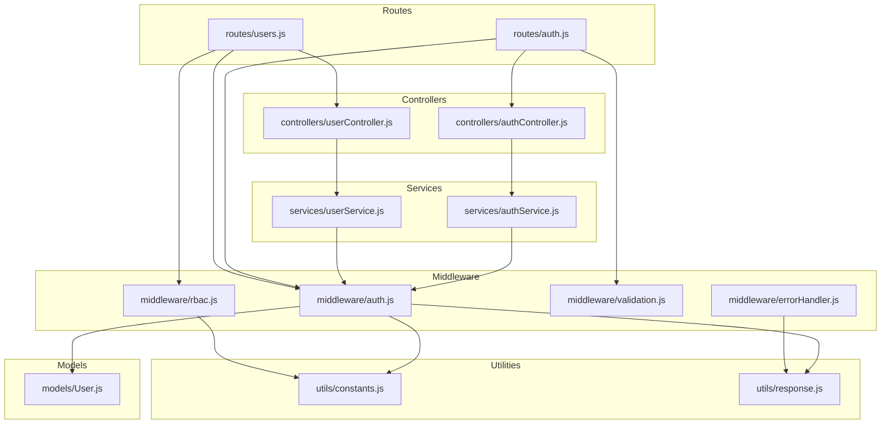
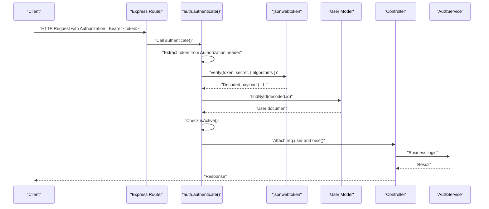
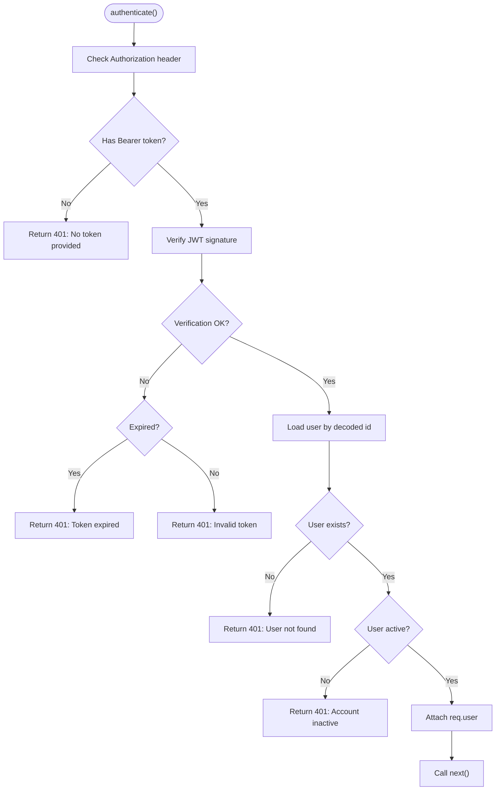
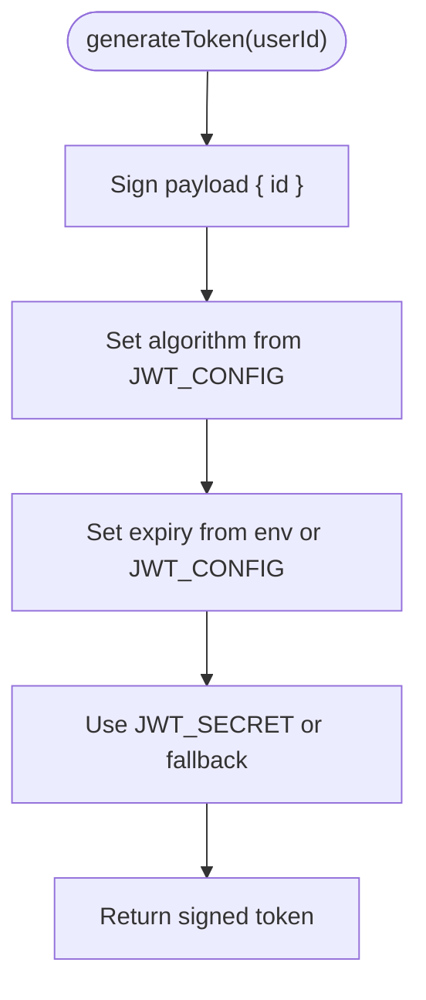
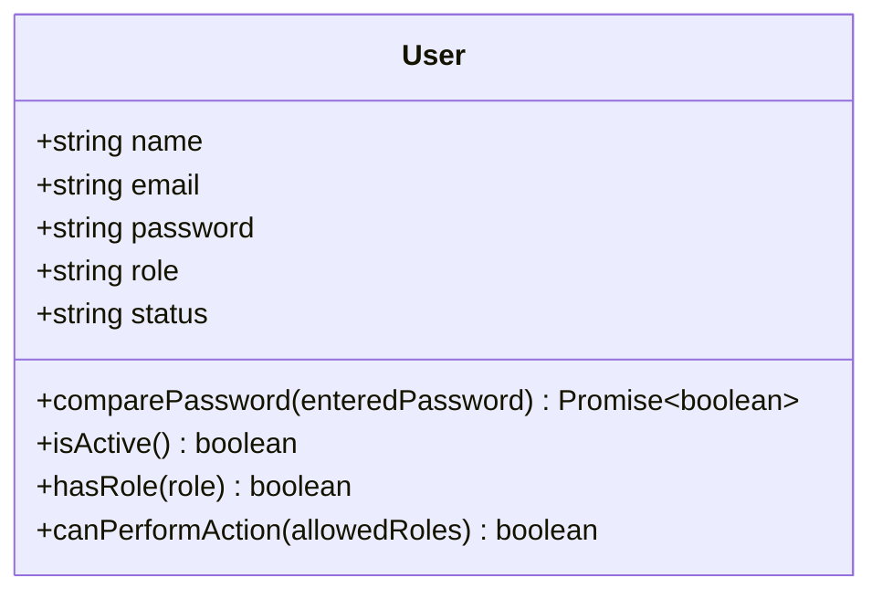
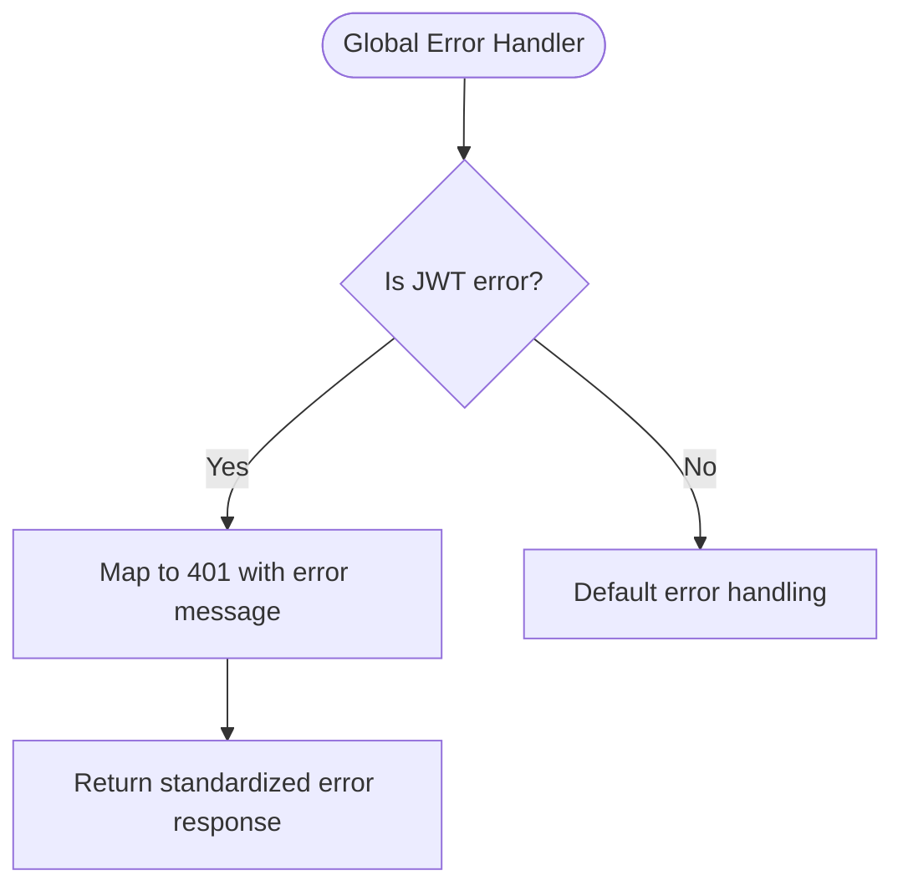
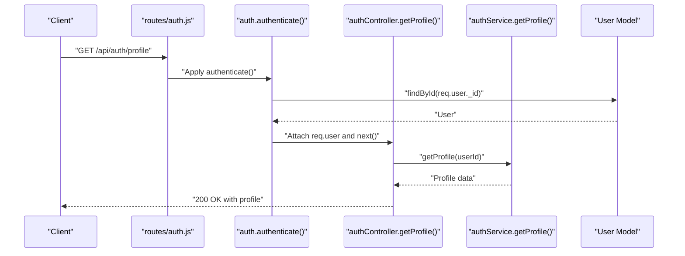
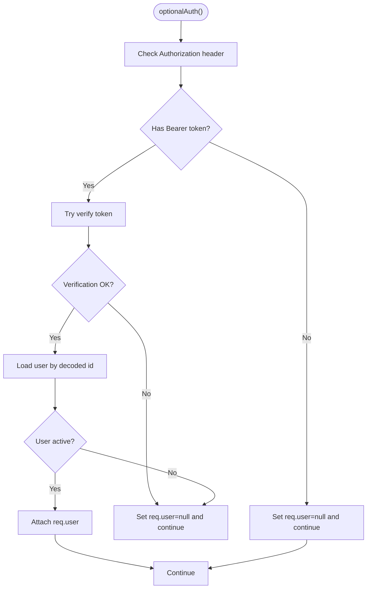
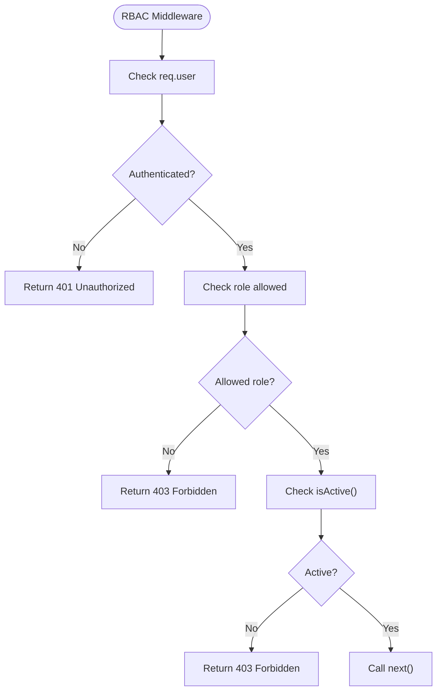
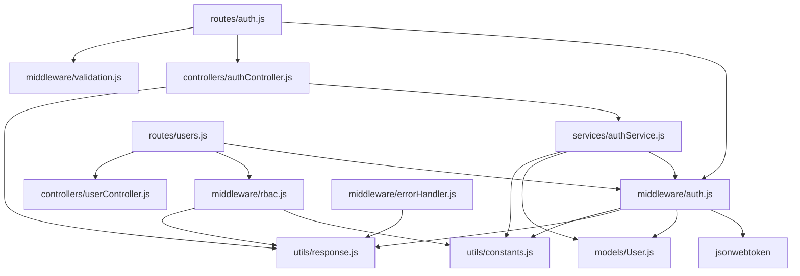

# Authentication Middleware

<cite>
**Referenced Files in This Document**
- [auth.js](file://backend/middleware/auth.js)
- [authController.js](file://backend/controllers/authController.js)
- [authService.js](file://backend/services/authService.js)
- [User.js](file://backend/models/User.js)
- [constants.js](file://backend/utils/constants.js)
- [response.js](file://backend/utils/response.js)
- [auth.js](file://backend/routes/auth.js)
- [users.js](file://backend/routes/users.js)
- [rbac.js](file://backend/middleware/rbac.js)
- [errorHandler.js](file://backend/middleware/errorHandler.js)
</cite>

## Table of Contents
1. [Introduction](#introduction)
2. [Project Structure](#project-structure)
3. [Core Components](#core-components)
4. [Architecture Overview](#architecture-overview)
5. [Detailed Component Analysis](#detailed-component-analysis)
6. [Dependency Analysis](#dependency-analysis)
7. [Performance Considerations](#performance-considerations)
8. [Troubleshooting Guide](#troubleshooting-guide)
9. [Conclusion](#conclusion)

## Introduction
This document provides comprehensive documentation for the authentication middleware system in the FDPAC backend. It explains JWT token verification, mandatory and optional authentication flows, token generation with configurable settings, user session management, and robust error handling. It also covers integration patterns with controllers and routes, and demonstrates practical usage examples.

## Project Structure
The authentication system spans middleware, controllers, services, models, and utilities. Key components include:
- Authentication middleware for JWT verification and token generation
- Controllers for authentication endpoints
- Services encapsulating business logic for registration, login, and profile operations
- User model with password hashing and role/status utilities
- Response utilities for standardized HTTP responses
- Route definitions binding middleware to endpoints
- RBAC middleware for role-based access control
- Global error handler for JWT-related errors

**Diagram sources**
- [auth.js:1-49](file://backend/routes/auth.js#L1-L49)
- [users.js:1-64](file://backend/routes/users.js#L1-L64)
- [authController.js:1-114](file://backend/controllers/authController.js#L1-L114)
- [userController.js:1-152](file://backend/controllers/userController.js#L1-L152)
- [authService.js:1-195](file://backend/services/authService.js#L1-L195)
- [userService.js:1-276](file://backend/services/userService.js#L1-L276)
- [auth.js:1-116](file://backend/middleware/auth.js#L1-L116)
- [rbac.js:1-151](file://backend/middleware/rbac.js#L1-L151)
- [validation.js:1-309](file://backend/middleware/validation.js#L1-L309)
- [errorHandler.js:1-179](file://backend/middleware/errorHandler.js#L1-L179)
- [User.js:1-130](file://backend/models/User.js#L1-L130)
- [constants.js:1-81](file://backend/utils/constants.js#L1-L81)
- [response.js:1-101](file://backend/utils/response.js#L1-L101)

**Section sources**
- [auth.js:1-49](file://backend/routes/auth.js#L1-L49)
- [users.js:1-64](file://backend/routes/users.js#L1-L64)
- [authController.js:1-114](file://backend/controllers/authController.js#L1-L114)
- [authService.js:1-195](file://backend/services/authService.js#L1-L195)
- [auth.js:1-116](file://backend/middleware/auth.js#L1-L116)
- [User.js:1-130](file://backend/models/User.js#L1-L130)
- [constants.js:1-81](file://backend/utils/constants.js#L1-L81)
- [response.js:1-101](file://backend/utils/response.js#L1-L101)
- [rbac.js:1-151](file://backend/middleware/rbac.js#L1-L151)
- [errorHandler.js:1-179](file://backend/middleware/errorHandler.js#L1-L179)

## Core Components
- Authentication middleware: Provides mandatory and optional authentication, JWT verification, user loading, and token generation.
- Response utilities: Standardized success, error, unauthorized, forbidden, and not-found responses.
- Constants: JWT configuration, roles, statuses, and permissions.
- User model: Schema definition, password hashing, role/status helpers, and virtual properties.
- RBAC middleware: Role-based access control enforcing permissions.
- Global error handler: Centralized error handling including JWT-specific errors.

**Section sources**
- [auth.js:1-116](file://backend/middleware/auth.js#L1-L116)
- [response.js:1-101](file://backend/utils/response.js#L1-L101)
- [constants.js:66-70](file://backend/utils/constants.js#L66-L70)
- [User.js:10-130](file://backend/models/User.js#L10-L130)
- [rbac.js:1-151](file://backend/middleware/rbac.js#L1-L151)
- [errorHandler.js:65-84](file://backend/middleware/errorHandler.js#L65-L84)

## Architecture Overview
The authentication flow integrates middleware, services, and controllers to enforce secure access to protected resources. The middleware extracts and validates JWT tokens from Authorization headers, loads the user from the database, and attaches the user object to the request. Token generation uses configurable expiration and algorithm settings.

**Diagram sources**
- [auth.js:14-59](file://backend/middleware/auth.js#L14-L59)
- [authController.js:52-66](file://backend/controllers/authController.js#L52-L66)
- [authService.js:59-93](file://backend/services/authService.js#L59-L93)
- [User.js:101-103](file://backend/models/User.js#L101-L103)

## Detailed Component Analysis

### Authentication Middleware
The middleware provides three primary functions:
- authenticate(): Mandatory authentication requiring a valid, non-expired token and an active user account.
- optionalAuth(): Optional authentication that attaches a user if present and valid; otherwise proceeds without a user.
- generateToken(): Creates a signed JWT with configurable expiration and algorithm settings.

Key behaviors:
- Bearer token extraction from Authorization header.
- JWT verification using configured algorithm and secret.
- User lookup and active status validation.
- Error handling for missing tokens, invalid tokens, expired tokens, and inactive accounts.
- Optional authentication silently fails when no token is present or invalid.

**Diagram sources**
- [auth.js:14-59](file://backend/middleware/auth.js#L14-L59)

**Section sources**
- [auth.js:14-116](file://backend/middleware/auth.js#L14-L116)

### Token Generation
The generateToken() function creates a JWT containing the user identifier. It uses:
- Secret from environment variables or a fallback constant.
- Configurable expiration and algorithm from constants.
- HS256 algorithm by default.

**Diagram sources**
- [auth.js:100-109](file://backend/middleware/auth.js#L100-L109)
- [constants.js:66-70](file://backend/utils/constants.js#L66-L70)

**Section sources**
- [auth.js:100-109](file://backend/middleware/auth.js#L100-L109)
- [constants.js:66-70](file://backend/utils/constants.js#L66-L70)

### User Session Management and Loading
The middleware attaches the authenticated user to the request object for downstream controllers and services. The User model provides:
- Password hashing on save using bcrypt.
- comparePassword() for verifying credentials during login.
- isActive() to check account status.
- Role-based helpers and virtual properties for role checks.

**Diagram sources**
- [User.js:10-130](file://backend/models/User.js#L10-L130)

**Section sources**
- [User.js:84-103](file://backend/models/User.js#L84-L103)

### Error Handling for Authentication
The middleware returns standardized 401 unauthorized responses for:
- Missing token.
- Invalid token.
- Expired token.
- User not found.
- Inactive user account.

Additionally, the global error handler centralizes JWT-related errors:
- JsonWebTokenError mapped to 401 with “Invalid token” message.
- TokenExpiredError mapped to 401 with “Token has expired” message.

**Diagram sources**
- [errorHandler.js:125-136](file://backend/middleware/errorHandler.js#L125-L136)
- [response.js:56-63](file://backend/utils/response.js#L56-L63)

**Section sources**
- [auth.js:24-58](file://backend/middleware/auth.js#L24-L58)
- [errorHandler.js:65-84](file://backend/middleware/errorHandler.js#L65-L84)
- [response.js:56-63](file://backend/utils/response.js#L56-L63)

### Integration Patterns with Controllers and Routes
- Routes define public/private access and bind middleware:
  - Public routes: Registration and login.
  - Private routes: Profile retrieval and password change.
  - Admin-only routes: User management endpoints.
- Controllers receive the authenticated user via req.user and delegate to services.
- Services encapsulate business logic and use generateToken() for response tokens.

**Diagram sources**
- [auth.js:32-32](file://backend/routes/auth.js#L32-L32)
- [authController.js:52-66](file://backend/controllers/authController.js#L52-L66)
- [authService.js:100-116](file://backend/services/authService.js#L100-L116)
- [auth.js:47-48](file://backend/middleware/auth.js#L47-L48)

**Section sources**
- [auth.js:1-49](file://backend/routes/auth.js#L1-L49)
- [authController.js:1-114](file://backend/controllers/authController.js#L1-L114)
- [authService.js:1-195](file://backend/services/authService.js#L1-L195)

### Optional Authentication Pattern
The optionalAuth() middleware attempts to validate a token and attach the user if valid and active. If no token or an invalid token is provided, it sets req.user to null and continues, allowing downstream logic to handle optional user context.

**Diagram sources**
- [auth.js:64-93](file://backend/middleware/auth.js#L64-L93)

**Section sources**
- [auth.js:64-93](file://backend/middleware/auth.js#L64-L93)

### RBAC Integration
The RBAC middleware enforces role-based permissions after authentication. It checks:
- Authentication presence.
- Role inclusion in allowed roles.
- Active account status.
- Permission keys against predefined permissions matrix.

**Diagram sources**
- [rbac.js:14-33](file://backend/middleware/rbac.js#L14-L33)

**Section sources**
- [rbac.js:1-151](file://backend/middleware/rbac.js#L1-L151)

## Dependency Analysis
The authentication system exhibits clear separation of concerns:
- Middleware depends on jsonwebtoken, User model, response utilities, and constants.
- Controllers depend on services and response utilities.
- Services depend on models and middleware for token generation.
- Routes depend on middleware and controllers.
- RBAC middleware depends on constants and response utilities.
- Global error handler depends on response utilities and standardizes JWT errors.

**Diagram sources**
- [auth.js:6-9](file://backend/middleware/auth.js#L6-L9)
- [authController.js:6-7](file://backend/controllers/authController.js#L6-L7)
- [authService.js:6-8](file://backend/services/authService.js#L6-L8)
- [users.js:10-12](file://backend/routes/users.js#L10-L12)
- [auth.js:10-11](file://backend/routes/auth.js#L10-L11)
- [rbac.js:6-7](file://backend/middleware/rbac.js#L6-L7)
- [errorHandler.js:6-6](file://backend/middleware/errorHandler.js#L6-L6)

**Section sources**
- [auth.js:1-116](file://backend/middleware/auth.js#L1-L116)
- [authService.js:1-195](file://backend/services/authService.js#L1-L195)
- [authController.js:1-114](file://backend/controllers/authController.js#L1-L114)
- [users.js:1-64](file://backend/routes/users.js#L1-L64)
- [auth.js:1-49](file://backend/routes/auth.js#L1-L49)
- [rbac.js:1-151](file://backend/middleware/rbac.js#L1-L151)
- [errorHandler.js:1-179](file://backend/middleware/errorHandler.js#L1-L179)

## Performance Considerations
- Token verification occurs synchronously; ensure JWT_SECRET is set securely and consistently.
- User lookup by ID is O(log n) due to index on _id; consider caching for high-traffic endpoints.
- Password hashing is handled by the User model pre-save hook; avoid unnecessary saves to reduce overhead.
- Prefer optionalAuth() for endpoints where guest access is acceptable to minimize authentication overhead.
- Configure JWT expiration appropriately to balance security and user experience.

## Troubleshooting Guide
Common issues and resolutions:
- Missing Authorization header: Ensure clients send Authorization: Bearer <token>.
- Invalid token: Verify JWT_SECRET matches the server configuration and algorithm settings.
- Expired token: Prompt users to re-authenticate; ensure client refresh logic is implemented.
- User not found: Confirm the user exists in the database and the token payload id is correct.
- Inactive user account: Activate the user or prompt administrator intervention.
- JWT errors globally: The error handler maps JsonWebTokenError and TokenExpiredError to 401 responses.

**Section sources**
- [auth.js:24-58](file://backend/middleware/auth.js#L24-L58)
- [errorHandler.js:125-136](file://backend/middleware/errorHandler.js#L125-L136)
- [response.js:56-63](file://backend/utils/response.js#L56-L63)

## Conclusion
The authentication middleware system provides a robust, modular foundation for JWT-based authentication. It enforces mandatory and optional authentication, manages user sessions, generates tokens with configurable settings, and integrates seamlessly with controllers and RBAC middleware. The standardized response utilities and centralized error handling ensure consistent behavior across the application.