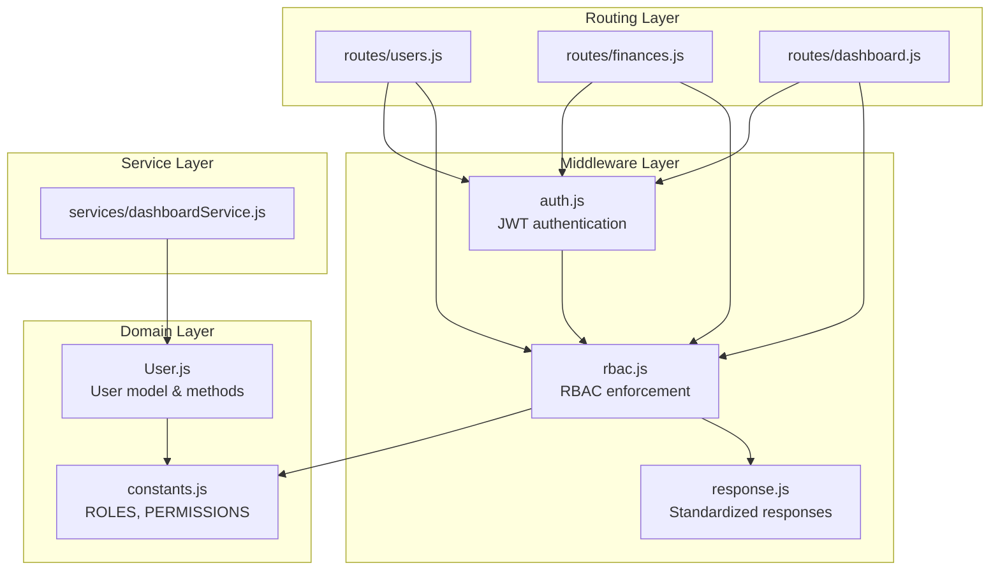
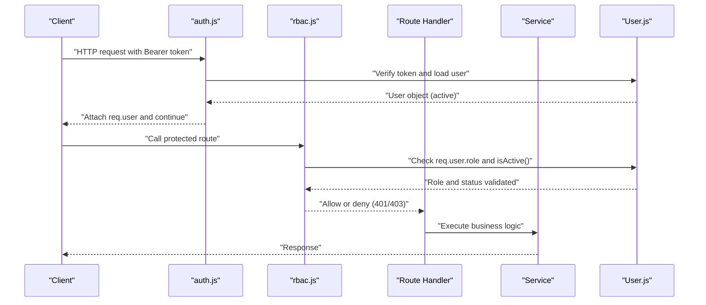
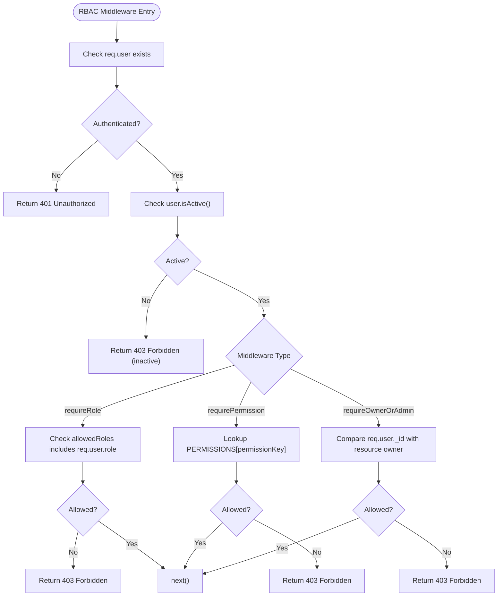
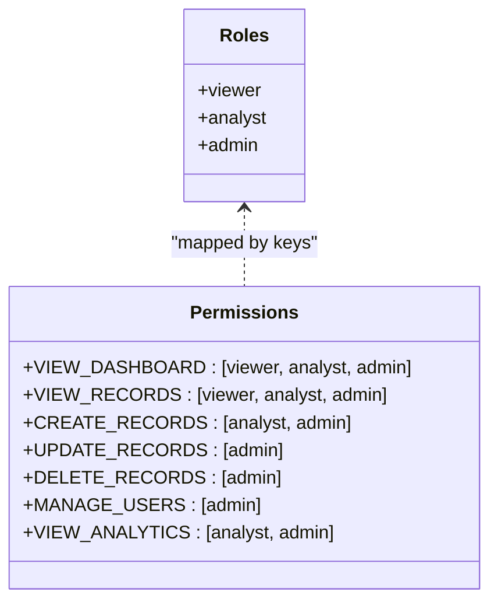
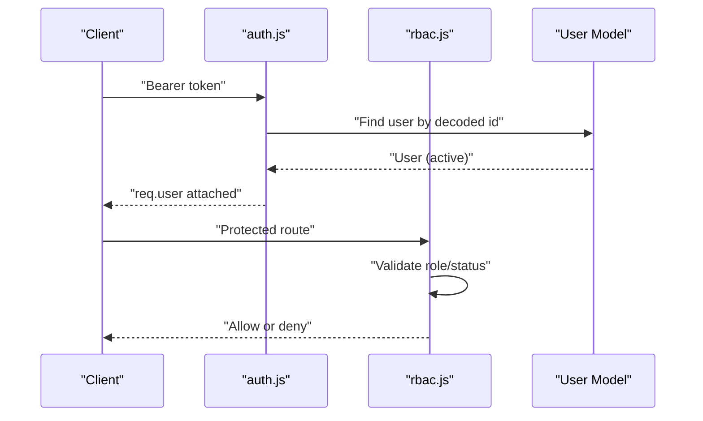
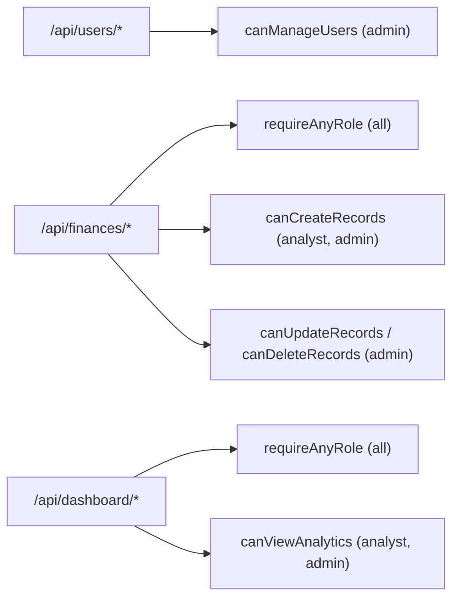
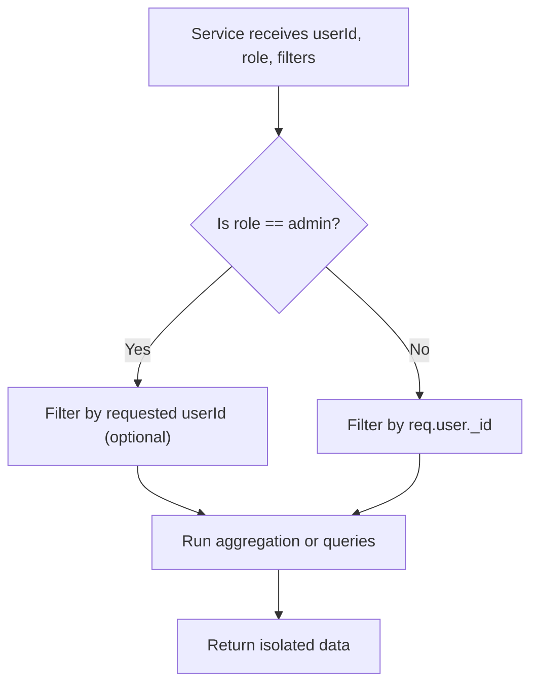
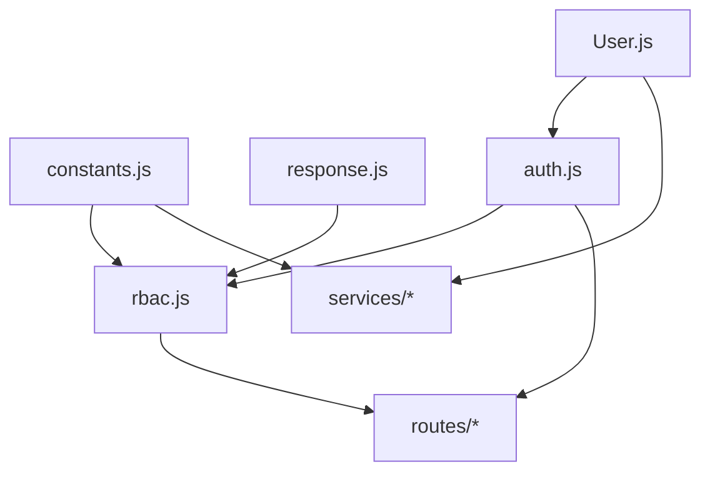

# Authorization Middleware

<cite>
**Referenced Files in This Document**
- [rbac.js](file://backend/middleware/rbac.js)
- [constants.js](file://backend/utils/constants.js)
- [auth.js](file://backend/middleware/auth.js)
- [response.js](file://backend/utils/response.js)
- [User.js](file://backend/models/User.js)
- [users.js](file://backend/routes/users.js)
- [finances.js](file://backend/routes/finances.js)
- [dashboard.js](file://backend/routes/dashboard.js)
- [dashboardService.js](file://backend/services/dashboardService.js)
- [server.js](file://backend/server.js)
</cite>

## Table of Contents
1. [Introduction](#introduction)
2. [Project Structure](#project-structure)
3. [Core Components](#core-components)
4. [Architecture Overview](#architecture-overview)
5. [Detailed Component Analysis](#detailed-component-analysis)
6. [Dependency Analysis](#dependency-analysis)
7. [Performance Considerations](#performance-considerations)
8. [Troubleshooting Guide](#troubleshooting-guide)
9. [Conclusion](#conclusion)

## Introduction
This document provides comprehensive documentation for the role-based access control (RBAC) middleware used to enforce authorization policies across the backend. It explains the hierarchical role structure (Viewer, Analyst, Admin), the permission matrix system, and the middleware implementation that enforces access control at the route level. It also covers permission checking mechanisms, role validation, and data isolation strategies, along with practical examples and troubleshooting guidance for common authorization scenarios.

## Project Structure
The authorization system spans several layers:
- Middleware: Authentication and RBAC enforcement
- Models: User entity with roles and status
- Routes: Route definitions that apply RBAC middleware
- Services: Business logic that respects role-based data isolation
- Utilities: Shared constants and response helpers

**Diagram sources**
- [auth.js:14-59](file://backend/middleware/auth.js#L14-L59)
- [rbac.js:14-66](file://backend/middleware/rbac.js#L14-L66)
- [constants.js:6-57](file://backend/utils/constants.js#L6-L57)
- [User.js:10-130](file://backend/models/User.js#L10-L130)
- [users.js:10-12](file://backend/routes/users.js#L10-L12)
- [finances.js:10-16](file://backend/routes/finances.js#L10-L16)
- [dashboard.js:10-12](file://backend/routes/dashboard.js#L10-L12)
- [dashboardService.js:281-334](file://backend/services/dashboardService.js#L281-L334)

**Section sources**
- [server.js:52-56](file://backend/server.js#L52-L56)
- [users.js:10-12](file://backend/routes/users.js#L10-L12)
- [finances.js:10-16](file://backend/routes/finances.js#L10-L16)
- [dashboard.js:10-12](file://backend/routes/dashboard.js#L10-L12)

## Core Components
- Role constants define the hierarchy: Viewer < Analyst < Admin.
- Permission matrix maps actions to allowed roles.
- RBAC middleware provides:
  - Role-based gatekeepers (requireRole, requireAdmin, requireAnalystOrAdmin, requireAnyRole)
  - Permission-based gatekeepers (requirePermission, canManageUsers, canCreateRecords, canUpdateRecords, canDeleteRecords, canViewAnalytics)
  - Resource-level ownership checks (requireOwnerOrAdmin)
- Authentication middleware attaches the user object to requests and validates account status.
- User model exposes role and status checks and helper methods for role validation.

**Section sources**
- [constants.js:6-57](file://backend/utils/constants.js#L6-L57)
- [rbac.js:14-136](file://backend/middleware/rbac.js#L14-L136)
- [auth.js:14-59](file://backend/middleware/auth.js#L14-L59)
- [User.js:34-112](file://backend/models/User.js#L34-L112)

## Architecture Overview
The authorization pipeline follows a layered approach:
- Requests pass through authentication middleware to attach the user context.
- Route handlers apply RBAC middleware to enforce role or permission gates.
- Services implement data isolation based on roles (non-admins see only their records; admins may filter by user).

**Diagram sources**
- [auth.js:14-59](file://backend/middleware/auth.js#L14-L59)
- [rbac.js:14-66](file://backend/middleware/rbac.js#L14-L66)
- [User.js:101-112](file://backend/models/User.js#L101-L112)

## Detailed Component Analysis

### RBAC Middleware
The RBAC module exports composable middleware functions:
- requireRole: Allows access if the user’s role is included in the allowed set.
- requirePermission: Validates that the requested permission is mapped to the user’s role.
- requireAdmin, requireAnalystOrAdmin, requireAnyRole: Convenience wrappers around requireRole.
- canManageUsers, canCreateRecords, canUpdateRecords, canDeleteRecords, canViewAnalytics: Permission-based guards derived from the permission matrix.
- requireOwnerOrAdmin: Enforces resource-level ownership checks for non-admin users while allowing admin bypass.

**Diagram sources**
- [rbac.js:14-136](file://backend/middleware/rbac.js#L14-L136)
- [constants.js:48-57](file://backend/utils/constants.js#L48-L57)

**Section sources**
- [rbac.js:14-136](file://backend/middleware/rbac.js#L14-L136)
- [constants.js:48-57](file://backend/utils/constants.js#L48-L57)

### Permission Matrix and Hierarchical Roles
- Roles: viewer, analyst, admin (hierarchical).
- Permissions map actions to allowed roles:
  - VIEW_DASHBOARD, VIEW_RECORDS: viewer, analyst, admin
  - CREATE_RECORDS: analyst, admin
  - UPDATE_RECORDS, DELETE_RECORDS: admin
  - MANAGE_USERS: admin
  - VIEW_ANALYTICS: analyst, admin

**Diagram sources**
- [constants.js:6-10](file://backend/utils/constants.js#L6-L10)
- [constants.js:48-57](file://backend/utils/constants.js#L48-L57)

**Section sources**
- [constants.js:6-10](file://backend/utils/constants.js#L6-L10)
- [constants.js:48-57](file://backend/utils/constants.js#L48-L57)

### Authentication Integration
- The authentication middleware verifies JWT tokens, loads the user from the database, ensures the account is active, and attaches the user object to the request.
- RBAC middleware relies on the presence of req.user and the user’s role/status.

**Diagram sources**
- [auth.js:14-59](file://backend/middleware/auth.js#L14-L59)
- [rbac.js:14-66](file://backend/middleware/rbac.js#L14-L66)
- [User.js:101-112](file://backend/models/User.js#L101-L112)

**Section sources**
- [auth.js:14-59](file://backend/middleware/auth.js#L14-L59)
- [rbac.js:14-66](file://backend/middleware/rbac.js#L14-L66)
- [User.js:101-112](file://backend/models/User.js#L101-L112)

### Route-Level Enforcement Examples
- Users management routes apply admin-only permissions.
- Finances routes apply role or permission gates depending on operation.
- Dashboard routes apply analytics permissions for advanced views and general access for basic views.

**Diagram sources**
- [users.js:19-61](file://backend/routes/users.js#L19-L61)
- [finances.js:29-64](file://backend/routes/finances.js#L29-L64)
- [dashboard.js:19-54](file://backend/routes/dashboard.js#L19-L54)

**Section sources**
- [users.js:19-61](file://backend/routes/users.js#L19-L61)
- [finances.js:29-64](file://backend/routes/finances.js#L29-L64)
- [dashboard.js:19-54](file://backend/routes/dashboard.js#L19-L54)

### Data Isolation Strategies
- Non-admin users are restricted to their own records via service-level aggregation and filtering.
- Admins can optionally filter by userId when requesting dashboard analytics.
- Ownership checks at the route level prevent unauthorized resource access for non-admins.

**Diagram sources**
- [dashboardService.js:281-334](file://backend/services/dashboardService.js#L281-L334)

**Section sources**
- [dashboardService.js:281-334](file://backend/services/dashboardService.js#L281-L334)

## Dependency Analysis
- RBAC depends on constants for roles and permissions and on response utilities for standardized HTTP responses.
- Authentication depends on the User model and JWT configuration.
- Routes depend on both auth and RBAC middleware.
- Services depend on models and constants for data isolation and categorization.

**Diagram sources**
- [constants.js:6-57](file://backend/utils/constants.js#L6-L57)
- [rbac.js:6-7](file://backend/middleware/rbac.js#L6-L7)
- [response.js:56-77](file://backend/utils/response.js#L56-L77)
- [auth.js:6-9](file://backend/middleware/auth.js#L6-L9)
- [User.js:8](file://backend/models/User.js#L8)

**Section sources**
- [constants.js:6-57](file://backend/utils/constants.js#L6-L57)
- [rbac.js:6-7](file://backend/middleware/rbac.js#L6-L7)
- [response.js:56-77](file://backend/utils/response.js#L56-L77)
- [auth.js:6-9](file://backend/middleware/auth.js#L6-L9)
- [User.js:8](file://backend/models/User.js#L8)

## Performance Considerations
- Token verification and user lookup occur once per request; keep middleware order minimal to reduce overhead.
- Use targeted indexes on user role and status for efficient filtering in services.
- Avoid unnecessary aggregation stages; pre-filter by userId for non-admins to minimize dataset size.
- Cache frequently accessed dashboards for analysts/admins if latency becomes a concern.

## Troubleshooting Guide
Common authorization issues and resolutions:
- 401 Unauthorized
  - Cause: Missing or invalid Bearer token.
  - Resolution: Ensure the client sends a valid token in the Authorization header and that the server’s JWT secret is configured.
  - Section sources
    - [auth.js:24-26](file://backend/middleware/auth.js#L24-L26)
    - [response.js:56-63](file://backend/utils/response.js#L56-L63)

- 403 Forbidden (inactive account)
  - Cause: User account is inactive.
  - Resolution: Activate the user account or contact an administrator.
  - Section sources
    - [auth.js:42-44](file://backend/middleware/auth.js#L42-L44)
    - [rbac.js:27-29](file://backend/middleware/rbac.js#L27-L29)

- 403 Forbidden (role mismatch)
  - Cause: User role not included in allowed roles.
  - Resolution: Assign the required role or adjust route permissions.
  - Section sources
    - [rbac.js:22-24](file://backend/middleware/rbac.js#L22-L24)

- 403 Forbidden (permission mismatch)
  - Cause: Action not permitted for the user’s role.
  - Resolution: Review the permission matrix and ensure the action is mapped to the user’s role.
  - Section sources
    - [rbac.js:55-57](file://backend/middleware/rbac.js#L55-L57)
    - [constants.js:48-57](file://backend/utils/constants.js#L48-L57)

- 403 Forbidden (resource ownership)
  - Cause: Non-admin user attempting to access another user’s resource.
  - Resolution: Ensure the user owns the resource or grant admin privileges.
  - Section sources
    - [rbac.js:127-129](file://backend/middleware/rbac.js#L127-L129)

- Data visibility issues
  - Cause: Non-admins not seeing expected records.
  - Resolution: Confirm that services filter by userId for non-admins and by requested userId for admins.
  - Section sources
    - [dashboardService.js:281-334](file://backend/services/dashboardService.js#L281-L334)

## Conclusion
The RBAC middleware provides a robust, composable authorization framework that integrates tightly with authentication and route definitions. By leveraging a clear permission matrix and hierarchical roles, it enables precise control over who can perform which actions and what data they can access. Combined with service-level data isolation, it ensures secure and predictable behavior across the application.