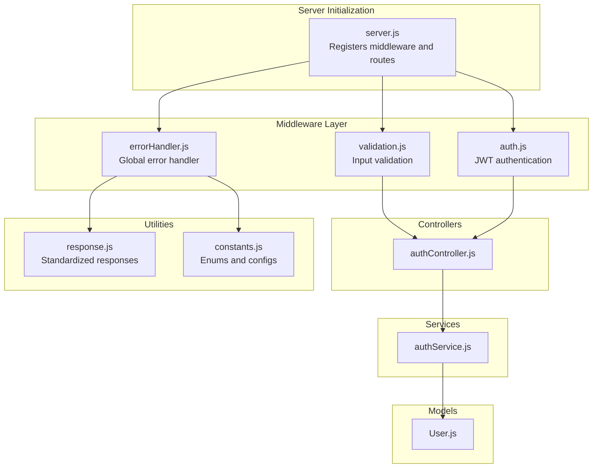
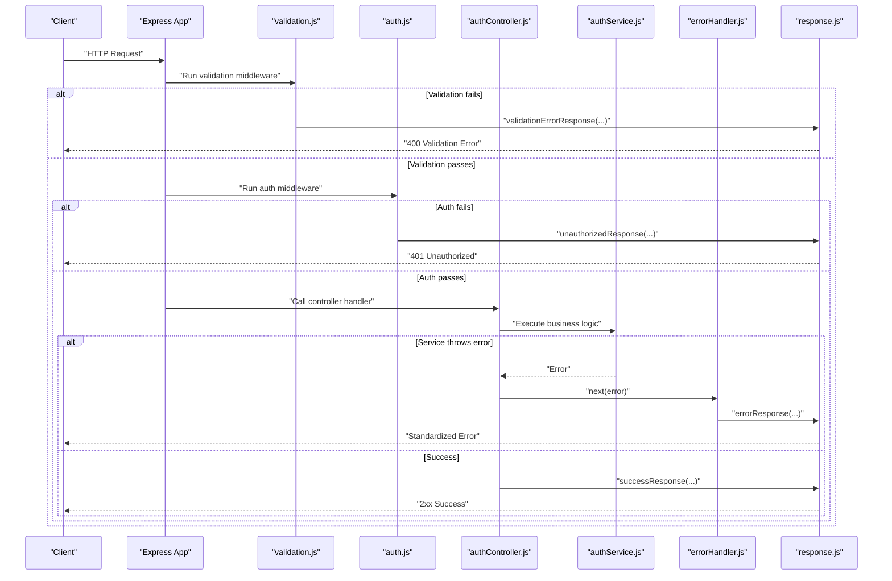
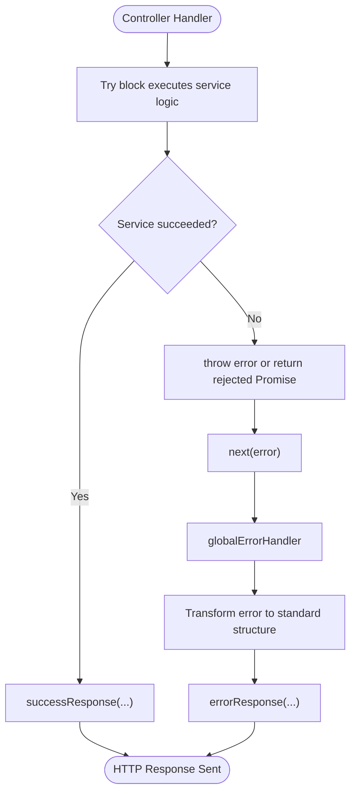
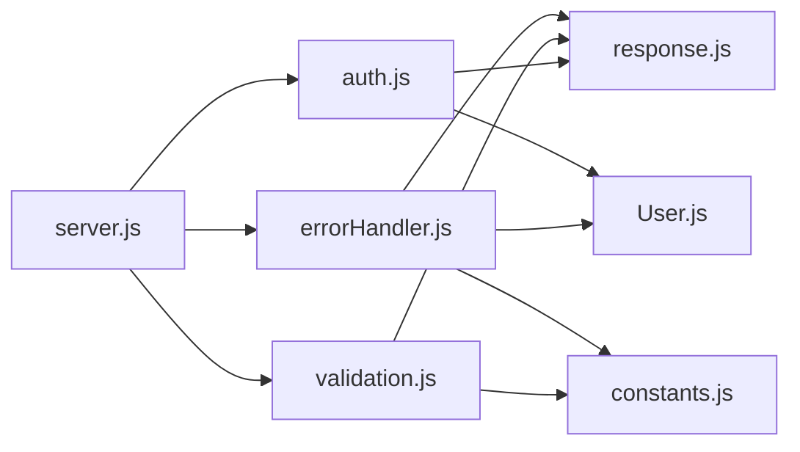

# Error Handling Middleware

<cite>
**Referenced Files in This Document**
- [errorHandler.js](file://backend/middleware/errorHandler.js)
- [response.js](file://backend/utils/response.js)
- [validation.js](file://backend/middleware/validation.js)
- [auth.js](file://backend/middleware/auth.js)
- [server.js](file://backend/server.js)
- [authController.js](file://backend/controllers/authController.js)
- [authService.js](file://backend/services/authService.js)
- [User.js](file://backend/models/User.js)
- [constants.js](file://backend/utils/constants.js)
- [auth.js](file://backend/routes/auth.js)
</cite>

## Table of Contents
1. [Introduction](#introduction)
2. [Project Structure](#project-structure)
3. [Core Components](#core-components)
4. [Architecture Overview](#architecture-overview)
5. [Detailed Component Analysis](#detailed-component-analysis)
6. [Dependency Analysis](#dependency-analysis)
7. [Performance Considerations](#performance-considerations)
8. [Troubleshooting Guide](#troubleshooting-guide)
9. [Conclusion](#conclusion)
10. [Appendices](#appendices)

## Introduction
This document explains the centralized error handling middleware and how errors propagate through the application’s middleware chain. It covers consistent error response formatting, error types handled (validation, authentication, and internal server errors), HTTP status code mapping, logging strategies, debugging techniques, custom error types, error transformation patterns, and integration with application monitoring. It also provides best practices and production error management strategies.

## Project Structure
The error handling system is implemented as a global middleware that standardizes error responses and integrates with request validation and authentication middlewares. The server registers the global error handler last so it captures unhandled errors from earlier middleware and route handlers.

**Diagram sources**
- [server.js:1-113](file://backend/server.js#L1-L113)
- [validation.js:1-309](file://backend/middleware/validation.js#L1-L309)
- [auth.js:1-116](file://backend/middleware/auth.js#L1-L116)
- [errorHandler.js:1-179](file://backend/middleware/errorHandler.js#L1-L179)
- [authController.js:1-114](file://backend/controllers/authController.js#L1-L114)
- [authService.js:1-195](file://backend/services/authService.js#L1-L195)
- [User.js:1-130](file://backend/models/User.js#L1-L130)
- [response.js:1-101](file://backend/utils/response.js#L1-L101)
- [constants.js:1-81](file://backend/utils/constants.js#L1-L81)

**Section sources**
- [server.js:1-113](file://backend/server.js#L1-L113)

## Core Components
- Global Error Handler: Centralizes error detection, classification, and response formatting.
- APIError Class: Custom error type for operational errors with explicit status codes and optional structured errors.
- Validation Middleware: Validates request bodies and parameters using express-validator and returns standardized validation errors.
- Authentication Middleware: Verifies JWT tokens and returns standardized unauthorized responses on failures.
- Response Utilities: Provides standardized success and error response builders.

Key responsibilities:
- Normalize error responses across the application.
- Transform framework-specific errors (Mongoose, JWT) into consistent structures.
- Provide development-friendly stack traces while keeping production responses safe.
- Gracefully handle uncaught exceptions and unhandled promise rejections.

**Section sources**
- [errorHandler.js:11-20](file://backend/middleware/errorHandler.js#L11-L20)
- [errorHandler.js:89-145](file://backend/middleware/errorHandler.js#L89-L145)
- [response.js:28-35](file://backend/utils/response.js#L28-L35)
- [validation.js:13-27](file://backend/middleware/validation.js#L13-L27)
- [auth.js:14-59](file://backend/middleware/auth.js#L14-L59)

## Architecture Overview
The error handling architecture follows a layered approach:
- Validation middleware runs before controllers to prevent invalid data from reaching business logic.
- Authentication middleware ensures only authorized requests reach protected routes.
- Controllers call service methods and forward errors to the next callback.
- The global error handler intercepts all errors, transforms them, and sends a standardized response.

**Diagram sources**
- [validation.js:13-27](file://backend/middleware/validation.js#L13-L27)
- [auth.js:14-59](file://backend/middleware/auth.js#L14-L59)
- [authController.js:13-26](file://backend/controllers/authController.js#L13-L26)
- [authService.js:15-51](file://backend/services/authService.js#L15-L51)
- [errorHandler.js:89-145](file://backend/middleware/errorHandler.js#L89-L145)
- [response.js:12-19](file://backend/utils/response.js#L12-L19)

## Detailed Component Analysis

### Global Error Handler
The global error handler:
- Ensures every error has a status code and message.
- Detects and transforms Mongoose validation errors, duplicate key errors, and cast errors.
- Detects JWT errors and expiration errors.
- Logs errors in development mode.
- Sends a standardized error response, including stack traces in development.

Error transformation patterns:
- Validation errors: Converts Mongoose ValidationError into a structured array of field-level errors.
- Duplicate key errors: Converts MongoDB duplicate key error into a friendly message and structured error.
- Cast errors: Converts ObjectId parsing errors into user-friendly messages.
- JWT errors: Converts JsonWebTokenError and TokenExpiredError into consistent unauthorized messages.

HTTP status code mapping:
- Validation errors: 400 Bad Request.
- Duplicate key errors: 409 Conflict.
- Cast errors: 400 Bad Request.
- JWT invalid token: 401 Unauthorized.
- JWT expired token: 401 Unauthorized.
- Other errors: 500 Internal Server Error.

Logging and debugging:
- Development logs include the full error object.
- Stack traces are included in development responses for easier debugging.

Graceful shutdown:
- Uncaught exceptions trigger immediate process exit.
- Unhandled promise rejections trigger graceful server shutdown and process exit.

**Section sources**
- [errorHandler.js:89-145](file://backend/middleware/errorHandler.js#L89-L145)
- [errorHandler.js:150-171](file://backend/middleware/errorHandler.js#L150-L171)

### Validation Middleware
The validation middleware:
- Uses express-validator to define validation rules per route.
- Collects validation errors and returns a standardized 400 response with field-level details.
- Supports body, param, and query validations.

Common validation scenarios:
- Registration: name, email, password, optional role.
- Login: email and password.
- User updates: ID format validation and optional field constraints.
- Finance records: amount, type, category, dates, and optional descriptions/notes.
- Lists: pagination and sorting constraints.

Transformation pattern:
- Converts express-validator errors into a consistent array with field, message, and value.

**Section sources**
- [validation.js:13-27](file://backend/middleware/validation.js#L13-L27)
- [validation.js:32-60](file://backend/middleware/validation.js#L32-L60)
- [validation.js:130-168](file://backend/middleware/validation.js#L130-L168)

### Authentication Middleware
The authentication middleware:
- Extracts Bearer tokens from Authorization headers.
- Verifies JWT tokens and attaches the user to the request.
- Returns standardized unauthorized responses for missing tokens, invalid tokens, and expired tokens.
- Provides optional authentication that does not block requests.

Integration with error handling:
- On failure, returns unauthorized responses instead of throwing errors.
- On success, continues to the next middleware/controller.

**Section sources**
- [auth.js:14-59](file://backend/middleware/auth.js#L14-L59)
- [auth.js:64-93](file://backend/middleware/auth.js#L64-L93)

### Response Utilities
The response utilities provide standardized JSON responses:
- Success responses include success flag, message, data, and null error.
- Error responses include success flag, message, null data, and optional error payload.
- Specialized responses: validation error, unauthorized, forbidden, and not found.

Usage patterns:
- Controllers call successResponse for successful outcomes.
- Controllers call errorResponse for unexpected errors.
- Validation middleware calls validationErrorResponse for validation failures.
- Authentication middleware calls unauthorizedResponse for auth failures.

**Section sources**
- [response.js:12-19](file://backend/utils/response.js#L12-L19)
- [response.js:28-35](file://backend/utils/response.js#L28-L35)
- [response.js:42-49](file://backend/utils/response.js#L42-L49)
- [response.js:56-63](file://backend/utils/response.js#L56-L63)
- [response.js:84-91](file://backend/utils/response.js#L84-L91)

### Error Propagation Through the Middleware Chain
Error propagation occurs via Express’s next() callback:
- Controllers catch errors thrown by services and pass them to next().
- The global error handler intercepts all errors and sends a standardized response.
- Validation and authentication middlewares short-circuit with responses when validation/auth fails.

**Diagram sources**
- [authController.js:13-26](file://backend/controllers/authController.js#L13-L26)
- [authService.js:15-51](file://backend/services/authService.js#L15-L51)
- [errorHandler.js:89-145](file://backend/middleware/errorHandler.js#L89-L145)

## Dependency Analysis
The error handling system depends on:
- Express for middleware and routing.
- express-validator for validation.
- jsonwebtoken for JWT verification.
- mongoose for model validation and error codes.
- dotenv for environment configuration.

**Diagram sources**
- [server.js:12-12](file://backend/server.js#L12-L12)
- [errorHandler.js:6-6](file://backend/middleware/errorHandler.js#L6-L6)
- [validation.js:7-7](file://backend/middleware/validation.js#L7-L7)
- [auth.js:6-6](file://backend/middleware/auth.js#L6-L6)
- [User.js:1-130](file://backend/models/User.js#L1-L130)
- [constants.js:1-81](file://backend/utils/constants.js#L1-L81)

**Section sources**
- [package.json:16-24](file://backend/package.json#L16-L24)

## Performance Considerations
- Minimize synchronous operations in error handling to avoid blocking the event loop.
- Avoid expensive computations in error responses; keep transformations lightweight.
- Use environment-based toggles for stack traces to reduce overhead in production.
- Prefer early exits in validation and authentication to reduce unnecessary processing.

## Troubleshooting Guide
Common issues and resolutions:
- Validation errors returning 400 with field-level details:
  - Confirm validation middleware is attached to the route.
  - Check that validation rules align with request payloads.
- Authentication failures returning 401:
  - Verify Authorization header format and token presence.
  - Ensure JWT secret and algorithm match server configuration.
- Mongoose duplicate key errors:
  - Review unique constraints in models and incoming data.
  - Confirm duplicate key error handling is triggered by error code 11000.
- Cast errors for ObjectId:
  - Validate IDs passed in params and ensure correct format.
- JWT expiration:
  - Prompt users to re-authenticate when receiving expired token messages.
- Uncaught exceptions and unhandled rejections:
  - Monitor process logs for uncaught exceptions and unhandled rejections.
  - Ensure graceful shutdown logic is executed.

Debugging techniques:
- Enable development logging to inspect full error objects.
- Use stack traces in development responses to trace error origins.
- Add targeted console logs in middleware and controllers during local testing.
- Integrate structured logging (e.g., Winston) for production environments.

**Section sources**
- [errorHandler.js:94-96](file://backend/middleware/errorHandler.js#L94-L96)
- [errorHandler.js:150-171](file://backend/middleware/errorHandler.js#L150-L171)
- [auth.js:56-58](file://backend/middleware/auth.js#L56-L58)

## Conclusion
The centralized error handling middleware provides a robust, consistent, and standardized approach to error management across the application. By transforming framework-specific errors into unified structures, enforcing strict validation and authentication, and offering clear logging and graceful shutdown mechanisms, the system improves reliability, debuggability, and maintainability. Adopting the recommended best practices and production strategies outlined here will help ensure resilient error handling in real-world deployments.

## Appendices

### Error Response Structure
All error responses follow a consistent JSON structure:
- success: Boolean indicating failure.
- message: Human-readable error message.
- data: Always null for error responses.
- error: Optional error payload. In development, includes stack traces; in production, may include a simplified representation.

**Section sources**
- [response.js:28-35](file://backend/utils/response.js#L28-L35)

### HTTP Status Code Mapping
- 400 Bad Request: Validation errors and cast errors.
- 401 Unauthorized: Missing, invalid, or expired JWT tokens.
- 404 Not Found: Undefined routes and resource not found scenarios.
- 409 Conflict: Duplicate key errors.
- 500 Internal Server Error: Unexpected server errors.

**Section sources**
- [errorHandler.js:102-136](file://backend/middleware/errorHandler.js#L102-L136)
- [response.js:84-91](file://backend/utils/response.js#L84-L91)

### Custom Error Types and Transformation Patterns
- Custom APIError class:
  - Purpose: Encapsulate operational errors with explicit status codes and optional structured errors.
  - Usage: Throw instances with desired status code and error details.
- Transformation patterns:
  - Mongoose ValidationError -> Field-level errors array.
  - Mongoose duplicate key error -> Friendly message with unique constraint violation.
  - Mongoose CastError -> User-friendly message for invalid ObjectId.
  - JWT errors -> Consistent unauthorized messages for invalid/expired tokens.

**Section sources**
- [errorHandler.js:11-20](file://backend/middleware/errorHandler.js#L11-L20)
- [errorHandler.js:25-62](file://backend/middleware/errorHandler.js#L25-L62)
- [errorHandler.js:67-84](file://backend/middleware/errorHandler.js#L67-L84)

### Integration with Application Monitoring
Recommended integrations:
- Structured logging (e.g., Winston) to capture error metadata and context.
- Error tracking platforms (e.g., Sentry) to monitor production errors and alert on regressions.
- Metrics collection for error rates and latency to detect anomalies.
- Correlate request IDs across logs for end-to-end tracing.

[No sources needed since this section provides general guidance]