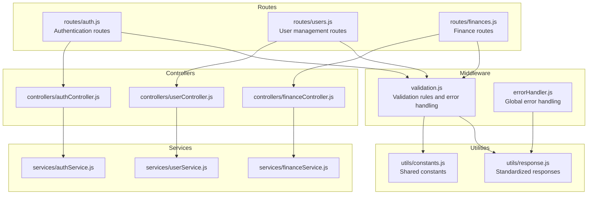
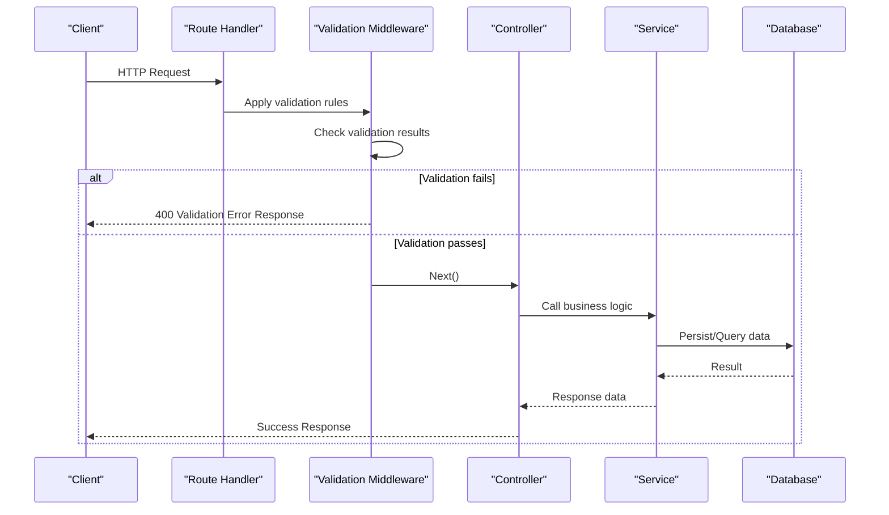
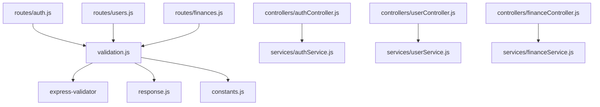

# Input Validation Middleware

<cite>
**Referenced Files in This Document**
- [validation.js](file://backend/middleware/validation.js)
- [response.js](file://backend/utils/response.js)
- [constants.js](file://backend/utils/constants.js)
- [auth.js](file://backend/routes/auth.js)
- [users.js](file://backend/routes/users.js)
- [finances.js](file://backend/routes/finances.js)
- [authController.js](file://backend/controllers/authController.js)
- [userController.js](file://backend/controllers/userController.js)
- [financeController.js](file://backend/controllers/financeController.js)
- [authService.js](file://backend/services/authService.js)
- [userService.js](file://backend/services/userService.js)
- [financeService.js](file://backend/services/financeService.js)
- [errorHandler.js](file://backend/middleware/errorHandler.js)
</cite>

## Table of Contents
1. [Introduction](#introduction)
2. [Project Structure](#project-structure)
3. [Core Components](#core-components)
4. [Architecture Overview](#architecture-overview)
5. [Detailed Component Analysis](#detailed-component-analysis)
6. [Dependency Analysis](#dependency-analysis)
7. [Performance Considerations](#performance-considerations)
8. [Troubleshooting Guide](#troubleshooting-guide)
9. [Conclusion](#conclusion)

## Introduction
This document provides comprehensive documentation for the input validation middleware built with express-validator. It explains request sanitization and validation rules implementation, documents common validation patterns for different data types and formats, covers error collection and response formatting for validation failures, and details integration with controller functions. It also addresses the relationship between validation middleware and business logic services, and provides performance considerations and best practices for maintaining a clean separation between validation and business logic.

## Project Structure
The validation middleware is organized under the middleware directory and integrates with routes, controllers, and services across the backend. The validation module exports reusable validation arrays and a centralized error handler that formats validation failures consistently.

**Diagram sources**
- [validation.js:1-309](file://backend/middleware/validation.js#L1-L309)
- [auth.js:1-49](file://backend/routes/auth.js#L1-L49)
- [users.js:1-64](file://backend/routes/users.js#L1-L64)
- [finances.js:1-67](file://backend/routes/finances.js#L1-L67)
- [authController.js:1-114](file://backend/controllers/authController.js#L1-L114)
- [userController.js:1-152](file://backend/controllers/userController.js#L1-L152)
- [financeController.js:1-138](file://backend/controllers/financeController.js#L1-L138)
- [authService.js:1-195](file://backend/services/authService.js#L1-L195)
- [userService.js:1-276](file://backend/services/userService.js#L1-L276)
- [financeService.js:1-264](file://backend/services/financeService.js#L1-L264)
- [response.js:1-101](file://backend/utils/response.js#L1-L101)
- [constants.js:1-81](file://backend/utils/constants.js#L1-L81)
- [errorHandler.js:1-179](file://backend/middleware/errorHandler.js#L1-L179)

**Section sources**
- [validation.js:1-309](file://backend/middleware/validation.js#L1-L309)
- [auth.js:1-49](file://backend/routes/auth.js#L1-L49)
- [users.js:1-64](file://backend/routes/users.js#L1-L64)
- [finances.js:1-67](file://backend/routes/finances.js#L1-L67)

## Core Components
The validation middleware provides:
- Centralized validation rules for user registration, login, user updates, financial record creation/update, and query parameters.
- A standardized error handler that collects validation errors and formats them consistently.
- Integration points with routes and controllers to enforce validation before business logic execution.

Key responsibilities:
- Define validation rules using express-validator for body, param, and query parameters.
- Sanitize input data (trimming, normalization).
- Enforce constraints (required fields, length limits, formats, allowed values).
- Collect and format validation errors for consistent client responses.
- Integrate with controller functions to pass validated data to services.

**Section sources**
- [validation.js:13-27](file://backend/middleware/validation.js#L13-L27)
- [validation.js:32-60](file://backend/middleware/validation.js#L32-L60)
- [validation.js:65-78](file://backend/middleware/validation.js#L65-L78)
- [validation.js:83-114](file://backend/middleware/validation.js#L83-L114)
- [validation.js:119-125](file://backend/middleware/validation.js#L119-L125)
- [validation.js:130-168](file://backend/middleware/validation.js#L130-L168)
- [validation.js:173-214](file://backend/middleware/validation.js#L173-L214)
- [validation.js:219-225](file://backend/middleware/validation.js#L219-L225)
- [validation.js:230-273](file://backend/middleware/validation.js#L230-L273)
- [validation.js:278-295](file://backend/middleware/validation.js#L278-L295)

## Architecture Overview
The validation middleware sits between routes and controllers, ensuring that incoming requests meet predefined criteria before reaching business logic. It leverages shared constants for allowed values and uses a standardized response utility for consistent error reporting.

**Diagram sources**
- [auth.js:18](file://backend/routes/auth.js#L18)
- [users.js:40](file://backend/routes/users.js#L40)
- [finances.js:29](file://backend/routes/finances.js#L29)
- [validation.js:13-27](file://backend/middleware/validation.js#L13-L27)
- [response.js:42-49](file://backend/utils/response.js#L42-L49)

## Detailed Component Analysis

### Validation Rules Implementation
The validation module defines reusable validation arrays for different endpoints. Each rule set targets specific request locations (body, param, query) and applies sanitization and validation constraints.

Common patterns:
- Body parameters: trim, normalize, length checks, required fields, numeric ranges, allowed value sets.
- Param parameters: MongoDB ObjectId validation for IDs.
- Query parameters: pagination limits, date formats, sorting fields, allowed values.

Examples of rule configurations:
- Registration: name trimming and length limits, email validation and normalization, password length requirement, optional role constrained to allowed values.
- Login: email trimming and validation, password required.
- User update: ID validation, optional fields with trimming and length checks, email normalization, role and status constrained to allowed values.
- Finance creation: amount positive float, type constrained to allowed values, category trimming and length limits, optional date ISO8601, optional description and notes with length limits.
- Finance update: ID validation, optional amount positive float, optional type constrained to allowed values, optional category trimming and length checks, optional date ISO8601, optional description and notes with length limits.
- Finance list: page and limit integers with bounds, optional type constrained to allowed values, optional category trimming and length limits, optional date range ISO8601, optional sort field and order constrained to allowed values.

**Section sources**
- [validation.js:32-60](file://backend/middleware/validation.js#L32-L60)
- [validation.js:65-78](file://backend/middleware/validation.js#L65-L78)
- [validation.js:83-114](file://backend/middleware/validation.js#L83-L114)
- [validation.js:119-125](file://backend/middleware/validation.js#L119-L125)
- [validation.js:130-168](file://backend/middleware/validation.js#L130-L168)
- [validation.js:173-214](file://backend/middleware/validation.js#L173-L214)
- [validation.js:219-225](file://backend/middleware/validation.js#L219-L225)
- [validation.js:230-273](file://backend/middleware/validation.js#L230-L273)
- [validation.js:278-295](file://backend/middleware/validation.js#L278-L295)

### Request Sanitization
The validation rules apply sanitization to improve data quality and reduce vulnerabilities:
- Trimming whitespace from strings to prevent accidental leading/trailing spaces.
- Email normalization to ensure consistent email storage and comparison.
- Length limits to prevent oversized inputs that could cause storage or processing issues.
- Numeric validation with minimum/maximum bounds for amounts and pagination parameters.

These operations occur before validation checks, ensuring that sanitized values are validated against constraints.

**Section sources**
- [validation.js:33-38](file://backend/middleware/validation.js#L33-L38)
- [validation.js:40-46](file://backend/middleware/validation.js#L40-L46)
- [validation.js:48-52](file://backend/middleware/validation.js#L48-L52)
- [validation.js:88-94](file://backend/middleware/validation.js#L88-L94)
- [validation.js:96-101](file://backend/middleware/validation.js#L96-L101)
- [validation.js:131-135](file://backend/middleware/validation.js#L131-L135)
- [validation.js:137-141](file://backend/middleware/validation.js#L137-L141)
- [validation.js:143-148](file://backend/middleware/validation.js#L143-L148)
- [validation.js:150-153](file://backend/middleware/validation.js#L150-L153)
- [validation.js:155-159](file://backend/middleware/validation.js#L155-L159)
- [validation.js:161-165](file://backend/middleware/validation.js#L161-L165)

### Error Collection and Response Formatting
Validation errors are collected and formatted consistently:
- The error handler extracts validation results and maps them to a structured array containing field, message, and value.
- A dedicated validation error response utility returns a standardized JSON payload with success=false, message, data=null, and error array.
- The response follows a consistent structure across all endpoints, simplifying client-side error handling.

Integration with error handling:
- The global error handler manages various error types, including Mongoose validation errors and duplicate key errors, ensuring consistent error responses.
- Validation failures are handled by the middleware’s error handler and return 400 responses with structured error arrays.

**Section sources**
- [validation.js:13-27](file://backend/middleware/validation.js#L13-L27)
- [response.js:42-49](file://backend/utils/response.js#L42-L49)
- [errorHandler.js:25-37](file://backend/middleware/errorHandler.js#L25-L37)
- [errorHandler.js:42-51](file://backend/middleware/errorHandler.js#L42-L51)
- [errorHandler.js:56-62](file://backend/middleware/errorHandler.js#L56-L62)

### Integration with Controllers and Services
Validation middleware integrates seamlessly with controllers and services:
- Routes attach validation middleware before controller handlers.
- Controllers receive validated data and pass it to services for business logic execution.
- Services operate on validated data, reducing the risk of invalid data reaching persistence layers.

Example integrations:
- Authentication routes: validation for registration and login precedes service calls for user creation and authentication.
- User management routes: validation for user ID and updates ensures safe operations on user resources.
- Finance routes: validation for record creation, updates, and list queries ensures data integrity and access control.

**Section sources**
- [auth.js:18](file://backend/routes/auth.js#L18)
- [auth.js:25](file://backend/routes/auth.js#L25)
- [users.js:40](file://backend/routes/users.js#L40)
- [users.js:47](file://backend/routes/users.js#L47)
- [finances.js:29](file://backend/routes/finances.js#L29)
- [finances.js:43](file://backend/routes/finances.js#L43)
- [finances.js:50](file://backend/routes/finances.js#L50)
- [finances.js:57](file://backend/routes/finances.js#L57)
- [authController.js:13](file://backend/controllers/authController.js#L13)
- [userController.js:31](file://backend/controllers/userController.js#L31)
- [financeController.js:13](file://backend/controllers/financeController.js#L13)

### Relationship Between Validation and Business Logic
The validation middleware maintains a clean separation from business logic:
- Validation focuses on input correctness and sanitization.
- Business logic resides in services, operating on validated data.
- Controllers act as orchestrators, passing validated data to services and returning standardized responses.

Benefits:
- Clear separation reduces coupling between input validation and business rules.
- Reusable validation arrays across endpoints promote consistency.
- Services remain focused on domain logic, unaffected by validation concerns.

**Section sources**
- [validation.js:13-27](file://backend/middleware/validation.js#L13-L27)
- [authService.js:15](file://backend/services/authService.js#L15)
- [userService.js:88](file://backend/services/userService.js#L88)
- [financeService.js:15](file://backend/services/financeService.js#L15)

### Common Validation Patterns
Patterns implemented across endpoints:
- Required fields: Ensuring essential data is present before processing.
- String sanitization: Trimming and normalizing text inputs.
- Length constraints: Limiting input sizes to prevent overflow and maintain consistency.
- Format validation: Using format-specific validators (email, ISO8601 dates).
- Allowed value sets: Restricting values to predefined constants.
- Numeric constraints: Enforcing minimum/maximum values for numeric fields.
- Optional fields: Applying validation only when data is provided.

Constants usage:
- Shared constants define allowed values for roles, statuses, record types, and categories, ensuring consistency across validations.

**Section sources**
- [validation.js:33-38](file://backend/middleware/validation.js#L33-L38)
- [validation.js:40-46](file://backend/middleware/validation.js#L40-L46)
- [validation.js:54-57](file://backend/middleware/validation.js#L54-L57)
- [validation.js:88-94](file://backend/middleware/validation.js#L88-L94)
- [validation.js:96-101](file://backend/middleware/validation.js#L96-L101)
- [validation.js:103-111](file://backend/middleware/validation.js#L103-L111)
- [validation.js:131-135](file://backend/middleware/validation.js#L131-L135)
- [validation.js:137-141](file://backend/middleware/validation.js#L137-L141)
- [validation.js:143-148](file://backend/middleware/validation.js#L143-L148)
- [validation.js:150-153](file://backend/middleware/validation.js#L150-L153)
- [validation.js:155-159](file://backend/middleware/validation.js#L155-L159)
- [validation.js:161-165](file://backend/middleware/validation.js#L161-L165)
- [constants.js:6-22](file://backend/utils/constants.js#L6-L22)

### Custom Validators and Extensibility
While the current implementation relies on built-in express-validator validators, the architecture supports adding custom validators:
- Custom validators can be integrated into existing validation arrays by chaining them with existing rules.
- Custom validators can encapsulate complex business rules while maintaining separation from business logic.
- Error messages for custom validators should align with the standardized error response format.

Implementation considerations:
- Place custom validators early in the validation chain to fail fast.
- Ensure custom validators return meaningful error messages aligned with the error response structure.

[No sources needed since this section provides general guidance]

## Dependency Analysis
The validation middleware depends on:
- express-validator for validation and sanitization.
- Shared constants for allowed values.
- Response utilities for consistent error formatting.

Integration points:
- Routes import validation arrays and attach them to endpoints.
- Controllers receive validated data and call services.
- Services operate on validated data without additional validation overhead.

**Diagram sources**
- [validation.js:6-8](file://backend/middleware/validation.js#L6-L8)
- [response.js:1-101](file://backend/utils/response.js#L1-L101)
- [constants.js:1-81](file://backend/utils/constants.js#L1-L81)
- [auth.js:11](file://backend/routes/auth.js#L11)
- [users.js:12](file://backend/routes/users.js#L12)
- [finances.js:17](file://backend/routes/finances.js#L17)
- [authController.js:6](file://backend/controllers/authController.js#L6)
- [userController.js:6](file://backend/controllers/userController.js#L6)
- [financeController.js:6](file://backend/controllers/financeController.js#L6)

**Section sources**
- [validation.js:6-8](file://backend/middleware/validation.js#L6-L8)
- [auth.js:11](file://backend/routes/auth.js#L11)
- [users.js:12](file://backend/routes/users.js#L12)
- [finances.js:17](file://backend/routes/finances.js#L17)

## Performance Considerations
- Early validation: Applying validation middleware before controllers reduces unnecessary service calls and database operations for invalid requests.
- Minimal overhead: Built-in validators are efficient; avoid redundant checks in services by relying on middleware validation.
- Consistent error handling: Centralized error formatting prevents repeated error processing logic across endpoints.
- Pagination bounds: Limiting query parameters (page, limit) prevents excessive database load and resource consumption.
- Date range validation: Ensures efficient querying with proper index usage.

Best practices:
- Keep validation rules close to the boundary (middleware) to fail fast.
- Use allowed value sets to minimize branching in services.
- Normalize and sanitize data in middleware to simplify service logic.
- Leverage constants for allowed values to ensure consistency and reduce maintenance overhead.

[No sources needed since this section provides general guidance]

## Troubleshooting Guide
Common validation issues and resolutions:
- Validation errors: Review the structured error array in the response to identify problematic fields and values.
- Duplicate key errors: Mongoose duplicate key errors are handled by the global error handler; ensure unique constraints are respected.
- Cast errors: Invalid ObjectId formats trigger cast errors; verify ID parameters conform to MongoDB ObjectId format.
- JWT errors: Token-related errors are handled centrally; ensure tokens are valid and not expired.

Debugging tips:
- Enable development logging to inspect detailed error stacks.
- Verify validation arrays match request shapes (body, param, query).
- Confirm constants used in validation rules match service expectations.

**Section sources**
- [errorHandler.js:25-37](file://backend/middleware/errorHandler.js#L25-L37)
- [errorHandler.js:42-51](file://backend/middleware/errorHandler.js#L42-L51)
- [errorHandler.js:56-62](file://backend/middleware/errorHandler.js#L56-L62)
- [errorHandler.js:67-84](file://backend/middleware/errorHandler.js#L67-L84)
- [errorHandler.js:89-145](file://backend/middleware/errorHandler.js#L89-L145)

## Conclusion
The input validation middleware provides a robust, reusable foundation for enforcing request correctness across the application. By centralizing validation rules, sanitization, and error formatting, it ensures consistent behavior, improves security, and maintains a clean separation between validation and business logic. The integration with routes, controllers, and services demonstrates a well-structured architecture that scales with additional endpoints and business requirements.