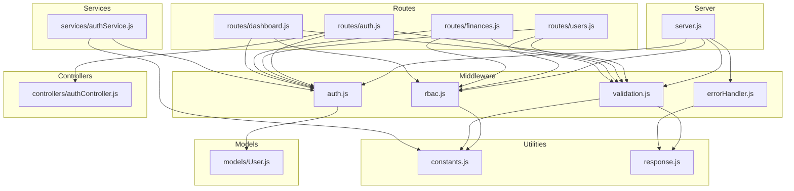
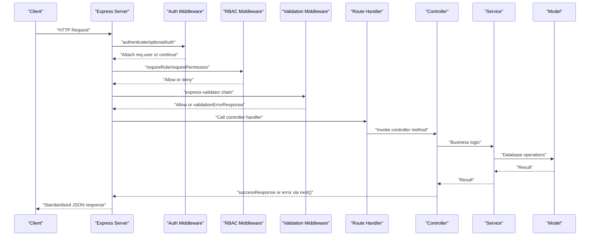
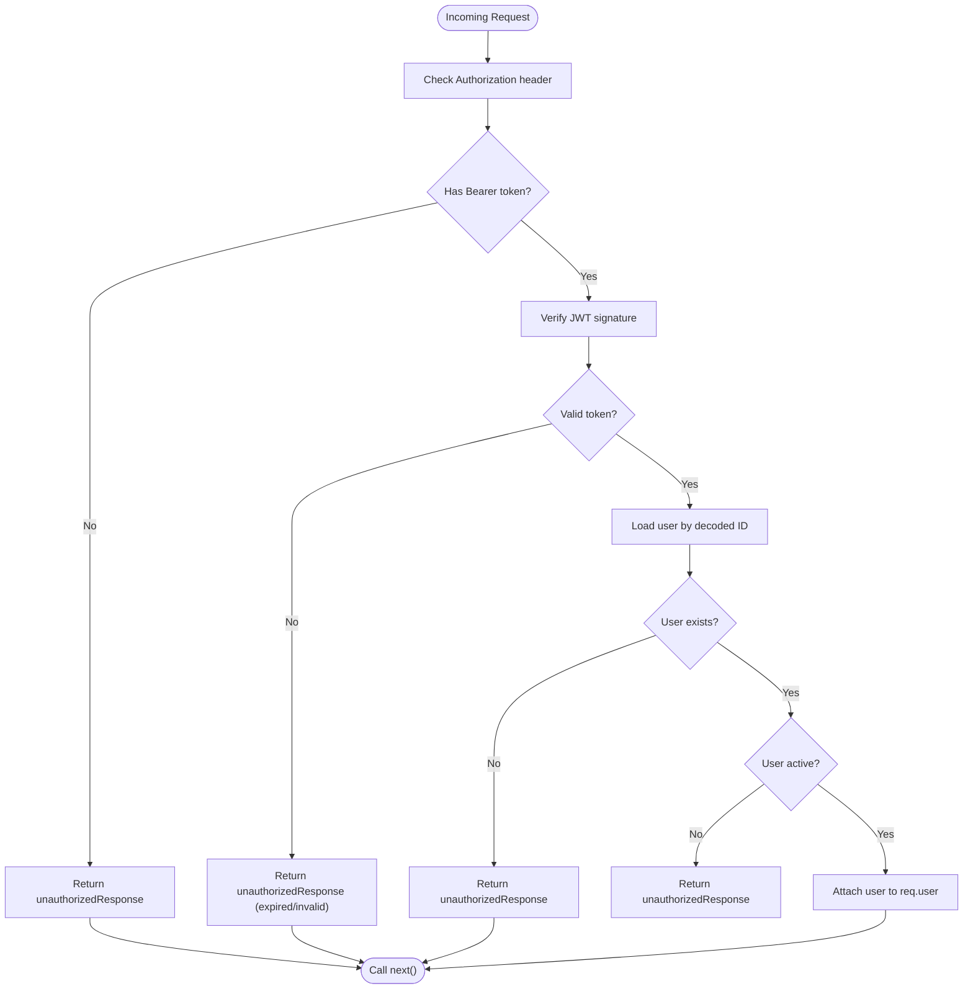
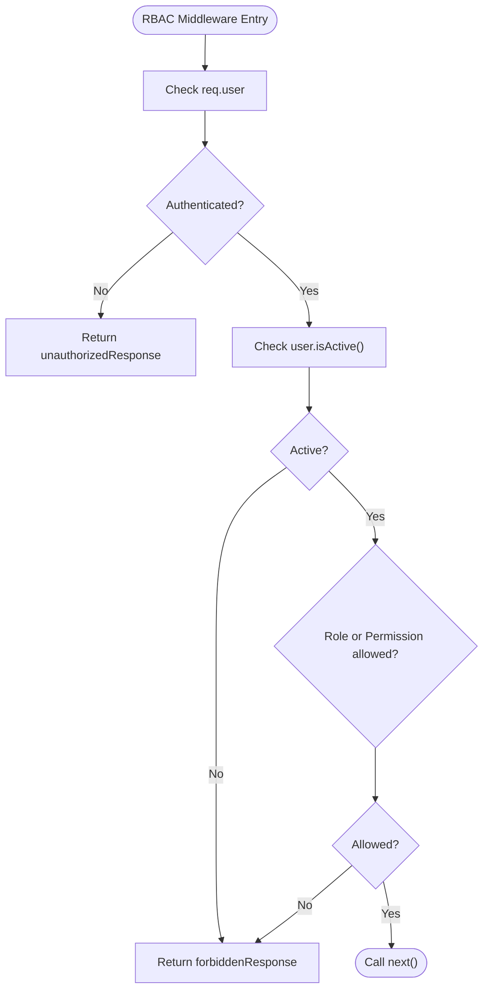
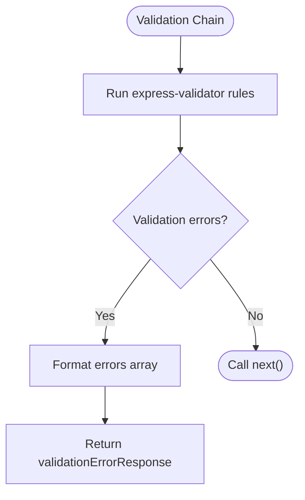
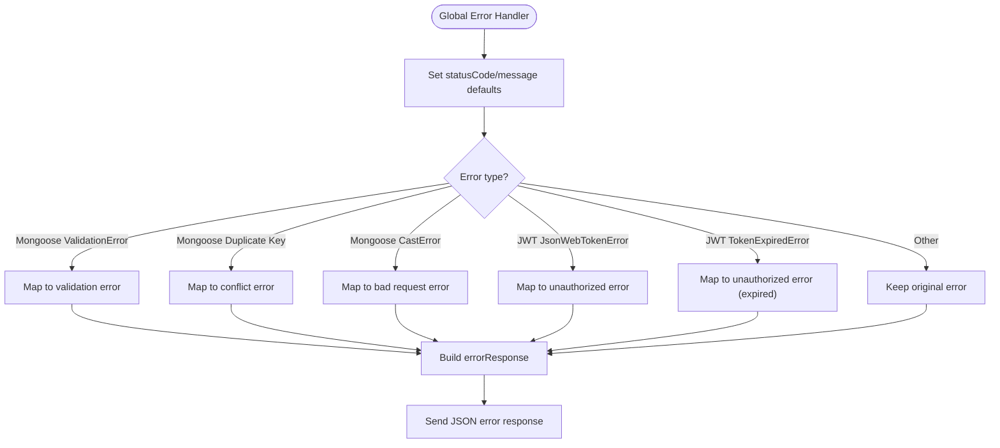
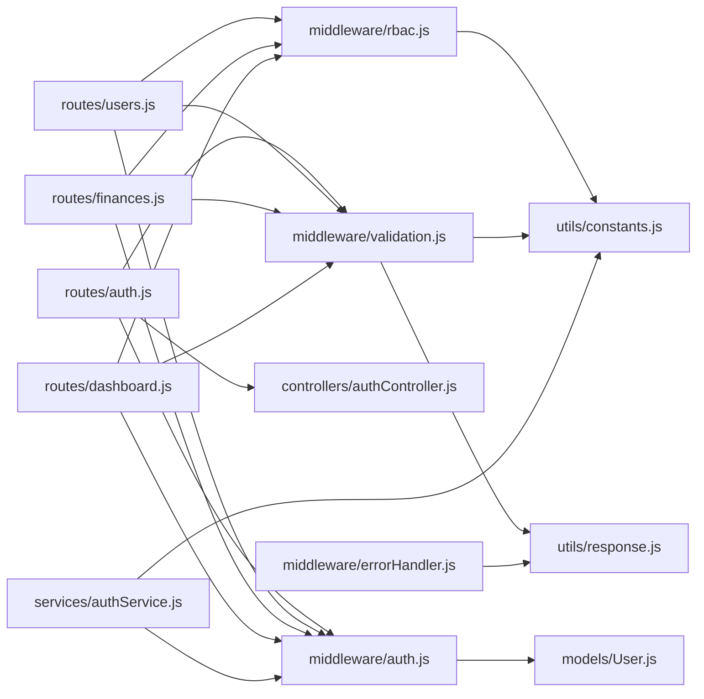

# Middleware & Interceptors

<cite>
**Referenced Files in This Document**
- [auth.js](file://backend/middleware/auth.js)
- [rbac.js](file://backend/middleware/rbac.js)
- [validation.js](file://backend/middleware/validation.js)
- [errorHandler.js](file://backend/middleware/errorHandler.js)
- [constants.js](file://backend/utils/constants.js)
- [response.js](file://backend/utils/response.js)
- [server.js](file://backend/server.js)
- [authController.js](file://backend/controllers/authController.js)
- [auth.js](file://backend/routes/auth.js)
- [users.js](file://backend/routes/users.js)
- [finances.js](file://backend/routes/finances.js)
- [dashboard.js](file://backend/routes/dashboard.js)
- [authService.js](file://backend/services/authService.js)
- [User.js](file://backend/models/User.js)
</cite>

## Table of Contents
1. [Introduction](#introduction)
2. [Project Structure](#project-structure)
3. [Core Components](#core-components)
4. [Architecture Overview](#architecture-overview)
5. [Detailed Component Analysis](#detailed-component-analysis)
6. [Dependency Analysis](#dependency-analysis)
7. [Performance Considerations](#performance-considerations)
8. [Troubleshooting Guide](#troubleshooting-guide)
9. [Conclusion](#conclusion)
10. [Appendices](#appendices)

## Introduction
This document explains the middleware and interceptor system used in the backend. It covers:
- Authentication middleware for JWT token verification and user session management
- Authorization middleware implementing role-based access control (RBAC) with permission checks
- Input validation middleware using express-validator for request sanitization and validation
- Centralized error handling middleware for consistent error responses

It also documents configuration options, integration patterns, middleware chaining examples, custom middleware creation, debugging techniques, performance considerations, and best practices.

## Project Structure
The middleware and interceptors live under the middleware directory and are integrated via routes and controllers. Utility modules provide shared constants and standardized response helpers. The server initializes middleware globally and registers routes.

**Diagram sources**
- [server.js:1-113](file://backend/server.js#L1-L113)
- [auth.js:1-116](file://backend/middleware/auth.js#L1-L116)
- [rbac.js:1-151](file://backend/middleware/rbac.js#L1-L151)
- [validation.js:1-309](file://backend/middleware/validation.js#L1-L309)
- [errorHandler.js:1-179](file://backend/middleware/errorHandler.js#L1-L179)
- [constants.js:1-81](file://backend/utils/constants.js#L1-L81)
- [response.js:1-101](file://backend/utils/response.js#L1-L101)
- [auth.js:1-49](file://backend/routes/auth.js#L1-L49)
- [users.js:1-64](file://backend/routes/users.js#L1-L64)
- [finances.js:1-67](file://backend/routes/finances.js#L1-L67)
- [dashboard.js:1-57](file://backend/routes/dashboard.js#L1-L57)
- [authController.js:1-114](file://backend/controllers/authController.js#L1-L114)
- [authService.js:1-195](file://backend/services/authService.js#L1-L195)
- [User.js:1-130](file://backend/models/User.js#L1-L130)

**Section sources**
- [server.js:1-113](file://backend/server.js#L1-L113)
- [auth.js:1-116](file://backend/middleware/auth.js#L1-L116)
- [rbac.js:1-151](file://backend/middleware/rbac.js#L1-L151)
- [validation.js:1-309](file://backend/middleware/validation.js#L1-L309)
- [errorHandler.js:1-179](file://backend/middleware/errorHandler.js#L1-L179)
- [constants.js:1-81](file://backend/utils/constants.js#L1-L81)
- [response.js:1-101](file://backend/utils/response.js#L1-L101)
- [auth.js:1-49](file://backend/routes/auth.js#L1-L49)
- [users.js:1-64](file://backend/routes/users.js#L1-L64)
- [finances.js:1-67](file://backend/routes/finances.js#L1-L67)
- [dashboard.js:1-57](file://backend/routes/dashboard.js#L1-L57)
- [authController.js:1-114](file://backend/controllers/authController.js#L1-L114)
- [authService.js:1-195](file://backend/services/authService.js#L1-L195)
- [User.js:1-130](file://backend/models/User.js#L1-L130)

## Core Components
- Authentication middleware: Validates JWT from Authorization header, attaches user to request, supports optional auth, and generates tokens.
- RBAC middleware: Enforces role-based and permission-based access checks, including ownership verification.
- Validation middleware: Uses express-validator to define per-route validation rules and a central error handler for validation failures.
- Error handling middleware: Centralizes error responses, normalizes Mongoose and JWT errors, and handles uncaught exceptions and unhandled rejections.

**Section sources**
- [auth.js:14-115](file://backend/middleware/auth.js#L14-L115)
- [rbac.js:14-150](file://backend/middleware/rbac.js#L14-L150)
- [validation.js:13-308](file://backend/middleware/validation.js#L13-L308)
- [errorHandler.js:11-178](file://backend/middleware/errorHandler.js#L11-L178)

## Architecture Overview
The middleware stack is mounted globally in the server, followed by route-specific middleware chains. Controllers receive authenticated and validated requests and delegate business logic to services.

**Diagram sources**
- [server.js:29-84](file://backend/server.js#L29-L84)
- [auth.js:14-93](file://backend/middleware/auth.js#L14-L93)
- [rbac.js:14-136](file://backend/middleware/rbac.js#L14-L136)
- [validation.js:13-27](file://backend/middleware/validation.js#L13-L27)
- [authController.js:13-105](file://backend/controllers/authController.js#L13-L105)
- [authService.js:15-93](file://backend/services/authService.js#L15-L93)
- [User.js:100-103](file://backend/models/User.js#L100-L103)

## Detailed Component Analysis

### Authentication Middleware
Responsibilities:
- Extract Bearer token from Authorization header
- Verify JWT with configured algorithm and secret
- Load user from database and attach to request
- Support optional authentication that does not block on missing/invalid tokens
- Generate signed JWT with configurable expiry and algorithm

Key behaviors:
- Token presence and format checks
- Decoding and verification with error classification (expired vs invalid)
- User existence and active status checks
- Optional auth silently proceeds without attaching user on failure

Integration patterns:
- Apply to routes requiring authenticated sessions
- Use optional auth for public endpoints needing user context when available

Configuration options:
- Secret and algorithm via environment variables or defaults
- Expiry via environment variable or default constant

**Diagram sources**
- [auth.js:14-59](file://backend/middleware/auth.js#L14-L59)
- [auth.js:64-93](file://backend/middleware/auth.js#L64-L93)
- [User.js:100-103](file://backend/models/User.js#L100-L103)

**Section sources**
- [auth.js:14-115](file://backend/middleware/auth.js#L14-L115)
- [constants.js:67-70](file://backend/utils/constants.js#L67-L70)

### Authorization Middleware (RBAC)
Responsibilities:
- Role enforcement: allow-list of roles
- Permission matrix: enforce capability gates mapped to roles
- Ownership checks: allow resource owners or admins
- Active user validation across all checks

Predefined guards:
- requireAdmin, requireAnalystOrAdmin, requireAnyRole
- canManageUsers, canCreateRecords, canUpdateRecords, canDeleteRecords, canViewAnalytics

**Diagram sources**
- [rbac.js:14-66](file://backend/middleware/rbac.js#L14-L66)
- [rbac.js:113-136](file://backend/middleware/rbac.js#L113-L136)
- [User.js:100-103](file://backend/models/User.js#L100-L103)

**Section sources**
- [rbac.js:14-150](file://backend/middleware/rbac.js#L14-L150)
- [constants.js:49-57](file://backend/utils/constants.js#L49-L57)

### Input Validation Middleware (express-validator)
Responsibilities:
- Define validation chains per route (body, param, query)
- Centralized error handler converts validation failures to a structured response
- Leverages constants for allowed values (roles, statuses, record types, categories)

Common validations:
- Registration: name, email, password, optional role
- Login: email, password
- User updates: ID param, optional name/email/role/status
- Finance records: amount/type/category/date/description/notes
- Lists: page, limit, type, category, date range, sort fields and order
- Dashboard: date range and period

**Diagram sources**
- [validation.js:13-27](file://backend/middleware/validation.js#L13-L27)
- [validation.js:32-60](file://backend/middleware/validation.js#L32-L60)
- [validation.js:130-168](file://backend/middleware/validation.js#L130-L168)
- [validation.js:230-273](file://backend/middleware/validation.js#L230-L273)
- [response.js:42-49](file://backend/utils/response.js#L42-L49)

**Section sources**
- [validation.js:13-308](file://backend/middleware/validation.js#L13-L308)
- [constants.js:5-46](file://backend/utils/constants.js#L5-L46)

### Centralized Error Handling Middleware
Responsibilities:
- Normalize Mongoose validation, duplicate key, and cast errors
- Normalize JWT errors (invalid/expired)
- Provide consistent error response shape
- Handle uncaught exceptions and unhandled promise rejections

Classes and utilities:
- APIError class for operational errors
- Handlers for specific error types
- Global error handler and shutdown helpers

**Diagram sources**
- [errorHandler.js:89-145](file://backend/middleware/errorHandler.js#L89-L145)
- [errorHandler.js:150-171](file://backend/middleware/errorHandler.js#L150-L171)
- [response.js:28-35](file://backend/utils/response.js#L28-L35)

**Section sources**
- [errorHandler.js:11-178](file://backend/middleware/errorHandler.js#L11-L178)
- [response.js:28-35](file://backend/utils/response.js#L28-L35)

## Dependency Analysis
- Routes import and compose middleware for each endpoint.
- Controllers call services; services may call middleware utilities (e.g., token generation).
- Models encapsulate user state and helper methods used by middleware (active status).
- Constants and response utilities are shared across middleware and routes.

**Diagram sources**
- [auth.js:10-11](file://backend/routes/auth.js#L10-L11)
- [users.js:10-12](file://backend/routes/users.js#L10-L12)
- [finances.js:10-22](file://backend/routes/finances.js#L10-L22)
- [dashboard.js:10-12](file://backend/routes/dashboard.js#L10-L12)
- [auth.js:100-109](file://backend/middleware/auth.js#L100-L109)
- [constants.js:5-80](file://backend/utils/constants.js#L5-L80)
- [response.js:1-101](file://backend/utils/response.js#L1-101)
- [errorHandler.js:1-179](file://backend/middleware/errorHandler.js#L1-179)
- [authService.js:7-8](file://backend/services/authService.js#L7-L8)
- [User.js:100-103](file://backend/models/User.js#L100-L103)

**Section sources**
- [auth.js:10-11](file://backend/routes/auth.js#L10-L11)
- [users.js:10-12](file://backend/routes/users.js#L10-L12)
- [finances.js:10-22](file://backend/routes/finances.js#L10-L22)
- [dashboard.js:10-12](file://backend/routes/dashboard.js#L10-L12)
- [auth.js:100-109](file://backend/middleware/auth.js#L100-L109)
- [constants.js:5-80](file://backend/utils/constants.js#L5-L80)
- [response.js:1-101](file://backend/utils/response.js#L1-101)
- [errorHandler.js:1-179](file://backend/middleware/errorHandler.js#L1-179)
- [authService.js:7-8](file://backend/services/authService.js#L7-L8)
- [User.js:100-103](file://backend/models/User.js#L100-L103)

## Performance Considerations
- Prefer optional authentication for public endpoints to avoid unnecessary token verification overhead.
- Keep validation chains minimal and specific to reduce CPU and memory usage during request parsing.
- Use appropriate limits for pagination to prevent heavy queries.
- Cache frequently accessed role/permission checks at the application level if needed, though middleware already short-circuits quickly.
- Ensure JWT secret and algorithm are configured securely and consistently to avoid repeated verification failures.
- Minimize synchronous work inside middleware; rely on asynchronous operations and early exits.

[No sources needed since this section provides general guidance]

## Troubleshooting Guide
Common issues and resolutions:
- Authentication failures:
  - Missing or malformed Authorization header
  - Expired or invalid token
  - User not found or inactive
- Authorization failures:
  - Insufficient role or missing permission
  - Non-owner attempts on resources with owner-only policies
- Validation failures:
  - Incorrect data types or out-of-range values
  - Missing required fields
  - Invalid enums or formats
- Centralized error handling:
  - Unexpected internal errors
  - Uncaught exceptions and unhandled rejections

Debugging techniques:
- Enable development request logging in the server for inspection of incoming requests.
- Review error logs for stack traces and error names (e.g., JWT errors, Mongoose errors).
- Temporarily adjust NODE_ENV to development to include stack traces in error responses.
- Add targeted console logs in middleware during local testing (avoid in production).
- Validate environment variables for JWT_SECRET and JWT_EXPIRE.

**Section sources**
- [server.js:34-40](file://backend/server.js#L34-L40)
- [errorHandler.js:94-96](file://backend/middleware/errorHandler.js#L94-L96)
- [errorHandler.js:150-171](file://backend/middleware/errorHandler.js#L150-L171)
- [auth.js:49-58](file://backend/middleware/auth.js#L49-L58)
- [rbac.js:16-31](file://backend/middleware/rbac.js#L16-L31)
- [validation.js:13-27](file://backend/middleware/validation.js#L13-L27)

## Conclusion
The middleware and interceptor system provides a robust foundation for authentication, authorization, input validation, and error handling. By composing middleware at the route level, the application enforces consistent policies while keeping controllers focused on business logic. Following the best practices and patterns outlined here ensures maintainability, security, and predictable behavior.

[No sources needed since this section summarizes without analyzing specific files]

## Appendices

### Middleware Chaining Examples
- Authentication and validation:
  - POST /api/auth/register: validateRegister → controller
  - POST /api/auth/login: validateLogin → controller
- Authorization and validation:
  - GET /api/users/:id: authenticate → canManageUsers → validateUserId → controller
  - POST /api/finances: authenticate → canCreateRecords → validateFinanceCreate → controller
- Mixed chains:
  - GET /api/dashboard/:id: authenticate → canViewAnalytics → validateDashboardQuery → controller

**Section sources**
- [auth.js:18-25](file://backend/routes/auth.js#L18-L25)
- [users.js:40-47](file://backend/routes/users.js#L40-L47)
- [finances.js:43-57](file://backend/routes/finances.js#L43-L57)
- [dashboard.js:19-47](file://backend/routes/dashboard.js#L19-L47)

### Custom Middleware Creation
Steps:
- Define a function with (req, res, next) signature
- Perform checks and attach data to req if needed
- Call next() to pass control to the next middleware/handler
- Return early with a standardized response for errors
- Export the function and import it in routes

Patterns:
- Authentication: verify token and attach user
- Authorization: check roles/permissions and active status
- Validation: wrap express-validator chains with a single error handler
- Error handling: normalize errors and respond consistently

**Section sources**
- [auth.js:14-59](file://backend/middleware/auth.js#L14-L59)
- [rbac.js:14-66](file://backend/middleware/rbac.js#L14-L66)
- [validation.js:13-27](file://backend/middleware/validation.js#L13-L27)
- [errorHandler.js:89-145](file://backend/middleware/errorHandler.js#L89-L145)

### Configuration Options
- JWT:
  - Algorithm and expiry via constants and environment variables
  - Secret fallback for development
- Validation:
  - Allowed values from constants (roles, statuses, record types, categories)
- Error handling:
  - Development mode toggles stack trace inclusion

**Section sources**
- [constants.js:67-70](file://backend/utils/constants.js#L67-L70)
- [auth.js:30-32](file://backend/middleware/auth.js#L30-L32)
- [errorHandler.js:94-96](file://backend/middleware/errorHandler.js#L94-L96)