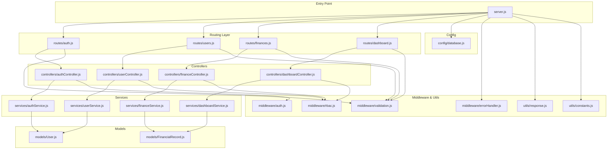
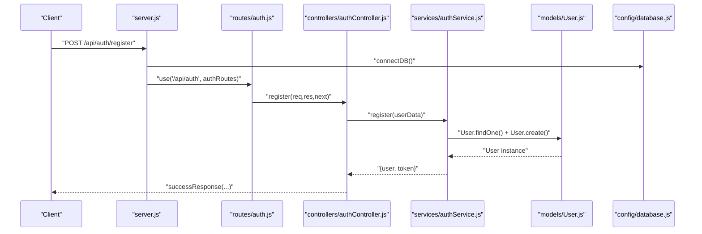
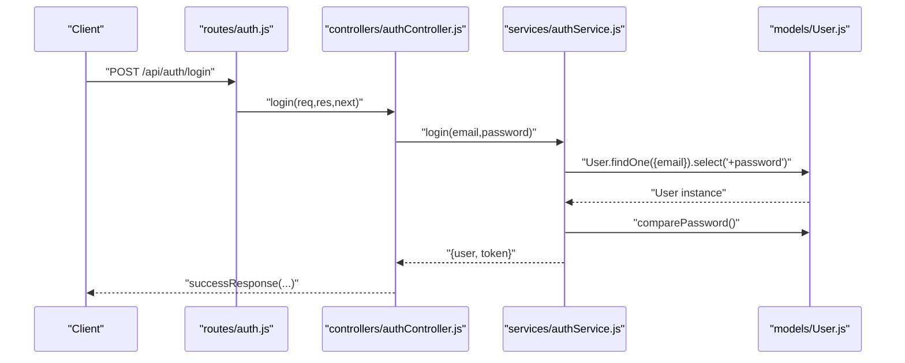
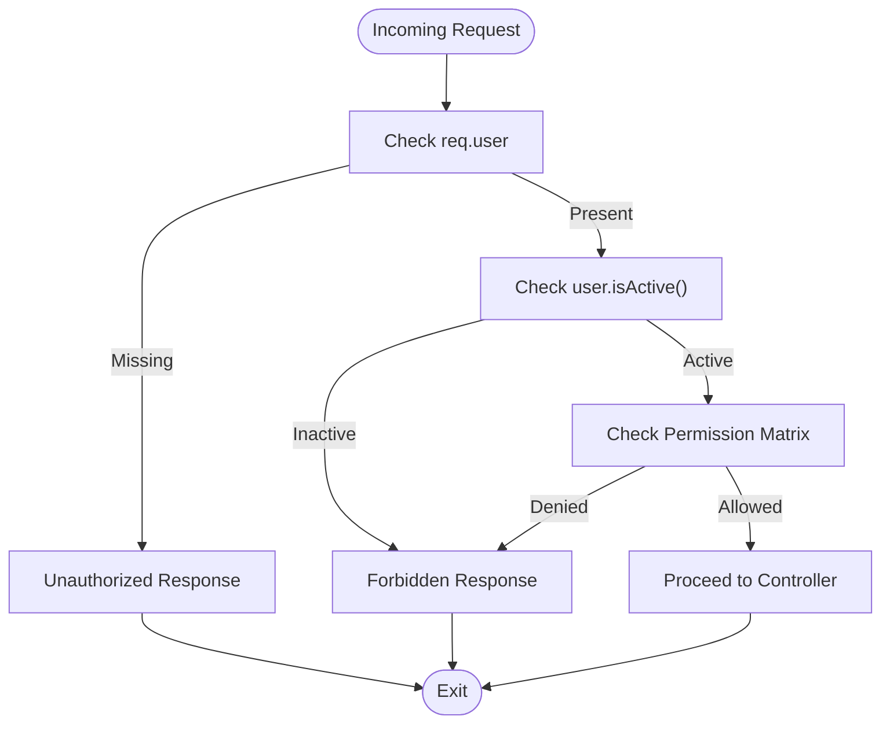
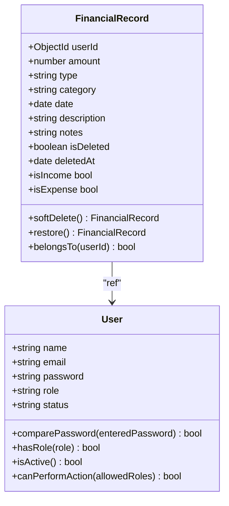
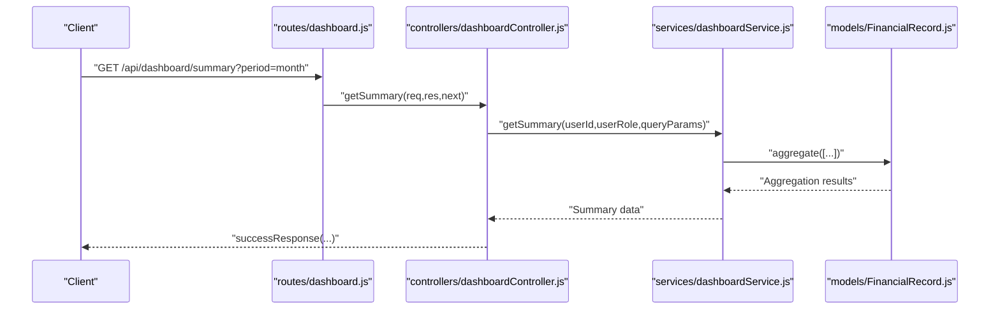
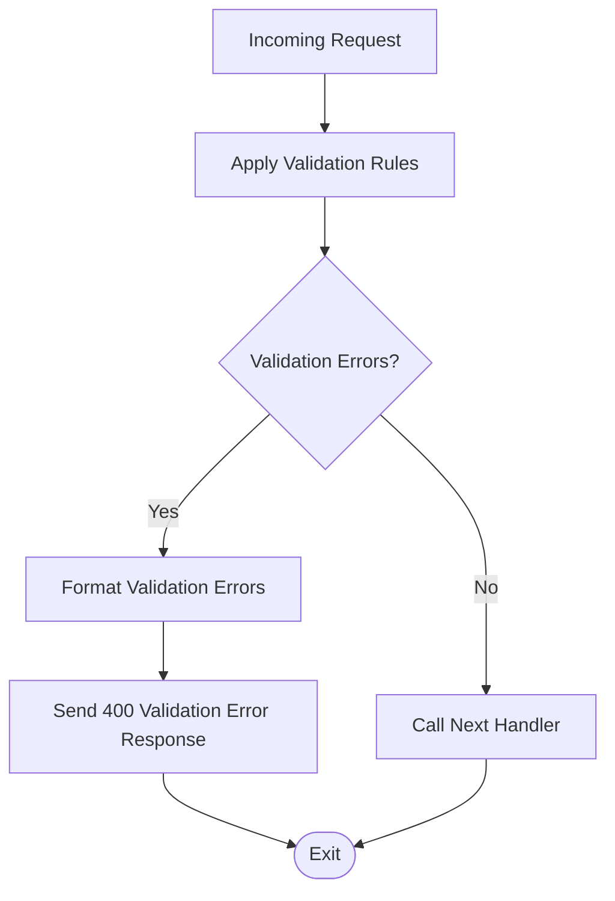
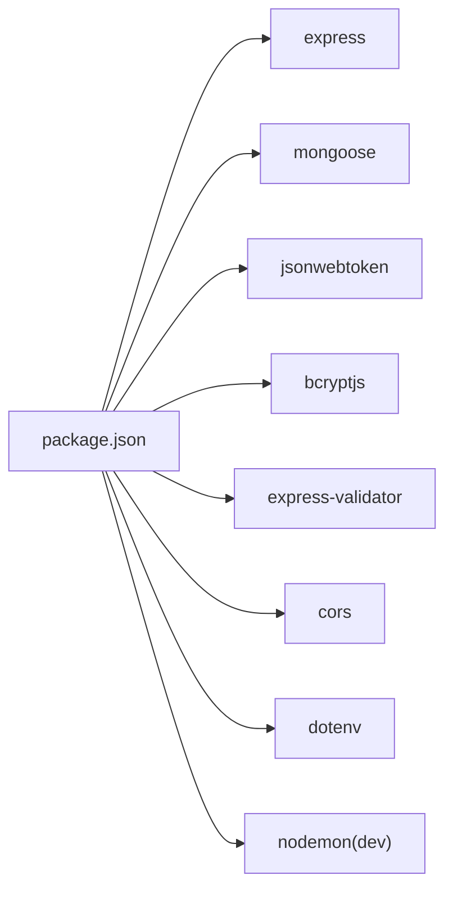

# Project Overview

<cite>
**Referenced Files in This Document**
- [README.md](file://backend/README.md)
- [package.json](file://backend/package.json)
- [server.js](file://backend/server.js)
- [database.js](file://backend/config/database.js)
- [constants.js](file://backend/utils/constants.js)
- [response.js](file://backend/utils/response.js)
- [validation.js](file://backend/middleware/validation.js)
- [rbac.js](file://backend/middleware/rbac.js)
- [auth.js](file://backend/routes/auth.js)
- [authController.js](file://backend/controllers/authController.js)
- [authService.js](file://backend/services/authService.js)
- [User.js](file://backend/models/User.js)
- [FinancialRecord.js](file://backend/models/FinancialRecord.js)
- [dashboardService.js](file://backend/services/dashboardService.js)
</cite>

## Table of Contents
1. [Introduction](#introduction)
2. [Project Structure](#project-structure)
3. [Core Components](#core-components)
4. [Architecture Overview](#architecture-overview)
5. [Detailed Component Analysis](#detailed-component-analysis)
6. [Dependency Analysis](#dependency-analysis)
7. [Performance Considerations](#performance-considerations)
8. [Troubleshooting Guide](#troubleshooting-guide)
9. [Conclusion](#conclusion)
10. [Appendices](#appendices)

## Introduction
FDPAC Finance Dashboard is a comprehensive backend API designed to power financial management applications with robust role-based access control (RBAC), secure authentication, and analytics-driven insights. It enables organizations to manage users, track financial records (income and expenses), and deliver actionable dashboards while enforcing granular permissions tailored to roles such as Viewer, Analyst, and Admin.

Target audience:
- Product teams building internal finance dashboards
- Organizations requiring secure financial data management with audit-friendly soft deletes
- Developers seeking a modular, standards-compliant backend built on modern Node.js technologies

Key capabilities:
- Secure authentication and sessionless JWT-based access
- Role-based access control with permission matrices
- Financial records lifecycle with soft deletes and category validation
- Analytics dashboard with summary, category breakdowns, recent activity, and trend analysis
- Centralized input validation and standardized API responses

Technology stack:
- Node.js runtime and Express.js framework
- MongoDB with Mongoose ODM
- JWT for authentication and authorization
- bcryptjs for password hashing
- express-validator for request validation

Benefits:
- Clean separation of concerns across models, services, controllers, routes, and middleware
- Predictable, testable APIs with consistent response formats
- Scalable RBAC enforcement and flexible analytics aggregation
- Developer-friendly environment with standardized conventions

## Project Structure
The backend follows a layered architecture with clear boundaries between presentation (routes), business logic (services), persistence (models), and cross-cutting concerns (middleware, utilities). The structure promotes maintainability and scalability.

**Diagram sources**
- [server.js:1-113](file://backend/server.js#L1-L113)
- [auth.js:1-49](file://backend/routes/auth.js#L1-L49)
- [authController.js:1-114](file://backend/controllers/authController.js#L1-L114)
- [authService.js:1-195](file://backend/services/authService.js#L1-L195)
- [User.js:1-130](file://backend/models/User.js#L1-L130)
- [FinancialRecord.js:1-134](file://backend/models/FinancialRecord.js#L1-L134)
- [rbac.js:1-151](file://backend/middleware/rbac.js#L1-L151)
- [validation.js:1-309](file://backend/middleware/validation.js#L1-L309)
- [response.js:1-101](file://backend/utils/response.js#L1-L101)
- [constants.js:1-81](file://backend/utils/constants.js#L1-L81)
- [database.js:1-43](file://backend/config/database.js#L1-L43)

**Section sources**
- [README.md:23-58](file://backend/README.md#L23-L58)
- [server.js:14-56](file://backend/server.js#L14-L56)

## Core Components
This section introduces the primary building blocks of the system and their responsibilities.

- Models
  - User: Defines user schema, password hashing, role/status checks, and helper methods.
  - FinancialRecord: Defines financial entry schema, soft-delete behavior, ownership checks, and category validation helpers.

- Services
  - authService: Implements registration, login, profile retrieval, password change, and initial admin setup.
  - dashboardService: Aggregates analytics data (summary, category breakdowns, recent activity, monthly/weekly trends) with role-aware filtering.

- Controllers
  - authController: Orchestrates authentication requests and delegates to authService.

- Middleware
  - validation: Validates incoming requests using express-validator and standardizes error responses.
  - rbac: Enforces role-based permissions and ownership checks.
  - auth: Extracts user context from JWT for protected routes.

- Utilities
  - constants: Centralizes roles, statuses, types, categories, permissions, pagination defaults, and JWT configuration.
  - response: Provides standardized success/error/unauthorized/forbidden/not-found responses.

- Configuration
  - database: Establishes MongoDB connection and disconnection utilities.

**Section sources**
- [User.js:10-130](file://backend/models/User.js#L10-L130)
- [FinancialRecord.js:9-134](file://backend/models/FinancialRecord.js#L9-L134)
- [authService.js:15-195](file://backend/services/authService.js#L15-L195)
- [dashboardService.js:16-345](file://backend/services/dashboardService.js#L16-L345)
- [authController.js:13-113](file://backend/controllers/authController.js#L13-L113)
- [validation.js:13-309](file://backend/middleware/validation.js#L13-L309)
- [rbac.js:14-151](file://backend/middleware/rbac.js#L14-L151)
- [constants.js:5-81](file://backend/utils/constants.js#L5-L81)
- [response.js:12-101](file://backend/utils/response.js#L12-L101)
- [database.js:11-42](file://backend/config/database.js#L11-L42)

## Architecture Overview
The system adheres to a layered architecture with clear separation of concerns:
- Entry point initializes Express, loads environment, connects to the database, registers routes, and applies middleware.
- Routes define endpoints and bind them to controllers.
- Controllers delegate to services for business logic.
- Services interact with models for persistence and computation.
- Middleware enforces validation, authentication, and authorization.
- Utilities provide shared constants and response formatting.

**Diagram sources**
- [server.js:11-56](file://backend/server.js#L11-L56)
- [auth.js:18](file://backend/routes/auth.js#L18)
- [authController.js:13-26](file://backend/controllers/authController.js#L13-L26)
- [authService.js:15-51](file://backend/services/authService.js#L15-L51)
- [User.js:10-130](file://backend/models/User.js#L10-L130)
- [database.js:11-25](file://backend/config/database.js#L11-L25)

## Detailed Component Analysis

### Authentication and Authorization
- Registration and login flow:
  - Input validation ensures required fields and formats.
  - Password hashing occurs automatically during user save.
  - JWT tokens are generated and returned upon successful auth.
- Profile management:
  - Protected endpoints require a valid Bearer token.
  - Password change validates current password before updating.
- Initial admin setup:
  - One-time endpoint to bootstrap the system with an admin user.

**Diagram sources**
- [auth.js:25](file://backend/routes/auth.js#L25)
- [authController.js:32-46](file://backend/controllers/authController.js#L32-L46)
- [authService.js:59-93](file://backend/services/authService.js#L59-L93)
- [User.js:84-86](file://backend/models/User.js#L84-L86)

**Section sources**
- [auth.js:14-46](file://backend/routes/auth.js#L14-L46)
- [authController.js:13-113](file://backend/controllers/authController.js#L13-L113)
- [authService.js:15-195](file://backend/services/authService.js#L15-L195)
- [User.js:64-86](file://backend/models/User.js#L64-L86)

### Role-Based Access Control (RBAC)
- Permission enforcement:
  - Middleware checks user role and active status before allowing access.
  - Permission keys map to allowed roles for actions like managing users, creating/updating/deleting records, and viewing analytics.
- Ownership checks:
  - Resource-level checks ensure non-admin users can only access their own records.

**Diagram sources**
- [rbac.js:14-66](file://backend/middleware/rbac.js#L14-L66)
- [constants.js:48-57](file://backend/utils/constants.js#L48-L57)

**Section sources**
- [rbac.js:14-151](file://backend/middleware/rbac.js#L14-L151)
- [constants.js:48-57](file://backend/utils/constants.js#L48-L57)

### Financial Records Management
- Data model:
  - Supports income/expense types, categorized entries, dates, and soft deletion.
  - Pre-find middleware excludes soft-deleted records by default.
- Lifecycle:
  - Creation validated and persisted.
  - Updates and deletions enforced by RBAC and ownership checks.
- Analytics:
  - Aggregation pipelines compute totals, counts, and trends by category and time periods.

**Diagram sources**
- [User.js:10-130](file://backend/models/User.js#L10-L130)
- [FinancialRecord.js:9-134](file://backend/models/FinancialRecord.js#L9-L134)

**Section sources**
- [FinancialRecord.js:75-108](file://backend/models/FinancialRecord.js#L75-L108)
- [dashboardService.js:281-334](file://backend/services/dashboardService.js#L281-L334)

### Analytics Dashboard
- Summary:
  - Computes total income, total expense, net balance, and counts.
- Category breakdown:
  - Groups by category and type to show top contributors.
- Recent activity:
  - Lists latest transactions with user metadata.
- Trends:
  - Monthly and weekly aggregations computed via MongoDB aggregation.

**Diagram sources**
- [dashboardService.js:16-55](file://backend/services/dashboardService.js#L16-L55)
- [FinancialRecord.js:19-28](file://backend/models/FinancialRecord.js#L19-L28)

**Section sources**
- [dashboardService.js:16-345](file://backend/services/dashboardService.js#L16-L345)

### Input Validation and Error Handling
- Validation:
  - Uses express-validator to validate request bodies, params, and query strings.
  - Converts validation errors into a standardized format.
- Error handling:
  - Centralized error handling middleware and response utilities provide consistent error payloads.

**Diagram sources**
- [validation.js:13-27](file://backend/middleware/validation.js#L13-L27)
- [response.js:42-49](file://backend/utils/response.js#L42-L49)

**Section sources**
- [validation.js:13-309](file://backend/middleware/validation.js#L13-L309)
- [response.js:12-101](file://backend/utils/response.js#L12-L101)

## Dependency Analysis
The project’s dependencies are minimal and focused, enabling a lean and maintainable backend.

**Diagram sources**
- [package.json:16-27](file://backend/package.json#L16-L27)

**Section sources**
- [package.json:16-27](file://backend/package.json#L16-L27)

## Performance Considerations
- Database indexing:
  - User and FinancialRecord schemas include strategic indexes to optimize common queries (e.g., email, role, status, date, type).
- Aggregation efficiency:
  - Dashboard analytics leverage MongoDB aggregation pipelines to compute summaries and trends server-side.
- Pagination:
  - List endpoints support configurable pagination limits to control payload sizes.
- Soft deletes:
  - Default exclusion of soft-deleted records reduces query overhead and maintains audit trails.

[No sources needed since this section provides general guidance]

## Troubleshooting Guide
Common issues and resolutions:
- Authentication failures:
  - Ensure the Authorization header includes a valid Bearer token.
  - Confirm credentials are correct and the account is active.
- Validation errors:
  - Review the validation error payload for missing or invalid fields.
- Access denied:
  - Verify the user’s role and that the account is active.
  - Confirm the endpoint requires a higher role or specific permission.
- Database connectivity:
  - Check the MongoDB URI and network accessibility.
  - Ensure the database is reachable and credentials are correct.

**Section sources**
- [response.js:56-91](file://backend/utils/response.js#L56-L91)
- [rbac.js:17-62](file://backend/middleware/rbac.js#L17-L62)
- [database.js:21-24](file://backend/config/database.js#L21-L24)

## Conclusion
FDPAC Finance Dashboard delivers a secure, scalable, and developer-friendly backend for financial management. Its layered architecture, robust RBAC, comprehensive validation, and analytics capabilities make it suitable for teams needing a production-ready foundation. By leveraging modern technologies and consistent patterns, the system supports both rapid iteration and long-term maintainability.

[No sources needed since this section summarizes without analyzing specific files]

## Appendices

### API Overview and Permissions
- Authentication endpoints:
  - Public registration and login.
  - Protected profile retrieval and password change.
  - One-time initial admin setup.
- User management:
  - Admin-only endpoints for listing, stats, creation, updates, deactivation, and toggling status.
- Financial records:
  - All roles can list and filter records; analysts and admins can create; admins can update/delete.
- Dashboard analytics:
  - Viewers can access summaries; analysts and admins can access category breakdowns, recent activity, and trends.

**Section sources**
- [README.md:101-159](file://backend/README.md#L101-L159)
- [constants.js:48-57](file://backend/utils/constants.js#L48-L57)

### Practical Examples
- Setup initial admin:
  - Use the one-time setup endpoint to create the first admin user.
- Login and retrieve dashboard summary:
  - Authenticate, then call the summary endpoint with optional period filters.
- Create a financial record:
  - Ensure the user has the required role; submit a valid record payload.

**Section sources**
- [README.md:242-281](file://backend/README.md#L242-L281)