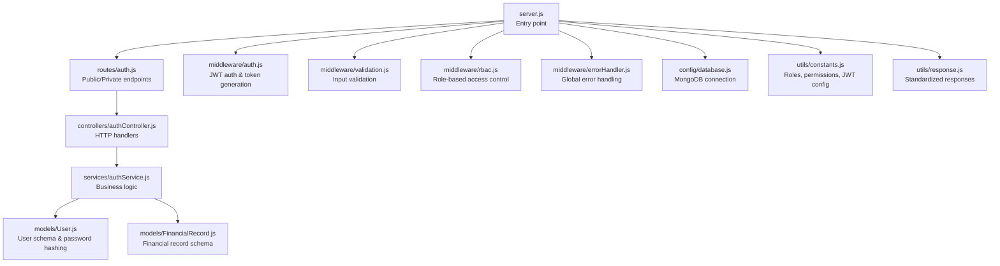
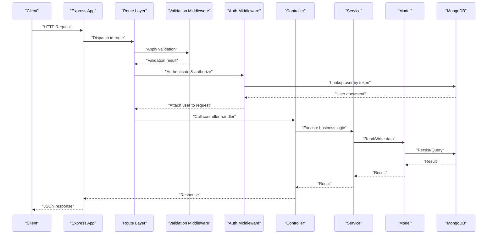
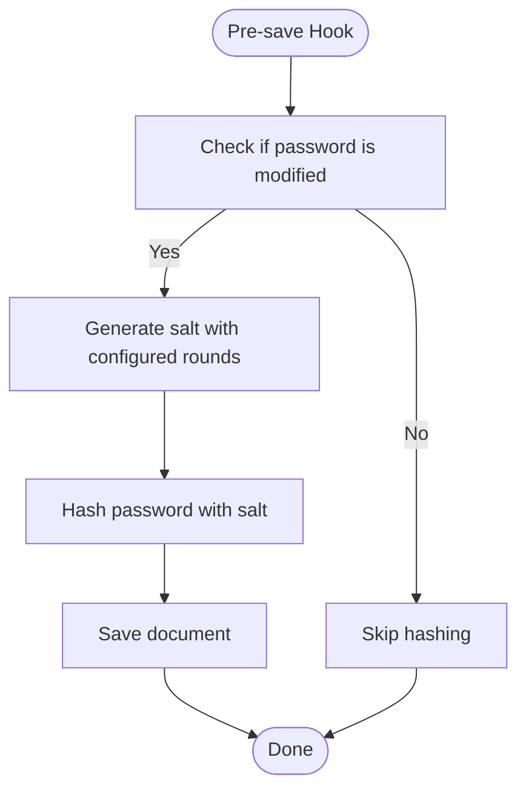
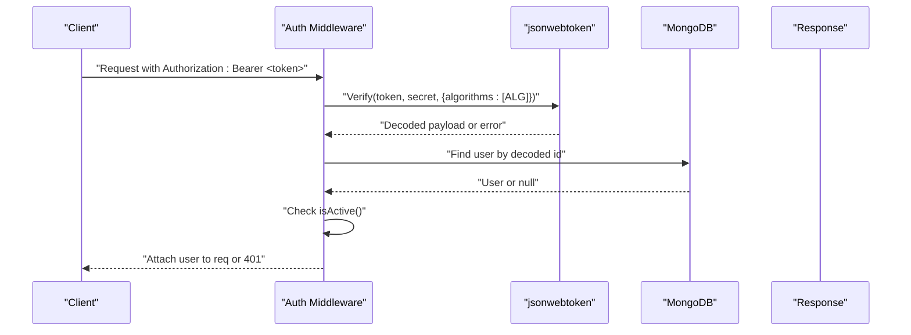
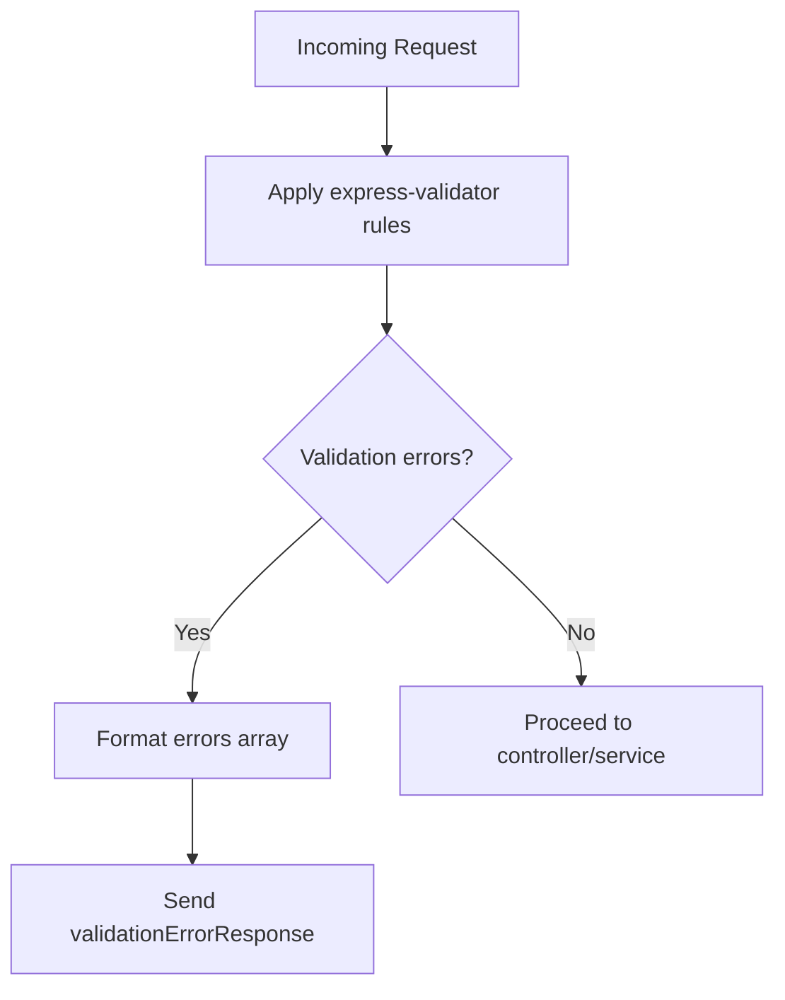
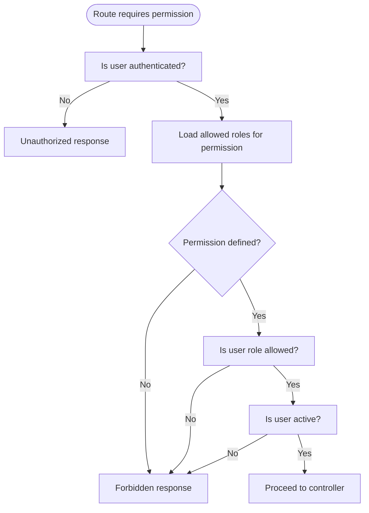
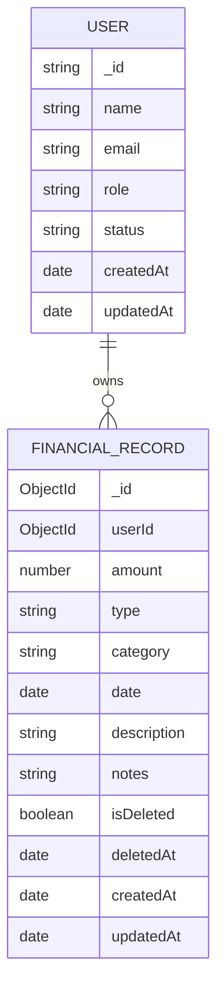
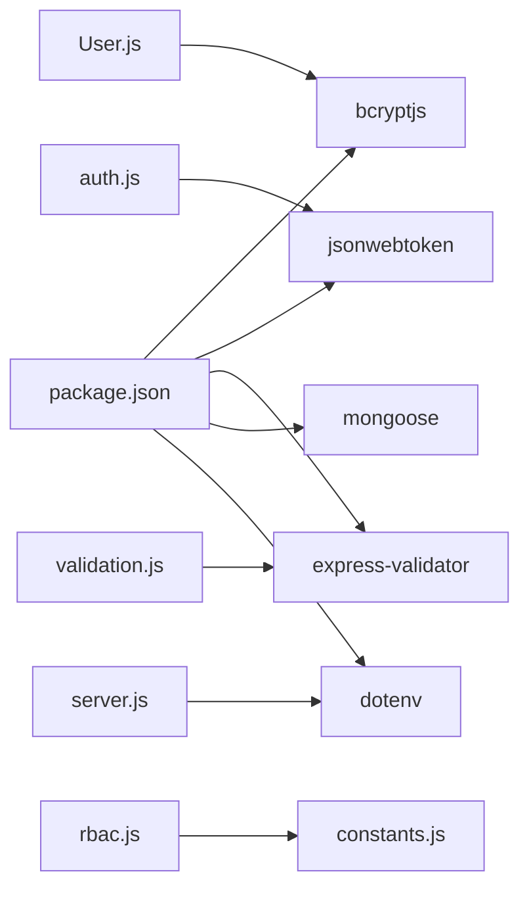

# Security Considerations

<cite>
**Referenced Files in This Document**
- [server.js](file://backend/server.js)
- [package.json](file://backend/package.json)
- [database.js](file://backend/config/database.js)
- [auth.js](file://backend/middleware/auth.js)
- [rbac.js](file://backend/middleware/rbac.js)
- [validation.js](file://backend/middleware/validation.js)
- [constants.js](file://backend/utils/constants.js)
- [errorHandler.js](file://backend/middleware/errorHandler.js)
- [response.js](file://backend/utils/response.js)
- [User.js](file://backend/models/User.js)
- [FinancialRecord.js](file://backend/models/FinancialRecord.js)
- [authController.js](file://backend/controllers/authController.js)
- [authService.js](file://backend/services/authService.js)
- [auth.js](file://backend/routes/auth.js)
</cite>

## Table of Contents
1. [Introduction](#introduction)
2. [Project Structure](#project-structure)
3. [Core Components](#core-components)
4. [Architecture Overview](#architecture-overview)
5. [Detailed Component Analysis](#detailed-component-analysis)
6. [Dependency Analysis](#dependency-analysis)
7. [Performance Considerations](#performance-considerations)
8. [Troubleshooting Guide](#troubleshooting-guide)
9. [Conclusion](#conclusion)
10. [Appendices](#appendices)

## Introduction
This document provides comprehensive security documentation for the FDPAC Finance Dashboard backend. It focuses on password security with bcryptjs, JWT token security, input validation using express-validator, access control via RBAC, data protection strategies, and operational security practices. The goal is to help developers and operators understand how security controls are implemented and how to maintain and improve them.

## Project Structure
The backend follows a layered architecture:
- Entry point initializes environment, connects to the database, applies middleware, and mounts routes.
- Routes define endpoints and apply validation and authentication middleware.
- Controllers orchestrate request handling and delegate to services.
- Services encapsulate business logic and interact with models.
- Models define schemas, pre-save hooks, and helper methods.
- Middleware enforces authentication, RBAC, input validation, and centralized error handling.
- Utilities centralize response formatting and constants.

**Diagram sources**
- [server.js:1-113](file://backend/server.js#L1-L113)
- [auth.js:1-49](file://backend/routes/auth.js#L1-L49)
- [auth.js:1-116](file://backend/middleware/auth.js#L1-L116)
- [validation.js:1-309](file://backend/middleware/validation.js#L1-L309)
- [rbac.js:1-151](file://backend/middleware/rbac.js#L1-L151)
- [errorHandler.js:1-179](file://backend/middleware/errorHandler.js#L1-L179)
- [authController.js:1-114](file://backend/controllers/authController.js#L1-L114)
- [authService.js:1-195](file://backend/services/authService.js#L1-L195)
- [User.js:1-130](file://backend/models/User.js#L1-L130)
- [FinancialRecord.js:1-134](file://backend/models/FinancialRecord.js#L1-L134)
- [database.js:1-43](file://backend/config/database.js#L1-L43)
- [constants.js:1-81](file://backend/utils/constants.js#L1-L81)
- [response.js:1-101](file://backend/utils/response.js#L1-L101)

**Section sources**
- [server.js:1-113](file://backend/server.js#L1-L113)
- [package.json:1-29](file://backend/package.json#L1-L29)

## Core Components
- Password security: bcryptjs is used for hashing and secure comparison. The model’s pre-save hook ensures passwords are hashed with a salt, and a dedicated method compares plaintext against stored hashes.
- JWT token security: tokens are signed with a configurable algorithm and expiration. Token verification occurs centrally, and the middleware checks user existence and activity.
- Input validation: express-validator validates request bodies, params, and query strings with strict constraints and normalized formats.
- Access control: RBAC middleware enforces role-based and permission-based authorization, including resource ownership checks.
- Data protection: MongoDB schema constraints, indexes, and soft-delete semantics protect data integrity. Token storage and transport are discussed in the JWT section.
- Audit and observability: standardized responses and centralized error handling provide structured feedback and logging.

**Section sources**
- [User.js:64-86](file://backend/models/User.js#L64-L86)
- [auth.js:100-109](file://backend/middleware/auth.js#L100-L109)
- [validation.js:13-27](file://backend/middleware/validation.js#L13-L27)
- [rbac.js:14-66](file://backend/middleware/rbac.js#L14-L66)
- [constants.js:67-70](file://backend/utils/constants.js#L67-L70)
- [errorHandler.js:89-145](file://backend/middleware/errorHandler.js#L89-L145)
- [response.js:12-91](file://backend/utils/response.js#L12-L91)

## Architecture Overview
The security architecture integrates middleware and services to enforce authentication, authorization, and input validation across the API.

**Diagram sources**
- [server.js:52-84](file://backend/server.js#L52-L84)
- [auth.js:14-59](file://backend/middleware/auth.js#L14-L59)
- [validation.js:13-27](file://backend/middleware/validation.js#L13-L27)
- [authController.js:13-26](file://backend/controllers/authController.js#L13-L26)
- [authService.js:15-51](file://backend/services/authService.js#L15-L51)
- [User.js:64-86](file://backend/models/User.js#L64-L86)
- [database.js:11-25](file://backend/config/database.js#L11-L25)

## Detailed Component Analysis

### Password Security with bcryptjs
- Salt rounds and hashing: The user schema’s pre-save hook generates a salt and hashes the password before saving. This ensures strong per-record salting and prevents rainbow table attacks.
- Secure comparison: A dedicated method securely compares a plaintext password against the stored hash.
- Schema protections: Passwords are excluded from default queries, reducing accidental exposure.

**Diagram sources**
- [User.js:64-77](file://backend/models/User.js#L64-L77)

**Section sources**
- [User.js:64-86](file://backend/models/User.js#L64-L86)
- [package.json:17](file://backend/package.json#L17)

### JWT Token Security
- Signing algorithm and expiration: Tokens are generated with a configurable algorithm and expiration period. Verification enforces the same algorithm and rejects expired tokens.
- Token retrieval and verification: Authentication middleware extracts the Bearer token from the Authorization header, verifies it, loads the user, and ensures the account is active.
- Token storage best practices: Clients should store tokens in secure, httpOnly cookies or secure storage mechanisms. Avoid placing tokens in localStorage for XSS-prone environments.

**Diagram sources**
- [auth.js:14-59](file://backend/middleware/auth.js#L14-L59)
- [constants.js:67-70](file://backend/utils/constants.js#L67-L70)

**Section sources**
- [auth.js:100-109](file://backend/middleware/auth.js#L100-L109)
- [auth.js:28-54](file://backend/middleware/auth.js#L28-L54)
- [constants.js:67-70](file://backend/utils/constants.js#L67-L70)

### Input Validation Security with express-validator
- Validation coverage: Validation middleware defines strict rules for registration, login, user updates, financial record creation/update, and query parameters. It normalizes emails and trims strings to reduce injection risks.
- Error handling: Centralized error handler converts validation failures into structured JSON responses with field-level details.

**Diagram sources**
- [validation.js:13-27](file://backend/middleware/validation.js#L13-L27)
- [response.js:42-49](file://backend/utils/response.js#L42-L49)

**Section sources**
- [validation.js:32-60](file://backend/middleware/validation.js#L32-L60)
- [validation.js:130-168](file://backend/middleware/validation.js#L130-L168)
- [validation.js:230-273](file://backend/middleware/validation.js#L230-L273)
- [errorHandler.js:89-145](file://backend/middleware/errorHandler.js#L89-L145)

### Access Control Security with RBAC
- Role enforcement: Middleware supports role-based checks and permission-based checks using a centralized permissions matrix.
- Resource ownership: Ownership checks ensure users can only access their own resources unless they are admins.
- Active account enforcement: Both authentication and authorization paths reject inactive accounts.

**Diagram sources**
- [rbac.js:40-66](file://backend/middleware/rbac.js#L40-L66)
- [constants.js:49-57](file://backend/utils/constants.js#L49-L57)

**Section sources**
- [rbac.js:14-33](file://backend/middleware/rbac.js#L14-L33)
- [rbac.js:113-136](file://backend/middleware/rbac.js#L113-L136)
- [constants.js:49-57](file://backend/utils/constants.js#L49-L57)

### Data Protection Strategies
- Encryption at rest: MongoDB stores documents as BSON; enable encryption at the database level and network level as per deployment policies.
- Encryption in transit: Use TLS termination at the reverse proxy or load balancer; avoid exposing HTTP endpoints in production.
- Data integrity and privacy: Schema constraints prevent invalid data. Soft deletes on financial records preserve audit trails while allowing recovery.
- Indexes: Strategic indexes optimize queries and reduce risk of inefficient scans.

**Diagram sources**
- [User.js:10-54](file://backend/models/User.js#L10-L54)
- [FinancialRecord.js:9-63](file://backend/models/FinancialRecord.js#L9-L63)

**Section sources**
- [FinancialRecord.js:75-81](file://backend/models/FinancialRecord.js#L75-L81)
- [FinancialRecord.js:86-99](file://backend/models/FinancialRecord.js#L86-L99)

### Audit Trail Implementation
- Timestamps: Models include createdAt and updatedAt for all entities.
- Soft deletion: Financial records support soft deletion with deletion metadata, enabling auditability.
- Logging: Centralized error handler logs errors in development mode; consider integrating structured logging and request correlation IDs for production.

**Section sources**
- [FinancialRecord.js:59-63](file://backend/models/FinancialRecord.js#L59-L63)
- [FinancialRecord.js:50-58](file://backend/models/FinancialRecord.js#L50-L58)
- [errorHandler.js:94-96](file://backend/middleware/errorHandler.js#L94-L96)

## Dependency Analysis
Security-related dependencies and their roles:
- bcryptjs: Password hashing and secure comparison.
- jsonwebtoken: JWT signing, verification, and expiration handling.
- express-validator: Input sanitization and validation.
- mongoose: Schema enforcement and database operations.
- dotenv: Environment variable loading for secrets.

**Diagram sources**
- [package.json:16-24](file://backend/package.json#L16-L24)
- [User.js:7](file://backend/models/User.js#L7)
- [auth.js:6](file://backend/middleware/auth.js#L6)
- [rbac.js:7](file://backend/middleware/rbac.js#L7)
- [validation.js:6](file://backend/middleware/validation.js#L6)
- [server.js:6](file://backend/server.js#L6)

**Section sources**
- [package.json:16-24](file://backend/package.json#L16-L24)

## Performance Considerations
- Avoid excessive bcrypt work factors in production; 10 is commonly sufficient. Monitor latency and adjust based on hardware.
- Use indexes strategically to minimize query times for frequent filters (e.g., user-based queries).
- Limit payload sizes and pagination defaults to control memory usage during validation and aggregation.
- Centralized error handling avoids repeated error formatting overhead.

## Troubleshooting Guide
- Authentication failures: Check token presence, algorithm alignment, secret configuration, and user activity status.
- Validation errors: Review formatted error arrays returned by the validation middleware for field-specific messages.
- JWT errors: Distinguish between invalid tokens and expired tokens; both are handled distinctly by the error handler.
- Database connectivity: Confirm environment variables and connection retry logic.

**Section sources**
- [auth.js:28-54](file://backend/middleware/auth.js#L28-L54)
- [errorHandler.js:125-136](file://backend/middleware/errorHandler.js#L125-L136)
- [validation.js:13-27](file://backend/middleware/validation.js#L13-L27)
- [database.js:11-25](file://backend/config/database.js#L11-L25)

## Conclusion
The FDPAC Finance Dashboard implements robust security controls across password hashing, JWT lifecycle, input validation, and RBAC. By adhering to the outlined best practices—such as secure token storage, environment-driven secrets, and strict input validation—the system maintains confidentiality, integrity, and availability. Regular audits, monitoring, and adherence to the incident response procedures will further strengthen security posture.

## Appendices

### Security Best Practices
- Secrets management: Store JWT_SECRET and database credentials in environment variables; rotate secrets periodically.
- Transport security: Enforce HTTPS/TLS termination at the edge; disable insecure protocols.
- Token storage: Prefer httpOnly cookies for session-like behavior; avoid localStorage for bearer tokens.
- Least privilege: Use RBAC to restrict access to sensitive actions and resources.
- Input hygiene: Normalize and sanitize inputs; validate types and lengths rigorously.
- Observability: Log security-relevant events; correlate requests; monitor anomalies.

### Vulnerability Assessment Guidelines
- Static analysis: Scan for hardcoded secrets, weak crypto, and unsafe deserialization.
- Dynamic testing: Penetration test endpoints with authenticated and anonymous requests.
- Dependency review: Audit bcryptjs, jsonwebtoken, express-validator, and mongoose for known vulnerabilities.
- Data validation: Ensure all inputs are validated and sanitized before persistence.

### Incident Response Procedures
- Detection: Monitor authentication failures, validation errors, and unusual access patterns.
- Containment: Rotate secrets, revoke compromised tokens, and temporarily restrict affected endpoints.
- Eradication: Patch vulnerabilities, update dependencies, and harden configurations.
- Recovery: Resume service after remediation, validate logs, and communicate with stakeholders.
- Postmortem: Document root causes, lessons learned, and preventive controls.