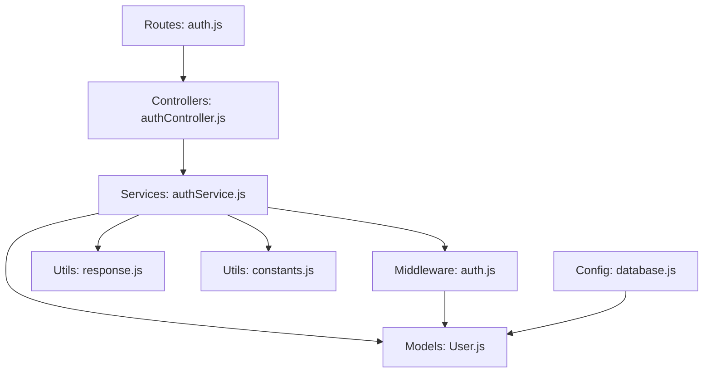
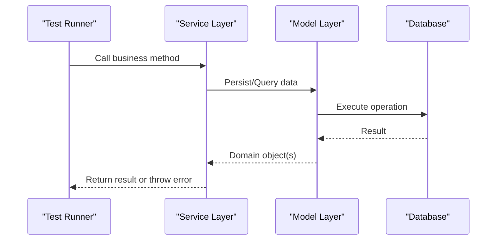
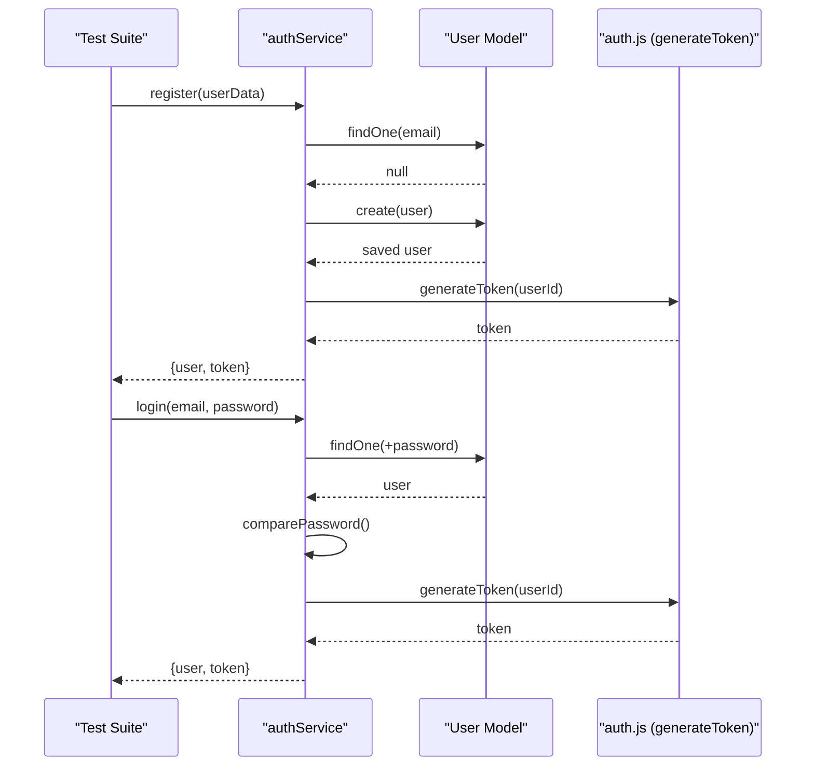
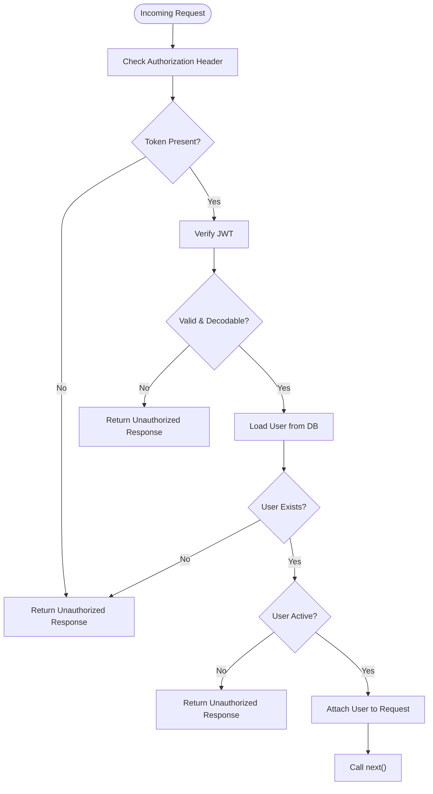
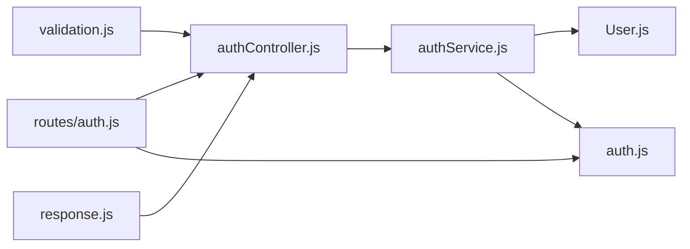

# Testing Strategy

<cite>
**Referenced Files in This Document**
- [package.json](file://backend/package.json)
- [auth.test.js](file://backend/tests/auth.test.js)
- [authService.js](file://backend/services/authService.js)
- [authController.js](file://backend/controllers/authController.js)
- [auth.js](file://backend/middleware/auth.js)
- [validation.js](file://backend/middleware/validation.js)
- [response.js](file://backend/utils/response.js)
- [database.js](file://backend/config/database.js)
- [User.js](file://backend/models/User.js)
- [constants.js](file://backend/utils/constants.js)
- [seed.js](file://backend/scripts/seed.js)
- [dashboardService.js](file://backend/services/dashboardService.js)
- [financeService.js](file://backend/services/financeService.js)
- [userService.js](file://backend/services/userService.js)
- [auth.js](file://backend/routes/auth.js)
</cite>

## Table of Contents
1. [Introduction](#introduction)
2. [Project Structure](#project-structure)
3. [Core Components](#core-components)
4. [Architecture Overview](#architecture-overview)
5. [Detailed Component Analysis](#detailed-component-analysis)
6. [Dependency Analysis](#dependency-analysis)
7. [Performance Considerations](#performance-considerations)
8. [Troubleshooting Guide](#troubleshooting-guide)
9. [Conclusion](#conclusion)
10. [Appendices](#appendices)

## Introduction
This document defines the testing strategy for the FDPAC Finance Dashboard backend. It covers unit testing with Jest, test organization patterns, mocking strategies for external dependencies, authentication testing (registration, login, token verification), controller/service/middleware best practices, test coverage guidelines, database strategies, test data management, and integration testing approaches. The goal is to ensure reliable, maintainable, and secure API behavior across controllers, services, middleware, and models.

## Project Structure
The backend follows a layered architecture:
- Routes define endpoints and wire middleware and controllers.
- Controllers orchestrate HTTP request handling and delegate to services.
- Services encapsulate business logic and coordinate model operations.
- Models define data schemas and helpers.
- Middleware handles cross-cutting concerns like validation and authentication.
- Config and utilities provide shared constants, database connections, and response helpers.
- Tests reside under a dedicated tests folder and exercise services and integration points.

**Diagram sources**
- [auth.js:1-49](file://backend/routes/auth.js#L1-L49)
- [authController.js:1-114](file://backend/controllers/authController.js#L1-L114)
- [authService.js:1-195](file://backend/services/authService.js#L1-L195)
- [auth.js:1-116](file://backend/middleware/auth.js#L1-L116)
- [User.js:1-130](file://backend/models/User.js#L1-L130)
- [response.js:1-101](file://backend/utils/response.js#L1-L101)
- [constants.js:1-81](file://backend/utils/constants.js#L1-L81)
- [database.js:1-43](file://backend/config/database.js#L1-L43)

**Section sources**
- [package.json:1-29](file://backend/package.json#L1-L29)
- [auth.js:1-49](file://backend/routes/auth.js#L1-L49)
- [authController.js:1-114](file://backend/controllers/authController.js#L1-L114)
- [authService.js:1-195](file://backend/services/authService.js#L1-L195)
- [auth.js:1-116](file://backend/middleware/auth.js#L1-L116)
- [User.js:1-130](file://backend/models/User.js#L1-L130)
- [response.js:1-101](file://backend/utils/response.js#L1-L101)
- [constants.js:1-81](file://backend/utils/constants.js#L1-L81)
- [database.js:1-43](file://backend/config/database.js#L1-L43)

## Core Components
- Authentication service: Implements registration, login, profile retrieval, password change, and initial admin creation.
- Authentication controller: Exposes HTTP endpoints and delegates to the service.
- Authentication middleware: Validates JWT tokens and attaches user context.
- Validation middleware: Enforces request validation via express-validator.
- Response utilities: Provide standardized success/error/unauthorized responses.
- Database configuration: Centralizes MongoDB connection and disconnection.
- User model: Defines schema, indexes, hashing, and helper methods.
- Constants: Centralizes roles, statuses, permissions, and JWT configuration.
- Seed script: Prepares test data for development and CI environments.

Key testing focus areas:
- Unit tests for services (auth, finance, dashboard, user) to validate business logic.
- Integration tests for routes and middleware to validate end-to-end flows.
- Mock strategies for external dependencies (database, JWT, bcrypt).
- Coverage guidelines and performance considerations for test suites.

**Section sources**
- [authService.js:1-195](file://backend/services/authService.js#L1-L195)
- [authController.js:1-114](file://backend/controllers/authController.js#L1-L114)
- [auth.js:1-116](file://backend/middleware/auth.js#L1-L116)
- [validation.js:1-309](file://backend/middleware/validation.js#L1-L309)
- [response.js:1-101](file://backend/utils/response.js#L1-L101)
- [database.js:1-43](file://backend/config/database.js#L1-L43)
- [User.js:1-130](file://backend/models/User.js#L1-L130)
- [constants.js:1-81](file://backend/utils/constants.js#L1-L81)
- [seed.js:1-132](file://backend/scripts/seed.js#L1-L132)

## Architecture Overview
The testing architecture aligns with the backend’s layered design. Tests target services for pure logic, controllers for HTTP orchestration, and middleware for cross-cutting concerns. Database operations are isolated behind a connection abstraction to enable controlled setup/teardown and cleanup.

[No sources needed since this diagram shows conceptual workflow, not actual code structure]

## Detailed Component Analysis

### Authentication Service Tests
The existing authentication tests demonstrate:
- Database lifecycle hooks (beforeAll/afterAll) and per-test cleanup (beforeEach).
- Registration tests validating successful creation and duplicate prevention.
- Login tests validating success, invalid password, and non-existent email scenarios.
- Profile retrieval tests validating success and not-found behavior.

Recommended enhancements:
- Add token verification tests by generating tokens and asserting payload decoding.
- Introduce negative tests for invalid/expired tokens in middleware tests.
- Parameterize test data and centralize fixtures for reuse.

**Diagram sources**
- [auth.test.js:1-117](file://backend/tests/auth.test.js#L1-L117)
- [authService.js:1-195](file://backend/services/authService.js#L1-L195)
- [auth.js:95-109](file://backend/middleware/auth.js#L95-L109)
- [User.js:84-86](file://backend/models/User.js#L84-L86)

**Section sources**
- [auth.test.js:1-117](file://backend/tests/auth.test.js#L1-L117)
- [authService.js:1-195](file://backend/services/authService.js#L1-L195)
- [auth.js:95-109](file://backend/middleware/auth.js#L95-L109)
- [User.js:84-86](file://backend/models/User.js#L84-L86)

### Authentication Controller Tests
Controller tests should validate:
- Successful responses using the response utilities.
- Error propagation via next() to centralized error handling.
- Middleware integration (authentication and validation) by stubbing or using real middleware in integration tests.

Best practices:
- Use supertest or similar to test HTTP endpoints.
- Assert status codes and response shape.
- Mock service methods to isolate controller logic.

**Section sources**
- [authController.js:1-114](file://backend/controllers/authController.js#L1-L114)
- [response.js:1-101](file://backend/utils/response.js#L1-L101)
- [validation.js:1-309](file://backend/middleware/validation.js#L1-L309)
- [auth.js:1-116](file://backend/middleware/auth.js#L1-L116)

### Authentication Middleware Tests
Focus areas:
- Token presence checks and unauthorized responses.
- JWT verification success and failure paths.
- Active user validation and account-inactive scenarios.
- Optional authentication behavior.

Mock strategies:
- Stub jwt.verify to simulate expired or invalid tokens.
- Stub User.findById to simulate missing user or inactive status.
- Use fake tokens with known payloads to assert claims.

**Diagram sources**
- [auth.js:14-59](file://backend/middleware/auth.js#L14-L59)

**Section sources**
- [auth.js:1-116](file://backend/middleware/auth.js#L1-L116)

### Validation Middleware Tests
Validation tests should cover:
- Positive cases for valid inputs.
- Negative cases for invalid inputs (types, lengths, formats).
- Proper error response shape and status codes.

Recommendations:
- Use minimal Express app to mount validation middleware and trigger validation errors.
- Assert validation error arrays include field, message, and value.

**Section sources**
- [validation.js:1-309](file://backend/middleware/validation.js#L1-L309)
- [response.js:42-49](file://backend/utils/response.js#L42-L49)

### Finance Service Tests
Coverage targets:
- Record creation with normalization and defaults.
- Retrieval with filtering, pagination, sorting, and access control.
- Updates with allowed fields and sanitization.
- Deletion with soft-delete semantics.
- Category aggregation and user-specific queries.

Mock strategies:
- Stub Mongoose methods (find, findOne, save, countDocuments) to avoid DB writes.
- Use fake ObjectId values for user and record IDs.
- Inject errors to test denial-of-access and not-found scenarios.

**Section sources**
- [financeService.js:1-264](file://backend/services/financeService.js#L1-L264)
- [User.js:1-130](file://backend/models/User.js#L1-L130)
- [constants.js:59-64](file://backend/utils/constants.js#L59-L64)

### Dashboard Service Tests
Coverage targets:
- Summary aggregation (income, expense, net balance).
- Category-wise breakdown.
- Recent activity with population.
- Monthly and weekly trends with grouping and formatting.
- Role-aware filtering and date-range queries.

Mock strategies:
- Stub aggregation pipeline stages to return deterministic outputs.
- Simulate different user roles and date ranges.

**Section sources**
- [dashboardService.js:1-345](file://backend/services/dashboardService.js#L1-L345)
- [constants.js:18-46](file://backend/utils/constants.js#L18-L46)

### User Service Tests
Coverage targets:
- Listing users with pagination and filters.
- Retrieving by ID and not-found handling.
- Creating users with duplicate-email prevention.
- Updating users with email uniqueness enforcement.
- Deleting users with constraints (last admin).
- Toggling status with last admin protection.
- Role-based queries and statistics.

Mock strategies:
- Stub Mongoose queries and counts.
- Inject role/status constants from constants module.

**Section sources**
- [userService.js:1-276](file://backend/services/userService.js#L1-L276)
- [constants.js:5-16](file://backend/utils/constants.js#L5-L16)

### Database and Test Data Management
- Centralized connection/disconnection in config/database.js supports test lifecycle hooks.
- Per-test cleanup ensures isolation (deleteMany on test emails).
- Seed script prepares realistic test data for integration and manual testing.

Guidelines:
- Use separate test databases or collections for isolation.
- Keep test data small and deterministic.
- Use factory-style fixtures for repeated patterns.

**Section sources**
- [database.js:1-43](file://backend/config/database.js#L1-L43)
- [auth.test.js:32-39](file://backend/tests/auth.test.js#L32-L39)
- [seed.js:1-132](file://backend/scripts/seed.js#L1-L132)

## Dependency Analysis
Testing dependencies and coupling:
- Services depend on models and middleware; tests should mock models and middleware to isolate service logic.
- Controllers depend on services; tests should mock services to validate HTTP orchestration.
- Middleware depends on models and JWT; tests should stub JWT and model methods.
- Routes depend on controllers and middleware; integration tests should mount routes with minimal Express setup.

**Diagram sources**
- [authService.js:1-195](file://backend/services/authService.js#L1-L195)
- [User.js:1-130](file://backend/models/User.js#L1-L130)
- [auth.js:1-116](file://backend/middleware/auth.js#L1-L116)
- [authController.js:1-114](file://backend/controllers/authController.js#L1-L114)
- [auth.js:1-49](file://backend/routes/auth.js#L1-L49)
- [validation.js:1-309](file://backend/middleware/validation.js#L1-L309)
- [response.js:1-101](file://backend/utils/response.js#L1-L101)

**Section sources**
- [authService.js:1-195](file://backend/services/authService.js#L1-L195)
- [authController.js:1-114](file://backend/controllers/authController.js#L1-L114)
- [auth.js:1-49](file://backend/routes/auth.js#L1-L49)
- [validation.js:1-309](file://backend/middleware/validation.js#L1-L309)
- [response.js:1-101](file://backend/utils/response.js#L1-L101)
- [User.js:1-130](file://backend/models/User.js#L1-L130)
- [auth.js:1-116](file://backend/middleware/auth.js#L1-L116)

## Performance Considerations
- Prefer unit tests over integration tests for speed; use mocks to eliminate DB and network overhead.
- Use Jest’s test timeouts judiciously; keep DB tests short with minimal data.
- Parallelize independent tests; avoid concurrent DB writes to the same collection.
- Use deterministic seeds and small datasets for dashboard/finance analytics tests.
- Avoid heavy computation in tests; precompute expected aggregates where feasible.

[No sources needed since this section provides general guidance]

## Troubleshooting Guide
Common issues and resolutions:
- Database connection failures in tests: Ensure environment variables are loaded and connectDB/disconnectDB are called in lifecycle hooks.
- Duplicate key errors: Use beforeEach cleanup to remove test documents by email or ID.
- JWT secret mismatches: Configure a consistent JWT_SECRET for tests or rely on fallback logic in middleware.
- Validation errors: Confirm validation middleware is mounted before controllers and that validationErrorResponse is returned.
- Assertion failures: Use snapshot testing for response shapes and structured assertions for dynamic fields.

**Section sources**
- [database.js:11-37](file://backend/config/database.js#L11-L37)
- [auth.test.js:24-39](file://backend/tests/auth.test.js#L24-L39)
- [auth.js:30-32](file://backend/middleware/auth.js#L30-L32)
- [validation.js:13-27](file://backend/middleware/validation.js#L13-L27)
- [response.js:42-49](file://backend/utils/response.js#L42-L49)

## Conclusion
The FDPAC Finance Dashboard employs a clean layered architecture suitable for comprehensive testing. By focusing on service-level unit tests, integrating route/controller tests with middleware, and leveraging robust mocking strategies, teams can achieve high confidence in authentication, financial analytics, and user management features. Adopting the guidelines herein will improve reliability, maintainability, and developer velocity.

[No sources needed since this section summarizes without analyzing specific files]

## Appendices

### Test Organization Patterns
- Group related tests by feature (e.g., auth, finance, dashboard, user).
- Use describe blocks to structure happy-path vs. error-path tests.
- Place shared setup/teardown in beforeAll/afterAll and beforeEach/afterEach.
- Keep tests readable with clear expectations and meaningful names.

**Section sources**
- [auth.test.js:23-111](file://backend/tests/auth.test.js#L23-L111)

### Mock Strategies for External Dependencies
- Database: Use connectDB/disconnectDB around tests; delete test documents in beforeEach.
- JWT: Stub jwt.verify to return known payloads or throw errors; stub generateToken to return deterministic tokens.
- Encryption: Optionally stub bcrypt methods to avoid slow hashing in tests.
- Express-validator: Mount validation middleware in a minimal app to trigger validation errors.

**Section sources**
- [database.js:11-37](file://backend/config/database.js#L11-L37)
- [auth.js:30-32](file://backend/middleware/auth.js#L30-L32)
- [auth.js:100-109](file://backend/middleware/auth.js#L100-L109)
- [validation.js:13-27](file://backend/middleware/validation.js#L13-L27)

### Continuous Integration Setup
- Define a test script in package.json to run Jest.
- Configure CI to set environment variables (JWT_SECRET, MONGODB_URI).
- Use separate test databases or containers for isolation.
- Report coverage thresholds and enforce pass/fail conditions.

**Section sources**
- [package.json:6-10](file://backend/package.json#L6-L10)

### Example Test Implementation References
- Authentication service tests: [auth.test.js:42-57](file://backend/tests/auth.test.js#L42-L57), [auth.test.js:65-83](file://backend/tests/auth.test.js#L65-L83), [auth.test.js:94-109](file://backend/tests/auth.test.js#L94-L109)
- Controller tests: [authController.js:13-26](file://backend/controllers/authController.js#L13-L26), [authController.js:32-46](file://backend/controllers/authController.js#L32-L46)
- Middleware tests: [auth.js:14-59](file://backend/middleware/auth.js#L14-L59)
- Validation tests: [validation.js:32-60](file://backend/middleware/validation.js#L32-L60), [validation.js:64-78](file://backend/middleware/validation.js#L64-L78)
- Finance service tests: [financeService.js:15-29](file://backend/services/financeService.js#L15-L29), [financeService.js:111-125](file://backend/services/financeService.js#L111-L125)
- Dashboard service tests: [dashboardService.js:16-55](file://backend/services/dashboardService.js#L16-L55), [dashboardService.js:256-272](file://backend/services/dashboardService.js#L256-L272)
- User service tests: [userService.js:88-113](file://backend/services/userService.js#L88-L113), [userService.js:161-181](file://backend/services/userService.js#L161-L181)