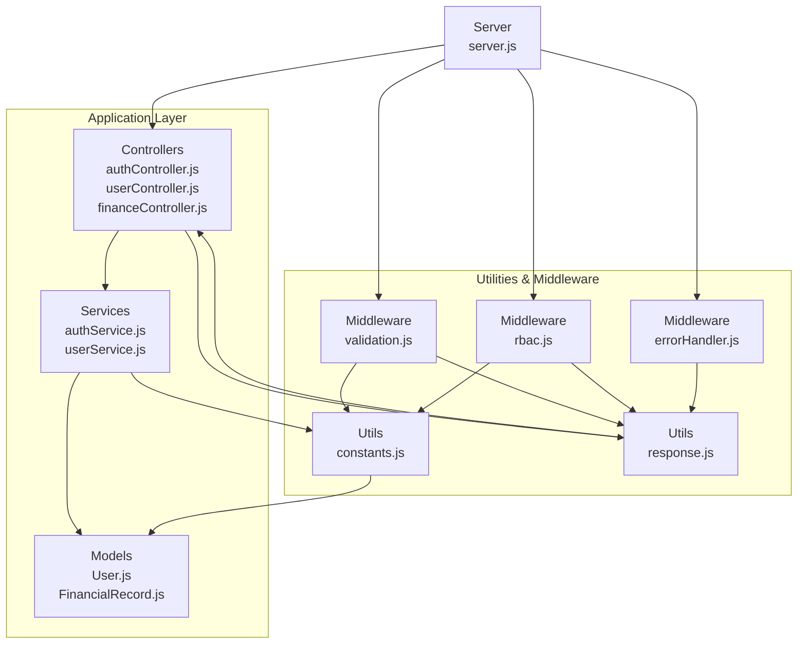
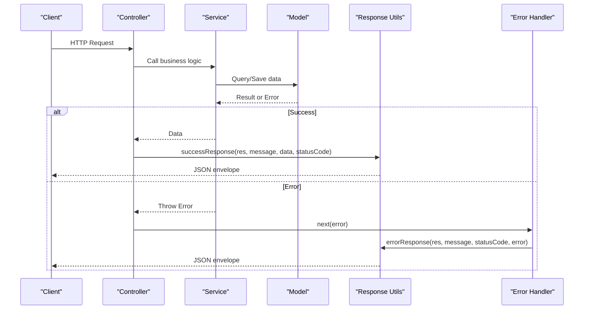
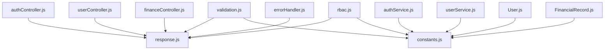

# Utility Functions & Constants

<cite>
**Referenced Files in This Document**
- [constants.js](file://backend/utils/constants.js)
- [response.js](file://backend/utils/response.js)
- [errorHandler.js](file://backend/middleware/errorHandler.js)
- [validation.js](file://backend/middleware/validation.js)
- [rbac.js](file://backend/middleware/rbac.js)
- [authController.js](file://backend/controllers/authController.js)
- [userController.js](file://backend/controllers/userController.js)
- [financeController.js](file://backend/controllers/financeController.js)
- [authService.js](file://backend/services/authService.js)
- [userService.js](file://backend/services/userService.js)
- [User.js](file://backend/models/User.js)
- [FinancialRecord.js](file://backend/models/FinancialRecord.js)
- [server.js](file://backend/server.js)
- [package.json](file://backend/package.json)
</cite>

## Table of Contents
1. [Introduction](#introduction)
2. [Project Structure](#project-structure)
3. [Core Components](#core-components)
4. [Architecture Overview](#architecture-overview)
5. [Detailed Component Analysis](#detailed-component-analysis)
6. [Dependency Analysis](#dependency-analysis)
7. [Performance Considerations](#performance-considerations)
8. [Troubleshooting Guide](#troubleshooting-guide)
9. [Conclusion](#conclusion)

## Introduction
This document provides comprehensive documentation for the utility functions and constants used throughout the Finance Dashboard Backend application. It focuses on:
- Standardized API response formatting utilities and their consistent usage across controllers
- The constants module covering roles, permissions, configuration settings, and enumerations
- Implementation details of response formatting functions, constant definitions, and their usage patterns
- Examples of response formatting, constant usage in validation, and configuration management
- Consistency guarantees and best practices for maintaining uniform response formats

## Project Structure
The utility and constants are organized under the utils directory and consumed by middleware, controllers, services, and models. The server integrates middleware globally to ensure consistent behavior across all routes.

**Diagram sources**
- [server.js:1-113](file://backend/server.js#L1-L113)
- [constants.js:1-81](file://backend/utils/constants.js#L1-L81)
- [response.js:1-101](file://backend/utils/response.js#L1-L101)
- [validation.js:1-309](file://backend/middleware/validation.js#L1-L309)
- [rbac.js:1-151](file://backend/middleware/rbac.js#L1-L151)
- [errorHandler.js:1-179](file://backend/middleware/errorHandler.js#L1-L179)
- [authController.js:1-114](file://backend/controllers/authController.js#L1-L114)
- [userController.js:1-152](file://backend/controllers/userController.js#L1-L152)
- [financeController.js:1-138](file://backend/controllers/financeController.js#L1-L138)
- [authService.js:1-195](file://backend/services/authService.js#L1-L195)
- [userService.js:1-276](file://backend/services/userService.js#L1-L276)
- [User.js:1-130](file://backend/models/User.js#L1-L130)
- [FinancialRecord.js:1-134](file://backend/models/FinancialRecord.js#L1-L134)

**Section sources**
- [server.js:1-113](file://backend/server.js#L1-L113)
- [package.json:1-29](file://backend/package.json#L1-L29)

## Core Components
This section documents the standardized API response utilities and the constants module.

### Standardized API Response Utilities
The response utilities provide a consistent JSON envelope for all HTTP responses. They encapsulate success, error, validation, unauthorized, forbidden, and not-found responses with a unified structure.

Key response functions:
- successResponse(res, message, data, statusCode): Returns a success payload with success=true, message, data, and error=null
- errorResponse(res, message, statusCode, error): Returns an error payload with success=false, message, data=null, and error
- validationErrorResponse(res, errors): Returns a 400 validation failure payload with success=false, message, data=null, and error as an array
- unauthorizedResponse(res, message): Returns a 401 unauthorized payload with success=false, message, data=null, and error='Unauthorized'
- forbiddenResponse(res, message): Returns a 403 forbidden payload with success=false, message, data=null, and error='Forbidden'
- notFoundResponse(res, message): Returns a 404 not found payload with success=false, message, data=null, and error='Not Found'

Usage patterns:
- Controllers call successResponse for successful outcomes and pass errors to next(error) to be handled by the global error handler
- Validation middleware uses validationErrorResponse to return structured validation failures
- RBAC middleware uses unauthorizedResponse and forbiddenResponse for access control denials

**Section sources**
- [response.js:1-101](file://backend/utils/response.js#L1-L101)
- [authController.js:13-26](file://backend/controllers/authController.js#L13-L26)
- [userController.js:13-25](file://backend/controllers/userController.js#L13-L25)
- [financeController.js:13-28](file://backend/controllers/financeController.js#L13-L28)
- [validation.js:13-27](file://backend/middleware/validation.js#L13-L27)

### Constants Module
The constants module centralizes configuration and enumerations used across the application.

- Roles: viewer, analyst, admin
- User Status: active, inactive
- Record Types: income, expense
- Categories: predefined lists for income and expense categories
- Permissions: matrix mapping permission keys to allowed roles
- Pagination: default page, default limit, and maximum limit
- JWT Configuration: expires_in and algorithm

Usage patterns:
- Models enforce enums using constants (e.g., User role and status, FinancialRecord type)
- Services use constants for defaults and validations
- Validation middleware enforces allowed values using constants
- RBAC middleware checks permissions against the PERMISSIONS matrix

**Section sources**
- [constants.js:1-81](file://backend/utils/constants.js#L1-L81)
- [User.js:34-49](file://backend/models/User.js#L34-L49)
- [FinancialRecord.js:21-28](file://backend/models/FinancialRecord.js#L21-L28)
- [validation.js:54-57](file://backend/middleware/validation.js#L54-L57)
- [rbac.js:48-52](file://backend/middleware/rbac.js#L48-L52)
- [userService.js:14-58](file://backend/services/userService.js#L14-L58)

## Architecture Overview
The application enforces consistency through a layered architecture:
- Controllers: orchestrate request handling and delegate to services
- Services: implement business logic and use constants for validation and defaults
- Models: define schemas with enum constraints using constants
- Middleware: validation, RBAC, and error handling use response utilities
- Utilities: response formatting and constants are shared across layers

**Diagram sources**
- [authController.js:13-26](file://backend/controllers/authController.js#L13-L26)
- [authService.js:15-51](file://backend/services/authService.js#L15-L51)
- [User.js:10-54](file://backend/models/User.js#L10-L54)
- [response.js:12-35](file://backend/utils/response.js#L12-L35)
- [errorHandler.js:89-145](file://backend/middleware/errorHandler.js#L89-L145)

## Detailed Component Analysis

### Response Formatting Utilities
These functions standardize all API responses with a consistent envelope:
- successResponse: wraps success=true, message, data, error=null
- errorResponse: wraps success=false, message, data=null, error
- validationErrorResponse: wraps validation errors as an array
- unauthorizedResponse: standardized 401 response
- forbiddenResponse: standardized 403 response
- notFoundResponse: standardized 404 response

Best practices:
- Always use successResponse for successful outcomes with appropriate HTTP status codes
- Use validationErrorResponse for validation failures from express-validator
- Use unauthorizedResponse and forbiddenResponse for access control denials
- Use notFoundResponse for resource-not-found scenarios
- Pass errors to next(error) so the global error handler can convert them to a standardized errorResponse

**Section sources**
- [response.js:12-91](file://backend/utils/response.js#L12-L91)
- [validation.js:13-27](file://backend/middleware/validation.js#L13-L27)
- [rbac.js:17-29](file://backend/middleware/rbac.js#L17-L29)
- [rbac.js:50-62](file://backend/middleware/rbac.js#L50-L62)

### Constants Module
The constants module defines:
- Roles and user status for model enums and RBAC checks
- Record types and categories for financial records
- Permission matrix for fine-grained access control
- Pagination defaults and JWT configuration

Implementation details:
- Enums in models enforce allowed values using Object.values(constants)
- Services use constants for defaults and validations
- Validation middleware enforces allowed values and lengths
- RBAC middleware checks permissions against the PERMISSIONS matrix

**Section sources**
- [constants.js:6-70](file://backend/utils/constants.js#L6-L70)
- [User.js:34-49](file://backend/models/User.js#L34-L49)
- [FinancialRecord.js:21-28](file://backend/models/FinancialRecord.js#L21-L28)
- [validation.js:54-57](file://backend/middleware/validation.js#L54-L57)
- [rbac.js:48-52](file://backend/middleware/rbac.js#L48-L52)

### Validation Middleware
The validation middleware uses express-validator to validate requests and returns standardized validation errors via validationErrorResponse. It validates:
- User registration and login credentials
- User updates (including role and status)
- Financial record creation and updates
- Query parameters for listing and dashboard endpoints

Usage patterns:
- Each validation chain checks field presence, format, length, and allowed values
- handleValidationErrors converts express-validator errors into a standardized array with field, message, and value
- Validation middleware is composed with route handlers to ensure early termination on validation failure

**Section sources**
- [validation.js:13-27](file://backend/middleware/validation.js#L13-L27)
- [validation.js:32-60](file://backend/middleware/validation.js#L32-L60)
- [validation.js:130-168](file://backend/middleware/validation.js#L130-L168)
- [validation.js:230-273](file://backend/middleware/validation.js#L230-L273)

### RBAC Middleware
The RBAC middleware enforces role-based permissions:
- requireRole: checks if the authenticated user has any of the allowed roles
- requirePermission: checks if the user's role is included in the permission matrix
- requireOwnerOrAdmin: verifies resource ownership or admin privileges
- Convenience helpers: requireAdmin, requireAnalystOrAdmin, requireAnyRole, canManageUsers, canCreateRecords, canUpdateRecords, canDeleteRecords, canViewAnalytics

Usage patterns:
- Apply requireRole or requirePermission before route handlers that modify or access protected resources
- Use requireOwnerOrAdmin for resource-level permissions (e.g., editing one's own records)
- Ensure user.isActive() is checked alongside role-based access

**Section sources**
- [rbac.js:14-33](file://backend/middleware/rbac.js#L14-L33)
- [rbac.js:40-66](file://backend/middleware/rbac.js#L40-L66)
- [rbac.js:113-136](file://backend/middleware/rbac.js#L113-L136)

### Error Handling Middleware
The global error handler:
- Normalizes errors with default status codes and messages
- Converts Mongoose validation, duplicate key, and cast errors into structured payloads
- Handles JWT errors (invalid token and expired token)
- Uses errorResponse to send standardized error responses
- Provides graceful shutdown for unhandled rejections and uncaught exceptions

**Section sources**
- [errorHandler.js:89-145](file://backend/middleware/errorHandler.js#L89-L145)
- [errorHandler.js:25-62](file://backend/middleware/errorHandler.js#L25-L62)
- [errorHandler.js:150-171](file://backend/middleware/errorHandler.js#L150-L171)

### Controllers and Services Usage Patterns
Controllers consistently use response utilities:
- authController: registers users, logs in, retrieves profiles, changes passwords, creates initial admin
- userController: manages users (CRUD), toggles status, retrieves statistics
- financeController: handles financial records (CRUD), retrieves categories

Services use constants for:
- Defaults (pagination, roles, statuses)
- Validations and business rules
- Token generation and user management

**Section sources**
- [authController.js:13-105](file://backend/controllers/authController.js#L13-L105)
- [userController.js:13-141](file://backend/controllers/userController.js#L13-L141)
- [financeController.js:13-128](file://backend/controllers/financeController.js#L13-L128)
- [authService.js:15-51](file://backend/services/authService.js#L15-L51)
- [userService.js:14-58](file://backend/services/userService.js#L14-L58)

## Dependency Analysis
The following diagram shows how response utilities and constants are consumed across the application:

**Diagram sources**
- [response.js:1-101](file://backend/utils/response.js#L1-L101)
- [constants.js:1-81](file://backend/utils/constants.js#L1-L81)
- [validation.js:1-309](file://backend/middleware/validation.js#L1-L309)
- [rbac.js:1-151](file://backend/middleware/rbac.js#L1-L151)
- [errorHandler.js:1-179](file://backend/middleware/errorHandler.js#L1-L179)
- [authController.js:1-114](file://backend/controllers/authController.js#L1-L114)
- [userController.js:1-152](file://backend/controllers/userController.js#L1-L152)
- [financeController.js:1-138](file://backend/controllers/financeController.js#L1-L138)
- [authService.js:1-195](file://backend/services/authService.js#L1-L195)
- [userService.js:1-276](file://backend/services/userService.js#L1-L276)
- [User.js:1-130](file://backend/models/User.js#L1-L130)
- [FinancialRecord.js:1-134](file://backend/models/FinancialRecord.js#L1-L134)

**Section sources**
- [response.js:1-101](file://backend/utils/response.js#L1-L101)
- [constants.js:1-81](file://backend/utils/constants.js#L1-L81)
- [validation.js:1-309](file://backend/middleware/validation.js#L1-L309)
- [rbac.js:1-151](file://backend/middleware/rbac.js#L1-L151)
- [errorHandler.js:1-179](file://backend/middleware/errorHandler.js#L1-L179)

## Performance Considerations
- Response utilities minimize overhead by returning a single JSON envelope with consistent fields
- Validation middleware short-circuits request processing on validation failure, reducing unnecessary service calls
- RBAC middleware performs lightweight checks before invoking business logic
- Constants are imported once and reused, avoiding repeated object construction
- Pagination defaults prevent excessive memory usage for large result sets

## Troubleshooting Guide
Common issues and resolutions:
- Validation failures: Ensure express-validator chains are properly composed and handleValidationErrors is included as the last validator
- Access control denials: Verify user roles and permissions align with the PERMISSIONS matrix; check isActive() status
- Error responses: Use next(error) in controllers to leverage the global error handler for standardized error envelopes
- Resource ownership: Use requireOwnerOrAdmin for resource-level permissions to prevent unauthorized access

**Section sources**
- [validation.js:13-27](file://backend/middleware/validation.js#L13-L27)
- [rbac.js:40-66](file://backend/middleware/rbac.js#L40-L66)
- [errorHandler.js:89-145](file://backend/middleware/errorHandler.js#L89-L145)

## Conclusion
The utility functions and constants provide a robust foundation for consistent API responses, standardized validation, and centralized configuration. By enforcing a uniform response envelope, structured validation errors, and a clear permission matrix, the application maintains reliability, readability, and maintainability across all layers. Following the documented usage patterns ensures consistency and simplifies future enhancements.